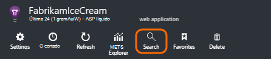
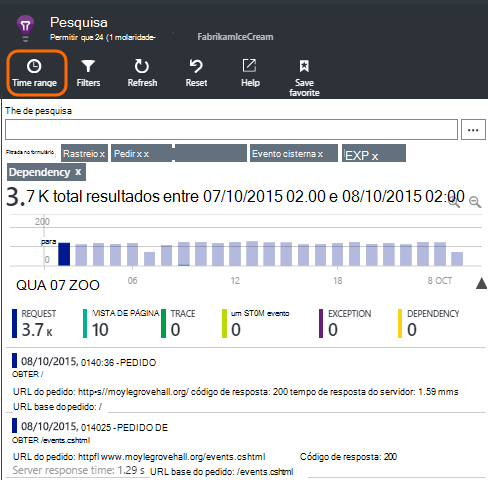
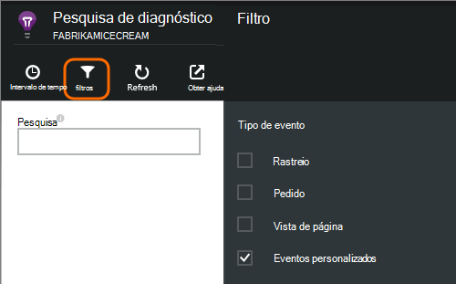
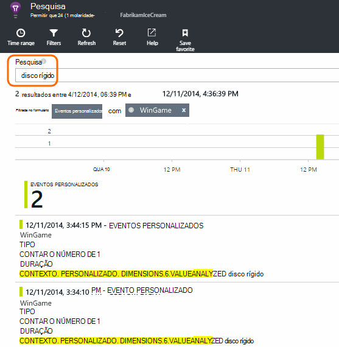
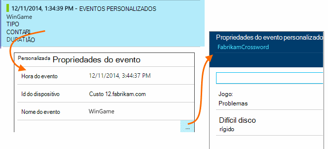
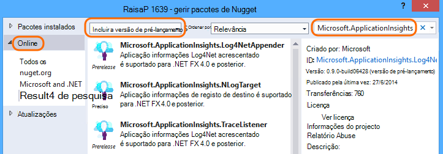
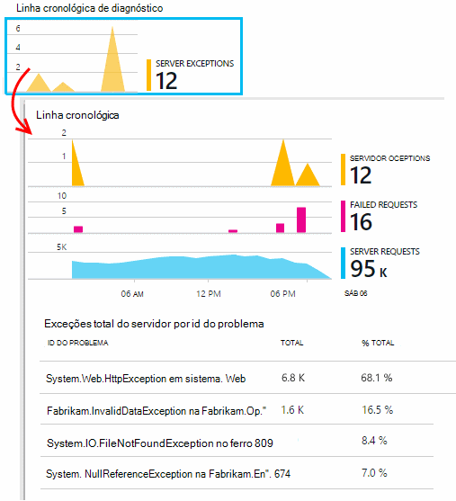
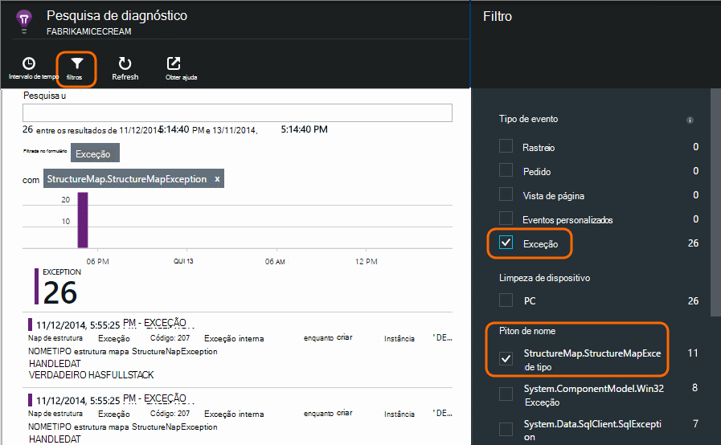

<properties 
    pageTitle="Exceções e diagnósticos personalizados para ASP.NET na aplicação de informações de registos" 
    description="Diagnosticar problemas nas aplicações web do ASP.NET procurando pedidos, exceções e registos gerados com o rastreio, NLog ou Log4Net." 
    services="application-insights" 
    documentationCenter=""
    authors="alancameronwills" 
    manager="douge"/>

<tags 
    ms.service="application-insights" 
    ms.workload="tbd" 
    ms.tgt_pltfrm="ibiza" 
    ms.devlang="na" 
    ms.topic="article" 
    ms.date="04/08/2016" 
    ms.author="awills"/>
 
# Exceções e diagnósticos personalizados para ASP.NET na aplicação de informações de registos

[Informações de aplicação] [ start] inclui uma poderosa [Pesquisa diagnóstico] [ diagnostic] ferramenta que lhe permite explorar e o nível de detalhe para telemetria enviada pelo SDK de informações de aplicação a partir da sua aplicação. Muitos eventos, tal como vistas de página de utilizador são enviados automaticamente pelo SDK.

Também pode escrever código para enviar eventos personalizados, relatórios de exceção e rastreios. E se já estiver a utilizar um quadro de registo como log4J, log4net, NLog ou System.Diagnostics.Trace, pode capturar essas registos e inclui-las na pesquisa. Isto torna mais fácil para se ligam log rastreios às ações de utilizador, exceções e outros eventos.

## Antes de escrever telemetria personalizada

Se ainda não o ainda [Configurar informações de aplicação para o seu projeto][start], fazê-lo agora.

Quando executar a sua aplicação, vai enviar algumas telemetria que irá aparecer na pesquisa diagnóstico, incluindo pedidos recebidos pelo servidor, página vistas tem sessão iniciadas no cliente e não identificada exceções.

Abrir a pesquisa de diagnóstico para ver a telemetria que o SDK envia automaticamente.

Variam os detalhes do tipo de uma aplicação para outro. Pode clicar em através de um evento individual para obter mais detalhes.

## Amostragem 

Se a sua aplicação envia muitos dados e estiver a utilizar o SDK de informações de aplicação para o ASP.NET versão 2.0.0-beta3 ou posterior, a funcionalidade de amostragem ajustável pode funcionar e enviar apenas uma percentagem do seu telemetria. [Saiba mais sobre amostragem.](app-insights-sampling.md)

##Eventos personalizados

Eventos personalizados aparecem ambos na [Pesquisa diagnóstico] [ diagnostic] e no [Explorador de métrica][metrics]. Pode enviar-lhes a partir de dispositivos, páginas web e aplicações de servidor. Podem ser utilizadas para fins de diagnóstico e para [Compreender os padrões de utilização][track].

Um evento personalizado tem um nome e também pode conter propriedades que pode filtrar, juntamente com as medidas numéricas.

JavaScript lado do cliente

    appInsights.trackEvent("WinGame",
         // String properties:
         {Game: currentGame.name, Difficulty: currentGame.difficulty},
         // Numeric measurements:
         {Score: currentGame.score, Opponents: currentGame.opponentCount}
         );

C# no servidor

    // Set up some properties:
    var properties = new Dictionary <string, string> 
       {{"game", currentGame.Name}, {"difficulty", currentGame.Difficulty}};
    var measurements = new Dictionary <string, double>
       {{"Score", currentGame.Score}, {"Opponents", currentGame.OpponentCount}};

    // Send the event:
    telemetry.TrackEvent("WinGame", properties, measurements);

VB no servidor

    ' Set up some properties:
    Dim properties = New Dictionary (Of String, String)
    properties.Add("game", currentGame.Name)
    properties.Add("difficulty", currentGame.Difficulty)

    Dim measurements = New Dictionary (Of String, Double)
    measurements.Add("Score", currentGame.Score)
    measurements.Add("Opponents", currentGame.OpponentCount)

    ' Send the event:
    telemetry.TrackEvent("WinGame", properties, measurements)

### Executar a aplicação e ver os resultados.

Abrir a pesquisa de diagnóstico.

Selecione o evento personalizada e selecione um nome para o evento específico.

Filtre os dados mais introduzindo um termo de pesquisa num valor de propriedade.  

Explorar um evento individual para ver as respetivas propriedades detalhadas.

##Vistas de página

Telemetria de vista de página é enviada pela chamada trackPageView() no [fragmento de JavaScript inserir nas suas páginas web][usage]. O objetivo principal é de contribuição para as contagens das vistas de página que vê na página Descrição geral.

Normalmente, denomina-se uma vez em cada página HTML, mas pode inserir mais chamadas - por exemplo, se tiver uma aplicação de página única e pretende iniciar uma nova página sempre que o utilizador obtém mais dados.

    appInsights.trackPageView(pageSegmentName, "http://fabrikam.com/page.htm"); 

Por vezes é útil para anexar propriedades que pode utilizar como filtros na pesquisa diagnóstico:

    appInsights.trackPageView(pageSegmentName, "http://fabrikam.com/page.htm",
     {Game: currentGame.name, Difficulty: currentGame.difficulty});

##Rastreio telemetria

Rastreio telemetria é código que inserir especificamente para criar registos de diagnóstico. 

Por exemplo, pode inserir chamadas da seguinte forma:

    var telemetry = new Microsoft.ApplicationInsights.TelemetryClient();
    telemetry.TrackTrace("Slow response - database01");

####  Instalar uma placa para o seu quadro de registo

Também pode procurar registos gerados com um quadro de registo - log4Net, NLog ou System.Diagnostics.Trace. 

1. Se planeia utilizar log4Net ou NLog, instale-o no seu projeto. 
2. No Explorador de solução, com o botão direito do projeto e selecione **Gerir pacotes de NuGet**.
3. Selecione Online > tudo, selecione a **Versão de pré-lançamento do incluir** e procure "Microsoft.ApplicationInsights"

    

4. Selecione o pacote adequado - um dos:
  + Microsoft.ApplicationInsights.TraceListener (para capturar System.Diagnostics.Trace chamadas)
  + Microsoft.ApplicationInsights.NLogTarget
  + Microsoft.ApplicationInsights.Log4NetAppender

O pacote de NuGet instala conjuntos de for necessários e também modifica Web. config ou App.

#### Insira chamadas de registo de diagnóstico

Se utiliza o System.Diagnostics.Trace, seria uma chamada normal:

    System.Diagnostics.Trace.TraceWarning("Slow response - database01");

Se preferir log4net ou NLog:

    logger.Warn("Slow response - database01");

Executar a aplicação no modo de depuração ou implementá-lo.

Irá ver as mensagens na pesquisa de diagnóstico ao selecionar o filtro de rastreio.

### Exceções

Introdução exceção relatórios na aplicação de informações fornece uma experiência muito poderosa, especialmente uma vez que pode navegar entre os pedidos de falhados e as exceções e ler a pilha de exceção.

Em alguns casos, é necessário para [Inserir algumas linhas de código] [ exceptions] para se certificar de que o seu exceções estão a ser capturadas automaticamente.

Também pode escrever código explícito para enviar telemetria exceção:

JavaScript

    try 
    { ...
    }
    catch (ex)
    {
      appInsights.TrackException(ex, "handler loc",
        {Game: currentGame.Name, 
         State: currentGame.State.ToString()});
    }

C#

    var telemetry = new TelemetryClient();
    ...
    try 
    { ...
    }
    catch (Exception ex)
    {
       // Set up some properties:
       var properties = new Dictionary <string, string> 
         {{"Game", currentGame.Name}};

       var measurements = new Dictionary <string, double>
         {{"Users", currentGame.Users.Count}};

       // Send the exception telemetry:
       telemetry.TrackException(ex, properties, measurements);
    }

V B

    Dim telemetry = New TelemetryClient
    ...
    Try
      ...
    Catch ex as Exception
      ' Set up some properties:
      Dim properties = New Dictionary (Of String, String)
      properties.Add("Game", currentGame.Name)

      Dim measurements = New Dictionary (Of String, Double)
      measurements.Add("Users", currentGame.Users.Count)
  
      ' Send the exception telemetry:
      telemetry.TrackException(ex, properties, measurements)
    End Try

Os parâmetros de propriedades e as medidas são opcionais, mas são úteis para filtrar e adicionar informações extra. Por exemplo, se tiver uma aplicação que pode executar vários jogos, foi possível encontrar todos os relatórios de exceção relacionados com um determinado jogo. Pode adicionar o número de itens que quiser para cada dicionário.

#### Exceções de visualização

Irá ver um resumo dos exceções comunicado em pá a descrição geral e, pode clicar para ver mais detalhes. Por exemplo:

[]

Clique em qualquer tipo de exceção para ver ocorrências específicas:

[]

Também pode abrir a pesquisa de diagnóstico diretamente, filtrar exceções e escolha o tipo de exceção que pretende ver.

### Exceções não processadas elaboração de relatórios

Relatórios de informações a aplicação não processados exceções onde possa, a partir de dispositivos, [os browsers][usage], ou web servidores, se implementada pelo [Estado Monitor] [ redfield] ou [Aplicação informações SDK][greenbrown]. 

No entanto, sempre não consegue fazer isto em alguns casos, porque o .NET framework capturas as exceções.  Para se certificar de que vê todas as exceções, por conseguinte, tem de escrever um processador de exceção pequenas. O procedimento que melhor varia de acordo com a tecnologia. Consulte o artigo [telemetria exceção para ASP.NET] [ exceptions] para obter detalhes. 

### Correlacionar com uma compilação

Ao ler registos de diagnóstico, é provável que o código fonte irá foram alterados desde o código direto foi implementado.

Por conseguinte, é útil para colocar as informações de compilação, como o URL da versão atual, para uma propriedade juntamente com cada exceção ou rastreio. 

Em vez de adicionar a propriedade separadamente para cada chamada exceção, pode definir as informações no contexto predefinido. 

    // Telemetry initializer class
    public class MyTelemetryInitializer : ITelemetryInitializer
    {
        public void Initialize (ITelemetry telemetry)
        {
            telemetry.Properties["AppVersion"] = "v2.1";
        }
    }

No inicializador a aplicação, tal como Global.asax.cs:

    protected void Application_Start()
    {
        // ...
        TelemetryConfiguration.Active.TelemetryInitializers
        .Add(new MyTelemetryInitializer());
    }

###Pedidos de Web de servidor

Pedido de telemetria é enviada automaticamente quando [instalar o Monitor de estado no servidor web][redfield], ou quando a [Adicionar informações da aplicação ao seu projeto web][greenbrown]. Feeds também para os gráficos de tempo pedidos e respostas no métrica Explorer e, na página Descrição geral.

Se pretender enviar eventos adicionais, pode utilizar a API TrackRequest().

## As perguntas e respostas

### Recebo um erro "chave instrumentação não pode estar vazio"

Parece tiver instalado o pacote de Nuget de placa de registo sem instalar a aplicação de informações.

No Explorador de solução, com o botão direito `ApplicationInsights.config` e selecione **Atualizar informações de aplicação**. Irá obter uma caixa de diálogo que lhe pede para iniciar sessão no Azure e crie a um recurso de informações da aplicação, ou reutilização existente. Que deverá corrigi-lo.

### Quantidade de dados é guardado?

Até 500 eventos por segundo a partir de cada aplicação. Eventos são retidos durante sete dias.

### Alguns dos meus eventos ou rastreios não aparecem

Se a sua aplicação envia muitos dados e estiver a utilizar o SDK de informações de aplicação para o ASP.NET versão 2.0.0-beta3 ou posterior, a funcionalidade de amostragem ajustável pode funcionar e enviar apenas uma percentagem do seu telemetria. [Saiba mais sobre amostragem.](app-insights-sampling.md)

## Próximos passos

* [Configurar a disponibilidade e testes de capacidade de resposta][availability]
* [Resolução de problemas][qna]

<!--Link references-->

[availability]: app-insights-monitor-web-app-availability.md
[diagnostic]: app-insights-diagnostic-search.md
[exceptions]: app-insights-asp-net-exceptions.md
[greenbrown]: app-insights-asp-net.md
[metrics]: app-insights-metrics-explorer.md
[qna]: app-insights-troubleshoot-faq.md
[redfield]: app-insights-monitor-performance-live-website-now.md
[start]: app-insights-overview.md
[track]: app-insights-api-custom-events-metrics.md
[usage]: app-insights-web-track-usage.md

 
