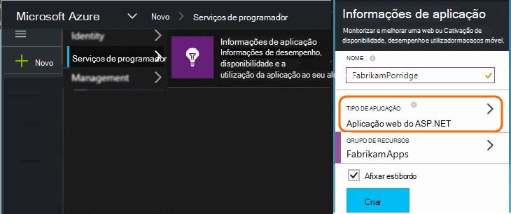
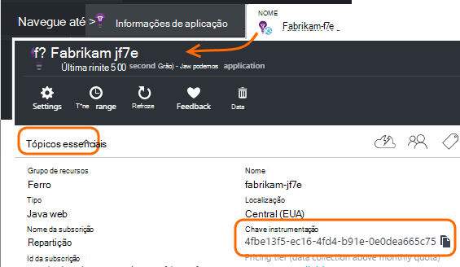

<properties 
    pageTitle="Separe os recursos de informações de aplicação para Dev Center, teste e produção" 
    description="Monitorizar o desempenho e a utilização da sua aplicação em diferentes fases do desenvolvimento" 
    services="application-insights" 
    documentationCenter=""
    authors="alancameronwills" 
    manager="douge"/>

<tags 
    ms.service="application-insights" 
    ms.workload="tbd" 
    ms.tgt_pltfrm="ibiza" 
    ms.devlang="na" 
    ms.topic="article" 
    ms.date="05/04/2016" 
    ms.author="awills"/>

# Separar recursos de informações de aplicação

Deverá telemetria a partir de diferentes componentes e versões da sua aplicação ser enviada para os recursos de informações da aplicação diferentes, ou combinada numa só? Este artigo parece pelo melhores práticas e as técnicas necessárias.

Primeiro, vamos compreender a pergunta. Os dados recebidos a partir da sua aplicação estão armazenados e processados pelos informações de aplicação de uma Microsoft Azure um *recurso*. Cada recurso está identificado por uma *chave de instrumentação* (iKey). Na sua aplicação, a tecla é fornecida para o SDK de informações de aplicação para que possa enviar os dados que recolhe ao recurso à direita. A chave pode ser fornecida no código ou no ApplicationInsights.config. Ao alterar a chave no SDK, pode encaminhá dados para diferentes recursos. 

Caso uma simples, quando criar o código para uma nova aplicação, também cria um novo recurso na aplicação de informações. No Visual Studio, a caixa de diálogo *novo projeto* faz isto por si.

Se for um grande volume de site, poderá ser implementada no mais do que uma instância de servidor.

Em cenários mais complexos, tem de um sistema que é constituído por vários componentes - por exemplo, um web site e um processador de back-end. 

## Quando utilizar iKeys separada

Aqui estão algumas orientações gerais:

* Onde tem uma unidade de forma independente com versões de aplicação que é executada num conjunto de instâncias que podem ser dimensionados para cima/baixo independentemente dos outros componentes do servidor, em seguida, normalmente faria mapear que para um único recurso - ou seja, este terá uma chave de instrumentação única (iKey).
* Por outro lado, razões para utilizar em separado iKeys incluem:
 - Ler facilmente separadas métricas de componentes em separado.
 - Mantêm inferior volume telemetria separada do volume de alta, para que limitação quotas e amostragem numa sequência de não afetam o outro.
 - Alertas em separado, exportar e configurações de item de trabalho.
 - Afaste [limites](app-insights-pricing.md#limits-summary) , tais como a quota de telemetria, limitação e web testar contagem.
 - Código em desenvolvimento e teste deve enviar para um iKey separada que o carimbo de produção.  

Muitas experiências portais de informações da aplicação foram concebidos com estas diretrizes deve ter em conta. Por exemplo, os servidores de ver segmentos na instância de servidor, tornando partem do princípio de que telemetria sobre um componente lógico pode ter várias instâncias do servidor.

## IKey único

Onde enviar telemetria a partir de vários componentes para uma única iKey:

* Adicione uma propriedade de telemetria que lhe permite segmento e filtrar a identidade do componente. O ID da função é adicionado automaticamente ao telemetria de instâncias de função de servidor, mas nos outros casos, que pode utilizar um [inicializador de telemetria](app-insights-api-filtering-sampling.md#add-properties) para adicionar a propriedade.
* Atualize o SDK de informações de aplicação no diferentes componentes ao mesmo tempo. Telemetria para um iKey deve têm na tabela com a mesma versão do SDK.

## IKeys separada

Onde tem vários iKeys para componentes de aplicação diferente:

* Crie um [dashboard](app-insights-dashboards.md) para uma vista de telemetria a chave da aplicação de lógica, combinada de componentes da aplicação diferente. Podem ser partilhados dashboards, para que uma vista de sistema lógico única pode ser utilizada pelo diferentes equipas.
* Organize os [grupos de recursos](app-insights-resources-roles-access-control.md) ao nível da equipa. Permissões de acesso são atribuídas ao grupo de recursos e incluem estas permissões para configurar alertas. 
* Utilize [modelos de Gestor de recursos do Azure e Powershell](app-insights-powershell.md) para ajudar a gerir artefactos como regras alertas e testa da web.

## IKeys separada para Dev Center/teste e de produção

Para tornar mais fácil de alterar a chave automaticamente quando a aplicação for disponibilizada, defina iKey no código, em vez de na ApplicationInsights.config.

### Tecla de instrumentação dinâmicos

Defina a chave num método de inicialização, tal como global.aspx.cs num serviço ASP.NET:

*C#*

    protected void Application_Start()
    {
      Microsoft.ApplicationInsights.Extensibility.
        TelemetryConfiguration.Active.InstrumentationKey = 
          // - for example -
          WebConfigurationManager.AppSettings["ikey"];
      ...

Neste exemplo, são colocados ikeys para os recursos diferentes em versões diferentes do ficheiro de configuração web. Trocar o ficheiro de configuração de web - que pode efetuar como parte do script de lançamento - será trocar o recurso de destino.

### Páginas Web

O iKey também é utilizado na páginas web sua aplicação, o [script que recebeu do pá guia de introdução](app-insights-javascript.md). Em vez de codificação-literalmente para o script, gerá-lo a partir do Estado do servidor. Por exemplo, numa aplicação do ASP.NET:

*JavaScript no Razor*

    <script type="text/javascript">
    // Standard Application Insights web page script:
    var appInsights = window.appInsights || function(config){ ...
    // Modify this part:
    }({instrumentationKey:  
      // Generate from server property:
      "@Microsoft.ApplicationInsights.Extensibility.
         TelemetryConfiguration.Active.InstrumentationKey"
    }) // ...

## Criar um recurso de aplicação informações adicional
  
Se decidir separar telemetria componentes de aplicação diferente, ou por diferentes carimbos de data / (teste/Dev Center/produção) do mesmo componente, terá de criar um novo recurso de informações da aplicação.

No [portal.azure.com](https://portal.azure.com), adicione um recurso de informações da aplicação:

* **Tipo de aplicação** afeta que vê no pá a descrição geral e as propriedades disponíveis no [Explorador de métrica](app-insights-metrics-explorer.md). Se não vir o tipo de aplicação, selecione um dos tipos de web para páginas web.
* **Grupo de recursos** é uma conveniência para gerir propriedades de como o [controlo de acesso](app-insights-resources-roles-access-control.md). Pode utilizar grupos de recursos distintos de desenvolvimento, teste e produção.
* **Subscrição** é a sua conta de pagamento no Azure.
* **Localização** é onde podemos manter os seus dados. Atualmente não pode ser alterado. 
* **Adicionar ao dashboard** coloca um mosaico de acesso rápido para o seu recurso na sua página base Azure. 

Criar o recurso tem de aguardar alguns segundos. Irá ver um alerta quando estiver concluída.

(Pode escrever um [PowerShell script](app-insights-powershell-script-create-resource.md) para criar automaticamente um recurso).

## Introdução a chave de instrumentação

A chave de instrumentação identifica o recurso que criou. 

Tem as teclas de instrumentação de todos os recursos para o qual a aplicação irá enviar dados.

 
