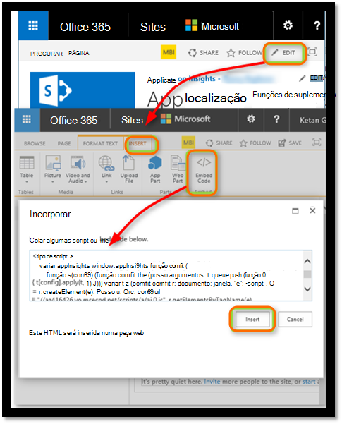

<properties 
    pageTitle="Monitorizar a um site do SharePoint com informações de aplicação" 
    description="Iniciar a monitorização de uma nova aplicação com uma nova chave de instrumentação" 
    services="application-insights" 
    documentationCenter=""
    authors="alancameronwills" 
    manager="douge"/>

<tags 
    ms.service="application-insights" 
    ms.workload="tbd" 
    ms.tgt_pltfrm="ibiza" 
    ms.devlang="na" 
    ms.topic="article" 
    ms.date="03/24/2016" 
    ms.author="awills"/>

# <a name="monitor-a-sharepoint-site-with-application-insights"></a>Monitorizar a um site do SharePoint com informações de aplicação


Informações de aplicação do Visual Studio monitoriza a disponibilidade, desempenho e a utilização das suas aplicações. Aqui vai aprender a configurar para um site do SharePoint.


## <a name="create-an-application-insights-resource"></a>Criar um recurso de informações de aplicação


No [portal do Azure](https://portal.azure.com), crie um novo recurso de informações da aplicação. Selecione ASP.NET como o tipo de aplicação.


O que é aberta pá é o local onde irá ver dados de utilização e desempenho sobre a sua aplicação. Para regressar à mesma próxima vez que iniciar sessão no Azure, deverá localizar um mosaico para a mesma no ecrã Iniciar. Em alternativa, clique em Procurar para localizá-lo.
    


## <a name="add-our-script-to-your-web-pages"></a>Adicionar o nosso script às suas páginas web

Na Iniciação rápida, obter o script para páginas web:


Inserir o script apenas antes de &lt;/head&gt; etiqueta de cada página que quer controlar. Se o seu Web site tiver uma página mestra, pode colocar o script aí. Por exemplo, num projecto do ASP.NET MVC, seria coloque-o na View\Shared\_Layout.cshtml

O script contém a chave de instrumentação que o direciona telemetria para o seu recurso de informações da aplicação.

### <a name="add-the-code-to-your-site-pages"></a>Adicionar o código a páginas do seu site

#### <a name="on-the-master-page"></a>Na página mestra

Se pode editar a página mestra do site, que irá fornecer a monitorização de cada página no site.

Dar saída a página mestra e editá-lo a utilizar o SharePoint Designer ou qualquer outro editor.


Adicionar o código de apenas antes de </head> etiqueta. 


#### <a name="or-on-individual-pages"></a>Ou em páginas individuais

Para monitorizar a um conjunto limitado de páginas, adicione o script separadamente para cada página. 

Inserir uma peça web e o fragmento de código de incorporação na mesma.





## <a name="view-data-about-your-app"></a>Ver dados sobre a sua aplicação

Implementar a aplicação.

Regressar ao seu pá de aplicação no [portal do Azure](https://portal.azure.com).

Os eventos primeiros serão apresentados na pesquisa. 


Clique em Atualizar depois de aguardar alguns segundos se está à espera de mais dados.

A partir de pá descrição geral, clique em **análise de utilização** para ver a gráficos de utilizadores, sessões e vistas de página:


Clique em qualquer gráfico para ver mais detalhes - por exemplo vistas de página:


Ou utilizadores:


## <a name="capturing-user-id"></a>Capturar Id de utilizador


O fragmento de código de página web padrão não captura o id de utilizador do SharePoint, mas pode fazê-lo com uma pequena modificação.


1. Copie a chave de instrumentação da sua aplicação dos Essentials pendente informações de aplicação. 


    

2. Substitua a chave de instrumentação para 'XXXX' no fragmento de abaixo. 
3. Incorpore o script na sua aplicação do SharePoint em vez do fragmento de que obtém a partir do portal.


```


<SharePoint:ScriptLink ID="ScriptLink1" name="SP.js" runat="server" localizable="false" loadafterui="true" /> 
<SharePoint:ScriptLink ID="ScriptLink2" name="SP.UserProfiles.js" runat="server" localizable="false" loadafterui="true" /> 
  
<script type="text/javascript"> 
var personProperties; 
  
// Ensure that the SP.UserProfiles.js file is loaded before the custom code runs. 
SP.SOD.executeOrDelayUntilScriptLoaded(getUserProperties, 'SP.UserProfiles.js'); 
  
function getUserProperties() { 
    // Get the current client context and PeopleManager instance. 
    var clientContext = new SP.ClientContext.get_current(); 
    var peopleManager = new SP.UserProfiles.PeopleManager(clientContext); 
     
    // Get user properties for the target user. 
    // To get the PersonProperties object for the current user, use the 
    // getMyProperties method. 
    
    personProperties = peopleManager.getMyProperties(); 
  
    // Load the PersonProperties object and send the request. 
    clientContext.load(personProperties); 
    clientContext.executeQueryAsync(onRequestSuccess, onRequestFail); 
} 
     
// This function runs if the executeQueryAsync call succeeds. 
function onRequestSuccess() { 
var appInsights=window.appInsights||function(config){
function s(config){t[config]=function(){var i=arguments;t.queue.push(function(){t[config].apply(t,i)})}}var t={config:config},r=document,f=window,e="script",o=r.createElement(e),i,u;for(o.src=config.url||"//az416426.vo.msecnd.net/scripts/a/ai.0.js",r.getElementsByTagName(e)[0].parentNode.appendChild(o),t.cookie=r.cookie,t.queue=[],i=["Event","Exception","Metric","PageView","Trace"];i.length;)s("track"+i.pop());return config.disableExceptionTracking||(i="onerror",s("_"+i),u=f[i],f[i]=function(config,r,f,e,o){var s=u&&u(config,r,f,e,o);return s!==!0&&t["_"+i](config,r,f,e,o),s}),t
    }({
        instrumentationKey:"XXXX"
    });
    window.appInsights=appInsights;
    appInsights.trackPageView(document.title,window.location.href, {User: personProperties.get_displayName()});
} 
  
// This function runs if the executeQueryAsync call fails. 
function onRequestFail(sender, args) { 
} 
</script> 


```


## <a name="next-steps"></a>Próximos passos

* [Testes web](app-insights-monitor-web-app-availability.md) para monitorizar a disponibilidade do seu site.

* [Informações de aplicação](app-insights-overview.md) para outros tipos de aplicação.


<!--Link references-->


 