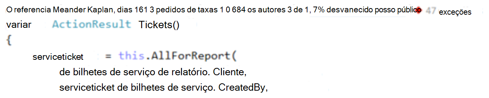
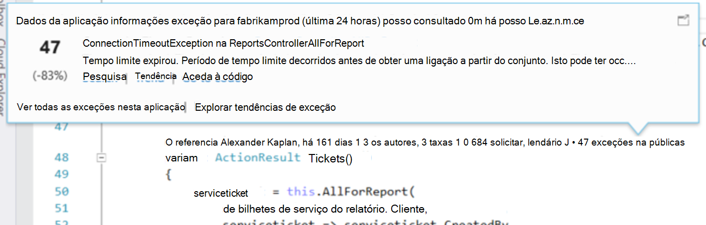
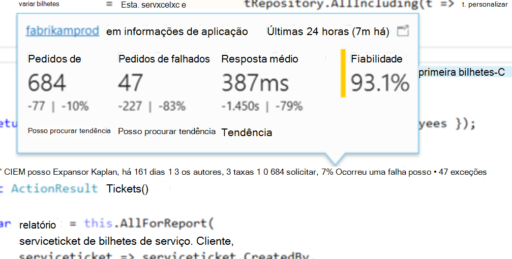
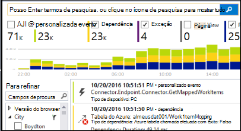

<properties 
    pageTitle="Telemetria de informações de aplicação no Visual Studio CodeLens | Microsoft Azure" 
    description="Aceder rapidamente a sua telemetria informações de aplicação do pedido e exceção com CodeLens no Visual Studio." 
    services="application-insights" 
    documentationCenter=".net"
    authors="numberbycolors" 
    manager="douge"/>

<tags 
    ms.service="application-insights" 
    ms.workload="tbd" 
    ms.tgt_pltfrm="ibiza" 
    ms.devlang="na" 
    ms.topic="get-started-article" 
    ms.date="08/30/2016" 
    ms.author="daviste"/>
    
# Telemetria de informações de aplicação no Visual Studio CodeLens

Métodos o código da sua aplicação web podem ser anotados com telemetria sobre tempo de execução exceções e pedir tempos de resposta. Se instalar o [Visual Studio aplicação informações](app-insights-overview.md) na sua aplicação, é apresentada a telemetria no Visual Studio [CodeLens](https://msdn.microsoft.com/library/dn269218.aspx) - as notas na parte superior de cada função onde está habituado a ver as informações úteis, tais como o número de casas a função são referenciadas ou última pessoa a editado-lo.

> [AZURE.NOTE] Informações de aplicação no CodeLens está disponível no 3 de atualização de 2015 do Visual Studio e posterior ou com a versão mais recente do [extensão de ferramentas de análise de programador](https://visualstudiogallery.msdn.microsoft.com/82367b81-3f97-4de1-bbf1-eaf52ddc635a). CodeLens está disponível nas edições Enterprise e Professional do Visual Studio.

## Onde localizar dados de informações de aplicação

Procure telemetria de informações da aplicação nos indicadores de CodeLens dos métodos público pedido da aplicação web. Indicadores de CodeLens são apresentados acima método e outras declarações no código c# e o Visual Basic. Se os dados de informações da aplicação estão disponíveis para um método, verá indicadores pedidos de e exceções, tal como "100 solicitar, Ocorreu uma falha de 1%" ou "10 exceções." Clique num indicador de CodeLens para obter mais detalhes. 

> [AZURE.TIP] Informações de aplicação do pedido e indicadores de exceção poderão demorar alguns segundos extra para carregar após os indicadores de outros CodeLens aparecem.

## Exceções CodeLens

O indicador de CodeLens exceção mostra o número de exceções que ocorreram das últimas 24 horas a partir de 15 com mais frequência que ocorram exceções na sua aplicação durante o período, enquanto o pedido fornecido pelo método de processamento.

Para ver mais detalhes, clique no indicador de CodeLens exceções:

* A alteração percentual em número de exceções a partir das mais recentes 24 horas em relação as prévias 24 horas
* Selecione **Ir para código** para navegar para o código de origem para a função deitar a exceção
* Selecione **pesquisa** para todas as instâncias desta exceção que ocorreram das últimas 24 horas de consulta
* Selecione **tendência** para ver uma visualização de tendência para ocorrências desta exceção das últimas 24 horas
* Selecione **Ver todas as exceções esta aplicação** para consultar todas as exceções que ocorreram das últimas 24 horas
* Selecione **tendências de exceção explorar** para ver uma visualização de tendência para todas as exceções que ocorreram das últimas 24 horas. 

> [AZURE.TIP] Se vir "0 exceções" no CodeLens mas souber deverá haver exceções, selecione para se certificar de que está selecionado o recurso de informações de aplicação à direita na CodeLens. Para selecionar outro recurso, o botão direito do rato no seu projeto no Explorador de solução e selecione **informações de aplicação > Escolha da origem de telemetria**. CodeLens só é mostrada para o 15 a maior parte dos exceções frequentemente ocorre na sua aplicação das últimas 24 horas, por isso, se uma exceção é do dia 16 com mais frequência ou menos, verá "0 exceções." Exceções de vistas ASP.NET podem não aparecer sobre os métodos de controlador que gerou essas vistas.

> [AZURE.TIP] Se vir "? exceções"CodeLens, é necessário associar à sua conta Azure Visual Studio ou as credenciais de conta Azure poderão ter expirado. Em ambos os casos, clique em "? exceções"e selecione **Adicionar uma conta …** para introduzir as suas credenciais.

## Pedidos em CodeLens

O pedido CodeLens indicador mostra o número de pedidos de HTTP foi servido por um método das últimas 24 horas, bem como a percentagem desses pedidos que falhou.

Para ver mais detalhes, clique em pedidos de CodeLens indicador:

* As alterações absoluto e percentagem no número de pedidos, falhas em pedidos e tempos de resposta média através das últimas 24 horas em comparação comparados as prévias 24 horas
* Método de cálculo de fiabilidade do método, como a percentagem de pedidos de que não se falhou das últimas 24 horas
* Selecione **pesquisa** para pedidos de ou falhados pedidos para consultar todos os pedidos de (falhados) que ocorreram das últimas 24 horas
* Selecione **tendência** para ver uma visualização de tendência para pedidos, pedidos de falhados ou tempos de resposta médio das últimas 24 horas.
* Selecione o nome do recurso informações de aplicações no canto superior esquerdo da vista de detalhes CodeLens para alterar qual o recurso é a origem de dados de CodeLens.

## Próximos passos

||
|---|---
|**[Trabalhar com informações de aplicação no Visual Studio](app-insights-visual-studio.md)** Procurar telemetria, consulte o artigo dados CodeLens e configurar as informações de aplicação. Todos dentro do Visual Studio. |
|**[Adicionar mais dados](app-insights-asp-net-more.md)** Monitorizar a utilização, disponibilidade, dependências, exceções. Integre rastreios a partir do registo de quadros. Escreva telemetria personalizada. | 
|**[Trabalhar com o portal de informações de aplicação](app-insights-dashboards.md)** Os dashboards, poderosas ferramentas de diagnóstico e analíticas, alertas, um mapa de dependência direto da sua aplicação e telemetria exportar. |
