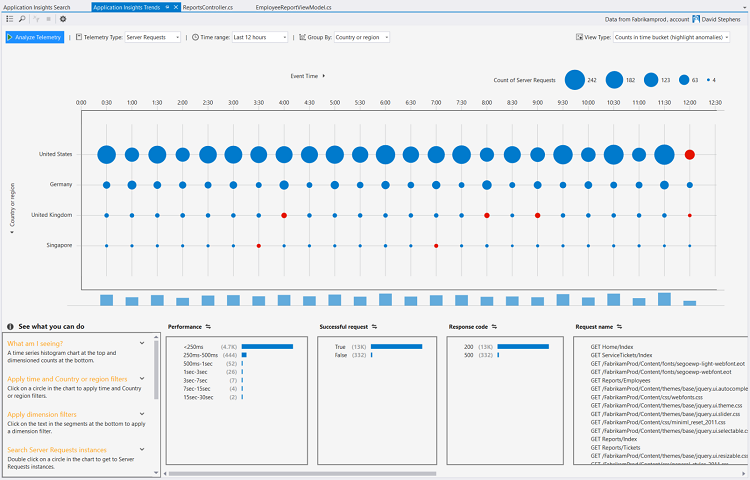

<properties 
    pageTitle="Analisar tendências no Visual Studio | Microsoft Azure" 
    description="Analisar, visualizar e explorar tendências nos seus telemetria informações de aplicação no Visual Studio." 
    services="application-insights" 
    documentationCenter=".net"
    authors="numberbycolors" 
    manager="douge"/>

<tags 
    ms.service="application-insights" 
    ms.workload="tbd" 
    ms.tgt_pltfrm="ibiza" 
    ms.devlang="na" 
    ms.topic="get-started-article" 
    ms.date="10/25/2016" 
    ms.author="daviste"/>
    
# Analisar tendências no Visual Studio

A ferramenta de tendências de informações da aplicação apresenta como telemetria importantes eventos a aplicação forem alterados ao longo do tempo, para o ajudar a identificar rapidamente os problemas e anomalias. Ao ligar a informação de diagnóstico mais detalhada, tendências podem ajudar a melhorar o desempenho da sua aplicação, controlar as causas dos exceções e descobrir estatísticas dos seus eventos personalizados.

> [AZURE.NOTE] Tendências de informações da aplicação está disponível no 3 de atualização de 2015 do Visual Studio e posterior ou com a versão de [Ferramentas de análise de programador extensão](https://visualstudiogallery.msdn.microsoft.com/82367b81-3f97-4de1-bbf1-eaf52ddc635a) 5.209 e versões posterior.

## Tendências de informações da aplicação aberta

Para abrir a janela de aplicação tendências de informações:

* O botão da barra de informações da aplicação, selecione **Explorar tendências de telemetria**, ou
* No menu de contexto do projeto, escolha **informações de aplicação > tendências de telemetria explorar**, ou
* A partir da barra de menu do Visual Studio, selecione **vista > Other Windows > tendências de informações da aplicação**.

Poderá ver um pedido para selecionar um recurso. Clique em **selecionar um recurso**, inicie sessão com uma subscrição do Azure e, em seguida, selecione um recurso de informações de aplicação a partir da lista para a qual gostaria de analisar tendências de telemetria.

## Selecione uma análise de tendências

Introdução ao selecionar a partir de um dos cinco comuns tendência análises, cada analisar dados de últimas 24 horas:

* **Investigar efectue a problemas de desempenho com pedidos de servidor** - pedidos feitos ao seu serviço, agrupados por tempos de resposta
* **Analisar erros nos pedidos de servidor** - pedidos feitos ao seu serviço, agrupados por código de resposta HTTP
* **Examinar as exceções na sua aplicação** - exceções a partir do seu serviço, agrupados por tipo de exceção
* **Verificar o desempenho do dependências da sua aplicação** - serviços chamados pelo seu serviço, agrupados por tempos de resposta
* **Inspecionar seus eventos personalizados** - eventos personalizado que configurou do seu serviço agrupadas por tipo de evento.

Estas análises pré-concebidos estão disponíveis mais tarde a partir do botão **tipos comuns de vista de análise de telemetria** no canto superior esquerdo da janela de tendências.

## Visualizar tendências na sua aplicação

Tendências de informações da aplicação cria uma visualização de série de tempo a partir de telemetria da sua aplicação. Cada visualização de série de tempo apresenta um tipo de telemetria, agrupado por uma propriedade desse telemetria, através de alguns intervalo de tempo. Por exemplo, poderá pretender ver os pedidos de servidor, agrupados pelo país/região onde estes teve origem, sobre as últimas 24 horas. Neste exemplo, cada bolhas na visualização seriam representam uma contagem dos pedidos de servidor para alguns país/região durante uma hora.

Utilize os controlos na parte superior da janela para ajustar a que tipos de telemetria ver. Em primeiro lugar, escolha os tipos de telemetria no qual está interessado:

* **Tipo de telemetria** - pedidos de servidor, exceções, depdendencies ou eventos personalizados
* **Intervalo de tempo** - qualquer parte dos últimos 30 minutos para os últimos 3 dias
* **Agrupar por** - exceção tipo, ID do problema, país/região e mais.

Em seguida, clique em **Analisar telemetria** para executar a consulta.

Para navegar entre as bolhas em visualização:

* Clique para selecionar um gráfico de bolhas, atualiza os filtros na parte inferior da janela, resumir apenas os eventos que ocorreram durante um período de tempo específico
* Faça duplo clique num gráfico de bolhas para navegar para a ferramenta de pesquisa e ver todos os eventos de telemetria individuais que ocorreram durante este período de tempo
* CTRL clique e um gráfico de bolhas para anule a visualização.

> [AZURE.TIP] Trabalham em conjunto para ajudá-lo a identificar as causas dos problemas no seu serviço de entre milhares de eventos de telemetria das ferramentas de pesquisa e as tendências. Por exemplo, se um tarde os seus clientes reparam a sua aplicação está a ser menor capacidade de resposta, comece com tendências. Analise pedidos feitos ao seu serviço sobre várias horas anteriores, agrupados por tempo de resposta. Consulte o artigo se existe um cluster habitual de pedidos de lentos. Em seguida, faça duplo clique nesse bolhas para ir para a ferramenta de pesquisa, filtrada para esses eventos pedido. A partir da pesquisa, pode explorar os conteúdos dos pedidos e navegue para o código envolvidos resolver o problema.

## Filtro

Descubra mais específicas tendências com os controlos de filtro na parte inferior da janela. Para aplicar um filtro, clique no respetivo nome. Pode alternar rapidamente entre diferentes filtros para descobrir tendências poderão ocultar numa dimensão específico da sua telemetria. Se aplicar um filtro a uma dimensão, como o tipo de exceção, filtros de outras dimensões permanecem clicáveis, apesar de aparecem a cinzento. Para anular-aplicar um filtro, clique novamente na mesma. CTRL-clique para selecionar vários filtros na mesma dimensão.

O que acontece se pretende aplicar vários filtros? 

1. Aplica o filtro primeiro. 
2. Clique no botão **aplicar filtros selecionados e consulta novamente** com o nome da dimensão do seu filtro primeiro. Isto novamente irá consultar o seu telemetria para apenas os eventos que corresponde ao primeiro filtro. 
3. Aplica um filtro segundo. 
4. Repita o processo para encontrar tendências em subconjuntos específicos da sua telemetria. Por exemplo, pedidos de servidor com o nome "Obter base/Index" _e_ que é proveniente de Alemanha _e_ que recebeu um código de 500 resposta. 

Para anular-aplicar um destes filtros, clique no botão **Remover filtros selecionados e a consulta novamente** para a dimensão.

## Localizar anomalias

A ferramenta de tendências pode realçar bolhas dos eventos que são discordantes em comparação com outros bolhas na série de tempo mesmo. Na lista pendente Tipo de vista, selecione **contagens no tempo balde (realce anomalias)** ou **percentagens no tempo balde (realce anomalias)**. Bolhas vermelhas são discordantes. Anomalias são definidas como bolhas com contagens/percentagens excedem 2.1 vezes o desvio padrão das percentagens/contagens passada dois períodos (48 horas se está a ver as últimas 24 horas, etc.).

> [AZURE.TIP] Realce anomalias é especialmente útil para localizar valores aberrantes na série de tempo das bolhas pequenas que caso contrário, poderão ter o aspeto do mesmo modo dimensionado.  

## Próximos passos

||
|---|---
|**[Trabalhar com informações de aplicação no Visual Studio](app-insights-visual-studio.md)** Procurar telemetria, consulte o artigo dados CodeLens e configurar as informações de aplicação. Todos dentro do Visual Studio. |
|**[Adicionar mais dados](app-insights-asp-net-more.md)** Monitorizar a utilização, disponibilidade, dependências, exceções. Integre rastreios a partir do registo de quadros. Escreva telemetria personalizada. | 
|**[Trabalhar com o portal de informações de aplicação](app-insights-dashboards.md)** Os dashboards, poderosas ferramentas de diagnóstico e analíticas, alertas, um mapa de dependência direto da sua aplicação e telemetria exportar. |
