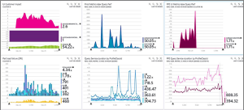

<properties 
    pageTitle="Trabalhar com informações de aplicação no Visual Studio" 
    description="Análise de desempenho e diagnósticos de durante a depuração e de produção." 
    services="application-insights" 
    documentationCenter=".net"
    authors="alancameronwills" 
    manager="douge"/>

<tags 
    ms.service="application-insights" 
    ms.workload="tbd" 
    ms.tgt_pltfrm="ibiza" 
    ms.devlang="na" 
    ms.topic="get-started-article" 
    ms.date="06/21/2016" 
    ms.author="awills"/>

# Trabalhar com informações de aplicação no Visual Studio

No Visual Studio (2015 e posterior), pode analisar o desempenho e diagnosticar problemas de depuração in e de produção, através de telemetria do [Visual Studio aplicação informações](app-insights-overview.md).

Se ainda não o ainda [Instalado aplicação informações na sua aplicação](app-insights-asp-net.md), fazer isto agora.

## Depurar o seu projeto

Executar a sua aplicação com F5 e experimentar: abrir páginas diferentes para gerar algumas telemetria.

No Visual Studio, verá uma contagem dos eventos que tenha sido iniciada.

Clique neste botão para abrir a pesquisa diagnóstico. 

## Pesquisa diagnóstico

A janela de pesquisa mostra eventos que tenham sido iniciados. (Se tiver sessão iniciada num Azure ao configurar as informações de aplicação, poderá procurar os eventos mesmo no portal.)

A pesquisa de texto livre funciona em todos os campos nos eventos. Por exemplo, procure uma parte do URL de uma página; ou o valor de uma propriedade tal como localidade de cliente; ou palavras específicas num registo de rastreio.

Clicar num evento para ver as respetivas propriedades detalhadas.

Também pode abrir o separador de itens relacionados para ajudar a diagnosticar os pedidos de falhados ou exceções.

## Concentrador de diagnóstico

O concentrador de diagnóstico (no Visual Studio 2015 ou posterior) mostra a telemetria do servidor de informações da aplicação, tal como é gerado. Isto funciona, mesmo se optado por participar apenas para instalar o SDK, sem ligá-lo a um recurso no portal do Azure.

## Exceções

Se tiver a [Configurar a monitorização de exceção](app-insights-asp-net-exceptions.md), relatórios de exceção mostrará na janela de pesquisa. 

Clique numa exceção para obter um rastreio de pilha. Se o código da aplicação for aberto no Visual Studio, pode clicar em através de no rastreio de pilha de para a linha relevante do código.

Além disso, na linha de código Lens acima cada método, verá uma contagem das exceções tem sessão iniciada por informações de aplicação antiga 24h.

## Monitorização local

(A partir de atualização de 2015 do Visual Studio 2) Se ainda não o tiver configurado o SDK para enviar telemetria para o portal de informações de aplicação (para que não existe nenhuma chave instrumentação ApplicationInsights.config), em seguida, a janela Diagnóstico apresentará telemetria a partir da sua sessão depuração mais recentes. 

Este é conveniente se já tiver publicado uma versão anterior da sua aplicação. Não queira de telemetria a partir do seu sessões depuração para misturadas com telemetria no portal de informações de aplicação a partir da aplicação publicado.

Também é útil se tiver alguns [telemetria personalizada](app-insights-api-custom-events-metrics.md) ao qual pretende depurar antes de enviar telemetria para o portal.

* *Na primeira, posso totalmente configuradas informações de aplicação para enviar telemetria para o portal. Mas agora gostaria Consulte telemetria apenas no Visual Studio.*

 * Nas definições da janela de pesquisa, existe uma opção de pesquisa locais diagnósticos mesmo se a sua aplicação envia telemetria para o portal.
 * Para parar a ser enviada para o portal de telemetria, comentar a linha `<instrumentationkey>...` a partir do ApplicationInsights.config. Quando estiver pronto para enviar telemetria para o portal novamente, remova-os comentários.

## Tendências

Tendências é uma ferramenta para visualizar a forma como a sua aplicação comporta-se ao longo do tempo. 

Selecione **Tendências de telemetria explorar** o botão da barra de ferramentas de informações da aplicação ou a janela de pesquisa de informações da aplicação. Selecione uma das consultas comuns cinco para começar a utilizar. Pode analisar diferentes conjuntos de dados com base em tipos de telemetria, intervalos de tempo e outras propriedades. 

Para localizar anomalias nos seus dados, selecione uma das opções anomalia no menu pendente "Tipo de vista". As opções de filtragem na parte inferior da janela do tornam mais fácil reduza no subconjuntos específicos da sua telemetria.

[Mais informações sobre as tendências](app-insights-visual-studio-trends.md).

## O que se segue?

||
|---|---
|**[Adicionar mais dados](app-insights-asp-net-more.md)** Monitorizar a utilização, disponibilidade, dependências, exceções. Integre rastreios a partir do registo de quadros. Escreva telemetria personalizada. | 
|**[Trabalhar com o portal de informações de aplicação](app-insights-dashboards.md)** Os dashboards, poderosas ferramentas de diagnóstico e analíticas, alertas, um mapa de dependência direto da sua aplicação e telemetria exportar. |

 
