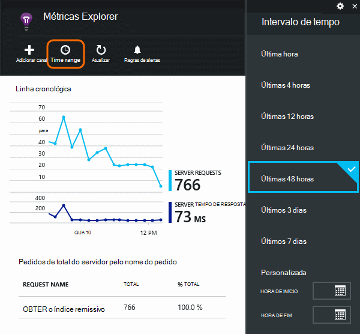
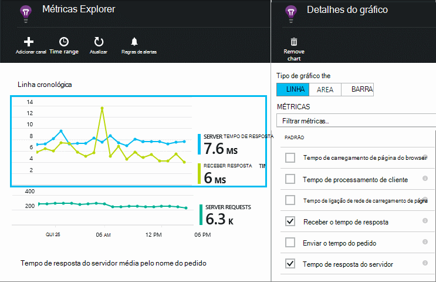
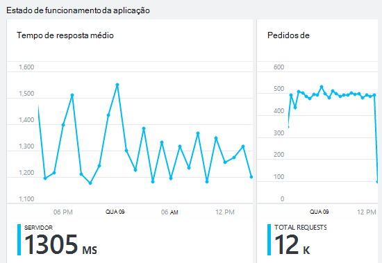
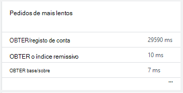
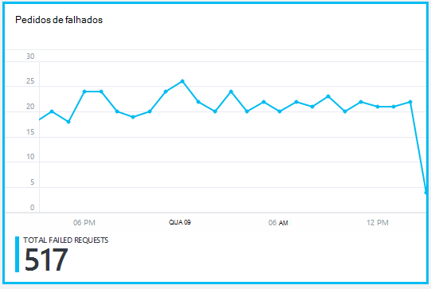
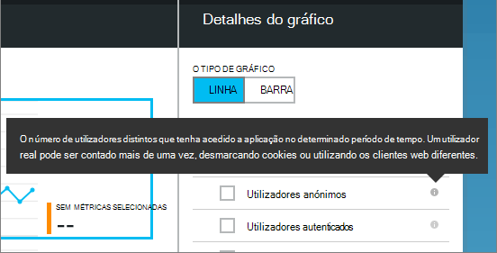
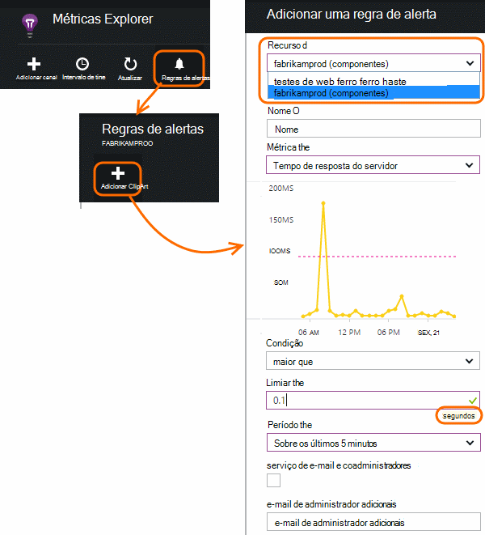

<properties 
    pageTitle="Monitorizar a sua aplicação estado de funcionamento e a utilização com informações de aplicação" 
    description="Introdução às informações de aplicação. Analise a utilização, disponibilidade e o desempenho do seu no local ou aplicações do Microsoft Azure." 
    services="application-insights" 
    documentationCenter=""
    authors="alancameronwills" 
    manager="douge"/>

<tags 
    ms.service="application-insights" 
    ms.workload="tbd" 
    ms.tgt_pltfrm="ibiza" 
    ms.devlang="na" 
    ms.topic="article" 
    ms.date="11/25/2015" 
    ms.author="awills"/>
 
# Monitorizar o desempenho nas aplicações web

*Informações de aplicação está na pré-visualização.*

Certifique-se a que sua aplicação está a executar bem e rapidamente Saiba mais sobre qualquer falhas. [Informações de aplicação] [ start] informá-lo sobre quaisquer problemas de desempenho e exceções e ajudá-lo a localizar e diagnosticar as causas raiz.

Informações de aplicação podem monitorizar aplicações web Java e ASP.NET e serviços, serviços WCF. Podem ser alojado no local, em máquinas virtuais ou como sites públicos do Microsoft Azure. 

No lado do cliente, informações de aplicação pode demorar telemetria de páginas web e uma grande variedade de dispositivos, incluindo iOS, Android e Windows loja de aplicações.

## Configurar a monitorização de desempenho

Se ainda não adicionou aplicação informações ao seu projeto (ou seja, se não tem ApplicationInsights.config), selecione uma das seguintes formas para começar a utilizar:

* [Aplicações web do ASP.NET](app-insights-asp-net.md)
 * [Adicionar exceção de monitorização](app-insights-asp-net-exceptions.md)
 * [Adicionar monitorização de dependência](app-insights-monitor-performance-live-website-now.md)
* [J2EE web apps](app-insights-java-get-started.md)
 * [Adicionar monitorização de dependência](app-insights-java-agent.md)

## Explorar métricas de desempenho

No [portal do Azure](https://portal.azure.com), navegue para o recurso de informações da aplicação que definiu para a sua aplicação. O separador Descrição Geral mostra dados de desempenho básicas:

Clique em qualquer gráfico para ver mais detalhes e para ver os resultados por um período. Por exemplo, clique no mosaico de pedidos e, em seguida, selecione um intervalo de tempo:

Clique no gráfico para escolher quais métricas apresenta, ou adicionar um novo gráfico e selecione o respetiva métricas:

> [AZURE.NOTE] **Desmarque todas as métricas** para ver a seleção completa que está disponível. Métricas abrange grupos; Quando está seleccionado qualquer membro de um grupo, aparecem apenas dos outros membros desse grupo.

## O que significa-todos os? Mosaicos de desempenho e relatórios

Existe uma variedade de métricas de desempenho que pode obter. Vamos começar por aqueles que apareça por predefinição no pá a aplicação.

### Pedidos de

O número de pedidos HTTP recebidos num período especificado. Comparar este procedimento com os resultados noutros relatórios para ver como a sua aplicação comporta-se como a carga varia.

Pedidos de HTTP incluem todos os pedidos GET ou POST de páginas, dados e imagens.

Clique no mosaico para obter as contagens de URL específicos.

### Tempo de resposta médio

Medidas o tempo entre um pedido de web introduzir a sua aplicação e a resposta a ser devolvido.

Os pontos de mostram um mover média. Se existirem muitas pedidos, poderá haver algumas que se afastarem de média sem um pico óbvio ou mergulhar no gráfico.

Procure picos invulgares. Em geral, espera tempo de resposta para aumentar com um aumento pedidos. Se o aumento for desproporcionado, poderá atingir um limite de recursos como CPU ou a capacidade de um serviço que utilize a aplicação.

Clique no mosaico para obter horas para o URL específicos.

### Pedidos de mais lentos

Mostra quais os pedidos poderão ter de otimização do desempenho.

### Pedidos de falhados

Uma contagem de pedidos emitiu não identificadas exceções.

Clique no mosaico para ver os detalhes de falhas específicas e selecione um pedido individual para ver os detalhes. 

Apenas uma amostra representante da falhas é mantida para inspeção individual.

### Outras métricas

Para ver o que defina outras métricas pode apresentar, clique num gráfico e, em seguida, desmarque todas as métricas para ver o total disponível. Clique em (i) para ver definição cada métrica.

Selecionar qualquer métrica desativar a outras pessoas que não é possível aparecem no mesmo gráfico.

## Definir alertas

Para ser notificado por correio eletrónico dos valores invulgares de qualquer métrica, adicione um alerta. Pode escolher qualquer para enviar o e-mail para os administradores de conta ou para endereços de correio eletrónico específico.

Defina o recurso antes das outras propriedades. Não selecione os recursos webtest se pretender definir alertas em desempenho ou utilização de métricas.

Tenha cuidado para tenha em atenção as unidades em que lhe for pedido para introduzir o valor limite.

*Não vejo o botão Adicionar alerta.* -Este é um grupo de conta a que tem acesso só de leitura? Contacte o administrador de conta.

## Diagnosticar problemas

Eis algumas sugestões para localizar e diagnosticar problemas de desempenho:

* Configurar o [testes web] [ availability] para recebê-se o web site vai para baixo ou responde incorretamente ou lentamente. 
* Compare a contagem de pedido com outras métricas para ver se falhas ou resposta lenta relacionados com carregar.
* [Inserir e procurar declarações de rastreio] [ diagnostic] no seu código para ajudar a identificar problemas.

## Próximos passos

[Web testes] [ availability] -tem pedidos de web enviados para a sua aplicação regulares a partir de todo o mundo.

[Capture e procurar rastreios diagnóstico] [ diagnostic] - inserir rastreio chamadas e percorrer os resultados para identificar problemas.

[A utilização de rastreio] [ usage] -a saber como as pessoas utilizam a sua aplicação.

[Resolução de problemas] [ qna] -perguntas e respostas

## Vídeo

[AZURE.VIDEO performance-monitoring-application-insights]

<!--Link references-->

[availability]: app-insights-monitor-web-app-availability.md
[diagnostic]: app-insights-diagnostic-search.md
[greenbrown]: app-insights-asp-net.md
[qna]: app-insights-troubleshoot-faq.md
[redfield]: app-insights-monitor-performance-live-website-now.md
[start]: app-insights-overview.md
[usage]: app-insights-web-track-usage.md

 
