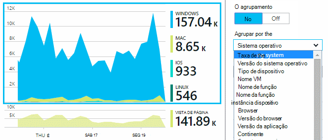

<properties 
    pageTitle="Análise de utilização para aplicações web com informações de aplicação" 
    description="Descrição geral da análise de utilização de aplicações web com informações de aplicação" 
    services="application-insights" 
    documentationCenter=""
    authors="alancameronwills" 
    manager="douge"/>

<tags 
    ms.service="application-insights" 
    ms.workload="tbd" 
    ms.tgt_pltfrm="ibiza" 
    ms.devlang="na" 
    ms.topic="article" 
    ms.date="06/12/2016" 
    ms.author="awills"/>
 
# <a name="usage-analysis-for-web-applications-with-application-insights"></a>Análise de utilização para aplicações web com informações de aplicação

Saber como as pessoas utilizam a sua aplicação permite-lhe concentrar-se o trabalho de desenvolvimento nos cenários que são mais importantes aos mesmos e obter informações para os objetivos que eles localizar mais fácil ou difícil alcançar. 

Informações de aplicação do Visual Studio fornece dois níveis de utilização de controlo:

* **, Sessão de página utilizadores e visualizar dados** - fornecidos terminar a caixa.  
* **Telemetria personalizada** - que [escrever código] [ api] para analisar os seus utilizadores através da experiência de utilizador da sua aplicação. 

## <a name="setting-up"></a>Configurar o

Abrir um recurso de informações de aplicação no [Portal do Azure](https://portal.azure.com), clique no gráfico de carregamentos de página vazio do Browser e siga as instruções de configuração.

[Saiba mais](app-insights-javascript.md) 


## <a name="how-popular-is-my-web-application"></a>Como popular é a minha aplicação web?

Inicie sessão no [portal do Azure][portal], navegue até ao seu recurso de aplicação e clique em utilização:


* **Utilizadores:** A contagem de utilizadores ativos distintos sobre o intervalo de tempo do gráfico. 
* **Sessões:** A contagem de sessões activas
* **Vistas de página** Conta o número de chamadas para trackPageView(), normalmente designado por uma vez por cada página web.

Clique em qualquer um dos gráficos para ver mais detalhes. Repare que pode alterar o intervalo de tempo dos gráficos.

### <a name="where-do-my-users-live"></a>Onde residem os meus utilizadores?

A partir do pá a utilização, clique no gráfico de utilizadores para ver mais detalhes:


 
### <a name="what-browsers-or-operating-systems-do-they-use"></a>Que browsers ou sistemas operativos utilizam?

Dados de grupo (segmento) por uma propriedade como Browser, o sistema operativo ou localidade:




## <a name="sessions"></a>Sessões

Sessão é um conceito fundamental em informações de aplicação, que esforça-se por associar cada evento de telemetria - como pedidos, vistas de página, exceções, ou eventos personalizados esse código-a uma sessão de utilizador específico. 

Informações de contexto de RTF serão recolhidas sobre cada sessão, tais como as características do dispositivo, geo localização, sistema operativo e assim sucessivamente.

Se instrumento cliente e no servidor ([ASP.NET] [ greenbrown] ou [J2EE][java]), o SDK serão propagados o id da sessão entre o cliente e servidor, para que podem ser associados eventos em ambos os lados.

Quando [diagnosticar problemas][diagnostic], pode encontrar todos os telemetria relacionados com a sessão em que ocorreu um problema, incluindo todos os pedidos e quaisquer eventos, exceções ou rastreios que tinha sessão iniciados.

Sessões de fornecer uma boa medida da popularidade do contextos como o dispositivo, o sistema operativo ou localização. Mostrando a contagem de sessões agrupados por dispositivo, por exemplo, obtém uma contagem mais precisa de frequência que o dispositivo é utilizado com a aplicação, que, contando vistas de página. Isto seria uma entrada útil para fazer uma triagem de qualquer problema específico do dispositivo.


#### <a name="whats-a-session"></a>O que é uma sessão?

Uma sessão representa um único deparar-se com entre o utilizador e a aplicação. Na sua forma mais simples, sessão começa com um utilizador iniciar a aplicação e concluir quando o utilizador sai a aplicação. Para aplicações web, por predefinição, a sessão termina após 30 minutos de inatividade, depois ou 24 horas da atividade. 

Pode alterar estas predefinições ao editar o fragmento de código:

    <script type="text/javascript">
        var appInsights= ... { ... }({
            instrumentationKey: "...",
            sessionRenewalMs: 3600000,
            sessionExpirationMs: 172800000
        });

* `sessionRenewalMs`: O tempo em milissegundos, a expirar a sessão devido a entrada do utilizador. Predefinição: 30 minutos.
* `sessionExpirationMs`: O comprimento máximo de sessão, em milissegundos. Se o utilizador permanece ativo depois desta vez, é contado outra sessão. Predefinição: 24 horas.

**Duração da sessão** é uma [métrica] [ metrics] que regista o intervalo de tempo entre os itens de telemetria primeiro e último da sessão. (-Não inclui o período de tempo limite.)

**Contagem de sessões** de um determinado intervalo é definido como o número de sessões exclusivos com algumas atividade durante este intervalo. Quando olha para um intervalo de tempo como contagem de sessões diária para a semana passada, este é normalmente equivalente para o número total de sessões. 

No entanto, quando explorar mais curtos intervalos de tempo como grão horário, vai ser contada uma sessão de longa que abrangem vários horas para cada hora em que estava ativa a sessão. 

## <a name="users-and-user-counts"></a>Os utilizadores e as contagens de utilizador


Cada sessão do utilizador está associado com um id de utilizador exclusivo. 

Por predefinição, o utilizador está identificado ao colocar um cookie. Um utilizador que utiliza vários browsers ou dispositivos vai ser contado mais de uma vez. (Mas ver [utilizadores autenticados](#authenticated-users))


Métrica a **contagem de utilizador** num determinado intervalo é definida como o número de utilizadores exclusivos com atividade gravada durante este intervalo. Como resultado, os utilizadores com sessões longas podem ser contabilizados várias vezes, quando definir um intervalo de tempo para que o grão é menor que uma hora ou para.

**Novos utilizadores** conta os utilizadores cujas sessões primeiros com a aplicação ocorreram durante este intervalo. Se for utilizado o método predefinido de contagem por utilizadores por cookies, em seguida, este será também inclui os utilizadores que tenham desmarcada respectivos cookies, ou que estão a utilizar um novo dispositivo ou browser para aceder à sua aplicação pela primeira vez.


### <a name="authenticated-users"></a>Utilizadores autenticados

Se a aplicação web do permite aos utilizadores início de sessão, pode obter uma contagem mais precisa ao fornecer informações de aplicação com um identificador de utilizador exclusivo. Não tem de ser o nome da pessoa ou o mesmo id que utilizam na sua aplicação. Assim que a sua aplicação identificou o utilizador, utilize este código:


*JavaScript lado do cliente*

      appInsights.setAuthenticatedUserContext(userId);

Se a sua aplicação agrupa contas de utilizadores, também pode passar um identificador para a conta. 

      appInsights.setAuthenticatedUserContext(userId, accountId);

Os ids de utilizador e a conta não pode conter espaços ou os carateres`,;=|`


No [Explorador de métricas](app-insights-metrics-explorer.md), pode criar um gráfico dos **Utilizadores autenticados** e **contas**. 

## <a name="synthetic-traffic"></a>Tráfego síntese

Tráfego síntese inclui pedidos de testes de disponibilidade e a carga, crawlers do motor de procura e outros agentes. 

Aplicação tentativas de informações esforça-se por automaticamente determinar e classificar tráfego síntese e assinale-a corretamente. Na maioria dos casos, o tráfego síntese não invocar JavaScript SDK, para que esta actividade é excluída de utilizador e uma contagem de sessão. 

No entanto, para informações de aplicação [web testes][availability], o id de utilizador é definido automaticamente com base numa localização de POP e id da sessão é definido com base no teste executar id. Nas predefinições relatórios, o tráfego síntese estejam filtrado por predefinição, o que irá excluir estes utilizadores e sessões. No entanto, quando o tráfego síntese for incluído, pode causar um aumento pequenas no gerais utilizadores e as contagens de sessão.
 
## <a name="page-usage"></a>Utilização de página

Clique no gráfico de vistas de página para obter uma versão ampliada no mais juntamente com uma explicação detalhada das suas páginas mais populares:


 
O exemplo acima é de um Web site jogos. A partir dos mesmos podemos instantaneamente ver:

* A utilização não melhorado na semana passada. Talvez podemos deverá consideração motor de busca?
* Muitas pessoas menos consulte as páginas de jogos que a Home page. Por que motivo não Home page do nosso apelar para reprodução jogos?
* 'Problemas' são o jogo mais popular. Vamos deverá dar prioridade aos novas ideias e melhorias aí.

## <a name="custom-tracking"></a>Controlo personalizado

Vamos supor que em vez de execução cada jogo numa página web em separado, decidir reestruturá-los a todos os sessão na aplicação de página única mesmo, com a maior parte das funcionalidades do codificado como Javascript na página web. Isto permite ao utilizador alternar rapidamente entre um jogo e outro ou se ainda tiver vários jogos numa página. 

Mas ainda, optar por informações da aplicação para iniciar sessão o número de vezes que cada jogo é aberto, no exatamente da mesma forma que ao terem sido em páginas web em separado. Que é fácil: inserir apenas uma chamada para o módulo de telemetria no seu JavaScript para o registo que foi aberto numa nova 'página' onde pretende:

    appInsights.trackPageView(game.Name);

## <a name="custom-events"></a>Eventos personalizados

Escreva telemetria personalizada para iniciar sessão eventos específicos. Particularmente numa aplicação única página, irá querer saber com que frequência o utilizador efetua ações específicas ou atinge certos objetivos: 

    appInsights.trackEvent("GameEnd");

Por exemplo, para iniciar sessão clicando numa ligação:

    <a href="target.htm" onclick="appInsights.trackEvent('linkClick');return true;">my link</a>


## <a name="view-counts-of-custom-events"></a>Contagens de vista de eventos personalizados

Abra o Explorador de métricas e adicionar um gráfico para mostrar os eventos. Segmento pelo nome:


## <a name="drill-into-specific-events"></a>Explorar os eventos específicos

Para obter uma melhor compreensão das como acede uma sessão típica, poderá querer focar-se numa sessão de utilizador específico que contém um tipo específico de evento. 

Neste exemplo, vamos codificadas um evento personalizado "NoGame" que chama-se o utilizador inicia sem iniciar realmente um jogo. Por que motivo é que um utilizador que pretende fazer? Talvez se vamos explorar os algumas ocorrências específicas, podemos irá obter uma pista. 

Eventos personalizados recebidos a partir da aplicação estão listados por nome no pá a descrição geral:


 
Clique no evento de interesse e selecione uma recente ocorrência específica:


 
Vamos ver todos os de telemetria para sessão em que ocorreu esse evento NoGame em particular. 


 
Não foram sem exceções, para que o utilizador não foi impedido de reprodução por alguns falha.
 
Vamos pode filtrar todos os tipos de telemetria exceto vistas de página para esta sessão:


 
E agora pode Vemos que este utilizador com sessão iniciada simplesmente para verificar as pontuações mais recentes. Talvez podemos deverá tomar em consideração desenvolver uma história de utilizador que o torna mais fácil para o fazer. (E podemos deve implementar um evento personalizado ao relatório quando ocorre este bloco específico.)

## <a name="filter-search-and-segment-your-data-with-properties"></a>Filtrar, procurar e segmentar os seus dados com propriedades
Pode anexar arbitrários etiquetas e valores numéricos a eventos.
 

*JavaScript lado do cliente*

```JavaScript

    appInsights.trackEvent("WinGame",
        // String properties:
        {Game: currentGame.name, Difficulty: currentGame.difficulty},
        // Numeric measurements:
        {Score: currentGame.score, Opponents: currentGame.opponentCount}
    );
```

*C# no servidor*

```C#

    // Set up some properties:
    var properties = new Dictionary <string, string> 
        {{"game", currentGame.Name}, {"difficulty", currentGame.Difficulty}};
    var measurements = new Dictionary <string, double>
        {{"Score", currentGame.Score}, {"Opponents", currentGame.OpponentCount}};

    // Send the event:
    telemetry.TrackEvent("WinGame", properties, measurements);
```

*VB no servidor*

```VB

    ' Set up some properties:
    Dim properties = New Dictionary (Of String, String)
    properties.Add("game", currentGame.Name)
    properties.Add("difficulty", currentGame.Difficulty)

    Dim measurements = New Dictionary (Of String, Double)
    measurements.Add("Score", currentGame.Score)
    measurements.Add("Opponents", currentGame.OpponentCount)

    ' Send the event:
    telemetry.TrackEvent("WinGame", properties, measurements)
```

Anexe propriedades para vistas de página da mesma forma:

*JavaScript lado do cliente*

```JS

    appInsights.trackPageView("Win", 
        url,
        {Game: currentGame.Name}, 
        {Score: currentGame.Score});
```

Na pesquisa de diagnóstico, ver as propriedades ao clicar em através de uma ocorrência individual de um evento.


 
Utilize o campo de pesquisa para ver as ocorrências de evento com um valor de propriedade em particular.


## <a name="a--b-testing"></a>A | Testes de B

Se não souber qual a variante de uma funcionalidade de será mais bem sucedida, liberte ambos-los, certificando cada acessível a diferentes que os utilizadores. Medir o êxito de cada e, em seguida, mover para uma versão unificada.

Para esta técnica, anexar distintas etiquetas para todos os telemetria que é enviada por cada versão da sua aplicação. Pode fazê-lo ao definir propriedades na TelemetryContext ativo. Estas propriedades predefinidas são adicionadas a todas as mensagens de telemetria que a aplicação de envia - não apenas as mensagens personalizadas, mas também de telemetria padrão. 

No portal do informações de aplicação, em seguida, poderá para filtrar e agrupar (segmento) os dados de etiquetas, publicados para comparar as diferentes versões.

*C# no servidor*

```C#

    using Microsoft.ApplicationInsights.DataContracts;

    var context = new TelemetryContext();
    context.Properties["Game"] = currentGame.Name;
    var telemetry = new TelemetryClient(context);
    // Now all telemetry will automatically be sent with the context property:
    telemetry.TrackEvent("WinGame");
```

*VB no servidor*

```VB

    Dim context = New TelemetryContext
    context.Properties("Game") = currentGame.Name
    Dim telemetry = New TelemetryClient(context)
    ' Now all telemetry will automatically be sent with the context property:
    telemetry.TrackEvent("WinGame")
```

Telemetria individual pode substituir os valores predefinidos.

Pode configurar um inicializador universal para que todos os TelemetryClients novos utilizar automaticamente o contexto.

```C#


    // Telemetry initializer class
    public class MyTelemetryInitializer : ITelemetryInitializer
    {
        public void Initialize (ITelemetry telemetry)
        {
            telemetry.Properties["AppVersion"] = "v2.1";
        }
    }
```

No inicializador a aplicação, tal como Global.asax.cs:

```C#

    protected void Application_Start()
    {
        // ...
        TelemetryConfiguration.Active.TelemetryInitializers
        .Add(new MyTelemetryInitializer());
    }
```


## <a name="build---measure---learn"></a>Compilar - medida - Saiba mais

Quando utilizar a análise, que se torne uma peça integrada do ciclo de desenvolvimento - não apenas algo que pensa que prestes a ajudar a resolver problemas. Eis algumas sugestões:

* Determine a métrica chave da sua aplicação. Pretende tantos utilizadores possível ou prefere um pequeno conjunto de utilizadores Feliz? Pretende maximizar visitas ou vendas?
* Plano para medir a cada bloco. Quando um novo bloco de utilizador esboçar ou funcionalidade ou o plano para actualizar um já existente, sempre pense como irá medir o sucesso da alteração. Antes de codificação é iniciado, solicitar "que efeito esta terá no nossas métricas, se funciona? Deverá podemos registar quaisquer novos eventos?"
E obviamente, quando a funcionalidade estiver direto, certifique-se de que observe as análises e agir nos resultados. 
* Se relacionam com outras métricas da métrica do chave. Por exemplo, se adicionar uma funcionalidade de "Favoritos", gostaria de saber com que frequência os utilizadores adicionam Favoritos. No entanto, talvez, é mais interessantes para saber o número de vezes que eles regresse aos seus favoritos. E, sobretudo, os clientes que utilizam Favoritos finalmente comprar mais do seu produto?
* Canárias testes. Configure um parâmetro de funcionalidade que permite-lhe tornar uma nova funcionalidade visível apenas para alguns utilizadores. Utilize as informações de aplicação para ver se está a ser utilizada a nova funcionalidade da forma que previstas. Efectuar ajustes, em seguida, solte-lo a uma audiência maior.
* Falar com os seus utilizadores! Análise não é suficiente na sua própria, mas complementar para manter uma relação de cliente boa.


## <a name="references"></a>Referências

* [Utilizar a API - descrição geral][api]
* [Referência da JavaScript API](https://github.com/Microsoft/ApplicationInsights-JS/blob/master/API-reference.md)

## <a name="video"></a>Vídeo

> [AZURE.VIDEO usage-monitoring-application-insights]


<!--Link references-->

[api]: app-insights-api-custom-events-metrics.md
[availability]: app-insights-monitor-web-app-availability.md
[client]: app-insights-javascript.md
[diagnostic]: app-insights-diagnostic-search.md
[greenbrown]: app-insights-asp-net.md
[java]: app-insights-java-get-started.md
[metrics]: app-insights-metrics-explorer.md
[portal]: http://portal.azure.com/
[windows]: app-insights-windows-get-started.md

 
