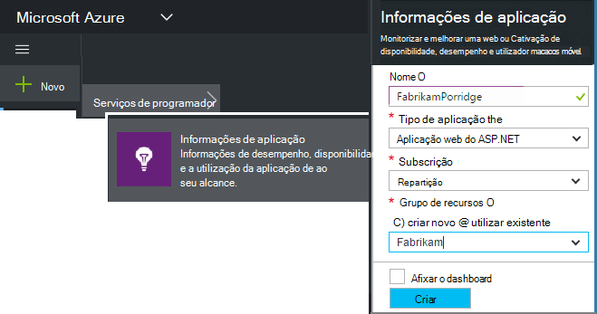
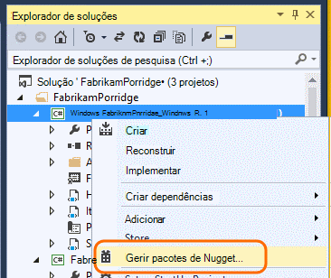
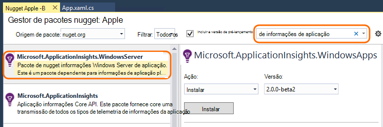
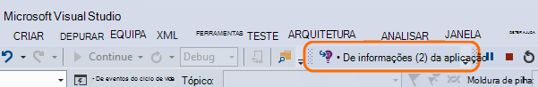
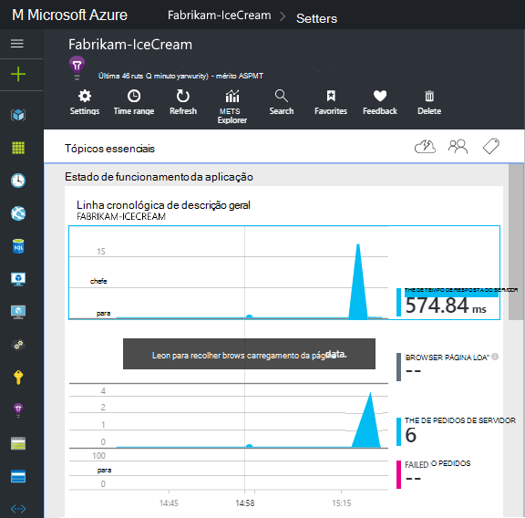
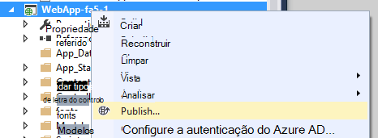

<properties
    pageTitle="Serviços de informações para o Windows de aplicações e funções de trabalho | Microsoft Azure"
    description="Adicione manualmente o SDK de informações de aplicação à aplicação ASP.NET para analisar a utilização, disponibilidade e o desempenho."
    services="application-insights"
    documentationCenter=".net"
    authors="alancameronwills"
    manager="douge"/>

<tags
    ms.service="application-insights"
    ms.workload="tbd"
    ms.tgt_pltfrm="ibiza"
    ms.devlang="na"
    ms.topic="get-started-article"
    ms.date="08/30/2016"
    ms.author="awills"/>

# Configurar manualmente as informações de aplicação para aplicações do ASP.NET 4

*Informações de aplicação está na pré-visualização.*

[AZURE.INCLUDE [app-insights-selector-get-started](../../includes/app-insights-selector-get-started.md)]

Pode configurar manualmente o [Visual Studio aplicação informações](app-insights-overview.md) para monitorizar a serviços do Windows, funções de trabalho e outras aplicações do ASP.NET. Para aplicações web, a configuração manual é uma alternativa a [configuração automática](app-insights-asp-net.md) oferecidos pelo Visual Studio.

Informações de aplicação ajuda-o a diagnosticar problemas e a utilização na sua aplicação direto e o desempenho do monitor.

#### Antes de começar

Precisa de:

* Uma subscrição do [Microsoft Azure](http://azure.com). Se a sua equipa ou a organização tiver uma subscrição do Azure, o proprietário pode adicionar ao-lo, com a sua [conta Microsoft](http://live.com).
* Visual Studio 2013 ou posterior.

## 1. Crie um recurso de informações de aplicação

Inicie sessão no [portal do Azure](https://portal.azure.com/)e criar um novo recurso de informações da aplicação. Selecione ASP.NET como o tipo de aplicação.

Um [recurso](app-insights-resources-roles-access-control.md) no Azure é uma instância de um serviço. Este recurso é onde telemetria da sua aplicação será analisada e lhe apresentada.

Escolha do tipo de aplicação define o conteúdo predefinido de pás o recurso e as propriedades visível no [Explorador de métricas](app-insights-metrics-explorer.md).

#### Copiar a chave de instrumentação

A tecla identifica o recurso e, que irá instalá-la mais cedo no SDK para direcionar dados para o recurso.

Os passos que efetuou apenas para criar um novo recurso são uma boa forma de iniciar a monitorização de qualquer aplicação. Agora pode enviar dados para o mesmo.

## 2. instalar o SDK na sua aplicação

Instalar e configurar o SDK de informações da aplicação variam consoante a plataforma de que está a trabalhar. Para as aplicações do ASP.NET, é fácil.

1. No Visual Studio, edite os pacotes de NuGet do seu projeto de aplicação web.

    

2. Instale a aplicação informações SDK para aplicações Web.

    

    *Pode utilizar outros volumes?*

    Sim. Selecione a API Core (Microsoft.ApplicationInsights) se pretender utilizar a API para enviar o seu próprio telemetria. O pacote do Windows Server inclui automaticamente a API Core plus um número de outros volumes como recolha contador de desempenho e dependência de monitorização. 

#### Atualizar para as versões futuras SDK

Vamos uma nova versão do SDK a frequentemente.

Para atualizar para uma [nova versão do SDK](https://github.com/Microsoft/ApplicationInsights-dotnet-server/releases/), abra novamente o Gestor de pacotes NuGet e filtrar no pacotes instalados. Selecione **Microsoft.ApplicationInsights.Web** e selecione **Atualizar**.

Se quaisquer personalizações que efetuou para ApplicationInsights.config, guarde uma cópia do mesmo antes de atualizar e, posteriormente intercalar as alterações a nova versão.

## 3. enviar telemetria

**Se instalou o pacote de core API:**

* Definir a chave de instrumentação no código, por exemplo na `main()`: 

    `TelemetryConfiguration.Active.InstrumentationKey = "`*a chave*`";` 

* [Escrever o seu próprio telemetria utilizar a API](app-insights-api-custom-events-metrics.md#ikey).

**Se tiver instalado o outros volumes de informações da aplicação,** pode, se preferir, utilize o ficheiro. config para definir a chave de instrumentação:

* Editar ApplicationInsights.config (qual foi adicionado ao instalar NuGet). Inserir isto apenas antes da etiqueta fecho:

    `<InstrumentationKey>`*a chave de instrumentação que copiou*`</InstrumentationKey>`

* Certifique-se de que as propriedades de ApplicationInsights.config no Explorador de solução estão definidas para **ação criar = conteúdo, copiar para directório de saída = copiar**.

## Executar o seu projeto

Utilizar o **F5** para executar a sua aplicação e experimentar: abrir páginas diferentes para gerar algumas telemetria.

No Visual Studio, verá uma contagem dos eventos que foram enviados.

## Ver o seu telemetria

Regresse ao [portal do Azure](https://portal.azure.com/) e navegue até ao seu recurso de informações da aplicação.

Procure dados em gráficos de descrição geral. Na primeira, verá apenas um ou dois pontos. Por exemplo:

Clique para ver mais detalhadas métricas. [Saiba mais sobre métricas.](app-insights-web-monitor-performance.md)

#### Sem dados?

* Utilize a aplicação, abrir páginas diferentes para que gera algumas telemetria.
* Abra o mosaico de [pesquisa](app-insights-diagnostic-search.md) , para ver os eventos individuais. Por vezes, bastam eventos um pouco enquanto mais tempo a obter através do pipeline de métricas.
* Aguarde alguns segundos e clique em **Atualizar**. Atualizar de gráficos próprios periodicamente, mas que pode atualizar manualmente se estiver a aguardar alguns dados que pode ser apresentada.
* Consulte o artigo [resolução de problemas](app-insights-troubleshoot-faq.md).

## Publicar a sua aplicação

Agora, implementar a aplicação para o seu servidor ou para Azure e ver os dados de acumular.

Quando executar no modo de depuração, telemetria é expedited através do pipeline de, para que deverá ver dados apresentadas em segundos. Quando implementar a aplicação na configuração de lançamento, dados é mais lentamente acumulado.

#### Sem dados depois de a publicar ao seu servidor?

Abra estas portas para o tráfego de saída na firewall do seu servidor:

+ `dc.services.visualstudio.com:443`
+ `f5.services.visualstudio.com:443`

#### Problemas no seu servidor de compilação?

Consulte o artigo [este item de resolução de problemas](app-insights-asp-net-troubleshoot-no-data.md#NuGetBuild).

> [AZURE.NOTE]Se a sua aplicação gera muitas telemetria (e estiver a utilizar o 2.0.0-beta3 de versão do ASP.NET SDK ou posterior), o módulo amostragem ajustável automaticamente irá reduzir o volume que é enviado para o portal através do envio apenas uma fração representante de eventos. No entanto, os eventos relacionados com o mesmo pedido vão ser selecionados ou desmarcados como um grupo, para que pode navegar entre os eventos relacionados. 
> [Saiba mais sobre amostragem](app-insights-sampling.md).

## Próximos passos

* [Adicionar mais de telemetria](app-insights-asp-net-more.md) para obter a vista de 360 graus da sua aplicação.

