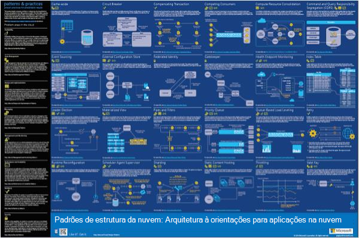

<properties 
    pageTitle="Arquitetura de aplicação no Microsoft Azure | Microsoft Azure" 
    description="Descrição geral de arquitectura que abrange os padrões de design comuns" 
    services="" 
    documentationCenter="" 
    authors="Rboucher" 
    manager="jwhit" 
    editor="mattshel"/>

<tags 
    ms.service="multiple" 
    ms.workload="na" 
    ms.tgt_pltfrm="na" 
    ms.devlang="na" 
    ms.topic="article" 
    ms.date="09/13/2016" 
    ms.author="robb"/>

#Arquitetura de aplicação no Microsoft Azure
Recursos para a criação de aplicações que utilizam o Microsoft Azure. Isto inclui ferramentas para o ajudar a desenhar diagramas para descrever visualmente os sistemas de software. 

##Cartaz de padrões de estrutura

Microsoft padrões & práticas publicou o livro de [Padrões de estrutura na nuvem](http://msdn.microsoft.com/library/dn568099.aspx) que se encontra disponível no MSDN e em transferir PDF. Também existe um cartaz de formato grande disponível que lista todos os padrões de. 

##Curso de certificação de arquitectura Microsoft

Curso uma arquitetura de suporte Microsoft exame de certificação 70-534 criado pela Microsoft. Este fica [disponível gratuitamente no EDX.ORG](https://www.edx.org/course/architecting-microsoft-azure-solutions-microsoft-dev205x).  Utiliza o [Modelo do Visio plano 3D](#3d-blueprint-visio-template). 

##Soluções da Microsoft

A Microsoft publica um conjunto de alto nível de [arquitecturas de solução](http://aka.ms/azblueprints) que mostra como criar tipos específicos de sistemas utilizando produtos da Microsoft. 

Microsoft publicados anteriormente, um conjunto de plantas mostrando arquitecturas de exemplo. Aqueles foram substituídos pelas arquitecturas de solução mencionadas anteriormente e a ligação de plano tem foi redireccionada para apontarem para o-los. Se precisar de acesso para os materiais de plantas anterior por algum motivo, e-mail [CnESymbols@microsoft.com](mailto:CnESymbols@microsoft.com) com o seu pedido.   

As plantas e diagramas de arquitecturas de solução utilizam peças da [nuvem e definir de símbolo de empresa](#Drawing-symbol-and-icon-sets).   

##Modelo do Visio de plano 3D

As versões 3D da agora obsoleto [Plantas de arquitectura Microsoft](http://aka.ms/azblueprints) inicialmente foram criadas numa ferramenta que não sejam da Microsoft. Um modelo do Visio 2013 (e posterior) enviou de 5 de Agosto de 2015 como parte de um [curso de certificação de arquitectura Microsoft distribuído no EDX.ORG](#microsoft-architecture-certification-course).

O modelo também está disponível fora do curso. 

- [Ver o vídeo de formação](http://aka.ms/3dBlueprintTemplateVideo) primeiro para que saiba o que pode fazer   
- Transferir o [Microsoft 3d modelo do Visio plano](http://aka.ms/3DBlueprintTemplate)
- Transfira a [nuvem e símbolos de empresa](#drawing-symbol-and-icon-sets) para utilizar com o modelo 3D. 

Enviar por correio eletrónico-na [CnESymbols@microsoft.com](mailto:CnESymbols@microsoft.com) para específicos questões não respondidas pelos materiais de formação ou para enviar comentários. O modelo já não está em desenvolvimento ativo, mas é útil e relevantes ainda uma vez que pode utilizar qualquer PNG ou a [nuvem e símbolos de empresa](#drawing-symbol-and-icon-sets), que são atualizadas.  

##Conjuntos de símbolo e ícone de desenho 

[Ver o Visio e símbolos de vídeo de formação](http://aka.ms/CnESymbolsVideo) e, em seguida, [Transferir na nuvem e definir o símbolo de empresa](http://aka.ms/CnESymbols) para ajudar a criar materiais técnicas que descrevem Azure, Windows Server, SQL Server e muito mais. Pode utilizar os símbolos em diagramas de arquitectura, materiais de formação, apresentações, folhas de dados, infographics, documentos técnicos e livros de festa 3º mesmo se o livro prepara pessoas a utilizarem a produtos da Microsoft. No entanto, não são destinar para utilização em interfaces de utilizador.

Os símbolos de CnE estão no formato do Visio, SVG e PNG. Instruções adicionais sobre como utilizar facilmente utilizam os símbolos no PowerPoint estão incluídas no conjunto. 

O conjunto de símbolos vem incluído trimestral e é atualizado, são lançados novos serviços. 

Símbolos adicionais para o Microsoft Office e as tecnologias relacionadas estão disponíveis no [Microsoft Office Visio stencil](http://www.microsoft.com/en-us/download/details.aspx?id=35772), apesar de que não estão otimizados para diagramas de arquitecturais aspeto, o conjunto de CnE.   

**Comentários:** Se tiver utilizado os símbolos de CnE, preencha a 5 pergunta breve [inquérito](http://aka.ms/azuresymbolssurveyv2) ou correio eletrónico-na [CnESymbols@microsoft.com](mailto:CnESymbols@microsoft.com) para problemas e perguntas específicas. Gostaríamos de saber o que acha, incluindo positivo comentários, para que recomendamos saibam que continue a investir tempo no-los. 

##Arquitetura Infographics

Microsoft publica arquitetura várias relacionados com cartazes/infographics. Incluem [As aplicações de nuvem do edifício reais](https://azure.microsoft.com/documentation/infographics/building-real-world-cloud-apps/) e o [dimensionamento serviços em nuvem](https://azure.microsoft.com/documentation/infographics/cloud-services/) . 

