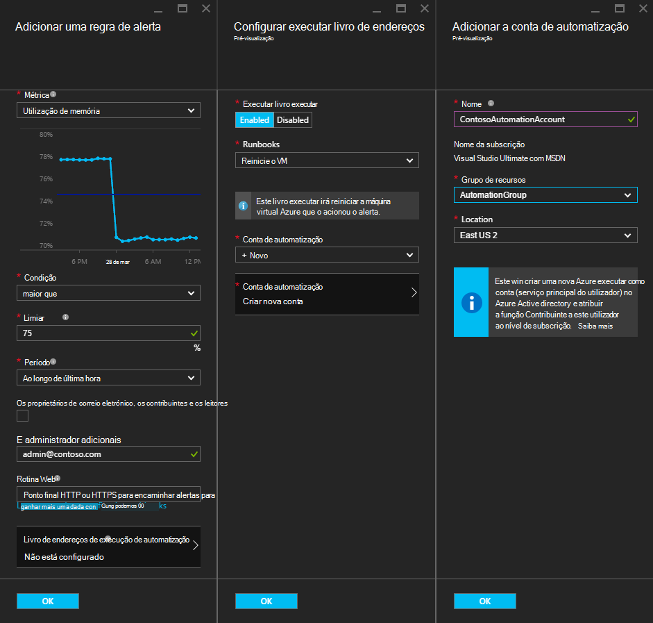
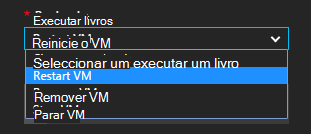
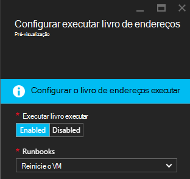
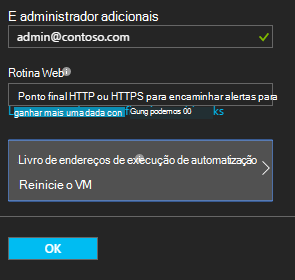

<properties
    pageTitle=" Solucionar uma Azure VM alertas com automatização Runbooks | Microsoft Azure"
    description="Este artigo demonstra como integrar o Azure Virtual Machine alertas runbooks de automatização do Azure e automática-solucionar uma problemas"
    services="automation"
    documentationCenter=""
    authors="mgoedtel"
    manager="jwhit"
    editor="tysonn" />    
<tags
    ms.service="automation"
    ms.devlang="na"
    ms.topic="article"
    ms.tgt_pltfrm="na"
    ms.workload="infrastructure-services"
    ms.date="06/14/2016"
    ms.author="csand;magoedte" />

# <a name="azure-automation-scenario---remediate-azure-vm-alerts"></a>Cenário de automatização Azure - solucionar uma alertas Azure VM

Azure automatização e máquinas virtuais do Azure disponibilizadas uma nova funcionalidade, permitindo-lhe configurar alertas de Máquina Virtual (VM) para executar runbooks de automatização. Esta nova capacidade permite-lhe desempenhar automaticamente remediação padrão em resposta ao alertas VM, como reiniciar ou parar a VM.

Anteriormente, durante a criação de alerta regra VM lhe foram capaz de [especificar uma webhook de automatização](https://azure.microsoft.com/blog/using-azure-automation-to-take-actions-on-azure-alerts/) para um livro de execuções para executar o livro de execuções sempre que o acionou o alerta. No entanto, isto necessário fazer o trabalho criar livro de execuções, criar webhook para o livro de execuções e, em seguida, copiar e colar a webhook durante a criação de alerta regra. Com este lançamento de novo, o processo é muito mais fácil porque diretamente pode escolher um livro de execuções de uma lista durante a criação de alerta regra e pode escolher uma conta de automatização que vai executar o livro de execuções ou criar facilmente uma conta.

Neste artigo, iremos mostrar-lhe como é fácil definir um alerta de Azure VM e configurar um livro de execuções automatização para ser executada sempre que o alerta de accionadores. Cenários de exemplo incluem reiniciar uma VM quando a utilização da memória excede algumas limiar devido a uma aplicação num VM com uma perda de memória, ou parar a uma VM quando o tempo de utilizador CPU tiverem sido inferior a 1% para hora antiga e não está em utilização. Também irá explicam a forma como a criação automática de um serviço principal na sua conta de automatização simplifica a utilização de runbooks no Azure remediação de alerta.

## <a name="create-an-alert-on-a-vm"></a>Criar um alerta numa VM

Execute os seguintes passos para configurar um alerta para iniciar um livro de execuções quando respectivo limiar foi cumprido.

>[AZURE.NOTE] Com esta versão, apenas suportamos máquinas virtuais de V2 e suporte para classic que VMS serão adicionados mais rapidamente.  

1. Inicie sessão no portal do Azure e clique em **máquinas virtuais**.  
2. Selecione uma das suas máquinas virtuais.  Será apresentada a pá de dashboard máquina virtual e a **Definições** de pá à direita.  
3. Pá **Definições** , na secção de monitorização selecione **regras alertas**.
4. No pá **alertas regras** , clique em **Adicionar alerta**.

Esta ação abre o pá **Adicionar uma regra de alerta** , onde pode configurar as condições para o alerta e escolher entre uma ou todas estas opções: enviar e-mail a alguém, utilize uma webhook para reencaminhar o alerta para outro sistema e/ou executar um livro de execuções automatização tentativa de resposta para solucionar uma o problema.

## <a name="configure-a-runbook"></a>Configurar um livro de execuções

Para configurar um livro de execuções para ser executada quando o limiar de alerta VM for cumprido, selecione o **Livro de execuções de automatização**. No pá **livro de execuções configurar** , pode selecionar livro de execuções para executar e a conta de automatização a executar o livro de execuções no.



>[AZURE.NOTE] Nesta versão pode escolher entre três runbooks que o serviço fornece – reiniciar VM, VM parar ou remover VM (eliminar).  A capacidade para selecionar outras runbooks ou um dos seus próprios runbooks estarão disponível num lançamento futuro.



Depois de selecionar um as três runbooks disponíveis, é apresentada a lista pendente de **conta de automatização** e pode selecionar uma conta de automatização que livro de execuções será executado como. Runbooks tem de executar no contexto de uma [conta de automatização](automation-security-overview.md) que seja na sua subscrição do Azure. Pode selecionar uma conta de automatização que já tiver criado ou pode ter uma nova conta de automatização criada para si.

Os que são fornecidos runbooks autenticar para Azure utilizando um principal de serviço. Se escolher executar o livro de execuções de uma das suas contas de automatização existentes, recomendamos irá criar automaticamente o serviço principal para si. Se optar por criar uma nova conta de automatização, em seguida, podemos irá criar automaticamente a conta e o capital de serviço. Em ambos os casos, duas activos serão também criados na conta de automatização – um activo certificado com o nome **AzureRunAsCertificate** e elementos uma ligação com o nome **AzureRunAsConnection**. O runbooks irá utilizar **AzureRunAsConnection** para autenticar com Azure para realizar a ação de gestão contra a VM.

>[AZURE.NOTE] O capital de serviço é criado no âmbito da subscrição e está atribuído a função Contribuinte. Esta função é necessária por ordem da conta de ter permissão para executar a automatização runbooks para gerir Azure VMs.  A criação de uma conta de Automaton e/ou serviços principal é um evento único. Assim que são criadas, pode utilizar essa conta para executar runbooks para outros alertas Azure VM.

Quando clica em **OK** no alerta está configurado e se selecionou a opção para criar uma nova conta de automatização, é criado juntamente com o serviço principal.  Isto pode demorar alguns segundos para concluir.  



Depois de concluída a configuração irá ver o nome do livro de execuções aparecem no pá **Adicionar uma regra de alerta** .



Clique em **OK** para **Adicionar uma regra de alerta** pá e a regra alerta serão criados e ative a se a máquina virtual está num Estado de execução.

### <a name="enable-or-disable-a-runbook"></a>Activar ou desactivar um livro de execuções

Se tiver um livro de execuções configurado para um alerta, pode desativar-sem remover a configuração do livro execuções. Esta opção permite-lhe manter o alerta em execução, talvez testar algumas das regras de alertas e, em seguida, mais tarde reativar o livro de execuções.

## <a name="create-a-runbook-that-works-with-an-azure-alert"></a>Criar um livro de execuções que funciona com um alerta Azure

Quando escolher um livro de execuções como parte de uma regra de alerta Azure, livro de execuções tem de ter lógica no-la para gerir os dados do alerta que lhe são transmitidos.  Quando um livro de execuções está configurado uma regra de alerta, é criada uma webhook para o livro de execuções; esse webhook, em seguida, é utilizado para iniciar o livro de execuções sempre que o alerta de accionadores.  A chamada para iniciar o livro de execuções real é um pedido de HTTP POST para o URL de webhook. Corpo do pedido de mensagem contém um objeto JSON formatado que contém as propriedades útil relacionadas com o alerta.  Como pode ver abaixo, os dados do alerta contém detalhes como subscriptionID, resourceGroupName, NomeRecurso e tipo de recurso.

### <a name="example-of-alert-data"></a>Exemplo de alerta de dados
```
{
    "WebhookName": "AzureAlertTest",
    "RequestBody": "{
    \"status\":\"Activated\",
    \"context\": {
        \"id\":\"/subscriptions/<subscriptionId>/resourceGroups/MyResourceGroup/providers/microsoft.insights/alertrules/AlertTest\",
        \"name\":\"AlertTest\",
        \"description\":\"\",
        \"condition\": {
            \"metricName\":\"CPU percentage guest OS\",
            \"metricUnit\":\"Percent\",
            \"metricValue\":\"4.26337916666667\",
            \"threshold\":\"1\",
            \"windowSize\":\"60\",
            \"timeAggregation\":\"Average\",
            \"operator\":\"GreaterThan\"},
        \"subscriptionId\":\<subscriptionID> \",
        \"resourceGroupName\":\"TestResourceGroup\",
        \"timestamp\":\"2016-04-24T23:19:50.1440170Z\",
        \"resourceName\":\"TestVM\",
        \"resourceType\":\"microsoft.compute/virtualmachines\",
        \"resourceRegion\":\"westus\",
        \"resourceId\":\"/subscriptions/<subscriptionId>/resourceGroups/TestResourceGroup/providers/Microsoft.Compute/virtualMachines/TestVM\",
        \"portalLink\":\"https://portal.azure.com/#resource/subscriptions/<subscriptionId>/resourceGroups/TestResourceGroup/providers/Microsoft.Compute/virtualMachines/TestVM\"
        },
    \"properties\":{}
    }",
    "RequestHeader": {
        "Connection": "Keep-Alive",
        "Host": "<webhookURL>"
    }
}
```

Quando o serviço de webhook automatização recebe a mensagem de HTTP extrai os dados do alerta e transmite-a para o livro de execuções no WebhookData livro execuções parâmetro de entrada.  Abaixo encontra-se um livro de execuções do exemplo que mostra como utilizar o parâmetro WebhookData e extrair os dados de alertas e utilizá-la para gerir o Azure recurso que o acionou o alerta.

### <a name="example-runbook"></a>Livro de execuções de exemplo

```
#  This runbook will restart an ARM (V2) VM in response to an Azure VM alert.

[OutputType("PSAzureOperationResponse")]

param ( [object] $WebhookData )

if ($WebhookData)
{
    # Get the data object from WebhookData
    $WebhookBody = (ConvertFrom-Json -InputObject $WebhookData.RequestBody)

    # Assure that the alert status is 'Activated' (alert condition went from false to true)
    # and not 'Resolved' (alert condition went from true to false)
    if ($WebhookBody.status -eq "Activated")
    {
        # Get the info needed to identify the VM
        $AlertContext = [object] $WebhookBody.context
        $ResourceName = $AlertContext.resourceName
        $ResourceType = $AlertContext.resourceType
        $ResourceGroupName = $AlertContext.resourceGroupName
        $SubId = $AlertContext.subscriptionId

        # Assure that this is the expected resource type
        Write-Verbose "ResourceType: $ResourceType"
        if ($ResourceType -eq "microsoft.compute/virtualmachines")
        {
            # This is an ARM (V2) VM

            # Authenticate to Azure with service principal and certificate
            $ConnectionAssetName = "AzureRunAsConnection"
            $Conn = Get-AutomationConnection -Name $ConnectionAssetName
            if ($Conn -eq $null) {
                throw "Could not retrieve connection asset: $ConnectionAssetName. Check that this asset exists in the Automation account."
            }
            Add-AzureRMAccount -ServicePrincipal -Tenant $Conn.TenantID -ApplicationId $Conn.ApplicationID -CertificateThumbprint $Conn.CertificateThumbprint | Write-Verbose
            Set-AzureRmContext -SubscriptionId $SubId -ErrorAction Stop | Write-Verbose

            # Restart the VM
            Restart-AzureRmVM -Name $ResourceName -ResourceGroupName $ResourceGroupName
        } else {
            Write-Error "$ResourceType is not a supported resource type for this runbook."
        }
    } else {
        # The alert status was not 'Activated' so no action taken
        Write-Verbose ("No action taken. Alert status: " + $WebhookBody.status)
    }
} else {
    Write-Error "This runbook is meant to be started from an Azure alert only."
}
```

## <a name="summary"></a>Resumo

Quando configurar um alerta uma VM Azure, tem agora a capacidade de configurar um livro de execuções automatização para desempenhar automaticamente ações remediação quando o alerta de accionadores facilmente. Nesta versão, pode escolher a partir do runbooks reiniciar, parar ou eliminar uma VM dependendo do seu cenário alerta. Este é apenas o início da ativação de cenários onde pode controlar as ações (notificação, resolução de problemas, remediação) que serão executadas automaticamente quando um alerta de accionadores.

## <a name="next-steps"></a>Próximos passos

- Para começar a trabalhar com gráficos runbooks, consulte o artigo [meu livro de execuções gráfico primeiro](automation-first-runbook-graphical.md)
- Para começar a trabalhar com runbooks de fluxo de trabalho do PowerShell, consulte o artigo [meu livro de execuções de fluxo de trabalho de PowerShell primeiro](automation-first-runbook-textual.md)
- Para saber mais sobre tipos de livro execuções, os respetivos vantagens e limitações, consulte o artigo [tipos de livro execuções de automatização do Azure](automation-runbook-types.md)
