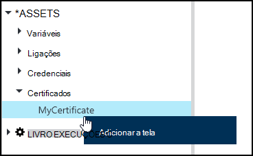
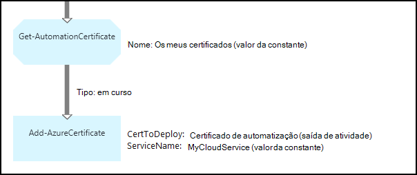

<properties 
   pageTitle="Certificado de activos no Azure automatização | Microsoft Azure"
   description="Certificados podem ser armazenados em segurança no Azure automatização para que possa ser acedidas por runbooks ou configurações DSC para autenticar Azure e recursos de terceiros.  Este artigo explica os detalhes de certificados e como trabalhar com os mesmos no textuais e gráficos de criação."
   services="automation"
   documentationCenter=""
   authors="mgoedtel"
   manager="stevenka"
   editor="tysonn" />
<tags 
   ms.service="automation"
   ms.devlang="na"
   ms.topic="article"
   ms.tgt_pltfrm="na"
   ms.workload="infrastructure-services"
   ms.date="02/23/2016"
   ms.author="magoedte;bwren" />

# Certificado de activos na automatização do Azure

Certificados podem ser armazenados em segurança no Azure automatização para que possa ser acedidas por runbooks ou configurações de DSC utilizando a atividade de **Obter AutomationCertificate** . Isto permite-lhe criar runbooks e as configurações de DSC que utilizam certificados de autenticação ou adiciona-os ao Azure ou terceiros recursos.

>[AZURE.NOTE] Activos seguros no Azure automatização incluem as credenciais, certificados, ligações e variáveis encriptadas. Estes elementos são encriptados e armazenados na automatização Azure utilizando uma chave exclusiva gerado para cada conta de automatização. Esta chave é encriptado por um certificado principal e armazenada no Azure automatização. Antes de os guardar um activo seguro, a chave da conta de automatização é desencriptada utilizando o certificado principal e, em seguida, utilizado para encriptar o elemento.

## Cmdlets do Windows PowerShell

Os cmdlets na seguinte tabela são utilizados para criar e gerir elementos de certificado de automatização com o Windows PowerShell. São fornecidos como parte do [módulo Azure PowerShell](../powershell-install-configure.md) que se encontra disponível para utilização em automatização runbooks e as configurações de DSC.

|Cmdlets|Descrição|
|:---|:---|
|[Get-AzureAutomationCertificate](http://msdn.microsoft.com/library/dn913765.aspx)|Obtém informações sobre um certificado. Apenas pode obter o certificado propriamente dito AutomationCertificate obter atividade.|
|[Novo AzureAutomationCertificate](http://msdn.microsoft.com/library/dn913764.aspx)|Importa um novo certificado para o Azure automatização.|
|[Remover - AzureAutomationCertificate](http://msdn.microsoft.com/library/dn913773.aspx)|Remove um certificado de automatização do Azure.|
|[Conjunto - AzureAutomationCertificate](http://msdn.microsoft.com/library/dn913763.aspx)|Define as propriedades de um certificado existente, incluindo carregar o ficheiro de certificado e definir a palavra-passe para um pfx.|

## Atividades para aceder a certificados

As atividades na seguinte tabela são utilizadas para aceder a certificados num livro execuções ou configuração DSC.

|Atividades|Descrição|
|:---|:---|
|Get-AutomationCertificate|Obtém um certificado para utilizar um livro execuções ou configuração DSC.|

>[AZURE.NOTE] Deve evitar utilizar variáveis no – nome parâmetro do Get-AutomationCertificate uma vez que este pode complicar identificação dependências entre runbooks ou configurações DSC e elementos de certificados na altura da estruturação.

## Criar um novo certificado

Quando cria um novo certificado, carregue um ficheiro. cer ou. pfx para automatização Azure. Se marcar o certificado como exportável, em seguida, pode transferir o-fora do arquivo de certificados de automatização do Azure. Se não for exportável, em seguida,-lo só pode ser utilizado para assinar dentro do livro execuções ou configuração DSC.

### Para criar um novo certificado com o portal clássico Azure

1. A partir da sua conta de automatização, clique em **recursos** na parte superior da janela.
1. Na parte inferior da janela, clique em **Adicionar definição**.
1. Clique em **Adicionar credenciais**.
2. Na lista pendente **Tipo de credencial** , selecione o **certificado**.
3. Escreva um nome para o certificado na caixa **nome** e clique na seta à direita.
4. Procure um ficheiro. cer ou. pfx.  Se selecionar um ficheiro. pfx, especifique uma palavra-passe e se deve ser permitido a serem exportadas.
1. Clique na marca de verificação para carregar o ficheiro de certificado e guardar o novo imobilizado certificado.

### Para criar um novo certificado com o portal do Azure

1. A partir da sua conta de automatização, clique na parte de **elementos** para abrir o pá de **activos** .
1. Clique na parte de **certificados** para abrir o pá **certificados** .
1. Clique em **Adicionar um certificado** no topo da pá.
2. Escreva um nome para o certificado na caixa **nome** .
2. Clique em **selecionar um ficheiro** em **carregar um ficheiro de certificado** para navegar para um ficheiro. cer ou. pfx.  Se selecionar um ficheiro. pfx, especifique uma palavra-passe e se deve ser permitido a serem exportadas.
1. Clique em **Criar** para guardar o novo imobilizado certificado.

### Para criar um novo certificado com o Windows PowerShell

Os comandos de exemplo seguintes mostram como criar um novo certificado de automatização e marca-exportável. Esta opção importa um ficheiro. pfx existente.

    $certName = 'MyCertificate'
    $certPath = '.\MyCert.pfx'
    $certPwd = ConvertTo-SecureString -String 'P@$$w0rd' -AsPlainText -Force
    
    New-AzureAutomationCertificate -AutomationAccountName "MyAutomationAccount" -Name $certName -Path $certPath –Password $certPwd -Exportable

## Utilizar um certificado

Tem de utilizar a atividade de **Obter AutomationCertificate** para utilizar um certificado. Não pode utilizar o cmdlet [Get-AzureAutomationCertificate](http://msdn.microsoft.com/library/dn913765.aspx) desde devolve informações sobre os elementos de certificado, mas não o certificado propriamente dito.

### Exemplo de livro de execuções textual

O código de exemplo seguinte mostra como adicionar um certificado para um serviço na nuvem num livro de execuções. Neste exemplo, a palavra-passe é obtida a partir de uma variável de automatização encriptada.

    $serviceName = 'MyCloudService'
    $cert = Get-AutomationCertificate -Name 'MyCertificate'
    $certPwd = Get-AutomationVariable –Name 'MyCertPassword'
    Add-AzureCertificate -ServiceName $serviceName -CertToDeploy $cert

### Exemplo de livro de execuções gráfica

Adicionar um **Get-AutomationCertificate** a um livro de execuções gráfico ao clicar no certificado no painel de biblioteca do editor de gráfico e selecionar **Adicionar a tela**.

A imagem seguinte mostra um exemplo de utilização de um certificado de um livro de execuções gráfico.  Este é o mesmo exemplo apresentado acima para adicionar um certificado para um serviço na nuvem a partir de um livro de execuções textual.  

Este exemplo utiliza o parâmetro de **UseConnectionObject** definido para a atividade de **Enviar TwilioSMS** que utiliza um objeto de ligação para a autenticação para o serviço.  Uma [ligação de tubagem](automation-graphical-authoring-intro.md#links-and-workflow) deve ser utilizado aqui uma vez que uma ligação de sequência deve devolver uma coleção de um único objeto que o parâmetro de ligação não está à espera.

## Consulte também

- [Hiperligações na criação de gráficos](automation-graphical-authoring-intro.md#links-and-workflow) 
