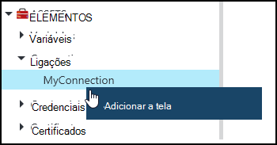
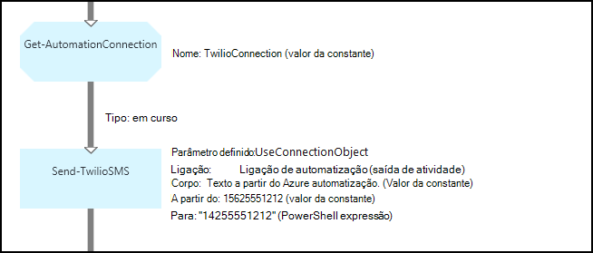
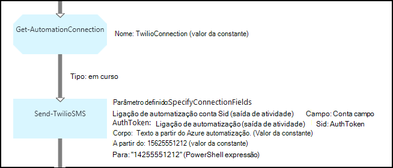

<properties 
   pageTitle="Elementos de ligação no Azure automatização | Microsoft Azure"
   description="Elementos de ligação no Azure automatização contêm as informações necessárias para ligar a um serviço externo ou a aplicação a partir de uma configuração de DSC ou livro execuções. Este artigo explica os detalhes das ligações e como trabalhar com os mesmos no textuais e gráficos de criação."
   services="automation"
   documentationCenter=""
   authors="bwren"
   manager="stevenka"
   editor="tysonn" />
<tags 
   ms.service="automation"
   ms.devlang="na"
   ms.topic="article"
   ms.tgt_pltfrm="na"
   ms.workload="infrastructure-services"
   ms.date="01/27/2016"
   ms.author="bwren" />

# Elementos de ligação no Azure automatização

Um ativo de ligação de automatização contém as informações necessárias para ligar a um serviço externo ou a aplicação a partir de uma configuração de DSC ou livro execuções. Isto pode incluir a informação necessária para autenticação, tal como um nome de utilizador e palavra-passe para além de informações da ligação como um URL ou uma porta. O valor de uma ligação é manter todas as propriedades para ligar a uma aplicação específica num imobilizado por oposição à criação de múltiplas variáveis. O utilizador pode editar os valores de uma ligação num único local, e pode ser efetuada com o nome de uma ligação um livro execuções ou a configuração do DSC num único parâmetro. As propriedades de uma ligação, podem ser acedidas na configuração de DSC com a atividade de **Obter AutomationConnection** ou livro execuções.

Quando cria uma ligação, tem de especificar um *tipo de ligação*. O tipo de ligação é um modelo que define um conjunto de propriedades. A ligação define valores para cada propriedade definido no respetivo tipo de ligação. Tipos de ligação são adicionados a automatização Azure do módulos de integração ou criados com a [API de automatização do Azure](http://msdn.microsoft.com/library/azure/mt163818.aspx). Os tipos de ligação apenas que estão disponíveis quando criar uma ligação são aqueles instalado na sua conta de automatização.

>[AZURE.NOTE] Activos seguros no Azure automatização incluem as credenciais, certificados, ligações e variáveis encriptadas. Estes elementos são encriptados e armazenados na automatização Azure utilizando uma chave exclusiva gerado para cada conta de automatização. Esta chave é encriptado por um certificado principal e armazenada no Azure automatização. Antes de os guardar um activo seguro, a chave da conta de automatização é desencriptada utilizando o certificado principal e, em seguida, utilizado para encriptar o elemento.

## Cmdlets do Windows PowerShell

Os cmdlets na seguinte tabela são utilizados para criar e gerir ligações de automatização com o Windows PowerShell. São fornecidos como parte do [módulo Azure PowerShell](../powershell-install-configure.md) que se encontra disponível para utilização em automatização runbooks e as configurações de DSC.

|Cmdlet|Descrição|
|:---|:---|
|[Get-AzureAutomationConnection](http://msdn.microsoft.com/library/dn921828.aspx)|Obtém uma ligação. Inclui uma tabela de hash com os valores de campos a ligação.|
|[Novo AzureAutomationConnection](http://msdn.microsoft.com/library/dn921825.aspx)|Cria uma nova ligação.|
|[Remover AzureAutomationConnection](http://msdn.microsoft.com/library/dn921827.aspx)|Remova uma ligação existente.|
|[Definir AzureAutomationConnectionFieldValue](http://msdn.microsoft.com/library/dn921826.aspx)|Define o valor de um determinado campo para uma ligação existente.|

## Atividades

As atividades na seguinte tabela são utilizadas para ligações num livro execuções ou configuração DSC de acesso.

|Atividades|Descrição|
|---|---|
|Get-AutomationConnection|Obtém uma ligação para utilizar. Devolve uma tabela de hash com as propriedades da ligação.|

>[AZURE.NOTE] Deve evitar utilizar variáveis no – nome parâmetro do **Get-AutomationConnection** uma vez que este pode complicar identificação dependências entre runbooks ou configurações DSC e elementos de ligação na altura da estruturação.

## Criar uma nova ligação

### Para criar uma nova ligação com o portal clássico Azure

1. A partir da sua conta de automatização, clique em **recursos** na parte superior da janela.
1. Na parte inferior da janela, clique em **Adicionar definição**.
1. Clique em **Adicionar ligação**.
2. Na lista pendente **Tipo de ligação** , selecione o tipo de ligação que pretende criar.  O assistente irá apresentar as propriedades para esse tipo específico.
1. Concluir o assistente e clique em caixa de verificação para guardar a nova ligação.

### Para criar uma nova ligação com o portal do Azure

1. A partir da sua conta de automatização, clique na parte de **elementos** para abrir o pá de **activos** .
1. Clique na parte de **ligações** para abrir o pá **ligações** .
1. Clique em **Adicionar uma ligação** no topo da pá.
2. Na lista pendente **tipo** , selecione o tipo de ligação que pretende criar. O formulário irá apresentar as propriedades para esse tipo específico.
1. Preencha o formulário e clique em **Criar** para guardar a nova ligação.

### Para criar uma nova ligação com o Windows PowerShell

Crie uma nova ligação com o Windows PowerShell utilizando o cmdlet [AzureAutomationConnection novo](http://msdn.microsoft.com/library/dn921825.aspx) . Este cmdlet tem um parâmetro com o nome **ConnectionFieldValues** espera de uma [tabela hash](http://technet.microsoft.com/library/hh847780.aspx) definir valores para cada uma das propriedades definidas pelo tipo de ligação.

Os seguintes comandos de exemplo criam uma nova ligação para [Twilio](http://www.twilio.com) é um serviço de telefonia que permite-lhe enviar e receber mensagens de texto.  Um módulo de integração de exemplo que inclui um tipo de ligação Twilio está disponível no [Centro de Script](http://gallery.technet.microsoft.com/scriptcenter/Twilio-PowerShell-Module-8a8bfef8).  Este tipo de ligação define as propriedades para SID de conta e Token de autorização, que são necessários para validar a sua conta quando se liga ao Twilio.  Tem de [transferir este módulo](http://gallery.technet.microsoft.com/scriptcenter/Twilio-PowerShell-Module-8a8bfef8) de e instalá-lo na sua conta de automatização para este código de exemplo trabalhar.

    $AccountSid = "DAf5fed830c6f8fac3235c5b9d58ed7ac5"
    $AuthToken  = "17d4dadfce74153d5853725143c52fd1"
    $FieldValues = @{"AccountSid" = $AccountSid;"AuthToken"=$AuthToken}

    New-AzureAutomationConnection -AutomationAccountName "MyAutomationAccount" -Name "TwilioConnection" -ConnectionTypeName "Twilio" -ConnectionFieldValues $FieldValues

## Utilizar uma ligação num livro execuções ou configuração DSC

Obtenha uma ligação de um livro execuções ou a configuração de DSC com o cmdlet **Get-AutomationConnection** .  Esta actividade obtém os valores dos campos diferentes na ligação e devolve-los como uma [tabela hash](http://go.microsoft.com/fwlink/?LinkID=324844) que, em seguida, podem ser utilizados com os comandos no livro execuções ou configuração DSC adequados.

### Exemplo de livro de execuções textual
Os comandos de exemplo seguintes mostram como utilizar a ligação Twilio no exemplo anterior para enviar uma mensagem de texto de um livro de execuções.  A atividade de enviar TwilioSMS utilizada aqui tem dois conjuntos de parâmetro cada utilize um método diferente para autenticar para o serviço de Twilio.  Um utiliza um objeto de ligação e outro utiliza parâmetros individuais para a conta SID e Token de autorização.  Ambos os métodos são apresentados neste exemplo.

    $Con = Get-AutomationConnection -Name "TwilioConnection"
    $NumTo = "14255551212"
    $NumFrom = "15625551212"
    $Body = "Text from Azure Automation."

    #Send text with connection object.
    Send-TwilioSMS -Connection $Con -From $NumFrom -To $NumTo -Body $Body

    #Send text with connection properties.
    Send-TwilioSMS -AccountSid $Con.AccountSid -AuthToken $Con.AuthToken -From $NumFrom -To $NumTo -Body $Body

### Livro de execuções gráficas amostras

Adicionar uma atividade de **Obter AutomationConnection** para um livro de execuções gráfico ao clicar na ligação no painel de biblioteca do editor de gráfico e selecionar **Adicionar a tela**.

A imagem seguinte mostra um exemplo de utilização de uma ligação de um livro de execuções gráfico.  Este é o mesmo exemplo apresentado acima para enviar uma mensagem de texto com Twilio a partir de um livro de execuções textual.  Este exemplo utiliza o parâmetro de **UseConnectionObject** definido para a atividade de **Enviar TwilioSMS** que utiliza um objeto de ligação para a autenticação para o serviço.  Uma [ligação de tubagem](automation-graphical-authoring-intro.md#links-and-workflow) é utilizada aqui, uma vez que o parâmetro de ligação está à espera num único objeto.

A razão pela qual um PowerShell expressão é utilizada para o valor do parâmetro **para** em vez de um valor da constante é este parâmetro espera um tipo de valor de matriz de cadeia, para que pode enviar para vários números.  Uma expressão de PowerShell permite-lhe fornecer um valor único ou de uma matriz.

A imagem abaixo mostra o exemplo como acima, mesmo mas utiliza o parâmetro de **SpecifyConnectionFields** definido que espera os parâmetros AccountSid e AuthToken para ser individualmente especificado por oposição a utilizar um objeto de ligação para a autenticação.  Neste caso, os campos da ligação estão especificados em vez do próprio objeto.  

## Artigos relacionados

- [Hiperligações na criação de gráficos](automation-graphical-authoring-intro.md#links-and-workflow)
 
