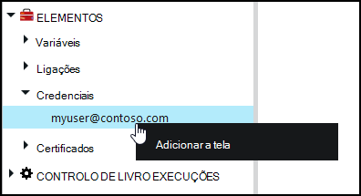
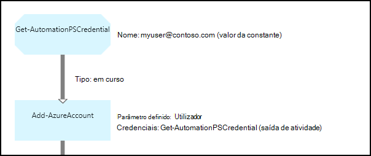

<properties 
   pageTitle="Elementos no Azure automatização de credenciais | Microsoft Azure"
   description="Elementos de credenciais no Azure automatização contêm as credenciais de segurança que podem ser utilizadas para autenticar para recursos pode ser consultados pela configuração de DSC ou livro execuções. Este artigo descreve como criar elementos de credenciais e utilizá-los num livro execuções ou configuração DSC."
   services="automation"
   documentationCenter=""
   authors="mgoedtel"
   manager="jwhit"
   editor="tysonn" />
<tags 
   ms.service="automation"
   ms.devlang="na"
   ms.topic="article"
   ms.tgt_pltfrm="na"
   ms.workload="infrastructure-services"
   ms.date="06/09/2016"
   ms.author="bwren" />

# Elementos de credenciais de automatização do Azure

Um ativo de credenciais de automatização contém um objeto de [PSCredential](http://msdn.microsoft.com/library/system.management.automation.pscredential) que contém as credenciais de segurança como um nome de utilizador e palavra-passe. Configurações de Runbooks e DSC podem utilizar cmdlets do que um objeto de PSCredential para a autenticação de aceitar ou estes podem extrair o nome de utilizador e palavra-passe do objeto PSCredential para fornecer aos algumas aplicação ou serviço que requer autenticação. As propriedades de credenciais são armazenadas em segurança no Azure automatização e podem ser acedidas na configuração de DSC com a atividade de [Obter AutomationPSCredential](http://msdn.microsoft.com/library/system.management.automation.pscredential.aspx) ou livro execuções.

>[AZURE.NOTE] Activos seguros no Azure automatização incluem as credenciais, certificados, ligações e variáveis encriptadas. Estes elementos são encriptados e armazenados na automatização Azure utilizando uma chave exclusiva gerado para cada conta de automatização. Esta chave é encriptado por um certificado principal e armazenada no Azure automatização. Antes de os guardar um activo seguro, a chave da conta de automatização é desencriptada utilizando o certificado principal e, em seguida, utilizado para encriptar o elemento. 

## Cmdlets do Windows PowerShell

Os cmdlets na seguinte tabela são utilizados para criar e gerir elementos de credenciais de automatização com o Windows PowerShell.  São fornecidos como parte do [módulo Azure PowerShell](../powershell-install-configure.md) que se encontra disponível para utilização em automatização runbooks e as configurações de DSC.

|Cmdlets|Descrição|
|:---|:---|
|[Get-AzureAutomationCredential](http://msdn.microsoft.com/library/dn913781.aspx)|Obtém informações sobre um activo de credenciais. Apenas pode obter a credencial própria a partir do **AutomationPSCredential obter** atividade.|
|[Novo AzureAutomationCredential](http://msdn.microsoft.com/library/azure/jj554330.aspx)|Cria uma nova credencial de automatização.|
|[Remover - AzureAutomationCredential](http://msdn.microsoft.com/library/azure/jj554330.aspx)|Remove uma credencial de automatização.|
|[Conjunto - AzureAutomationCredential](http://msdn.microsoft.com/library/azure/jj554330.aspx)|Define as propriedades de uma credencial de automatização existente.|

## Livro execuções atividades

As atividades na seguinte tabela são utilizadas para aceder a credenciais num livro de execuções e configurações de DSC.

|Atividades|Descrição|
|:---|:---|
|Get-AutomationPSCredential|Obtém uma credencial para utilizar uma configuração de DSC ou livro execuções. Devolve um objecto [System.Management.Automation.PSCredential](http://msdn.microsoft.com/library/system.management.automation.pscredential) .|

>[AZURE.NOTE] Deve evitar utilizar variáveis no – nome parâmetro do Get-AutomationPSCredential uma vez que este pode complicar identificação dependências entre runbooks ou configurações DSC e recursos na altura da estruturação de credenciais.

## Criar um novo activo de credenciais

### Para criar um novo activo credenciais com portal clássico do Azure

1. A partir da sua conta de automatização, clique em **recursos** na parte superior da janela.
1. Na parte inferior da janela, clique em **Adicionar definição**.
1. Clique em **Adicionar credenciais**.
2. Na lista pendente **Tipo de credencial** , selecione **PowerShell credenciais**.
1. Concluir o assistente e clique em caixa de verificação para guardar a nova credencial.

### Para criar um novo activo credenciais com o portal do Azure

1. A partir da sua conta de automatização, clique na parte de **elementos** para abrir o pá de **activos** .
1. Clique na parte de **credenciais** para abrir o pá **credenciais** .
1. Clique em **Adicionar credenciais** no topo da pá.
1. Preencha o formulário e clique em **Criar** para guardar a nova credencial.

### Para criar um novo activo credenciais com o Windows PowerShell

Os comandos de exemplo seguintes mostram como criar uma nova credencial de automatização. Um objeto de PSCredential é criado pela primeira vez com o nome e palavra-passe e, em seguida, utilizado para criar os elementos de credenciais. Em alternativa, pode utilizar o cmdlet **Get-credenciais** para lhe ser pedido para escrever um nome e palavra-passe.

    $user = "MyDomain\MyUser"
    $pw = ConvertTo-SecureString "PassWord!" -AsPlainText -Force
    $cred = New-Object –TypeName System.Management.Automation.PSCredential –ArgumentList $user, $pw
    New-AzureAutomationCredential -AutomationAccountName "MyAutomationAccount" -Name "MyCredential" -Value $cred

## Utilizar uma credencial de PowerShell

Obter um activo credencial num livro execuções ou configuração DSC com a atividade de **Obter AutomationPSCredential** . Isto devolve um [objeto de PSCredential](http://msdn.microsoft.com/library/system.management.automation.pscredential.aspx) que pode utilizar com uma actividade ou um cmdlet que requer um parâmetro PSCredential. Também pode obter as propriedades do objeto credenciais para utilizar individualmente. O objeto tem uma propriedade do nome de utilizador e a palavra-passe segura ou pode utilizar o método de **GetNetworkCredential** para devolver um objeto de [NetworkCredential](http://msdn.microsoft.com/library/system.net.networkcredential.aspx) irá fornecer uma versão não segura da palavra-passe.

### Exemplo de livro de execuções textual

Os comandos de exemplo seguintes mostram como utilizar uma credencial PowerShell num livro de execuções. Neste exemplo, a credencial serem recuperada e o nome de utilizador e palavra-passe atribuídas a variáveis.

    $myCredential = Get-AutomationPSCredential -Name 'MyCredential'
    $userName = $myCredential.UserName
    $securePassword = $myCredential.Password
    $password = $myCredential.GetNetworkCredential().Password

### Exemplo de livro de execuções gráfica

Adicionar uma atividade de **Obter AutomationPSCredential** para um livro de execuções gráfico ao clicar na credencial no painel de biblioteca do editor de gráfico e selecionar **Adicionar a tela**.

A imagem seguinte mostra um exemplo de utilização de uma credencial de um livro de execuções gráfico.  Neste caso, está a ser utilizado para fornecer a autenticação para um livro de execuções para recursos Azure conforme descrito no [Runbooks autenticar com a conta de utilizador do Azure AD](automation-sec-configure-aduser-account.md).  À primeira atividade obtém a credencial que tenha acesso para a subscrição Azure.  A atividade de **Adicionar AzureAccount** utiliza, em seguida, esta credencial para fornecer a autenticação para outras atividades que vêm após-lo.  Uma [ligação em curso](automation-graphical-authoring-intro.md#links-and-workflow) aqui está uma vez que **Get-AutomationPSCredential** está à espera num único objeto.  

## Utilizar uma credencial PowerShell no DSC
Enquanto configurações DSC no Azure automatização podem fazer referência a credencial activos utilizando **Get-AutomationPSCredential**, credencial activos é também possível passar através de parâmetros, se pretender. Para mais informações, consulte o artigo [Compiling configurações no Azure automatização DSC](automation-dsc-compile.md#credential-assets).

## Próximos passos

- Para obter mais informações sobre ligações em criação de gráficos, consulte [ligações na criação de gráficos](automation-graphical-authoring-intro.md#links-and-workflow)
- Para compreender os métodos de autenticação diferente com a automatização, consulte [A segurança de automatização do Azure](automation-security-overview.md)
- Para começar a trabalhar com gráficos runbooks, consulte o artigo [meu livro de execuções gráfico primeiro](automation-first-runbook-graphical.md)
- Para começar a trabalhar com runbooks de fluxo de trabalho do PowerShell, consulte o artigo [meu livro de execuções de fluxo de trabalho de PowerShell primeiro](automation-first-runbook-textual.md) 

 
