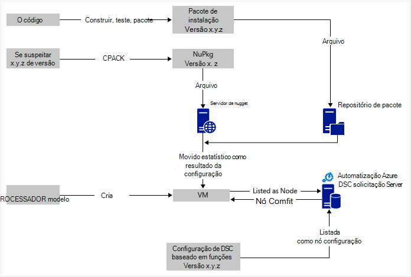
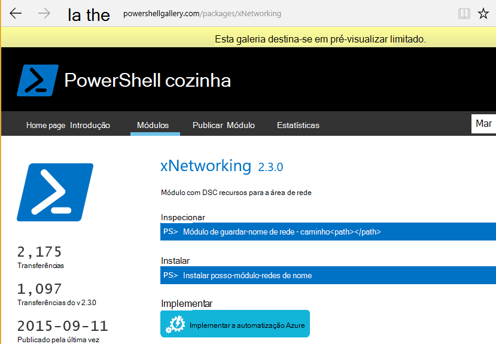

<properties
   pageTitle="Automatização Azure DSC implementação contínuo com Chocolatey | Microsoft Azure"
   description="Implementação de contínua DevOps utilizando DSC de automatização do Azure e para o Gestor de pacote Chocolatey.  Exemplo com o modelo de processador JSON completo e origem do PowerShell."
   services="automation"
   documentationCenter=""
   authors="sebastus"
   manager="stevenka"
   editor=""/>

<tags
   ms.service="automation"
   ms.devlang="na"
   ms.topic="article"
   ms.tgt_pltfrm="vm-windows"
   ms.workload="na"
   ms.date="08/08/2016"
   ms.author="golive"/>

# Exemplo de utilização: Contínua implementação em máquinas virtuais utilizando a automatização DSC e Chocolatey

No mundo DevOps existem muitas ferramentas para o ajudar com pontos de vários no pipeline de integração contínua.  Configuração de estado do Azure automatização desejado (DSC) é uma nova adição boas-vindas para as opções que podem empregam DevOps equipas.  Este artigo demonstra definição para cima contínua implementação (CD) para um computador Windows.  Pode expandir facilmente técnica para incluir quantos computadores com o Windows conforme necessário, na função (um web site, por exemplo) e, a partir daí para também funções adicionais.

## De alto nível

Existe bastante um pouco passa aqui, mas Felizmente-pode ser dividido em dois processos principais: 

  - Escrever o código e testá-la, criar e publicar pacotes de instalação para versões principais e secundárias do sistema. 
  - Criar e gerir VMs que irão instalar e executar o código nos pacotes.  

Assim ambos estes processos core estiverem no local, é um breve passo para atualizar automaticamente o pacote em execução no qualquer VM específico, tal como novas versões são criadas e implementadas.

## Descrição geral de componente

Gestores de pacote como [possam obter](https://en.wikipedia.org/wiki/Advanced_Packaging_Tool) são muito conhecidos no mundo Linux, mas não muito no mundo do Windows.  [Chocolatey](https://chocolatey.org/) é uma coisa tal e de Scott Hanselman [blogue](http://www.hanselman.com/blog/IsTheWindowsUserReadyForAptget.aspx) no tópico é uma excelente aqui.  Em Eis um resumo dos, Chocolatey permite-lhe instalar pacotes a partir de um repositório central de pacotes num sistema Windows utilizando a linha de comandos.  Pode criar e gerir o seu próprio repositório e Chocolatey pode instalar pacotes a partir de qualquer número de repositórios que designar.

Configuração do estado pretendida (DSC) ([Descrição geral](https://technet.microsoft.com/library/dn249912.aspx)) é uma ferramenta de PowerShell que permite-lhe declarar a configuração que pretende para uma máquina.  Por exemplo, pode dizer, "Pretendo Chocolatey instalado, pretendo IIS instalado, pretendo porta 80 aberta, pretendo 1.0.0 instalada versão do meu Web site."  O Gestor de DSC configuração Local (MMC) implementa que a configuração. DSC separar servidor mantém um repositório de configurações para sua máquinas. MMC em cada máquina controlos periodicamente para ver se a sua configuração corresponde a configuração armazenada. -Pode comunicar o estado ou tentar trazer a máquina de volta para alinhamento com a configuração armazenada. Pode editar a configuração armazenada no servidor solicitação para fazer com que um computador ou um conjunto de máquinas a entrar em alinhamento com a configuração alterada.

Automatização Azure é um serviço gerido no Microsoft Azure que permite-lhe automatizar tarefas vários utilizando runbooks, nós, credenciais, recursos e elementos como agendas e variáveis globais. Azure automatização DSC expande a esta capacidade de automatização para incluir ferramentas de PowerShell DSC.  Eis uma [Descrição geral](automation-dsc-overview.md)de excelente.

Um recurso de DSC é um módulo de código que tenha capacidades específicas, tal como a gestão de funcionamento em rede, Active Directory ou do SQL Server.  O recurso DSC Chocolatey sabe como aceder a um servidor de NuGet (entre outros), pacotes de transferir, instalar pacotes e assim sucessivamente.  Existem muitos outros recursos de DSC na [Galeria de PowerShell](http://www.powershellgallery.com/packages?q=dsc+resources&prerelease=&sortOrder=package-title).  Estes módulos são instalados no seu servidor de separar DSC do Azure automatização (por si) para que podem ser utilizadas pelo seu configurações.

Modelos de processador fornecem uma forma declarativa de gerar sua infraestrutura - coisas como redes, sub-redes, segurança da rede e encaminhamento, carregue balanceadores, NIC, VMs e assim sucessivamente.  Eis um [artigo](../resource-manager-deployment-model.md) que compara o modelo de implementação processador (declarativa) a com a gestão de serviço do Azure (ASM ou clássico) modelo de implementação (imperativo).  E outro [artigo](../virtual-machines/virtual-machines-windows-compare-deployment-models.md) sobre os fornecedores de recurso core, cluster, armazenamento e de rede.

Uma funcionalidade chave de um modelo de processador é a sua capacidade para instalar uma extensão VM para a VM, tal como está aprovisionado.  Uma extensão VM tem capacidades específicas, tais como a executar um script personalizado, instalar software de antivírus ou executar um script de configuração de DSC.  Existem muitos outros tipos de extensões VM.

## Rápida viagem à volta do diagrama

Iniciar na parte superior, escreva o seu código, criar e testar, em seguida, criar um pacote de instalação.  Chocolatey pode lidar com vários tipos de pacotes de instalação, tal como MSI, MSU, postal.  E tiver da potencialidade completa do PowerShell para efetuar a instalação real se capacidades nativas do Chocolatey não se adequarem até-lo.  Coloque o pacote de atualizações para o local acessível – um repositório de pacote.  Este exemplo de utilização utiliza uma pasta pública numa conta de armazenamento de Blobs do Azure, mas pode ser em qualquer lugar.  Chocolatey vierem funciona com servidores do NuGet e algumas outras pessoas para a gestão de metadados de pacote.  [Este artigo](https://github.com/chocolatey/choco/wiki/How-To-Host-Feed) descreve as opções.  Este exemplo de utilização utiliza NuGet.  Um Nuspec é metadados sobre os pacotes.  O Nuspec é "compilado" do NuPkg e armazenada no servidor NuGet.  Quando a configuração de pedidos de um pacote pelo nome e faz referência a um servidor de NuGet, o recurso de DSC Chocolatey (agora no VM) grabs o pacote de e instala-a para si.  Também pode pedir uma versão específica de uma embalagem.

Na parte inferior esquerda da imagem, não existe um modelo de Gestor de recursos do Azure (processador).  Neste exemplo de utilização, a extensão VM regista VM com o Azure automatização DSC solicitação servidor (ou seja, um servidor de solicitação) como um nó.  A configuração é armazenada no servidor solicitação.  Na verdade, este é armazenado duas vezes: uma vez como texto simples e uma vez por compilado como um ficheiro MOF (para aqueles que saber sobre esses elementos.)  No portal do, o MOF é uma "configuração de nó" (por oposição a simplesmente "configuração").  É o artefacto associada um nó, para que o nó será saibam a sua configuração.  Detalhes do abaixo Mostrar como atribuir a configuração de nó a nó.

Provavelmente já está a fazer o bit na parte superior, ou a maior parte do mesmo.  Criar o nuspec, a compilar e armazená-los num servidor NuGet são uma coisa pequenas.  E já está a gerir VMs.  Está a demorar o passo seguinte a implementação contínua requer a configurar o servidor de solicitação (uma vez), a registar os nós com ela (uma vez) e criar e armazenar a configuração não existem (inicialmente).  Atualize a configuração e configuração de nó, em seguida, tal como pacotes são atualizados e implementados para o repositório no servidor solicitação (repetição, conforme necessário).

Se não estiver a começar com um modelo de processador, que é também.  Existem os cmdlets do PowerShell concebida para ajudar a registar o seu VMs com o servidor de solicitação e todos os restantes. Para obter mais detalhes, consulte este artigo: [máquinas de ativação para gestão pelo DSC de automatização do Azure](automation-dsc-onboarding.md)

## Passo 1: Configurar a conta de servidor e automatização solicitação

Numa linha de comandos do PowerShell (adicionar AzureRmAccount) autenticada: (pode demorar alguns minutos enquanto está configurado o servidor de solicitação)

    New-AzureRmResourceGroup –Name MY-AUTOMATION-RG –Location MY-RG-LOCATION-IN-QUOTES
    New-AzureRmAutomationAccount –ResourceGroupName MY-AUTOMATION-RG –Location MY-RG-LOCATION-IN-QUOTES –Name MY-AUTOMATION-ACCOUNT 

Pode colocar a sua conta de automatização para qualquer uma das seguintes regiões (também conhecidos por localização): Leste dos EUA 2, Sul Central-nos, administração pública-nos Virginia, Ocidental Europa, Sudeste asiático, Japão Oriente, Índia Central e Austrália Sudeste.

## Passo 2: Alterações de extensão VM para o modelo de processador

Detalhes para o registo VM (utilizando a extensão do PowerShell DSC VM) fornecidos neste [Modelo de guia de introdução do Azure](https://github.com/Azure/azure-quickstart-templates/tree/master/dsc-extension-azure-automation-pullserver).  Este passo regista o seu novo VM com o servidor de solicitação na lista de nós DSC.  Parte deste registo é especificando a configuração de nó seja aplicado o nó.  Esta configuração nó não tem de ainda existe no servidor do solicitação, para que fique OK passo 4 é onde isto é feito pela primeira vez.  Mas aqui no passo 2 necessita de decidiram o nome do nó e o nome da configuração.  Neste exemplo de utilização, o nó é 'isvbox' e a configuração é 'ISVBoxConfig'.  Para que o nome de configuração de nó (a ser especificado no DeploymentTemplate.json) é 'ISVBoxConfig.isvbox'.  

## Passo 3: Adicionar recursos DSC necessários para o servidor de solicitação

A Galeria de PowerShell é implementada para instalar recursos DSC para a sua conta de automatização do Azure.  Navegue para o recurso que pretende e clique no botão "Implementar para Azure automatização".

Outra técnica recentemente adicionada ao Portal do Azure permite-lhe separar nos módulos novos ou atualizar módulos existentes. Clique no recurso de conta de automatização, o mosaico elementos e finalmente o mosaico módulos.  O ícone da Galeria procurar permite-lhe ver a lista de módulos na galeria, desagregar os detalhes e finalmente importar para a sua conta de automatização. Este é uma excelente forma de manter o seu módulos atualizados a frequentemente. E, a funcionalidade de importação verifica dependências com outros módulos para garantir que nada tira está sincronizado.

Em alternativa, existe a abordagem manual.  A estrutura de pastas de um módulo de integração com o PowerShell para um computador Windows é um pouco diferente do esperado pela automatização Azure a estrutura de pastas.  Isto requer um pouco optimização da sua parte.  Mas não é difícil e fazer apenas uma vez por recurso (a não ser que pretende atualizá-lo no futuro.)  Para mais informações sobre a criação de módulos de integração do PowerShell, consulte este artigo: [Módulos de integração de criação de automatização do Azure](https://azure.microsoft.com/blog/authoring-integration-modules-for-azure-automation/)

-   Instale o módulo que precisa de estação de trabalho, da seguinte forma:
    -   Instale o [Windows Management Framework, v5](http://aka.ms/wmf5latest) (não é necessário para o Windows 10)
    -   `Install-Module –Name MODULE-NAME`< — grabs o módulo a partir da Galeria de PowerShell 
-   Copie a pasta de módulo do `c:\Program Files\WindowsPowerShell\Modules\MODULE-NAME` para uma pasta temp 
-   Eliminar exemplos e documentação a partir da pasta principal 
-   Código postal da pasta principal, o ficheiro ZIP de nomenclatura exatamente o mesmo que a pasta 
-   Coloque o ficheiro ZIP para uma localização de HTTP alcançável, como o armazenamento de BLOBs numa conta de armazenamento do Azure.
-   Execute este PowerShell:

        New-AzureRmAutomationModule `
            -ResourceGroupName MY-AUTOMATION-RG -AutomationAccountName MY-AUTOMATION-ACCOUNT `
            -Name MODULE-NAME –ContentLink "https://STORAGE-URI/CONTAINERNAME/MODULE-NAME.zip"
        

O exemplo incluído executa a estes passos para cChoco e xNetworking. Veja as [notas](#notes) para um tratamento especial para cChoco.

## Passo 4: Adicionar a configuração de nó para o servidor de solicitação

Não há nada especial sobre a primeira vez que importa a configuração para o servidor de solicitação e compilação.  Todos os subsequentes importação/compila com a mesma configuração exatamente apresentar o mesmo aspeto.  Sempre que atualizar o seu pacote e precisa de enviá-lo à produção efetuar este passo após assegurar que o ficheiro de configuração está correcto – incluindo a nova versão do seu pacote.  Eis o ficheiro de configuração e PowerShell:

ISVBoxConfig.ps1:

    Configuration ISVBoxConfig 
    { 
        Import-DscResource -ModuleName cChoco 
        Import-DscResource -ModuleName xNetworking
    
        Node "isvbox" {   
    
            cChocoInstaller installChoco 
            { 
                InstallDir = "C:\choco" 
            }
    
            WindowsFeature installIIS 
            { 
                Ensure="Present" 
                Name="Web-Server" 
            }
    
            xFirewall WebFirewallRule 
            { 
                Direction = "Inbound" 
                Name = "Web-Server-TCP-In" 
                DisplayName = "Web Server (TCP-In)" 
                Description = "IIS allow incoming web site traffic." 
                DisplayGroup = "IIS Incoming Traffic" 
                State = "Enabled" 
                Access = "Allow" 
                Protocol = "TCP" 
                LocalPort = "80" 
                Ensure = "Present" 
            }
    
            cChocoPackageInstaller trivialWeb 
            {            
                Name = "trivialweb" 
                Version = "1.0.0" 
                Source = “MY-NUGET-V2-SERVER-ADDRESS” 
                DependsOn = "[cChocoInstaller]installChoco", 
                "[WindowsFeature]installIIS" 
            } 
        }    
    }

Novo-ConfigurationScript.ps1:

    Import-AzureRmAutomationDscConfiguration ` 
        -ResourceGroupName MY-AUTOMATION-RG –AutomationAccountName MY-AUTOMATION-ACCOUNT ` 
        -SourcePath C:\temp\AzureAutomationDsc\ISVBoxConfig.ps1 ` 
        -Published –Force
    
    $jobData = Start-AzureRmAutomationDscCompilationJob ` 
        -ResourceGroupName MY-AUTOMATION-RG –AutomationAccountName MY-AUTOMATION-ACCOUNT ` 
        -ConfigurationName ISVBoxConfig 
    
    $compilationJobId = $jobData.Id
    
    Get-AzureRmAutomationDscCompilationJob ` 
        -ResourceGroupName MY-AUTOMATION-RG –AutomationAccountName MY-AUTOMATION-ACCOUNT ` 
        -Id $compilationJobId

Resultado estes passos numa configuração nós nova com o nome "ISVBoxConfig.isvbox" a ser colocadas no servidor solicitação.  O nome de configuração de nó é criado como "configurationName.nodeName".

## Passo 5: Criar e manter o pacote de metadados

Para cada pacote que coloca do repositório de pacote, precisa de um nuspec que descreva-lo.  Esse nuspec tem de ser compilada e armazenado no seu servidor de NuGet. Este processo é descrito [aqui](http://docs.nuget.org/create/creating-and-publishing-a-package).  Pode utilizar MyGet.org como um servidor de NuGet.  Vender este serviço, mas tem uma starter SKU é gratuito.  Em NuGet.org encontrará instruções sobre como instalar o seu servidor de NuGet para os pacotes privados.

## Passo 6: Associando-todos juntos

Sempre que uma versão transmite perguntas e respostas e é aprovada para a implementação, o pacote é criado, nuspec e nupkg atualizados e implementado no servidor NuGet.  Além disso, a configuração (passo 4 acima) têm de ser atualizada concordem com o novo número de versão.  Tem de ser enviada para o servidor de solicitação e compilado.  A partir desse momento, o utilizador é os VMs que dependem do que a configuração separar a actualização de e instalá-lo.  Cada um destas atualizações são simples - apenas uma linha ou duas de PowerShell.  No caso de serviços de equipa do Visual Studio, algumas páginas encapsulated em tarefas de compilação que podem ser interligadas numa compilação.  Este [artigo](https://www.visualstudio.com/en-us/docs/alm-devops-feature-index#continuous-delivery) fornece mais detalhes.  Este [GitHub repo](https://github.com/Microsoft/vso-agent-tasks) apresenta detalhes sobre as várias tarefas de compilação disponíveis.

## Notas

Este exemplo de utilização começa com uma VM a partir de uma imagem do Windows Server 2012 R2 genérica a partir da Galeria Azure.  Pode iniciar a partir de qualquer imagem armazenada e, em seguida, aperfeiçoar a partir desse local com a configuração de DSC.  No entanto, a alteração de configuração é alimentos para uma imagem é muito mais difícil que dinamicamente atualizar a configuração do utilizando DSC.

Não tem de utilizar um modelo de processador e a extensão VM para utilizar esta técnica com o seu VMs.  E o seu VMs não tem de estar ligado Azure para ser em gestão de CD.  Tudo o que é necessário é que Chocolatey ser instalado e o MMC configurado na VM para que-saiba onde está o servidor de solicitação.  

Obviamente, quando atualiza um pacote de uma VM que se encontra na produção, precisar de levar esse VM terminar rotação enquanto está instalada a atualização.  Como fazer isto varia amplamente.  Por exemplo, com uma VM atrás de um balanceador de carga Azure, pode adicionar uma sondagem personalizada.  Ao atualizar a VM, tem o ponto final sonda devolver uma 400.  O optimizar necessária para fazer com que esta alteração pode ser dentro da sua configuração, tal como pode optimizar para mudá-lo para devolver uma 200 assim que a atualização estiver concluída.

Origem completa para este exemplo de utilização é [Este projeto do Visual Studio](https://github.com/sebastus/ARM/tree/master/CDIaaSVM) no GitHub.

##Artigos relacionados##

- [Automatização azure DSC descrição geral] (automatização-dsc overview.md)
- [Azure automatização DSC cmdlets] (https://msdn.microsoft.com/library/mt244122.aspx)
- [Máquinas de ativação para gestão pelo Azure automatização DSC] (automatização-dsc onboarding.md)
