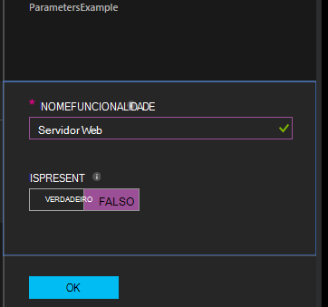

<properties 
   pageTitle="A compilar configurações no Azure automatização DSC | Microsoft Azure" 
   description="Descrição geral de duas formas de compilação configurações de configuração de estado pretendida (DSC): no portal do Azure e com o Windows PowerShell. " 
   services="automation" 
   documentationCenter="na" 
   authors="coreyp-at-msft" 
   manager="stevenka" 
   editor="tysonn"/>

<tags
   ms.service="automation"
   ms.devlang="na"
   ms.topic="article"
   ms.tgt_pltfrm="powershell"
   ms.workload="na" 
   ms.date="01/25/2016"
   ms.author="coreyp"/>
   
#A compilar configurações no DSC de automatização do Azure#

Permite-lhe compilar configurações de configuração de estado pretendida (DSC) de duas maneiras com a automatização Azure: no portal do Azure e com o Windows PowerShell. A tabela seguinte irá ajudá-lo a determinar quando utilizar o método com base em características de cada: 

###Portal de pré-visualização Azure###
- Método mais simples com interface de utilizador interativos
- Formulário para fornecer valores de parâmetros simples
- Controlar facilmente o estado da tarefa
- Acesso autenticado com o Azure de início de sessão

###Windows PowerShell###
- Chamar a partir de linha de comandos com os cmdlets do Windows PowerShell
- Podem ser incluídos no solução automatizada com vários passos
- Forneça os valores de parâmetros simples e complexas
- Controlar o estado da tarefa
- Cliente necessário para suportar os cmdlets do PowerShell
- Pass ConfigurationData
- Compilar configurações que utilizam credenciais

Assim que tiver decidido um método de compilação, pode seguir os respetivos procedimentos abaixo para iniciar a compilar.

##A compilar uma configuração DSC com o portal do Azure##

1.  A partir da sua conta de automatização, clique em **configurações**.
2.  Clique numa configuração para abrir o respetivo pá.
3.  Clique em **Compilar**.
4.  Se a configuração não tem parâmetros, lhe ser pedido para confirmar se pretende compilá-lo. Se a configuração tem parâmetros, o pá **Compilar configuração** será aberto para que possam fornecer valores de parâmetros. Consulte a secção de <a href="#basic-parameters">**Parâmetros fundamentais**</a> abaixo para obter mais detalhes sobre os parâmetros.
5.  A **Tarefa de compilação** pá é aberto para que pode controlar o estado da tarefa de compilação e as configurações de nó (documentos de configuração de MOF)-causados seja colocado no servidor separar do Azure automatização DSC.

##A compilar uma configuração DSC com o Windows PowerShell##

Pode utilizar [`Start-AzureRmAutomationDscCompilationJob`](https://msdn.microsoft.com/library/mt244118.aspx) para iniciar a compilar com o Windows PowerShell. O seguinte código de exemplo é iniciado compilação de uma configuração DSC denominada **SampleConfig**.

    Start-AzureRmAutomationDscCompilationJob -ResourceGroupName "MyResourceGroup" -AutomationAccountName "MyAutomationAccount" -ConfigurationName "SampleConfig" 
 
`Start-AzureRmAutomationDscCompilationJob`Devolve um objecto de tarefa de compilação que pode utilizar para controlar o respetivo estado. Em seguida, pode utilizar este objeto de tarefa de compilação com [`Get-AzureRmAutomationDscCompilationJob`](https://msdn.microsoft.com/library/mt244120.aspx) para determinar o estado da tarefa compilação, e [`Get-AzureRmAutomationDscCompilationJobOutput`](https://msdn.microsoft.com/library/mt244103.aspx) para ver os seus fluxos (resultado). O código de exemplo seguinte inicia compilação da configuração do **SampleConfig** , espera até que foi concluída e, em seguida, apresenta os fluxos de.
    
    $CompilationJob = Start-AzureRmAutomationDscCompilationJob -ResourceGroupName "MyResourceGroup" -AutomationAccountName "MyAutomationAccount" -ConfigurationName "SampleConfig"
    
    while($CompilationJob.EndTime –eq $null -and $CompilationJob.Exception –eq $null)           
    {
        $CompilationJob = $CompilationJob | Get-AzureRmAutomationDscCompilationJob
        Start-Sleep -Seconds 3
    }
    
    $CompilationJob | Get-AzureRmAutomationDscCompilationJobOutput –Stream Any 

##Parâmetros básicos##

Declaração de parâmetro de configurações de DSC, incluindo tipos de parâmetro e propriedades, funciona da mesma, tal como no Azure automatização runbooks. Consulte o artigo [Iniciar um livro de execuções no Azure automatização](automation-starting-a-runbook.md) para saber mais sobre os parâmetros de livro execuções.

O exemplo seguinte utiliza dois parâmetros denominados **NomeFuncionalidade** e **IsPresent**, para determinar os valores das propriedades na configuração de nó **ParametersExample.sample** , gerado durante a compilação.

    Configuration ParametersExample
    {
        param(
            [Parameter(Mandatory=$true)]
    
            [string] $FeatureName,
    
            [Parameter(Mandatory=$true)]
            [boolean] $IsPresent
        )
    
        $EnsureString = "Present"
        if($IsPresent -eq $false)
        {
            $EnsureString = "Absent"
        }
    
        Node "sample"
        {
            WindowsFeature ($FeatureName + "Feature")
            {
                Ensure = $EnsureString
                Name = $FeatureName
            }
        }
    }

Permite-lhe compilar DSC configurações que utilizam parâmetros básicos no portal do Azure automatização DSC ou com o Azure PowerShell:

###Portal###

No portal do, pode introduzir valores de parâmetros depois de clicar em **Compilar**.

###PowerShell###

PowerShell requer parâmetros num [hashtable](http://technet.microsoft.com/library/hh847780.aspx) onde a chave coincidir com o nome do parâmetro e o valor for igual ao valor do parâmetro.

    $Parameters = @{
            "FeatureName" = "Web-Server"
            "IsPresent" = $False
    }
    
    
    Start-AzureRmAutomationDscCompilationJob -ResourceGroupName "MyResourceGroup" -AutomationAccountName "MyAutomationAccount" -ConfigurationName "ParametersExample" -Parameters $Parameters 
    

Para informações sobre prisma PSCredentials como parâmetros, consulte o artigo <a href="#credential-assets">**Elementos de credenciais**</a> .

##ConfigurationData##

**ConfigurationData** permite-lhe separar estrutura configuração a partir de qualquer configuração específicas do ambiente ao utilizar o PowerShell DSC. Consulte o artigo [separar "O que" a partir de "Onde" na PowerShell DSC](http://blogs.msdn.com/b/powershell/archive/2014/01/09/continuous-deployment-using-dsc-with-minimal-change.aspx) para saber mais sobre **ConfigurationData**.

>[AZURE.NOTE] Pode utilizar **ConfigurationData** ao compilar no Azure automatização DSC através do Azure PowerShell, mas não no portal do Azure.

A configuração de DSC exemplo seguinte utiliza **ConfigurationData** através de palavras-chave **$ConfigurationData** e **$AllNodes** . Também terá do [módulo **xWebAdministration** ](https://www.powershellgallery.com/packages/xWebAdministration/) para este exemplo:

     Configuration ConfigurationDataSample
     {
        Import-DscResource -ModuleName xWebAdministration -Name MSFT_xWebsite
    
        Write-Verbose $ConfigurationData.NonNodeData.SomeMessage 
    
        Node $AllNodes.Where{$_.Role -eq "WebServer"}.NodeName
        {
            xWebsite Site
            {
                Name = $Node.SiteName
                PhysicalPath = $Node.SiteContents
                Ensure   = "Present"
            }
        }
    }

Pode compilar a configuração de DSC acima com PowerShell. A abaixo PowerShell adiciona duas configurações de nó para o servidor de separar DSC do Azure automatização: **ConfigurationDataSample.MyVM1** e **ConfigurationDataSample.MyVM3**:

    $ConfigData = @{
        AllNodes = @(
            @{
                NodeName = "MyVM1"
                Role = "WebServer"
            },
            @{
                NodeName = "MyVM2"
                Role = "SQLServer"
            },
            @{
                NodeName = "MyVM3"
                Role = "WebServer"
    
            }
    
        )
    
        NonNodeData = @{
            SomeMessage = "I love Azure Automation DSC!"
    
        }
    
    } 
    
    Start-AzureRmAutomationDscCompilationJob -ResourceGroupName "MyResourceGroup" -AutomationAccountName "MyAutomationAccount" -ConfigurationName "ConfigurationDataSample" -ConfigurationData $ConfigData

##Elementos##

Referências de elementos são os mesmos no configurações DSC de automatização do Azure e runbooks. Consulte o seguinte para obter mais informações:

- [Certificados](automation-certificates.md)
- [Ligações](automation-connections.md)
- [Credenciais](automation-credentials.md)
- [Variáveis](automation-variables.md)

###Elementos de credenciais###
Enquanto configurações DSC no Azure automatização podem fazer referência a credencial activos utilizando **Get-AzureRmAutomationCredential**, credencial activos é também possível passar através de parâmetros, se pretender. Se uma configuração demorar um parâmetro do tipo de **PSCredential** , em seguida, tem de ser efetuada com o nome da cadeia de um ativo de credenciais de automatização do Azure como valor do parâmetro nessa, em vez de um objeto de PSCredential. Nos bastidores, elemento credencial Azure automatização com esse nome será obtido e transmitido para a configuração.

Manter as credenciais seguro em configurações de nó (documentos de configuração de MOF) requer encriptar as credenciais no ficheiro de nó Configuração MOF. Automatização Azure leva-o até esta um passo adicional e encripta todo o ficheiro MOF. No entanto, atualmente é tem distinguir PowerShell DSC é importa para introduzir as credenciais a debitar em texto simples durante a geração da MOF configuração nó, porque PowerShell DSC não sabe que Azure automatização irá encriptar todo o ficheiro MOF após a sua geração através de uma tarefa de compilação.

Pode saber DSC de PowerShell que não há problema para introduzir as credenciais debitar em texto simples na configuração de nó gerado MOFs utilizando <a href="#configurationdata">**ConfigurationData**</a>. Deve passar `PSDscAllowPlainTextPassword = $true` através do **ConfigurationData** para nome de cada bloco de nó que é apresentada na configuração DSC e utiliza credenciais.

O exemplo seguinte mostra uma configuração de DSC que utiliza um ativo de credenciais de automatização.

    Configuration CredentialSample
    {
       $Cred = Get-AzureRmAutomationCredential -Name "SomeCredentialAsset"
    
        Node $AllNodes.NodeName
        { 
            File ExampleFile
            { 
                SourcePath = "\\Server\share\path\file.ext" 
                DestinationPath = "C:\destinationPath" 
                Credential = $Cred 
            }
        }
    }

Pode compilar a configuração de DSC acima com PowerShell. A abaixo PowerShell adiciona duas configurações de nó para o servidor de separar DSC do Azure automatização: **CredentialSample.MyVM1** e **CredentialSample.MyVM2**.

    $ConfigData = @{
        AllNodes = @(
            @{
                NodeName = "*"
                PSDscAllowPlainTextPassword = $True
            },
            @{
                NodeName = "MyVM1"
            },
            @{
                NodeName = "MyVM2"
            }
        )
    }
    
    Start-AzureRmAutomationDscCompilationJob -ResourceGroupName "MyResourceGroup" -AutomationAccountName "MyAutomationAccount" -ConfigurationName "CredentialSample" -ConfigurationData $ConfigData
