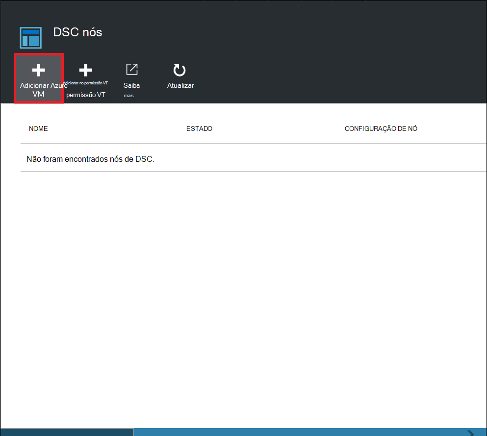

<properties
   pageTitle="Introdução ao Azure automatização DSC"
   description="Explicação e exemplos das tarefas mais comuns no Azure automatização pretendido estado configuração (DSC)"
   services="automation" 
   documentationCenter="na" 
   authors="eslesar" 
   manager="dongill" 
   editor="tysonn"/>

<tags
   ms.service="automation"
   ms.devlang="na"
   ms.topic="article"
   ms.tgt_pltfrm="powershell"
   ms.workload="na" 
   ms.date="06/06/2016"
   ms.author="magoedte;eslesar"/>
   

# <a name="getting-started-with-azure-automation-dsc"></a>Introdução ao Azure automatização DSC

Este tópico explica como efetuar as tarefas mais comuns com Azure automatização pretendido estado configuração (DSC), tal como criar, importar e a compilar configurações, máquinas de ativação para gerir e visualizar relatórios. Para obter uma descrição geral do que está Azure automatização DSC, consulte o artigo [Descrição geral do Azure automatização DSC](automation-dsc-overview.md). Para obter documentação DSC, consulte o artigo [Windows PowerShell pretendido Estado descrição geral de configuração](https://msdn.microsoft.com/PowerShell/dsc/overview).

Este tópico fornece um guia passo a passo para utilizar o Azure automatização DSC. Se pretender que um ambiente de exemplo que já está configurado sem seguir os passos descritos neste tópico, pode utilizar [o modelo de processador seguinte](https://github.com/azureautomation/automation-packs/tree/master/102-sample-automation-setup). Este modelo configura um ambiente do Azure automatização DSC concluído, incluindo uma VM Azure que é gerido pelo DSC de automatização do Azure.
 
## <a name="prerequisites"></a>Pré-requisitos

Para concluir os exemplos neste tópico, é necessário o seguinte:

- Uma conta de automatização do Azure. Para obter instruções sobre como criar uma conta Azure automatização executar como, consulte o artigo [Executar como conta Azure](automation-sec-configure-azure-runas-account.md).
- Um VM de Gestor de recursos do Azure (não clássica) a executar o Windows Server 2008 R2 ou posterior. Para obter instruções sobre como criar uma VM, consulte o artigo [Criar primeira virtuais máquina com o Windows no portal do Azure](../virtual-machines/virtual-machines-windows-hero-tutorial.md)

## <a name="creating-a-dsc-configuration"></a>Criar uma configuração DSC

Vamos criar uma simples [configuração DSC](https://msdn.microsoft.com/powershell/dsc/configurations) garante a presença ou ausência do **Servidor Web** Windows funcionalidade (IIS), dependendo de como atribuir nós.

1. Inicie o Windows PowerShell ISE (ou editores de texto).

2. Escreva o seguinte texto:

    ```powershell
    configuration TestConfig
    {
        Node WebServer
        {
            WindowsFeature IIS
            {
                Ensure               = 'Present'
                Name                 = 'Web-Server'
                IncludeAllSubFeature = $true

            }
        }

        Node NotWebServer
        {
            WindowsFeature IIS
            {
                Ensure               = 'Absent'
                Name                 = 'Web-Server'

            }
        }
        }
    ```
3. Guarde o ficheiro como `TestConfig.ps1`.

Esta configuração chama um recurso de cada bloco de nó, [WindowsFeature recurso](https://msdn.microsoft.com/powershell/dsc/windowsfeatureresource), que garantem a presença ou ausência da funcionalidade de **Servidor Web** .

## <a name="importing-a-configuration-into-azure-automation"></a>Importar uma configuração para automatização do Azure

Em seguida, podemos irá importar a configuração da conta de automatização.

1. Inicie sessão no [portal do Azure](https://portal.azure.com).

2. No menu concentrador, clique em **todos os recursos** e, em seguida, o nome da sua conta de automatização.

3. No pá **conta automatização** , clique em **DSC configurações**.

4. No pá **DSC configurações** , clique em **Adicionar uma configuração**.

5. No pá **Importar a configuração** , navegue para a `TestConfig.ps1` ficheiro no seu computador.
    
    
    

6. Clique em **OK**.

## <a name="viewing-a-configuration-in-azure-automation"></a>Ver uma configuração de automatização do Azure

Depois de ter importado uma configuração, pode vê-lo no portal do Azure.

1. Inicie sessão no [portal do Azure](https://portal.azure.com).

2. No menu concentrador, clique em **todos os recursos** e, em seguida, o nome da sua conta de automatização.

3. No pá **conta automatização** , clique em **DSC configurações**

4. No pá **DSC configurações** , clique em **TestConfig** (este é o nome da configuração do que importou no procedimento anterior).

5. No pá **TestConfig configuração** , clique em **Ver origem de configuração**.

    
    
    É aberta uma **origem de configuração de TestConfig** pá e apresenta o código do PowerShell para a configuração.
    
## <a name="compiling-a-configuration-in-azure-automation"></a>A compilar uma configuração de automatização do Azure

Antes de poder aplicar um estado pretendido para um nó, uma configuração DSC definir desse Estado tem ser compilada num ou mais configurações de nó (documento MOF) e colocada em automatização DSC separar servidor. Para obter uma descrição de compilação de configurações no Azure automatização DSC mais detalhada, consulte o artigo [a compilar configurações no Azure automatização DSC](automation-dsc-compile.md). Para mais informações sobre a compilar configurações, consulte o artigo [DSC configurações](https://msdn.microsoft.com/PowerShell/DSC/configurations).

1. Inicie sessão no [portal do Azure](https://portal.azure.com).

2. No menu concentrador, clique em **todos os recursos** e, em seguida, o nome da sua conta de automatização.

3. No pá **conta automatização** , clique em **DSC configurações**

4. No pá **DSC configurações** , clique em **TestConfig** (o nome da configuração do importados anteriormente).

5. No pá **TestConfig configuração** , clique em **Compilar**e, em seguida, clique em **Sim**. Esta ação inicia uma tarefa de compilação.
    
    
    
> [AZURE.NOTE] Quando compilar uma configuração no Azure automatização, automaticamente implementa qualquer configuração nó criado MOFs para o servidor de solicitação.

## <a name="viewing-a-compilation-job"></a>Ver uma tarefa de compilação

Depois de iniciar uma compilação, pode vê-lo no mosaico **trabalhos de compilação** no pá a **configuração** . O mosaico de **tarefas de compilação** mostra atualmente em execução, concluído e Ocorreu uma falha de tarefas. Quando abre um pá de tarefa de compilação, que apresenta informações sobre essa tarefa incluindo erros ou avisos encontrados, parâmetros de entrada utilizado na configuração e compilação registos.

1. Inicie sessão no [portal do Azure](https://portal.azure.com).

2. No menu concentrador, clique em **todos os recursos** e, em seguida, o nome da sua conta de automatização.

3. No pá **conta automatização** , clique em **DSC configurações**.

4. No pá **DSC configurações** , clique em **TestConfig** (o nome da configuração do importados anteriormente).

5. No mosaico **trabalhos de compilação** de pá a **Configuração de TestConfig** , clique em qualquer um dos trabalhos listados. Abre uma **Tarefa de compilação** pá identificados com a data em que a tarefa de compilação foi iniciada.

    
  
6. Clique em qualquer dos mosaicos no pá a **Tarefa de compilação** para ver mais detalhes sobre a tarefa.

## <a name="viewing-node-configurations"></a>Ver configurações de nó

Conclusão de uma tarefa de compilação cria uma ou mais novas configurações de nó. Uma configuração de nó é um documento MOF que é implementado para o servidor de solicitação e pronto a ser movido e aplicados por uma ou mais nós. Pode ver as configurações de nó na sua conta de automatização no pá **Configurações de nó DSC** . Uma configuração de nó tem um nome com o formulário *ConfigurationName*. *NomeNó*.

1. Inicie sessão no [portal do Azure](https://portal.azure.com).

2. No menu concentrador, clique em **todos os recursos** e, em seguida, o nome da sua conta de automatização.

3. No pá **conta automatização** , clique em **DSC nó configurações**.

    
    
## <a name="onboarding-an-azure-vm-for-management-with-azure-automation-dsc"></a>Ativação uma VM Azure para a gestão com DSC de automatização do Azure

Pode utilizar o Azure automatização DSC para gerir Azure VMs (clássica e o Gestor de recursos), VMs no local, máquinas Linux, AWS VMs e máquinas físico no local. Neste tópico, vamos abordar como incorporada VMs de Gestor de recursos do Azure apenas. Para obter informações sobre a ativação outros tipos de máquinas, consulte o artigo [máquinas de ativação para gestão pelo Azure automatização DSC](automation-dsc-onboarding.md).

### <a name="to-onboard-an-azure-resource-manager-vm-for-management-by-azure-automation-dsc"></a>A bordo uma VM de Gestor de recursos do Azure para gestão pelo DSC de automatização do Azure

1. Inicie sessão no [portal do Azure](https://portal.azure.com).

2. No menu concentrador, clique em **todos os recursos** e, em seguida, o nome da sua conta de automatização.

3. No pá **conta automatização** , clique em **DSC nós**.

4. Na pá **DSC nós** , clique em **Adicionar VM Azure**.

    

5. Na pá **Adicionar VMs Azure** , clique em **Seleccionar máquinas virtuais para incorporada**.

6. Na pá **Selecione VMs** , selecione a VM pretende incorporada e clique em **OK**.

    >[AZURE.IMPORTANT] Tem de ser um VM de Gestor de recursos do Azure a executar o Windows Server 2008 R2 ou posterior.
    
7. Na pá **Adicionar VMs Azure** , clique em **configurar os dados de registo**.

8. Na pá **registo** , introduza o nome da configuração do nó que pretende aplicar a VM na caixa **Nome de configuração de nó** . Isto deve corresponder exatamente ao nome de uma configuração de nó na conta de automatização. Fornecer um nome neste momento é opcional. Pode alterar a configuração de nó atribuídas após a ativação o nó.
Verifique **Reinicie o nó se for necessário**e, em seguida, clique em **OK**.
    
    
    
    A configuração de nó que especificou será aplicada à VM em intervalos especificados pela **Configuração modo frequência**e, a VM irá procurar atualizações para a configuração de nó em intervalos especificado pela **Frequência de atualizar**. Para mais informações sobre como estes valores são utilizados, consulte o artigo [configurar o Gestor de configuração do Local](https://msdn.microsoft.com/PowerShell/DSC/metaConfig).
    
9. Na pá **Adicionar VMs Azure** , clique em **Criar**.

Azure irá iniciar o processo de ativação a VM. Quando estiver concluído, a VM irá aparecer na pá **DSC nós** na conta de automatização.

## <a name="viewing-the-list-of-dsc-nodes"></a>Ver a lista de nós do DSC

Pode ver a lista de todos os computadores que tenham sido onboarded para a gestão de na sua conta de automatização na pá **DSC nós** .

1. Inicie sessão no [portal do Azure](https://portal.azure.com).

2. No menu concentrador, clique em **todos os recursos** e, em seguida, o nome da sua conta de automatização.

3. No pá **conta automatização** , clique em **DSC nós**.

## <a name="viewing-reports-for-dsc-nodes"></a>Ver relatórios de nós DSC

Sempre que Azure automatização DSC executa a verificação de consistência num nó gerido, o nó envia um relatório de estado novamente para o servidor de solicitação. Pode ver estes relatórios no pá para esse nó.

1. Inicie sessão no [portal do Azure](https://portal.azure.com).

2. No menu concentrador, clique em **todos os recursos** e, em seguida, o nome da sua conta de automatização.

3. No pá **conta automatização** , clique em **DSC nós**.

4. No mosaico **relatórios** , clique em qualquer um dos relatórios na lista.

    

No pá para um relatório individual, pode ver as seguintes informações de estado para a verificação de consistência correspondentes:

- O estado de relatório — se o nó é "Compatível", a configuração "Falhou", ou o nó é "Não compatível com" (quando o nó está no modo de **applyandmonitor** e o computador não está a ser o estado pretendido).
- A hora de início para a verificação de consistência.
- O tempo de execução total para a verificação de consistência.
- O tipo de verificação de consistência.
- Todos os erros, incluindo o código de erro e a mensagem de erro. 
- Qualquer recursos do DSC a configuração e o estado de cada recurso (se o nó é o estado pretendido para esse recurso) — pode clicar em cada recurso para obter informações mais detalhadas para esse recurso.
- O nome, o endereço IP e o modo de configuração do nó.

Também pode clicar em **Ver relatório não processado** para ver os dados reais que o nó envia para o servidor. Para mais informações sobre como utilizar os dados, consulte o artigo [utilizar um servidor de relatórios DSC](https://msdn.microsoft.com/powershell/dsc/reportserver).

Pode demorar algum tempo depois de um nó onboarded antes do primeiro relatório está disponível. Poderá ter de esperar até 30 minutos para o primeiro relatório depois bordo um nó.

## <a name="reassigning-a-node-to-a-different-node-configuration"></a>Reatribuir um nó uma configuração de nó diferente

Pode atribuir um nó para utilizar uma configuração de nó diferente daquele que inicialmente atribuídos.

1. Inicie sessão no [portal do Azure](https://portal.azure.com).

2. No menu concentrador, clique em **todos os recursos** e, em seguida, o nome da sua conta de automatização.

3. No pá **conta automatização** , clique em **DSC nós**.

4. No pá **DSC nós** , clique no nome do nó que pretende reatribuir.

5. No pá para esse nó, clique em **atribuir nó**.

    

6. No pá **Atribuir configuração de nó** , selecione a configuração de nó ao qual pretende atribuir o nó e, em seguida, clique em **OK**.

    
    
## <a name="unregistering-a-node"></a>Anular o registo de um nó

Se já não pretender que um nó para ser gerido por Azure automatização DSC, pode anular registo-lo.

1. Inicie sessão no [portal do Azure](https://portal.azure.com).

2. No menu concentrador, clique em **todos os recursos** e, em seguida, o nome da sua conta de automatização.

3. No pá **conta automatização** , clique em **DSC nós**.

4. No pá **DSC nós** , clique no nome do nó que quer anular o registo.

5. No pá para esse nó, clique em **Unregister**.

    

## <a name="related-articles"></a>Artigos relacionados
* [Descrição geral de automatização DSC Azure](automation-dsc-overview.md)
* [Ativação máquinas para gestão pelo DSC de automatização do Azure](automation-dsc-onboarding.md)
* [O Windows PowerShell pretendido descrição geral de configuração de estado](https://msdn.microsoft.com/powershell/dsc/overview)
* [Cmdlets de automatização DSC Azure](https://msdn.microsoft.com/library/mt244122.aspx)
* [Preços de automatização DSC Azure](https://azure.microsoft.com/pricing/details/automation/)

