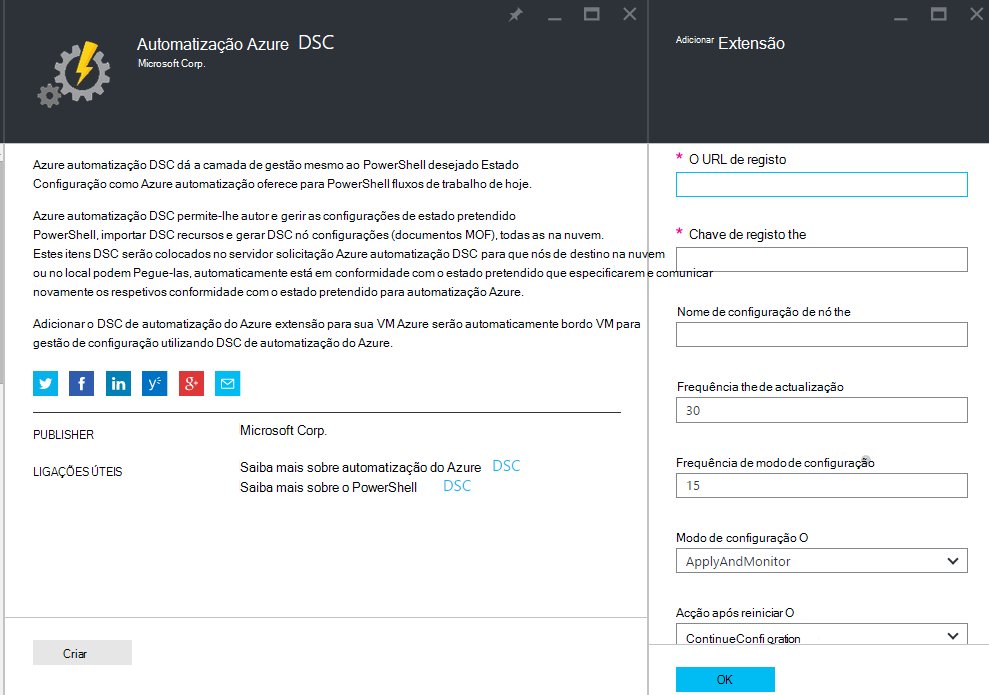
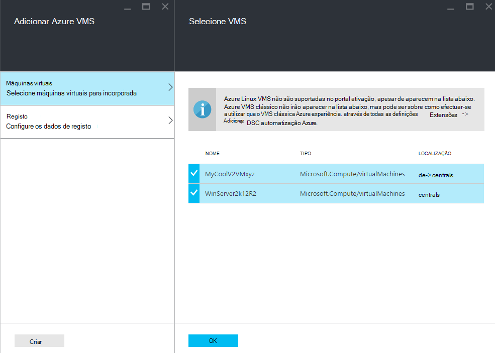
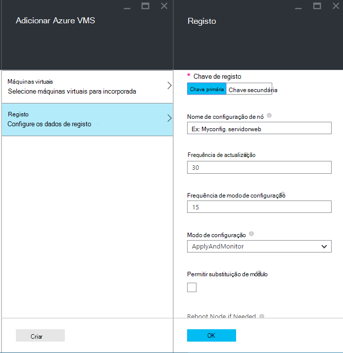
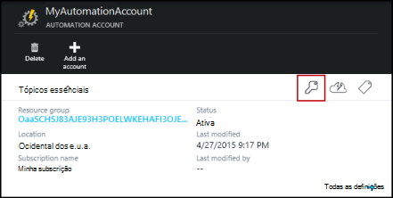
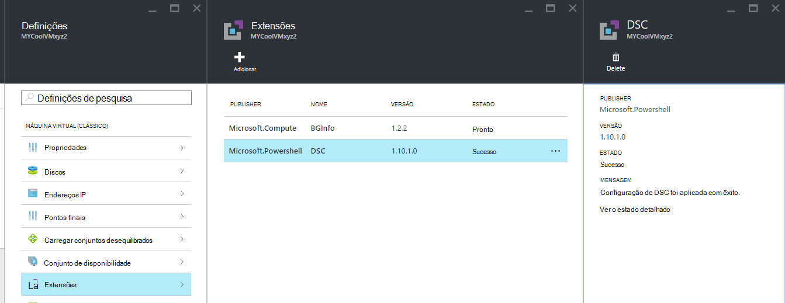

<properties 
   pageTitle="Ativação físicas e máquinas virtuais para gestão pelo Azure automatização DSC | Microsoft Azure" 
   description="Como configurar o máquinas para a gestão com DSC de automatização do Azure" 
   services="automation" 
   documentationCenter="dev-center-name" 
   authors="coreyp-at-msft" 
   manager="stevenka" 
   editor="tysonn"/>

<tags
   ms.service="automation"
   ms.devlang="NA"
   ms.topic="article"
   ms.tgt_pltfrm="powershell"
   ms.workload="TBD" 
   ms.date="04/22/2016"
   ms.author="coreyp"/>

# Ativação máquinas para gestão pelo DSC de automatização do Azure

## Por que motivo gerir máquinas com DSC de automatização do Azure?

Como o [PowerShell pretendido estado configuração](https://technet.microsoft.com/library/dn249912.aspx), a configuração de estado pretendido do Azure automatização é um serviço de gestão de configuração de simples, e poderoso, para os nós DSC (física e máquinas virtuais) em qualquer centro de dados na nuvem ou no local. Permite-escalabilidade através de milhares de máquinas forma rápida e fácil de uma localização central, segura. Pode facilmente incorporadas máquinas, atribua-as configurações declarativas e ver relatórios a mostrar de cada computador da conformidade para o estado pretendido que especificou. A camada de gestão do Azure automatização DSC é DSC o que é a camada de gestão de automatização do Azure à criação de scripts de PowerShell. Por outras palavras, da mesma forma que o Azure automatização ajuda a gerir os scripts de PowerShell, também ajuda a gerir as configurações de DSC. Para saber mais sobre os benefícios da utilização do Azure automatização DSC, consulte o artigo [Descrição geral do Azure automatização DSC](automation-dsc-overview.md). 

Azure automatização DSC podem ser utilizado para gerir uma variedade de máquinas:

*    Azure máquinas virtuais (clássico)
*    Azure máquinas virtuais
*    Máquinas virtuais de Amazon Web Services (AWS)
*    Windows física virtuais máquinas no local, ou numa nuvem diferente Azure/AWS
*    Linux física virtual máquinas no local, no Azure ou numa nuvem diferente do Azure

Além disso, se não estiver pronto para gerir as configurações de máquina a partir da nuvem, Azure automatização DSC também pode ser utilizada como um ponto final de só de relatório. Esta opção permite-lhe definir configuração pretendida (emissão) do através de DSC no local e ver os detalhes de elaboração de relatórios ricos conformidade nó com o estado pretendido no Azure automatização.

As secções seguintes descrevem como pode bordo cada tipo de máquina para DSC de automatização do Azure.

## Azure máquinas virtuais (clássico)

Com o Azure automatização DSC, pode máquinas virtuais Azure (clássico) facilmente incorporadas para gestão de configuração utilizando o Azure portal, ou PowerShell. Em definições avançadas e sem ter de remoto para a VM administrador, a extensão de configuração de estado pretendido do Azure VM regista a VM com Azure automatização DSC. Uma vez que a extensão de configuração de estado pretendido do Azure VM é executado forma assíncrona, os passos para controlar o progresso ou resolução de problemas são fornecidas na secção de [**resolução de problemas Azure máquina virtual ativação**](#troubleshooting-azure-virtual-machine-onboarding) abaixo.

### Portal do Azure

No [portal do Azure](http://portal.azure.com/), clique em **Procurar** -> **máquinas virtuais (clássico)**. Selecione a VM Windows que pretende incorporada. No pá de dashboard a máquina virtual, clique em **todas as definições de** -> **extensões** -> **Adicionar** -> **Azure automatização DSC** -> **Criar**. Introduza os [valores de Gestor de configuração do PowerShell DSC Local](https://msdn.microsoft.com/powershell/dsc/metaconfig4) necessários para o seu caso de utilização, chave de registo da sua conta de automatização e URL de registo e, opcionalmente, uma configuração de nó para atribuir a VM.

Para localizar o registo de URL e a chave para a automatização de conta para bordo o computador, consulte a secção [**seguro registo**](#secure-registration) abaixo.

### PowerShell

    # log in to both Azure Service Management and Azure Resource Manager
    Add-AzureAccount
    Add-AzureRmAccount
    
    # fill in correct values for your VM/Automation account here
    $VMName = ""
    $ServiceName = ""
    $AutomationAccountName = ""
    $AutomationAccountResourceGroup = ""

    # fill in the name of a Node Configuration in Azure Automation DSC, for this VM to conform to
    $NodeConfigName = ""

    # get Azure Automation DSC registration info
    $Account = Get-AzureRmAutomationAccount -ResourceGroupName $AutomationAccountResourceGroup -Name $AutomationAccountName
    $RegistrationInfo = $Account | Get-AzureRmAutomationRegistrationInfo

    # use the DSC extension to onboard the VM for management with Azure Automation DSC
    $VM = Get-AzureVM -Name $VMName -ServiceName $ServiceName
    
    $PublicConfiguration = ConvertTo-Json -Depth 8 @{
      SasToken = ""
      ModulesUrl = "https://eus2oaasibizamarketprod1.blob.core.windows.net/automationdscpreview/RegistrationMetaConfigV2.zip"
      ConfigurationFunction = "RegistrationMetaConfigV2.ps1\RegistrationMetaConfigV2"

    # update these PowerShell DSC Local Configuration Manager defaults if they do not match your use case.
    # See https://technet.microsoft.com/library/dn249922.aspx?f=255&MSPPError=-2147217396 for more details
     Properties = @{
        RegistrationKey = @{
          UserName = 'notused'
          Password = 'PrivateSettingsRef:RegistrationKey'
        }
        RegistrationUrl = $RegistrationInfo.Endpoint
        NodeConfigurationName = $NodeConfigName
        ConfigurationMode = "ApplyAndMonitor"
        ConfigurationModeFrequencyMins = 15
        RefreshFrequencyMins = 30
        RebootNodeIfNeeded = $False
        ActionAfterReboot = "ContinueConfiguration"
        AllowModuleOverwrite = $False
      }
    }

    $PrivateConfiguration = ConvertTo-Json -Depth 8 @{
      Items = @{
         RegistrationKey = $RegistrationInfo.PrimaryKey
      }
    }
    
    $VM = Set-AzureVMExtension `
     -VM $vm `
     -Publisher Microsoft.Powershell `
     -ExtensionName DSC `
     -Version 2.19 `
     -PublicConfiguration $PublicConfiguration `
     -PrivateConfiguration $PrivateConfiguration `
     -ForceUpdate

    $VM | Update-AzureVM

## Azure máquinas virtuais

Azure automatização DSC permite-lhe um facilmente incorporadas máquinas virtuais Azure para gestão de configuração, utilizando o Azure portal, modelos de Gestor de recursos do Azure ou PowerShell. Em definições avançadas e sem ter de remoto para a VM administrador, a extensão de configuração de estado pretendido do Azure VM regista a VM com Azure automatização DSC. Uma vez que a extensão de configuração de estado pretendido do Azure VM é executado forma assíncrona, os passos para controlar o progresso ou resolução de problemas são fornecidas na secção de [**resolução de problemas Azure máquina virtual ativação**](#troubleshooting-azure-virtual-machine-onboarding) abaixo.

### Portal do Azure

No [portal do Azure](https://portal.azure.com/), navegue para a conta de automatização do Azure onde pretende máquinas virtuais incorporadas. No dashboard de conta de automatização, clique em **DSC nós** -> **Adicionar VM Azure**.

Em **Selecione máquinas virtuais para incorporado**, selecione um ou mais Azure máquinas virtuais para incorporada.

Em **configurar os dados de registo**, introduza os [valores de Gestor de configuração do PowerShell DSC Local](https://msdn.microsoft.com/powershell/dsc/metaconfig4) necessários para o seu caso de utilização e, opcionalmente uma configuração de nó para atribuir a VM.

 
### Azure modelos de Gestor de recursos

Azure máquinas virtuais pode ser implementadas e onboarded para DSC de automatização do Azure através do Gestor de recursos do Azure modelos. Consulte o artigo [Configurar uma VM via extensão DSC e Azure automatização DSC](https://azure.microsoft.com/documentation/templates/dsc-extension-azure-automation-pullserver/) para um modelo de exemplo que onboards uma VM existente para DSC de automatização do Azure. Para localizar a chave de registo e o URL de registo tomadas como entrada neste modelo, consulte a secção [**seguro registo**](#secure-registration) abaixo.

### PowerShell

O cmdlet [AzureRmAutomationDscNode de registo](https://msdn.microsoft.com/library/mt603833.aspx) pode ser utilizados para máquinas virtuais incorporadas no portal do Azure através do PowerShell.

## Máquinas virtuais de Amazon Web Services (AWS)

Pode facilmente incorporadas máquinas de virtuais Amazon Web Services para gestão de configuração pelo DSC de automatização do Azure utilizando o Toolkit de DSC AWS. Pode saber mais sobre o toolkit [aqui](https://blogs.msdn.microsoft.com/powershell/2016/04/20/aws-dsc-toolkit/).

## Windows física virtual máquinas no local, ou numa nuvem diferente Azure/AWS

Máquinas com o Windows no local e máquinas com o Windows no não Azure nuvens (como Amazon Web Services) podem também ser onboarded para DSC de automatização do Azure, desde tenham acesso à internet, através de alguns passos simples de saída:

1. Certificar-se de que a versão mais recente de [WMF 5](http://aka.ms/wmf5latest) está instalada em computadores que pretende incorporada para Azure automatização DSC.
2. Siga as instruções na secção [**Gerar DSC metaconfigurations**](#generating-dsc-metaconfigurations) abaixo para gerar uma pasta que contém o metaconfigurations DSC conforme seja necessário.
3. Aplica remotamente metaconfiguration o PowerShell DSC máquinas que pretende incorporada. **Este comando é executar a partir do computador tem de ter a versão mais recente do [WMF 5](http://aka.ms/wmf5latest) instalado**:

    `Set-DscLocalConfigurationManager -Path C:\Users\joe\Desktop\DscMetaConfigs -ComputerName MyServer1, MyServer2`

4. Se não é possível aplicar a metaconfigurations PowerShell DSC remotamente, copie a pasta de metaconfigurations a partir do passo 2 para cada máquina para incorporada. Em seguida, ligue para **Conjunto DscLocalConfigurationManager** localmente no cada computador incorporada para.
5. Utilizando o Azure portal ou os cmdlets, verifique que máquinas para incorporada agora aparecem como nós DSC registados na sua conta de automatização do Azure.

## Linux física virtual máquinas no local, no Azure ou numa nuvem diferente do Azure

Máquinas de Linux no local, Linux máquinas no Azure e Linux máquinas no não Azure nuvens também podem ser onboarded para DSC de automatização do Azure, desde tenham acesso à internet, através de alguns passos simples de saída:

1. Certificar-se de que a versão mais recente do [agente de DSC Linux](http://www.microsoft.com/download/details.aspx?id=49150) está instalada em computadores que pretende incorporada para Azure automatização DSC.

2. Se as [predefinições do Gestor de configuração do PowerShell DSC Local](https://msdn.microsoft.com/powershell/dsc/metaconfig4) corresponder casos de utilização e pretende que a bordo máquinas tal que **quer** importar a partir de e um relatório ao Azure automatização DSC:

    *    Em cada máquina Linux para incorporada para Azure automatização DSC, utilize Register.py para incorporada utilizando as predefinições do Gestor de configuração do PowerShell DSC Local:

        `/opt/microsoft/dsc/Scripts/Register.py <Automation account registration key> <Automation account registration URL>`

    *    Para localizar a chave de registo e o URL de registo para a sua conta de automatização, consulte a secção [**seguro registo**](#secure-registration) abaixo.

    Se o Gestor de configuração do PowerShell DSC Local predefinições **fazer** **correspondam às casos de utilização, ou seja conveniente máquinas incorporadas tal apenas comunica para Azure automatização DSC** , mas não não configuração por solicitação ou módulos PowerShell do mesmo, siga os passos 3 a 6. Caso contrário, avance diretamente para o passo 6.

3.  Siga as instruções na secção [**Gerar DSC metaconfigurations**](#generating-dsc-metaconfigurations) abaixo para gerar uma pasta que contém o metaconfigurations DSC conforme seja necessário.
4.  Aplica remotamente metaconfiguration o PowerShell DSC máquinas que pretende incorporada:
        
        $SecurePass = ConvertTo-SecureString -String "<root password>" -AsPlainText -Force
        $Cred = New-Object System.Management.Automation.PSCredential "root", $SecurePass
        $Opt = New-CimSessionOption -UseSsl -SkipCACheck -SkipCNCheck -SkipRevocationCheck

        # need a CimSession for each Linux machine to onboard
        
        $Session = New-CimSession -Credential $Cred -ComputerName <your Linux machine> -Port 5986 -Authentication basic -SessionOption $Opt
        
        Set-DscLocalConfigurationManager -CimSession $Session –Path C:\Users\joe\Desktop\DscMetaConfigs
    
Este comando é executar a partir do computador tem de ter a versão mais recente do [WMF 5](http://aka.ms/wmf5latest) instalado.

5.  Se não é possível aplicar a metaconfigurations PowerShell DSC remotamente, para cada computador Linux incorporada, copie metaconfiguration correspondente para essa máquina a partir da pasta no passo 5 sessão no computador Linux. Em seguida, ligar `SetDscLocalConfigurationManager.py` localmente em cada máquina Linux que pretende para incorporada para Azure automatização DSC:

    `/opt/microsoft/dsc/Scripts/SetDscLocalConfigurationManager.py –configurationmof <path to metaconfiguration file>`

6.  Utilizando o Azure portal ou os cmdlets, verifique que máquinas para incorporada agora aparecem como nós DSC registados na sua conta de automatização do Azure.

##Gerar DSC metaconfigurations
Forma genérica incorporada para qualquer computador para DSC de automatização do Azure, um metaconfiguration DSC pode ser gerado que, quando aplicado, indica o agente DSC no computador para separar de e/ou ao Azure automatização DSC um relatório. DSC metaconfigurations para Azure automatização DSC pode ser gerado utilizando uma configuração PowerShell DSC ou os cmdlets do PowerShell de automatização do Azure.

**Nota:** DSC metaconfigurations conter os segredos necessário para incorporada uma máquina a automatização de uma conta para a gestão de. Certifique-se proteger quaisquer metaconfigurations DSC que criar adequadamente ou eliminá-los após a sua utilização.

###Utilizar uma configuração DSC
1.  Abra o ISE do PowerShell como administrador numa máquina no seu ambiente local. O computador tem de ter a versão mais recente do [WMF 5](http://aka.ms/wmf5latest) instalado.

2.  Copie o seguinte script localmente. Este script contém uma configuração PowerShell DSC para criar metaconfigurations e um comando para iniciar a criação de metaconfiguration.
    
        # The DSC configuration that will generate metaconfigurations
        [DscLocalConfigurationManager()]
        Configuration DscMetaConfigs 
        { 
            param 
            ( 
                [Parameter(Mandatory=$True)] 
                [String]$RegistrationUrl,
         
                [Parameter(Mandatory=$True)] 
                [String]$RegistrationKey,

                [Parameter(Mandatory=$True)] 
                [String[]]$ComputerName,

                [Int]$RefreshFrequencyMins = 30, 
            
                [Int]$ConfigurationModeFrequencyMins = 15, 
            
                [String]$ConfigurationMode = "ApplyAndMonitor", 
            
                [String]$NodeConfigurationName,

                [Boolean]$RebootNodeIfNeeded= $False,

                [String]$ActionAfterReboot = "ContinueConfiguration",

                [Boolean]$AllowModuleOverwrite = $False,

                [Boolean]$ReportOnly
            )

    
            if(!$NodeConfigurationName -or $NodeConfigurationName -eq "") 
            { 
                $ConfigurationNames = $null 
            } 
            else 
            { 
                $ConfigurationNames = @($NodeConfigurationName) 
            }

            if($ReportOnly)
            {
               $RefreshMode = "PUSH"
            }
            else
            {
               $RefreshMode = "PULL"
            }

            Node $ComputerName
            {

                Settings 
                { 
                    RefreshFrequencyMins = $RefreshFrequencyMins 
                    RefreshMode = $RefreshMode 
                    ConfigurationMode = $ConfigurationMode 
                    AllowModuleOverwrite = $AllowModuleOverwrite 
                    RebootNodeIfNeeded = $RebootNodeIfNeeded 
                    ActionAfterReboot = $ActionAfterReboot 
                    ConfigurationModeFrequencyMins = $ConfigurationModeFrequencyMins 
                }

                if(!$ReportOnly)
                {
                   ConfigurationRepositoryWeb AzureAutomationDSC 
                    { 
                        ServerUrl = $RegistrationUrl 
                        RegistrationKey = $RegistrationKey 
                        ConfigurationNames = $ConfigurationNames 
                    }

                    ResourceRepositoryWeb AzureAutomationDSC 
                    { 
                       ServerUrl = $RegistrationUrl 
                       RegistrationKey = $RegistrationKey 
                    }
                }

                ReportServerWeb AzureAutomationDSC 
                { 
                    ServerUrl = $RegistrationUrl 
                    RegistrationKey = $RegistrationKey 
                }
            } 
        }
        
        # Create the metaconfigurations
        # TODO: edit the below as needed for your use case
        $Params = @{
             RegistrationUrl = '<fill me in>';
             RegistrationKey = '<fill me in>';
             ComputerName = @('<some VM to onboard>', '<some other VM to onboard>');
             NodeConfigurationName = 'SimpleConfig.webserver';
             RefreshFrequencyMins = 30;
             ConfigurationModeFrequencyMins = 15;
             RebootNodeIfNeeded = $False;
             AllowModuleOverwrite = $False;
             ConfigurationMode = 'ApplyAndMonitor';
             ActionAfterReboot = 'ContinueConfiguration';
             ReportOnly = $False;  # Set to $True to have machines only report to AA DSC but not pull from it
        }
        
        # Use PowerShell splatting to pass parameters to the DSC configuration being invoked
        # For more info about splatting, run: Get-Help -Name about_Splatting
        DscMetaConfigs @Params

3.  Preencha a chave de registo e o URL para a sua conta de automatização, bem como os nomes dos máquinas para incorporada. Todos os outros parâmetros são opcionais. Para localizar a chave de registo e o URL de registo para a sua conta de automatização, consulte a secção [**seguro registo**](#secure-registration) abaixo.

4.  Se pretender que as máquinas para comunicar informações de estado DSC para Azure automatização DSC, mas não separar configuração ou PowerShell módulos, defina o parâmetro **ReportOnly** como verdadeiro.

5.  Execute o script. Agora deverá ter uma pasta denominada **DscMetaConfigs** no seu diretório de trabalho, que contém o metaconfigurations PowerShell DSC para máquinas para incorporada.

###Utilizar os cmdlets de automatização do Azure
Se as predefinições do Gestor de configuração do PowerShell DSC Local correspondem casos de utilização e pretende máquinas incorporadas tal que estes tanto separar de e ao Azure automatização DSC um relatório, os cmdlets do Azure automatização fornecem um método simplificado de gerar o metaconfigurations DSC necessário:

1.  Abra o PowerShell consola ou o ISE do PowerShell como um administrador numa máquina no seu ambiente local.

2.  Ligar para o Gestor de recursos do Azure utilizando **Adicionar AzureRmAccount**

3.  Transferir o metaconfigurations PowerShell DSC para máquinas que pretende para incorporada da conta de automatização ao qual pretende nós incorporada:

        # Define the parameters for Get-AzureRmAutomationDscOnboardingMetaconfig using PowerShell Splatting
        $Params = @{
            ResourceGroupName = 'ContosoResources'; # The name of the ARM Resource Group that contains your Azure Automation Account
            AutomationAccountName = 'ContosoAutomation'; # The name of the Azure Automation Account where you want a node on-boarded to
            ComputerName = @('web01', 'web02', 'sql01'); # The names of the computers that the meta configuration will be generated for
            OutputFolder = "$env:UserProfile\Desktop\";
        }
        
        # Use PowerShell splatting to pass parameters to the Azure Automation cmdlet being invoked
        # For more info about splatting, run: Get-Help -Name about_Splatting
        Get-AzureRmAutomationDscOnboardingMetaconfig @Params

Agora deverá ter uma pasta denominada ***DscMetaConfigs***, que contém o metaconfigurations PowerShell DSC para máquinas para incorporada.

##Seguro de registo

Máquinas fazê-lo em segurança incorporada para uma conta de automatização do Azure através do protocolo de registo WMF 5 DSC, que permite que um nó DSC autenticar a um servidor de PowerShell DSC V2 separar ou Reporting (incluindo Azure automatização DSC). O nó regista para o servidor de um **URL de registo**, autenticar com uma **chave de registo**. Durante o registo, o nó DSC e o servidor de DSC solicitação/Reporting negoceiam um certificado exclusivo para este nó utilizar para autenticação para o POST-registo de servidor. Este processo impede que onboarded nós de representar uma que outra, tal como se um nó está comprometida e comporta forma maliciosa. Após o registo, a chave de registo não é utilizada para autenticação novamente e é eliminada a partir do nó.

Pode obter as informações necessárias para o protocolo de registo de DSC a partir do pá **Gerir chaves** no portal do Azure pré-visualização. Abra este pá clicando no ícone de chave no painel de **Essentials** para a conta de automatização.

*    URL de registo é o campo de URL no pá a gerir chaves.
*    Chave de registo é a chave primária do Access ou o secundário tecla de acesso no pá a gerir chaves. Quer chave pode ser utilizada.

Para segurança adicional, as teclas de acesso principais e secundários de uma conta de automatização podem voltar a ser geradas em qualquer altura (no pá **Gerir chaves** ) para impedir que os registos de nó futuras utilizar teclas anterior.

##Resolução de problemas de ativação do Azure máquina virtual

Azure automatização DSC permite-lhe VMs de Windows Azure facilmente incorporada para gestão de configuração. Em definições avançadas, a extensão de configuração de estado pretendido do Azure VM é utilizada para registar a VM Azure automatização DSC. Visto que a extensão de configuração de estado pretendido do Azure VM executa modo assíncrono, controlar o progresso e resolução de problemas de sua execução podem ser importantes. 

>[AZURE.NOTE] Qualquer método de ativação uma VM do Windows Azure para Azure automatização DSC que utiliza a extensão de configuração de estado pretendido do Azure VM poderá demorar uma hora para o nó Mostrar até registada no Azure automatização. Este é devido a instalação do Windows Management Framework 5.0 no VM pela extensão do Azure VM DSC, que é necessário para incorporado a VM para Azure automatização DSC.

Para resolver problemas ou ver o estado da extensão Azure VM pretendido estado configuração, no Azure portal navegue para a VM a ser onboarded, em seguida, clique em -> **todas as definições de** -> **extensões** -> **DSC**. Para obter mais detalhes, pode clicar em **Ver estado detalhado**.

## Validade do certificado e novo registo

Depois de registar uma máquina como um nó DSC no Azure automatização DSC, existem várias razões porque é que poderá ter de registar esse nó no futuro:

* Depois de registar, cada nó negocia automaticamente um certificado exclusivo para autenticação expira após um ano. Atualmente, o protocolo de registo do PowerShell DSC não é possível renovada automaticamente certificados quando estes são prestes a expirar, pelo que necessita de registar os nós após a hora de um ano. Antes de voltar a registar, certifique-se de que cada nó está em execução Windows Management Framework 5.0 RTM. Se o certificado de autenticação de um nó expira e o nó não é registada novamente, o nó será não é possível comunicar com a automatização do Azure e serão marcadas como 'Unresponsive'. Novo registo executado cerca de 90 dias ou inferior a partir do tempo de expiração de certificado ou em qualquer ponto após a data de validade do certificado, irá resultar num novo certificado a ser geradas e utilizado.

* Para alterar todos os [valores de Gestor de configuração do PowerShell DSC Local](https://msdn.microsoft.com/powershell/dsc/metaconfig4) que foram definidas durante o registo inicial do nó, tal como configurationmode como. Atualmente, estes valores de agente DSC só podem ser alterados através do novo registo. Uma exceção é a configuração de nó atribuído ao nó – este pode ser alterada no Azure automatização DSC diretamente.

Novo registo pode ser efectuado da mesma forma que registou o nó inicialmente, utilizar qualquer um dos métodos de ativação descritos neste documento. Não tem de anular o registo de um nó a partir do Azure DSC de automatização antes de voltar a registá-lo.

## Artigos relacionados
* [Descrição geral de automatização DSC Azure](automation-dsc-overview.md)
* [Cmdlets de automatização DSC Azure](https://msdn.microsoft.com/library/mt244122.aspx)
* [Preços de automatização DSC Azure](https://azure.microsoft.com/pricing/details/automation/)

