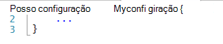
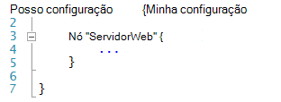
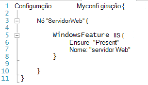
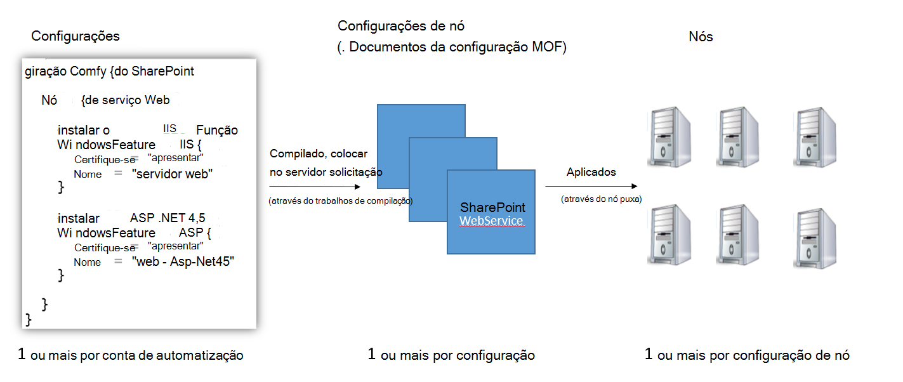
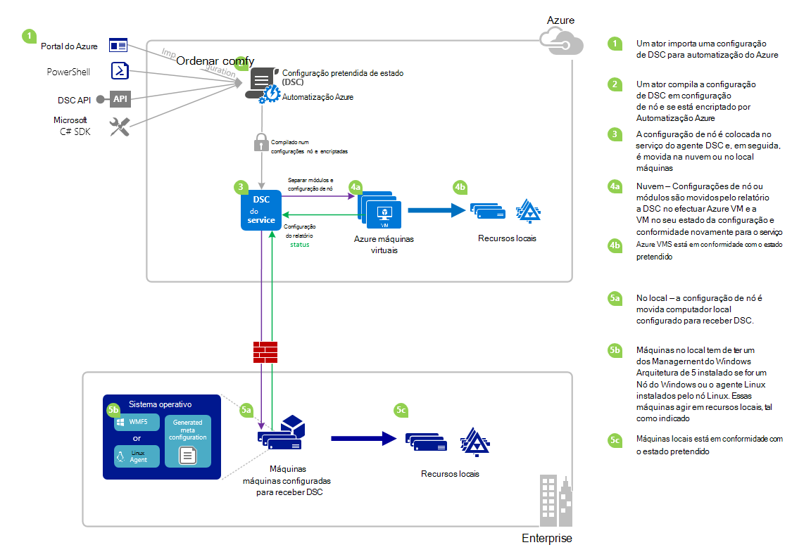

<properties 
   pageTitle="Descrição geral do Azure automatização DSC | Microsoft Azure" 
   description="Uma descrição geral do Azure automatização pretendido estado configuração (DSC), os termos e problemas conhecidos" 
   services="automation" 
   documentationCenter="dev-center-name" 
   authors="coreyp-at-msft" 
   manager="stevenka" 
   editor="tysonn"
   keywords="PowerShell dsc, configuração estado pretendido, azure de dsc powershell"/>

<tags
   ms.service="automation"
   ms.devlang="NA"
   ms.topic="article"
   ms.tgt_pltfrm="powershell"
   ms.workload="TBD" 
   ms.date="05/10/2016"
   ms.author="magoedte;coreyp"/>

# Descrição geral de DSC automatização Azure #

##O que é o Azure automatização DSC?##
Implementar e manter o estado dos seus servidores e recursos de aplicação pretendido podem ser entediante e sujeito a erros. Com o Azure automatização pretendida estado configuração (DSC), pode implementar de forma consistente, monitorizar o sujeito e atualizar automaticamente o estado de todos os recursos IT, na escala a partir da nuvem pretendido. Criada com base em PowerShell DSC, automatização DSC pode alinhar configuração máquina com um estado específico ao longo física e máquinas virtuais (VMs), com o Windows ou Linux e na nuvem ou no local. Pode ativar a entrega de serviços IT contínua com controlo consistente e gerir alteração rápida ao longo do seu ambiente de TI de híbrido heterogéneo com facilidade.

Azure automatização DSC constrói na parte superior dos conceitos básicos introduzidos numa DSC PowerShell para fornecer uma experiência de gestão de configuração ainda mais fácil. Azure automatização DSC dá a camada de gestão mesmo ao [PowerShell pretendido estado configuração](https://msdn.microsoft.com/powershell/dsc/overview) como Azure automatização oferece para PowerShell scripting hoje.

Azure automatização DSC permite-lhe para [criar e gerir as configurações de estado pretendido PowerShell](https://technet.microsoft.com/library/dn249918.aspx), importar [DSC recursos](https://technet.microsoft.com/library/dn282125.aspx)e gerar DSC nó configurações (documentos MOF), todas as na nuvem. Estes itens DSC irão ser colocados no Azure automatização [DSC separar server](https://technet.microsoft.com/library/dn249913.aspx) para que nós de destino (como física e máquinas virtuais) na nuvem ou no local podem Pegue-las, automaticamente está em conformidade com o estado pretendido que especificarem e comunicar novamente os respetivos conformidade com o estado pretendido para automatização Azure.

Prefere está a assistir a leitura? Ter um olhar sobre a por baixo do vídeo a partir de Maio de 2015, quando o Azure automatização DSC pela primeira vez foi anunciada. **Nota:** Enquanto os conceitos e ciclo de vida de outros fabricantes referidos neste vídeo estão corretas, Azure automatização DSC tem muitas progresso desde que foi registado este vídeo. Está agora disponível em geral, tem uma IU muito mais abrangente no portal do Azure e suporta vários capacidades adicionais.

> [AZURE.VIDEO microsoft-ignite-2015-heterogeneous-configuration-management-using-microsoft-azure-automation]

## Termos de automatização Azure DSC ##
### Configuração ###
PowerShell DSC introduzida um novo conceito denominado configurações. Configurações permitem-lhe definir o, através do PowerShell sintaxe, o estado do seu ambiente pretendido. Para utilizar DSC para configurar o seu ambiente, primeiro definir um bloco de script do Windows PowerShell utilizando a palavra-chave de configuração, em seguida, segui-lo com um identificador, em seguida, com chavetas ({}) para delimitar o bloco.

Pode definir blocos de configuração de nó que especificam a configuração pretendida para um conjunto de nós (computadores) no seu ambiente que devem ser configuradas exatamente o mesmo dentro do bloco de configuração. Desta forma, uma configuração de nó representa uma "função" para um ou mais nós assumir. Um bloco de configuração de nó começa com a palavra-chave nó. Siga esta palavra-chave com o nome da função, que pode ser uma variável ou expressão. Após o nome de função, utilize as chavetas {} para delimitar o bloco de configuração de nó.

 
Dentro de bloco de configuração nó, pode definir blocos de recursos para configurar recursos DSC específicos. Um bloco de recurso é iniciado com o nome do recurso, seguido do identificador pretende especificar para esse bloco, em seguida, chavetas {} para delimitar o bloco.

Para obter informações mais detalhadas sobre a palavra-chave de configuração, consulte: [Noções sobre configuração de palavra-chave na configuração de estado pretendido](http://blogs.msdn.com/b/powershell/archive/2013/11/05/understanding-configuration-keyword-in-desired-state-configuration.aspx "Noções sobre configuração de palavra-chave pretendido configuração de estado")

Executar (compilação de) uma configuração DSC vai produzir uma ou mais DSC nó configurações (documentos MOF), que são o que nós DSC aplicam-se para cumprir o estado pretendido.

Azure automatização DSC permite-lhe importar, autor, e compilação DSC configurações no Azure automatização, semelhante a como runbooks podem ser importados, criado e, ao Azure automatização.

>[AZURE.IMPORTANT] Uma configuração deve conter apenas um bloco de configuração, com o mesmo nome que a configuração, no Azure automatização DSC. 

###Configuração de nó###

Quando uma configuração DSC é compilada, um ou mais configurações de nó são produzidas dependendo os blocos de nó na configuração. Uma configuração de nó é como "MOF" ou "documento configuração" (se estiver familiarizado com os termos de PS DSC) e representa uma "função", tal como servidorweb ou de trabalho, que pretender Estado um ou mais nós devem partem do pressuposto ou verificar a existência de conformidade contra. Nomes das configurações de nó no Azure automatização DSC assumir a forma de "Configuração Name.NodeConfigurationBlockName".

PS Nós DSC tomem conhecimento das configurações de nó que devem envolva através de DSC push ou solicitação métodos. Azure automatização DSC depende do método de solicitação DSC, onde configurações de nó nós pedido que deve ser aplicada a partir do DSC de automatização do Azure separar servidor. Uma vez que os nós de fazer o pedido Azure automatização DSC, os nós podem ser atrás de firewalls, que todos os entrada portas fechadas, etc. Apenas têm acesso à Internet de saída (diretamente ou através de um proxy).

###Nó###

Um nó DSC é qualquer computador que tem a sua configuração gerida pelo DSC. Isto pode ser Windows ou Linux Azure VM, no local VM / física anfitrião ou máquina na nuvem pública outra. Nós envolva configurações de nó para tornam-se e manter a conformidade com o estado pretendido definem e também podem relatório novamente para um servidor de relatórios no seu estado da configuração e conformidade versus o estado pretendido.

Azure automatização DSC facilita a ativação de nós para gestão pelo DSC de automatização do Azure e permite alterar da configuração do nó atribuída a cada nó lado do servidor, para que próxima vez que um nó verifica o servidor para obter instruções será partem do pressuposto de uma função diferente e alterar como está configurado e o estado de complaince-deve relatar contra para corresponder ao.

###Recurso###
DSC recursos são blocos modulares que pode utilizar para definir uma configuração de configuração de estado pretendido do Windows PowerShell (DSC). DSC vem com um conjunto de recursos incorporados, como aqueles para ficheiros e pastas, funcionalidades de servidor e funções, definições de registo, variáveis de ambiente e serviços e processos. Para saber mais sobre a lista completa dos recursos de DSC incorporados e como utilizá-las, consulte o artigo [Incorporados Windows PowerShell pretendido estado configuração recursos](https://technet.microsoft.com/library/dn249921.aspx).

Também podem ser importados recursos DSC como parte do PowerShell módulos para alargar o conjunto de recursos de DSC incorporados. Recursos predefinido não serão movidos para baixo por nós DSC do servidor de solicitação DSC, se uma configuração de nó que o nó se destinar transponha contiver referências a esses recursos. Para saber como criar recursos personalizados, consulte o artigo [Criar Windows PowerShell pretendido estado configuração recursos personalizados](https://technet.microsoft.com/library/dn249927.aspx).

Azure automatização DSC é fornecido com as mesmas incorporados recursos de DSC como faz PS DSC. Recursos adicionais podem ser adicionados a Azure automatização DSC importando módulos de PowerShell que contém os recursos para automatização Azure.

###Tarefa de compilação###
A tarefa de compilação no Azure automatização DSC é uma instância da compilação de uma configuração, para criar um ou mais configurações de nó. Estes são semelhantes às tarefas de livro execuções do Azure automatização, exceto os realmente não efetua qualquer tarefa, exceto para criar as configurações de nó. Qualquer configurações de nó criadas por uma tarefa de compilação são colocadas automaticamente no servidor solicitação DSC de automatização do Azure e substituem versões anteriores de configurações de nó, se estes existiram para esta configuração. O nome de uma configuração de nó produzido por uma tarefa de compilação assume a forma de "ConfigurationName.NodeConfigurationBlockName". Por exemplo, a compilar o abaixo configuração seria produzir uma configuração de nó único denominada "MyConfiguration.webserver"

>[AZURE.NOTE] Tal como runbooks, podem ser publicadas configurações. Isto não está relacionada com colocar em itens DSC sessão no servidor de solicitação Azure automatização DSC. Tarefas de compilação causam itens DSC seja colocado no servidor solicitação Azure automatização DSC. Para mais informações sobre como "publicar" no Azure automatização, consulte [publicar um livro de execuções](https://msdn.microsoft.com/library/dn903765.aspx).

##Ciclo de vida do Azure automatização DSC##
Aceder a partir de uma conta de automatização vazia a um conjunto gerido de nós corretamente configurados envolve um conjunto de processos para a definição de configurações, ativar as configurações para configurações de nó e nós de ativação para DSC de automatização do Azure e para as configurações de nó. O diagrama seguinte ilustra o ciclo de vida do Azure automatização DSC:

A imagem seguinte ilustra detalhado processo passo a passo no ciclo de vida de DSC. Inclui formas diferentes uma configuração é importada e aplicada a nós no Azure automatização, componentes necessários para uma máquina no local suportar DSC e interações entre diferentes componentes. 

     

##Contras / problemas conhecidos:##

- Ao atualizar para o WMF 5 RTM, se o computador já está registado como um nó no Azure automatização DSC, anule o registo a partir do Azure automatização DSC e volte a registar após a atualização da RTM 5 WMF.

- Azure automatização DSC não suporta configurações de DSC parciais ou compostas neste momento. No entanto, recursos compostos DSC podem ser importados e utilizados no Azure automatização DSC configurações, tal como no local PowerShell, permitindo-reutilização de configuração.

- A versão mais recente de WMF 5 tem de estar instalada para que o agente PowerShell DSC para o Windows conseguir comunicar com a automatização Azure. A versão mais recente do agente do PowerShell DSC para Linux tem de estar instalada para Linux possam comunicar com o Azure automatização.

- O servidor de solicitação PowerShell DSC tradicional espera módulo zips seja colocado no servidor solicitação no formato **ModuleName_Version.zip "**. Automatização Azure espera módulos do PowerShell para serem importados com nomes sob a forma de **ModuleName.zip**. Consulte [Esta mensagem no blogue](https://azure.microsoft.com/blog/2014/12/15/authoring-integration-modules-for-azure-automation/) , para obter mais informações sobre o formato de integração com o módulo necessário para importar o módulo Azure automatização. 

- Módulos PowerShell importados para o Azure automatização não podem conter ficheiros. doc ou. docx. Alguns módulos de PowerShell que contenham DSC recursos contêm estes ficheiros, para fins de ajuda. Estes ficheiros devem ser removidos módulos, prévias para importar para o Azure automatização.

- Quando um nó está registado pela primeira vez com uma conta de automatização do Azure ou o nó é alterado para ser mapeada para um nó diferente configuração lado do servidor, do Estado estarão 'Compatível', mesmo que não é realmente em conformidade com a configuração de nó-lo agora é mapeado para o estado do nó. Depois do nó executa a sua primeira solicitação e envia o seu primeiro relatório, após o registo ou uma alteração de mapeamento de configuração de nó, o estado do nó pode ser considerado fidedigno.

- Quando uma VM do Windows Azure para gestão pelo Azure automatização DSC utilizar qualquer um dos nossos métodos de ativação direta de ativação, pode demorar numa hora para a VM ser apresentada como um nó DSC no Azure automatização. Este é devido a instalação do Windows Management Framework 5.0 no VM pela extensão do Azure VM DSC, que é necessário para incorporado a VM para Azure automatização DSC.

- Depois de registar, cada nó negocia automaticamente um certificado exclusivo para autenticação expira após um ano. Neste momento, o protocolo de registo do PowerShell DSC automaticamente não pode renovar certificados quando estes são prestes a expirar, pelo que necessita de registar os nós após a hora de um ano. Antes de voltar a registar, certifique-se de que cada nó está em execução Windows Management Framework 5.0 RTM. Se o certificado de autenticação de um nó expira e o nó não é registada novamente, o nó será não é possível comunicar com a automatização do Azure e serão marcadas como 'Unresponsive'. Novo registo é executado da mesma forma que se registou o nó inicialmente. Novo registo executado cerca de 90 dias ou inferior a partir do tempo de expiração de certificado ou em qualquer ponto após a data de validade do certificado, irá resultar num novo certificado a ser geradas e utilizado.

- Ao atualizar para o WMF 5 RTM, se o computador já está registado como um nó no Azure automatização DSC, anule o registo a partir do Azure automatização DSC e volte a registar após a atualização da RTM 5 WMF. Antes de voltar a registar, elimine o ficheiro $env:windir\system32\configuration\DSCEngineCache.mof.

- Cmdlets do PowerShell DSC poderá não funcionar se WMF 5 RTM estiver instalado na parte superior de WMF 5 produção pré-visualização. Para corrigir este problema, execute o seguinte comando numa sessão de PowerShell elevada (executar como administrador):`mofcomp $env:windir\system32\wbem\DscCoreConfProv.mof`
 

##Artigos relacionados##

- [Máquinas de ativação para gestão pelo Azure automatização DSC] (.. /Automation/Automation-DSC-onboarding.MD)
- [Compilar configurações no Azure automatização DSC] (.. /Automation/Automation-DSC-Compile.MD)
- [Azure automatização DSC cmdlets] (https://msdn.microsoft.com/library/mt244122.aspx)
- [Azure automatização DSC preços] (https://azure.microsoft.com/pricing/details/automation/)
- [Contínua implementação para VMs IaaS utilizando a automatização Azure DSC e Chocolatey] (automatização-dsc-cd-chocolatey.md)
