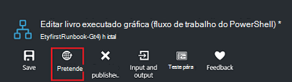
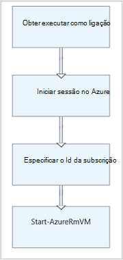

<properties
    pageTitle="Meu livro de execuções gráfico primeiro no Azure automatização | Microsoft Azure"
    description="Tutorial orienta-o através da criação, testar e a publicação de um livro de execuções gráfico simple."
    services="automation"
    documentationCenter=""
    authors="mgoedtel"
    manager="jwhit"
    editor=""
    keywords="livro execuções, modelo de livro execuções, livro execuções automatização, livro de execuções azure"/>
<tags
    ms.service="automation"
    ms.workload="tbd"
    ms.tgt_pltfrm="na"
    ms.devlang="na"
    ms.topic="get-started-article"
    ms.date="07/06/2016"
    ms.author="magoedte;bwren"/>

# <a name="my-first-graphical-runbook"></a>Meu livro de execuções gráfico primeiro

> [AZURE.SELECTOR] - [Gráficos](automation-first-runbook-graphical.md) - [PowerShell](automation-first-runbook-textual-PowerShell.md) - [PowerShell fluxo de trabalho](automation-first-runbook-textual.md)

Neste tutorial orienta-o através da criação de um [livro de execuções gráfico](automation-runbook-types.md#graphical-runbooks) no Azure automatização.  Vamos começar com um livro de execuções simple que vamos testar e publicar enquanto podemos explicam como controlar o estado da tarefa livro execuções.  Em seguida, podemos irá modificar livro de execuções para gerir realmente Azure recursos, neste caso, iniciar uma máquina virtual Azure.  Iremos, em seguida, fazer livro de execuções mais robustas ao adicionar parâmetros de livro execuções e ligações condicional.

## <a name="prerequisites"></a>Pré-requisitos

Para concluir este tutorial, terá o seguinte.

-   Subscrição do Azure.  Se não tiver um ainda, pode [Ativar os benefícios da sua subscritor MSDN](https://azure.microsoft.com/pricing/member-offers/msdn-benefits-details/) ou <a href="/pricing/free-account/" target="_blank"> [Inscrever-se para uma conta gratuita](https://azure.microsoft.com/free/).
-   [Executar como conta azure](automation-sec-configure-azure-runas-account.md) para o livro de execuções sem soltar, autenticar para recursos Azure.  Esta conta tem de ter permissão para iniciar e parar a máquina virtual.
-   Uma máquina virtual Azure.  Iremos parar e iniciar nesta máquina, por isso, não deve ser produção.


## <a name="step-1---create-new-runbook"></a>Passo 1 - Criar novo livro de execuções

Vamos começar por criar um livro de execuções simple exporta o texto *Olá mundo*.

1.  No Portal do Azure, abre a sua conta de automatização.  
    Página de conta de automatização dá-lhe uma vista rápida dos recursos nesta conta.  Já deve ter alguns elementos.  A maioria das pessoas são os módulos são automaticamente incluídos numa nova conta de automatização.  Também deverá ter o elemento credencial que é mencionado na [Pré-requisitos](#prerequisites).
2.  Clique no mosaico **Runbooks** para abrir a lista de runbooks.<br> 
3.  Crie um novo livro de execuções clicando no botão **Adicionar um livro de execuções** e, em seguida, **criar um novo livro de execuções**.
4.  Dê o nome *MyFirstRunbook gráfica*ao livro de execuções.
5.  Neste caso, iremos para criar um [livro de execuções gráfico](automation-graphical-authoring-intro.md) portanto, selecione **gráficos** para **tipo de livro execuções**.<br> <br>
6.  Clique em **Criar** para criar o livro de execuções e abrir o editor de gráfico.

## <a name="step-2---add-activities-to-the-runbook"></a>Passo 2 - Adicionar atividades ao livro de execuções

O controlo de biblioteca no lado esquerdo do editor de permite-lhe selecionar atividades para adicionar ao seu livro de execuções.  Iremos para adicionar um cmdlet de **Saída de escrita** para exportar texto a partir do livro de execuções.

1.  O controlo de biblioteca, clique na caixa de texto de pesquisa e escreva a **Saída de escrita**.  Os resultados da pesquisa serão apresentados abaixo. <br> 
2.  Desloque para baixo para a parte inferior da lista.  Pode quer clique com o botão direito do rato em **Saída de escrita** e selecione **Adicionar a tela** ou clique na elipse junto ao cmdlet e, em seguida, selecione **Adicionar a tela**.
3.  Clique na atividade de **Saída de escrita** na tela.  Esta ação abre a pá de controlo de configuração que permite-lhe configurar a atividade.
4.  A **etiqueta** predefinições para o nome do cmdlet, mas recomendamos pode alterá-lo para algo mais fácil. Altere-o para *Escrever Olá mundo para exportar*.
5.  Clique em **parâmetros** para fornecer valores para os parâmetros do cmdlet.  
    Algumas cmdlets tem vários conjuntos de parâmetro e que necessita para seleccionar que irá utilizar. Neste caso, o **Resultado de escrita** tem apenas um conjunto de parâmetro, pelo que não necessita selecionar uma. <br> 
6.  Selecione o parâmetro **InputObject** .  Este é o parâmetro onde podemos irá especificar o texto para enviar a sequência de saída.
7.  Na lista pendente **origem de dados** , selecione **PowerShell expressão**.  No menu pendente **origem de dados** fornece origens diferentes que utilizar para preencher um valor de parâmetro.  
    Pode utilizar a saída dessas origens como outra actividade, um ativo de automatização ou uma expressão de PowerShell.  Neste caso, queremos apenas para o texto *Olá mundo*de saída. Vamos pode utilizar uma expressão de PowerShell e especificar uma cadeia.
8.  Na caixa **expressão** , escreva *"Olá mundo"* e, em seguida, clique em **OK** duas vezes para voltar para a tela.<br> 
9.  Guarde o livro de execuções ao clicar em **Guardar**.<br> 

## <a name="step-3---test-the-runbook"></a>Passo 3 - testar o livro de execuções

Antes de podemos publicar o livro de execuções para o tornar disponível na produção, queremos testá-la para se certificar de que funciona corretamente.  Quando testar um livro de execuções, executar a sua versão de **rascunho** e ver o resultado de forma interativa.

1.  Clique em **Painel de teste** para abrir o pá de teste.<br> 
2.  Clique em **Iniciar** para iniciar o teste.  Isto deve ser a única opção ativada.
3.  É criada uma [tarefa de livro execuções](automation-runbook-execution.md) e o respetivo estado é apresentada no painel de.  
    O estado da tarefa será iniciado como *em fila de espera* , indicando que está à espera para um livro execuções trabalhador na nuvem para se tornar disponível.  Em seguida, passará para *Iniciar* quando um trabalhador afirmações o projecto e, em seguida, *em execução* quando o livro de execuções começa realmente a funcionar.  
4.  Quando a tarefa de livro execuções estiver concluída, o resultado é apresentado. No nosso caso, deverá vemos *Olá mundo*.<br> 
5.  Feche o pá de teste para regressar à tela.

## <a name="step-4---publish-and-start-the-runbook"></a>Passo 4 - publicar e iniciar o livro de execuções

Livro de execuções que criámos apenas ainda está em modo de rascunho. Precisamos de publicá-lo antes de podemos pode executá-la de produção.  Quando publicar um livro de execuções, substituir a versão publicada existente com a versão de rascunho.  No nosso caso, podemos ainda não tem uma versão publicada porque criámos apenas o livro de execuções.

1.  Clique em **Publicar** para publicar o livro de execuções e, em seguida, **Sim** quando lhe for pedido.<br> 
2.  Se deslocar para a esquerda para ver o livro de execuções na pá **Runbooks** , mostrará um **Estado de criação** **publicado**.
3.  Desloque-se novamente para a direita para ver o pá para **MyFirstRunbook**.  
    As opções na parte superior permitem-nos iniciar o livro de execuções, agendá-la para iniciar ao algum tempo no futuro ou crie um [webhook](automation-webhooks.md) para que pode ser iniciado através de uma chamada de HTTP.
4.  Queremos apenas iniciar o livro de execuções por isso, clique em **Iniciar** e, em seguida, **Sim** quando lhe for pedido.<br> 
5.  Pá uma tarefa é aberto para a tarefa de livro execuções que criámos apenas.  Vamos pode fechar este pá mas, neste caso Vamos deixar-aberta, de modo que pode ver o progresso da tarefa.
6.  O estado da tarefa é apresentado na **Tarefa de resumo** e corresponde os Estados que recomendamos viu quando testámos livro de execuções.<br> 
7.  Assim que o estado de livro execuções apresenta *concluído*, clique em **saída**. Pá o **resultado** é aberto e é possível ver o nosso *Olá mundo* no painel de.<br>   
8.  Feche o pá de saída.
9.  Clique em **Todos os registos** para abrir o pá sequências para a tarefa de livro execuções.  Vamos só deverá ver *Olá mundo* na sequência de saída, mas isto pode mostrar outras sequências de uma tarefa de livro execuções como verboso e erro se o livro de execuções escreve às mesmas.<br> 
10. Feche o separador todos os registos e pá a tarefa para regressar à pá MyFirstRunbook.
11. Clique em **tarefas** para abrir o pá de tarefas para este livro de execuções.  Lista todas as tarefas criadas por este livro de execuções de. Vamos só deverá ver uma tarefa listada uma vez que recomendamos executou apenas a tarefa de uma vez.<br> 
12. Pode clicar nesta tarefa para abrir o painel de tarefas mesmo que recomendamos visualizados quando é iniciado o livro de execuções.  Esta opção permite-lhe tempo voltar atrás e ver os detalhes de qualquer tarefa que foi criado para um determinado livro de execuções.

## <a name="step-5---create-variable-assets"></a>Passo 5 - criar activos variáveis

Testámos e publicados nosso livro de execuções, mas até ao momento-não fazer nada úteis. Pretendemos-lo a gerir os recursos Azure.  Antes de configurar recomendamos o livro de execuções para autenticar, criamos uma variável para mantenha o ID da subscrição e fazer referência depois de configurar estamos a atividade para autenticar no passo 6 abaixo.  Incluir uma referência para o contexto de subscrição permite-lhe trabalhar facilmente entre múltiplas subscrições.  Antes de continuar, copie o seu ID da subscrição da opção de subscrições fora de painel de navegação.  

1. No pá automatização contas, clique no mosaico **elementos** e o pá de **activos** é aberto.
2. Na pá elementos, clique no mosaico **variáveis** .
3. No pá variáveis, clique em **Adicionar uma variável**.<br>
4. Na nova pá variável, na caixa **nome** , introduza **AzureSubscriptionId** e na caixa **valor** , introduza o ID da subscrição.  Manter *cadeia* para o **tipo** e o valor predefinido para **encriptação**.  
5. Clique em **Criar** para criar a variável.  


## <a name="step-6---add-authentication-to-manage-azure-resources"></a>Passo 6 - adicionar autenticação para gerir os recursos Azure

Agora que temos uma variável para colocar em espera nosso ID da subscrição, podemos pode configurar o nosso livro de execuções para autenticar com as credenciais de executar como que são referidas na [Pré-requisitos](#prerequisites).  Vamos fazê-lo adicionando o Azure executar como ligação **activo** e **Adicionar AzureRMAccount** cmdlet para a tela.  

1.  Abra o editor gráfico ao clicar em **Editar** na pá MyFirstRunbook.<br> 
2.  Vamos não são precisas **Escrever Olá mundo para exportar** , por isso, botão direito do rato clique na mesma e selecione **Eliminar**.
3.  No controlo de biblioteca, expanda **ligações** e adicione **AzureRunAsConnection** da tela ao selecionar **Adicionar a tela**.
4.  Na tela, selecione **AzureRunAsConnection** e no painel de controlo de configuração, escreva **Obter executar como ligação** na caixa de texto **etiqueta** .  Esta é a ligação 
5.  No controlo de biblioteca, escreva **AzureRmAccount adicionar** na caixa de texto de pesquisa.
6.  Adicione **AzureRmAccount adicionar** à tela de.<br> 
7.  Paire sobre **Obter executar como ligação** até um círculo é apresentada na parte inferior da forma. Clique no círculo e arraste a seta para **Adicionar AzureRmAccount**.  A seta que acabou de criar está uma *ligação*.  Livro de execuções irá iniciar com **Obter executar como ligação** e, em seguida, execute **AzureRmAccount adicionar**.<br> 
8.  Na tela, selecione **Adicionar AzureRmAccount** e na configuração de controlar o tipo de painel **Login to Azure** na caixa de texto **etiqueta** .
9.  Clique em **parâmetros** e a configuração de parâmetro de atividade pá é apresentada. 
10.  **Adicionar AzureRmAccount** tem vários conjuntos de parâmetro pelo precisamos selecionar uma antes de pode fornecemos valores de parâmetros.  Clique em **Definir parâmetros** e, em seguida, selecione o conjunto de parâmetro **ServicePrincipalCertificate** . 
11.  Depois de selecionar o parâmetro definido, os parâmetros são apresentados na pá a configuração de parâmetro de atividade.  Clique em **APPLICATIONID**.<br> 
12.  No pá valor do parâmetro, selecione a **saída de atividade** para a **origem de dados** e selecione **Obter executar como ligação** a partir da lista, na caixa de texto **caminho de campo** tipo **ApplicationId**e, em seguida, clique em **OK**.  Vamos são especificando o nome da propriedade para o caminho de campo porque a atividade exporta um objeto com várias propriedades.
13.  Clique em **CERTIFICATETHUMBPRINT**e na pá valor do parâmetro, selecione o **resultado da atividade** para a **origem de dados**.  Selecione **Obter executar como ligação** a partir da lista, na caixa de texto **caminho de campo** tipo **CertificateThumbprint**e, em seguida, clique em **OK**. 
14.  Clique em **SERVICEPRINCIPAL**e na pá valor do parâmetro, selecione **ConstantValue** para a **origem de dados**, clique na opção **True**e, em seguida, clique em **OK**.
15.  Clique em **TENANTID**e na pá valor do parâmetro, selecione o **resultado da atividade** para a **origem de dados**.  Selecione **Obter executar como ligação** a partir da lista, na caixa de texto **caminho de campo** tipo **TenantId**e, em seguida, clique duas vezes em **OK** .  
16.  No controlo de biblioteca, escreva **Conjunto AzureRmContext** na caixa de texto de pesquisa.
17.  Adicione **Conjunto AzureRmContext** para a tela.
18.  Na tela, selecione o **Conjunto AzureRmContext** e na configuração de controlar o tipo de painel **Especificar Id da subscrição** na caixa de texto **etiqueta** .
19.  Clique em **parâmetros** e a configuração de parâmetro de atividade pá é apresentada. 
20. **Conjunto AzureRmContext** tem vários conjuntos de parâmetro pelo precisamos selecionar uma antes de pode fornecemos valores de parâmetros.  Clique em **Definir parâmetros** e, em seguida, selecione o conjunto de parâmetro **SubscriptionId** .  
21.  Depois de selecionar o parâmetro definido, os parâmetros são apresentados na pá a configuração de parâmetro de atividade.  Clique em **SubscriptionID**
22.  No pá valor do parâmetro, selecione **Elementos variável** para a **origem de dados** e selecione **AzureSubscriptionId** a partir da lista e, em seguida, clique duas vezes em **OK** .   
23.  Paire sobre **o início de sessão para Azure** até um círculo é apresentada na parte inferior da forma. Clique no círculo e arraste a seta para **Especificar Id da subscrição**.


O livro de execuções deverá ter o aspeto semelhante ao seguinte neste momento: <br>

## <a name="step-7---add-activity-to-start-a-virtual-machine"></a>Passo 7 - adicionar atividade para iniciar uma máquina virtual

Agora adicionaremos uma atividade de **Início AzureRmVM** para iniciar uma máquina virtual.  Pode escolher qualquer máquina virtual na sua subscrição do Azure e, por agora podemos estará hardcoding dê um nome para o cmdlet.

1. No controlo de biblioteca, escreva **Iniciar AzureRm** na caixa de texto de pesquisa.
2. Adicionar **AzureRmVM início** à tela de e, em seguida, clique e arraste-a por baixo de **Especificar Id da subscrição**.
3. Paire sobre **Especificar Id da subscrição** até um círculo é apresentada na parte inferior da forma.  Clique no círculo e arraste a seta para **Iniciar AzureRmVM**. 
4.  Selecione **Iniciar AzureRmVM**.  Clique em **parâmetros** e, em seguida, **Parâmetro definido** para ver os conjuntos de **AzureRmVM iniciar**.  Selecione o conjunto de parâmetro **ResourceGroupNameParameterSetName** . Tenha em atenção que **ResourceGroupName** e o **nome** tem pontos de exclamação seguinte-los.  Isto indica que estes provêm de parâmetros necessários.  Tenha em atenção que ambos esperar valores de cadeia.
5.  Selecione o **nome**.  Selecione a **expressão do PowerShell** para a **origem de dados** e o tipo na nome máquina virtual rodeada por aspas podemos iniciará com este livro de execuções.  Clique em **OK**.<br>
6.  Selecione **ResourceGroupName**. Utilize o **PowerShell expressão** para a **origem de dados** e escreva na nome do grupo de recursos rodeada por aspas.  Clique em **OK**.<br> 
8.  Clique em Painel de teste para que possamos testar livro de execuções.
9.  Clique em **Iniciar** para iniciar o teste.  Assim que for concluída, verifique que a máquina virtual foi iniciada.

O livro de execuções deverá ter o aspeto semelhante ao seguinte neste momento: <br>

## <a name="step-8---add-additional-input-parameters-to-the-runbook"></a>Passo 8 - adicionar parâmetros de entrada adicionais ao livro de execuções

Os nossos livro de execuções inicia atualmente a máquina virtual no grupo de recursos que recomendamos especificados no cmdlet **AzureRmVM iniciar** , mas os nossos livro de execuções seria mais útil se podemos poderia especificar ambos quando o livro de execuções é iniciado.  Vamos agora adicionar parâmetros de entrada ao livro de execuções para fornecer essa funcionalidade.

1. Abra o editor gráfico ao clicar em **Editar** no painel **MyFirstRunbook** .
2. Clique em **entrada e saída** e, em seguida, **Adicionar o teclado** para abrir o painel de parâmetro de entrada do livro execuções.<br> 
3. Especificar *VMName* para o **nome**.  Manter *cadeia* para o **tipo**, mas alterar **obrigatório** como *Sim*.  Clique em **OK**.
4. Criar um parâmetro de entrada obrigatório segundo chamado *ResourceGroupName* e, em seguida, clique em **OK** para fechar o painel de **entrada e saída** .<br> 
5. Selecione a atividade de **AzureRmVM iniciar** e, em seguida, clique em **parâmetros**.
6. Alterar a **origem de dados** para o **nome** à **entrada do livro execuções** e, em seguida, selecione **VMName**.<br>
7. Alterar a **origem de dados** para **ResourceGroupName** à **entrada do livro execuções** e, em seguida, selecione **ResourceGroupName**.<br> 
8. Guarde o livro de execuções e abrir o painel de teste.  Tenha em atenção que agora pode fornecer valores para as duas variáveis de entrada que serão utilizadas durante o ensaio.
9. Feche o painel de teste.
10. Clique em **Publicar** para publicar a nova versão do livro de execuções.
11. Pare a máquina virtual que começou a no passo anterior.
12. Clique em **Iniciar** para iniciar o livro de execuções.  Escreva em **VMName** e **ResourceGroupName** para a máquina virtual que vai começar.<br> 
13. Quando o livro de execuções for concluída, verifique que a máquina virtual foi iniciada.

## <a name="step-9---create-a-conditional-link"></a>Passo 9 - criar uma ligação condicional

Vamos agora modificar livro de execuções para que apenas tentará para iniciar a máquina virtual se não estiver já iniciado.  Vamos irá fazê-lo adicionando um cmdlet **Get-AzureRmVM** ao livro de execuções irá obter o estado de nível de instância da máquina virtual. Em seguida, adicionaremos um módulo de código de fluxo de trabalho do PowerShell chamado **Obter o estado** com um fragmento de código do PowerShell para determinar se o estado da máquina virtual está em execução ou parados.  Uma ligação condicional do módulo **Obter o estado** só será executada **Iniciar AzureRmVM** se o estado atual de execução está parado.  Por fim, vamos irá saída de uma mensagem a informar que se a VM foi iniciada com êxito ou não utilizar o cmdlet do PowerShell escrita-saída.

1. Abra **MyFirstRunbook** no editor de gráfico.
2. Remova a ligação entre **Especificar Id da subscrição** e **AzureRmVM iniciar** ao clicar no mesmo e, em seguida, premir a tecla *Delete* .
3. No controlo de biblioteca, escreva **Get-AzureRm** na caixa de texto de pesquisa.
4. Adicione **Get-AzureRmVM** para a tela.
5. Selecione **Obter AzureRmVM** e, em seguida, **Parâmetro definido** para ver os conjuntos de **Obter AzureRmVM**.  Selecione o conjunto de parâmetro **GetVirtualMachineInResourceGroupNameParamSet** .  Tenha em atenção que **ResourceGroupName** e o **nome** tem pontos de exclamação seguinte-los.  Isto indica que estes provêm de parâmetros necessários.  Tenha em atenção que ambos esperar valores de cadeia.
6. Em **origem de dados** para o **nome**, selecione **livro execuções entrada** e, em seguida, selecione **VMName**.  Clique em **OK**.
7. Em **origem de dados** para **ResourceGroupName**, selecione **livro execuções entrada** e, em seguida, selecione **ResourceGroupName**.  Clique em **OK**.
8. Em **origem de dados** de **Estado**, selecione o **valor da constante** e, em seguida, clique em **Verdadeiro**.  Clique em **OK**.  
9. Crie uma ligação a partir de **Especificar Id da subscrição** para **Obter AzureRmVM**.
10. No controlo de biblioteca, expanda o **Controlo de livro execuções** e adicionar **código** a tela de.  
11. Crie uma ligação da **Get-AzureRmVM** ao **código**.  
12. Clique em **código** e no painel de configuração, alterar a etiqueta para **Obter o estado**.
13. Parâmetro de selecção de **código** e o **Editor de código** pá é apresentado.  
14. No editor de código, cole o seguinte fragmento de código:

     ```
     $StatusesJson = $ActivityOutput['Get-AzureRmVM'].StatusesText 
     $Statuses = ConvertFrom-Json $StatusesJson 
     $StatusOut ="" 
     foreach ($Status in $Statuses){ 
     if($Status.Code -eq "Powerstate/running"){$StatusOut = "running"} 
     elseif ($Status.Code -eq "Powerstate/deallocated") {$StatusOut = "stopped"} 
     } 
     $StatusOut 
     ```

15. Crie uma ligação **Obter** estado para **Iniciar AzureRmVM**.<br>   
16. Selecione a ligação e no painel de configuração, altere a **condição de aplicar** como **Sim**.   Tenha em atenção a ligação transforma-se uma linha tracejada que indica que a atividade de destino só será executada se a condição é resolvida como verdadeiro.  
17. A **expressão da condição**, escreva *$ActivityOutput ["obter o estado"] - eq "Parado"*.  **Iniciar AzureRmVM** agora só serão executadas se a máquina virtual está parada.
18. No controlo de biblioteca, expanda **Cmdlets** e, em seguida, **Microsoft.PowerShell.Utility**.
19. Adicione **Saída de escrita** da tela duas vezes.<br> 
20. No primeiro controlo de **Saída de escrita** , clique em **parâmetros** e altere o valor de **etiqueta** para *Notificar VM iniciado*.
21. Para **InputObject**, altere a **origem de dados** para **PowerShell expressão** em, escreva a expressão *"$VMName iniciado com êxito."*.
22. No segundo controlo de **Saída de escrita** , clique em **parâmetros** e altere o valor de **etiqueta** para *Notificar VM iniciar Ocorreu uma falha*
23. Para **InputObject**, altere a **origem de dados** para **PowerShell expressão** em, escreva a expressão *"$VMName não conseguiu iniciar."*.
24. Crie uma ligação a partir do **Início AzureRmVM** para **Notificar VM iniciado** e **Notificar VM iniciar falhou**.
25. Selecione a ligação para **Notificar VM iniciado** e altere **Aplicar condição** **verdadeira**.
26. A **expressão da condição**, escreva *$ActivityOutput ['Início-AzureRmVM']. IsSuccessStatusCode - eq $true*.  Este controlo de saída de escrita agora só serão executadas se a máquina virtual for iniciada com êxito.
27. Selecione a ligação para **Notificar VM iniciar Ocorreu uma falha** e altere **Aplicar condição** **verdadeira**.
28. A **expressão da condição**, escreva *$ActivityOutput ['Início-AzureRmVM']. IsSuccessStatusCode - $true*.  Este controlo de saída de escrita agora só serão executadas se a máquina virtual não estiver iniciada com êxito.
29. Guarde o livro de execuções e abrir o painel de teste.
30. Inicie o livro de execuções com a máquina virtual parada e este deverá começar.

## <a name="next-steps"></a>Próximos passos

-   Para saber mais sobre a criação de gráficos, consulte o artigo [gráficos cocriação na automatização do Azure](automation-graphical-authoring-intro.md)
-   Para começar a trabalhar com PowerShell runbooks, consulte o artigo [meu livro de execuções do PowerShell primeiro](automation-first-runbook-textual-powershell.md)
-   Para começar a trabalhar com runbooks de fluxo de trabalho do PowerShell, consulte o artigo [meu livro de execuções de fluxo de trabalho de PowerShell primeiro](automation-first-runbook-textual.md)
