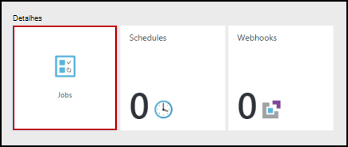

<properties
    pageTitle="Meu livro de execuções do fluxo de trabalho do PowerShell primeiro no Azure automatização | Microsoft Azure"
    description="Tutorial orienta-o através da criação, testar e a publicação de um livro de execuções do texto simples utilizando o PowerShell fluxo de trabalho."
    services="automation"
    documentationCenter=""
    authors="mgoedtel"
    manager="jwhit"
    editor=""
    keywords="PowerShell fluxo de trabalho, exemplos de fluxo de trabalho do powershell, powershell do fluxo de trabalho"/>
<tags
    ms.service="automation"
    ms.workload="tbd"
    ms.tgt_pltfrm="na"
    ms.devlang="na"
    ms.topic="get-started-article"
    ms.date="07/19/2016"
    ms.author="magoedte;bwren"/>

# <a name="my-first-powershell-workflow-runbook"></a>Meu livro de execuções do fluxo de trabalho do PowerShell primeiro

> [AZURE.SELECTOR] - [Gráficos](automation-first-runbook-graphical.md) - [PowerShell](automation-first-runbook-textual-PowerShell.md) - [PowerShell fluxo de trabalho](automation-first-runbook-textual.md)

Neste tutorial orienta-o através da criação de um [livro de execuções do fluxo de trabalho do PowerShell](automation-runbook-types.md#powerShell-workflow-runbooks) no Azure automatização. Vamos começar com um livro de execuções simple que vamos testar e publicar enquanto podemos explicam como controlar o estado da tarefa livro execuções. Em seguida, podemos irá modificar livro de execuções para gerir realmente Azure recursos, neste caso, iniciar uma máquina virtual Azure. Iremos, em seguida, fazer livro de execuções mais robustas ao adicionar parâmetros de livro execuções.

## <a name="prerequisites"></a>Pré-requisitos

Para concluir este tutorial, terá o seguinte.

-   Subscrição do Azure. Se não tiver um ainda, pode [Ativar os benefícios da sua subscritor MSDN](https://azure.microsoft.com/pricing/member-offers/msdn-benefits-details/) ou <a href="/pricing/free-account/" target="_blank"> [Inscrever-se para uma conta gratuita](https://azure.microsoft.com/free/).
-   [Conta de automatização](automation-security-overview.md) para o livro de execuções sem soltar, autenticar para recursos Azure.  Esta conta tem de ter permissão para iniciar e parar a máquina virtual.
-   Uma máquina virtual Azure. Iremos parar e iniciar nesta máquina, por isso, não deve ser produção.

## <a name="step-1---create-new-runbook"></a>Passo 1 - Criar novo livro de execuções

Vamos começar por criar um livro de execuções simple exporta o texto *Olá mundo*.

1.  No Portal do Azure, abre a sua conta de automatização.  
    Página de conta de automatização dá-lhe uma vista rápida dos recursos nesta conta. Já deve ter alguns elementos. A maioria das pessoas são os módulos são automaticamente incluídos numa nova conta de automatização. Também deverá ter o elemento credencial que é mencionado na [Pré-requisitos](#prerequisites).
2.  Clique no mosaico **Runbooks** para abrir a lista de runbooks.<br> 
3.  Crie um novo livro de execuções clicando no botão **Adicionar um livro de execuções** e, em seguida, **criar um novo livro de execuções**.
4.  Dê ao livro de execuções o nome do *Fluxo de trabalho MyFirstRunbook*.
5.  Neste caso, iremos para criar um [livro de execuções do fluxo de trabalho do PowerShell](automation-runbook-types.md#powerShell-workflow-runbooks) portanto, selecione o **Fluxo de trabalho do Powershell** para o **tipo de livro execuções**.<br> 
6.  Clique em **Criar** para criar o livro de execuções e abrir o editor de textual.

## <a name="step-2---add-code-to-the-runbook"></a>Passo 2 - adicionar código ao livro de execuções

Pode qualquer código do tipo de diretamente para o livro de execuções ou pode selecionar cmdlets, runbooks e recursos a partir do controlo de biblioteca e adicioná-las ao livro de execuções com quaisquer parâmetros relacionados. Neste tutorial, vamos escreva-me diretamente para o livro de execuções.

1.  Os nossos livro de execuções está atualmente vazio com apenas a necessários *fluxo de trabalho* de palavra-chave, o nome da nossa livro de execuções e as chavetas que irão encase o fluxo de trabalho completo. 

    ```
    Workflow MyFirstRunbook-Workflow
    {
    }
    ```

2.  Tipo de *resultado de escrita "Olá mundo."* entre as chavetas. 
   
    ```
    Workflow MyFirstRunbook-Workflow
    {
      Write-Output "Hello World"
    }
    ```

3.  Guarde o livro de execuções ao clicar em **Guardar**.<br> 

## <a name="step-3---test-the-runbook"></a>Passo 3 - testar o livro de execuções

Antes de podemos publicar o livro de execuções para o tornar disponível na produção, queremos testá-la para se certificar de que funciona corretamente. Quando testar um livro de execuções, executar a sua versão de **rascunho** e ver o resultado de forma interativa.

1.  Clique em **Painel de teste** para abrir o painel de teste.<br> 
2.  Clique em **Iniciar** para iniciar o teste. Isto deve ser a única opção ativada.
3.  É criada uma [tarefa de livro execuções](automation-runbook-execution.md) e respetivo estado apresentada.  
    O estado da tarefa será iniciado como *em fila de espera* , indicando que está à espera para um livro execuções trabalhador na nuvem breve disponíveis. Em seguida, passará para *Iniciar* quando um trabalhador afirmações o projecto e, em seguida, *em execução* quando o livro de execuções começa realmente a funcionar.  
4.  Quando a tarefa de livro execuções estiver concluída, o resultado é apresentado. No nosso caso, deverá vemos *Olá mundo*.<br> 
5.  Feche o painel de teste para regressar à tela.

## <a name="step-4---publish-and-start-the-runbook"></a>Passo 4 - publicar e iniciar o livro de execuções

Livro de execuções que criámos apenas ainda está em modo de rascunho. Precisamos de publicá-lo antes de podemos pode executá-la de produção. Quando publicar um livro de execuções, substituir a versão publicada existente com a versão de rascunho. No nosso caso, podemos ainda não tem uma versão publicada porque criámos apenas o livro de execuções.

1.  Clique em **Publicar** para publicar o livro de execuções e, em seguida, **Sim** quando lhe for pedido.<br> 
2.  Se deslocar para a esquerda para ver o livro de execuções no painel de **Runbooks** agora, mostrará um **Estado de criação** **publicado**.
3.  Desloque-se novamente para a direita para ver o painel de **Fluxo de trabalho MyFirstRunbook**.  
    As opções na parte superior permitem-nos iniciar o livro de execuções, agendá-la para iniciar ao algum tempo no futuro ou crie um [webhook](automation-webhooks.md) para que pode ser iniciado através de uma chamada de HTTP.
4.  Queremos apenas iniciar o livro de execuções por isso, clique em **Iniciar** e, em seguida, **Sim** quando lhe for pedido.<br> 
5.  É aberto um painel de tarefas para a tarefa de livro execuções podemos acabou de criar. Vamos pode fechar este painel mas, neste caso Vamos deixar-aberta, de modo que pode ver o progresso da tarefa.
6.  O estado da tarefa é apresentado na **Tarefa de resumo** e corresponde os Estados que recomendamos viu quando testámos livro de execuções.<br> 
7.  Assim que o estado de livro execuções apresenta *concluído*, clique em **saída**. O painel de saída é aberto e é possível ver o nosso *Olá mundo*.<br>   
8.  Feche o painel de saída.
9.  Clique em **fluxos de** para abrir o painel de fluxos para a tarefa de livro execuções. Vamos só deverá ver *Olá mundo* na sequência de saída, mas isto pode mostrar outras sequências de uma tarefa de livro execuções como verboso e erro se o livro de execuções escreve às mesmas.<br> 
10. Feche o painel de sequências e o painel de tarefas para regressar ao painel de MyFirstRunbook.
11. Clique em **tarefas** para abrir o painel de tarefas para este livro de execuções. Lista todas as tarefas criadas por este livro de execuções de. Vamos só deverá ver uma tarefa listada uma vez que recomendamos executou apenas a tarefa de uma vez.<br> 
12. Pode clicar nesta tarefa para abrir o painel de tarefas mesmo que recomendamos visualizados quando é iniciado o livro de execuções. Esta opção permite-lhe tempo voltar atrás e ver os detalhes de qualquer tarefa que foi criado para um determinado livro de execuções.

## <a name="step-5---add-authentication-to-manage-azure-resources"></a>Passo 5 - adicionar autenticação para gerir os recursos Azure

Testámos e publicados nosso livro de execuções, mas até ao momento-não fazer nada úteis. Pretendemos-lo a gerir os recursos Azure. Não poderá fazê-lo apesar da menos que temos autenticar utilizando as credenciais que são referidas na [Pré-requisitos](#prerequisites). Vamos fazê-lo com o cmdlet **AzureRMAccount adicionar** .

1.  Abra o editor textual ao clicar em **Editar** no painel de fluxo de trabalho MyFirstRunbook.<br> 
2.  Vamos não são precisas a linha de **Saída de escrita** , por isso, prosseguir e eliminá-la.
3.  Posicione o cursor uma linha em branco entre as chavetas.
4.  Escreva ou copie e cole o seguinte código processará a autenticação com a sua conta de automatização executar como:

    ```
    $Conn = Get-AutomationConnection -Name AzureRunAsConnection 
    Add-AzureRMAccount -ServicePrincipal -Tenant $Conn.TenantID `
    -ApplicationId $Conn.ApplicationID -CertificateThumbprint $Conn.CertificateThumbprint
    ```

5.  Clique em **Testar painel** para que possamos testar livro de execuções.
6.  Clique em **Iniciar** para iniciar o teste. Assim que for concluída, deverá receber resultados semelhantes às informações básicas seguintes, apresenta da sua conta. Isto confirma que a credencial é válida.<br> 

## <a name="step-6---add-code-to-start-a-virtual-machine"></a>Passo 6 - adicionar código para iniciar uma máquina virtual

Agora que estiver a nossa livro de execuções autenticar a nossa subscrição Azure, podemos pode gerir recursos. Adicionaremos um comando para iniciar uma máquina virtual. Pode escolher qualquer máquina virtual na sua subscrição do Azure e, por agora podemos estará hardcoding dê um nome para o cmdlet.

1.  Após *Adicionar AzureRmAccount*, escreva *Iniciar AzureRmVM-nome 'VMName' - ResourceGroupName 'NameofResourceGroup'* fornecer o nome e o nome de grupo de recursos da máquina virtual para começar.  

    ```
    workflow MyFirstRunbook-Workflow
    {
      $Conn = Get-AutomationConnection -Name AzureRunAsConnection
      Add-AzureRMAccount -ServicePrincipal -Tenant $Conn.TenantID -ApplicationId $Conn.ApplicationID -CertificateThumbprint $Conn.CertificateThumbprint
      Start-AzureRmVM -Name 'VMName' -ResourceGroupName 'ResourceGroupName'
    }
    ``` 

2.  Guardar o livro de execuções e, em seguida, clique em **Testar painel** para que possamos testar.
3.  Clique em **Iniciar** para iniciar o teste. Assim que for concluída, verifique que a máquina virtual foi iniciada.

## <a name="step-7---add-an-input-parameter-to-the-runbook"></a>Passo 7 - adicionar um parâmetro de entrada ao livro de execuções

Inicia o nosso livro de execuções atualmente a virtual de máquina que recomendamos codificado no livro de execuções, mas seria mais útil se podemos poderia especificar a máquina virtual quando o livro de execuções é iniciado. Vamos agora adicionar parâmetros de entrada ao livro de execuções para fornecer essa funcionalidade.

1.  Adicionar parâmetros para *VMName* e *ResourceGroupName* ao livro de execuções e utilizar estas variáveis com o cmdlet **Iniciar AzureRmVM** tal como no exemplo abaixo. 

    ```
    workflow MyFirstRunbook-Workflow
    {
       Param(
        [string]$VMName,
        [string]$ResourceGroupName
       )  
     $Conn = Get-AutomationConnection -Name AzureRunAsConnection 
     Add-AzureRMAccount -ServicePrincipal -Tenant $Conn.TenantID -ApplicationId $Conn.ApplicationID -CertificateThumbprint $Conn.CertificateThumbprint
     Start-AzureRmVM -Name $VMName -ResourceGroupName $ResourceGroupName
    }
    ```

2.  Guarde o livro de execuções e abrir o painel de teste. Tenha em atenção que agora pode fornecer valores para as duas variáveis de entrada que serão utilizadas durante o ensaio.
3.  Feche o painel de teste.
4.  Clique em **Publicar** para publicar a nova versão do livro de execuções.
5.  Pare a máquina virtual que começou a no passo anterior.
6.  Clique em **Iniciar** para iniciar o livro de execuções. Escreva em **VMName** e **ResourceGroupName** para a máquina virtual que vai começar.<br> 

7.  Quando o livro de execuções for concluída, verifique que a máquina virtual foi iniciada.

## <a name="next-steps"></a>Próximos passos

-  Para começar a trabalhar com gráficos runbooks, consulte o artigo [meu livro de execuções gráfico primeiro](automation-first-runbook-graphical.md)
-  Para começar a trabalhar com PowerShell runbooks, consulte o artigo [meu livro de execuções do PowerShell primeiro](automation-first-runbook-textual-powershell.md)
-  Para saber mais sobre tipos de livro execuções, os respetivos vantagens e limitações, consulte o artigo [tipos de livro execuções de automatização do Azure](automation-runbook-types.md)
-  Para mais informações sobre o PowerShell script suporta a funcionalidade, consulte o artigo [de suporte no Azure automatização de script do PowerShell nativo](https://azure.microsoft.com/blog/announcing-powershell-script-support-azure-automation-2/)