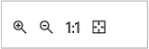

<properties 
    pageTitle="Cocriação gráficas na automatização Azure | Microsoft Azure"
    description="Criação gráficas permite-lhe criar runbooks para Azure automatização sem trabalhar com o código. Este artigo fornece uma introdução à criação gráficas e todos os detalhes conforme necessários para começar a criar um livro de execuções gráfico."
    services="automation"   
    documentationCenter=""
    authors="mgoedtel"
    manager="jwhit"
    editor="tysonn" />
<tags 
    ms.service="automation"
    ms.devlang="na"
    ms.topic="article"
    ms.tgt_pltfrm="na"
    ms.workload="infrastructure-services"
    ms.date="06/03/2016"
    ms.author="magoedte;bwren" />

# Gráficos de cocriação na automatização do Azure

## Introdução

Criação gráfica permite-lhe criar runbooks para Azure automatização sem complexidade do código do Windows PowerShell ou fluxo de trabalho do PowerShell subjacente. Adicionar atividades para a tela de uma biblioteca de cmdlets e runbooks, associá-las e configurar para formar um fluxo de trabalho.  Se nunca trabalhou com Orchestrator do Centro de sistema ou serviço de gestão de automatização (SMA), em seguida, este deverá ter um aspeto familiar para si.   

Este artigo fornece uma introdução à criação de gráficos e os conceitos que precisa para começar a utilizar na criação de um livro de execuções gráfico.

## Runbooks gráficas

Todos os runbooks no Azure automatização são fluxos de trabalho do Windows PowerShell.  Gráficos e gráficos fluxo de trabalho do PowerShell runbooks gerar código de PowerShell que é executado pelos trabalhadores automatização, mas não for possível visualizá-lo ou modifique-o diretamente.  Um livro de execuções gráfico pode ser convertido para um livro de execuções do fluxo de trabalho de PowerShell gráficas e vice versa, mas não pode ser convertidos para um livro de execuções textual. Um livro de execuções textual existente não pode ser importado para o editor de gráfico.  

## Descrição geral do editor de gráfico

Pode abrir o editor de gráfico no portal do Azure ao criar ou editar um livro de execuções gráfico.

As secções seguintes descrevem os controlos no editor de gráfico.

### Tela
A tela é onde estruturar o seu livro de execuções.  Adicionar atividades de nós o controlo de biblioteca ao livro de execuções e ligá-los com ligações para definir a lógica do livro de execuções.

Pode utilizar os controlos na parte inferior da tela para ampliar e reduzir.

### Controlo de biblioteca

O controlo de biblioteca é onde selecionar [atividades](#activities) para adicionar ao seu livro de execuções.  Adicioná-los à tela de onde os ligar a outras atividades.  Inclui quatro secções descritas na tabela seguinte.

| Secção | Descrição |
|:---|:---|
| Cmdlets | Inclui os cmdlets que podem ser utilizados no seu livro de execuções.  Cmdlets estão organizados por módulo.  Todos os módulos que tem instalada na sua conta de automatização estarão disponíveis.  |
| Runbooks |  Inclui o runbooks na sua conta de automatização. Estes runbooks pode ser adicionadas a tela para ser utilizado como subordinado runbooks. São apresentadas apenas runbooks do mesmo tipo core como livro de execuções a ser editado; para gráficos runbooks apenas PowerShell com base em runbooks são apresentadas, enquanto para gráficas fluxo de trabalho do PowerShell runbooks apenas PowerShell fluxo de trabalho baseados em-runbooks são apresentadas.
| Elementos | Inclui os [elementos de automatização](http://msdn.microsoft.com/library/dn939988.aspx) na sua conta de automatização que pode ser utilizada no seu livro de execuções.  Quando adiciona um ativo para um livro de execuções, irá adicionar uma atividade de fluxo de trabalho que deve obter os elementos selecionados.  No caso de activos variáveis, pode selecionar se pretende adicionar uma atividade para obter a variável ou definir a variável.
| Controlo de livro execuções | Inclui as atividades de controlo do livro execuções que podem ser utilizadas no seu livro de execuções atual. Uma *junção* assume múltiplas entradas e aguarda até que todos os terminem antes de continuar o fluxo de trabalho. Uma atividade de *código* é executado numa ou mais linhas de código PowerShell ou fluxo de trabalho do PowerShell, dependendo do tipo de livro de execuções gráfica.  Pode utilizar esta actividade de código personalizado ou para a funcionalidade que é difícil alcançar com outras atividades.|

### Controlo de configuração

O controlo de configuração é onde pode fornece detalhes de um objeto selecionado na tela. As propriedades disponíveis neste controlo serão variam consoante o tipo de objeto selecionado.  Quando selecionar uma opção no controlo de configuração, abrirá pás adicionais para fornecer informações adicionais.

### Controlo de teste

O controlo de teste não é apresentado quando o editor de gráfico é iniciado pela primeira vez. É aberto quando [Testar um livro de execuções gráfico](#graphical-runbook-procedures)de forma interativa.  

## Livro de execuções gráficas procedimentos 

### Exportar e importar um livro de execuções gráfico

Só pode exportar a versão publicada de um livro de execuções gráfica.  Se o livro de execuções ainda não foi publicado, em seguida, no botão **Exportar publicados** estarão desativado.  Quando clica no botão **Exportar publicado** , livro de execuções é transferido para o seu computador local.  O nome do ficheiro corresponde ao nome do livro de execuções com uma extensão de *graphrunbook* .

Pode importar um ficheiro de livro execuções gráficos ou gráfica fluxo de trabalho do PowerShell ao selecionar a opção **Importar** ao adicionar um livro de execuções.   Quando selecionar o ficheiro a importar, pode manter o mesmo **nome** ou fornecer um novo.  O campo Tipo de livro execuções irá apresentar o tipo do livro execuções após-avalia o ficheiro seleccionado e se tentar para selecionar um tipo diferente que não está correcto, uma mensagem será apresentada verificando existirem conflitos potenciais e durante a conversão, podem existir erros de sintaxe.  

### Testes de um livro de execuções gráfico

Pode testar a versão de um livro de execuções rascunho no portal do Azure enquanto deixando a versão publicada do livro de execuções inalteradas ou pode testar um novo livro de execuções antes de foi publicado. Esta opção permite-lhe para verificar se o livro de execuções está a funcionar corretamente antes de substituir a versão publicada. Quando testar um livro de execuções, livro de execuções rascunho é executado e as ações que realiza são concluídas. É criado sem histórico da tarefa, mas saída é apresentada no painel de saída de teste. 

Abra o controlo de teste para um livro de execuções abrindo o livro de execuções para editar e, em seguida, clique no botão **Painel de teste** .

Irá pedir o controlo de teste para quaisquer parâmetros de entrada e pode começar a livro de execuções ao clicar no botão **Iniciar** .

### Publicar um livro de execuções gráfico

Cada livro de execuções no Azure automatização tem um rascunho e uma versão publicada. Apenas a versão publicada está disponível para ser executado e pode ser editada apenas a versão de rascunho. A versão publicada não é afetada por quaisquer alterações para a versão de rascunho. Quando estiver pronta para estar disponível a versão de rascunho, em seguida, publicar que substitui a versão publicada com a versão de rascunho.

Pode publicar um livro de execuções gráfico abrindo o livro de execuções para edição e, em seguida, clicar no botão **Publicar** .

Quando um livro de execuções ainda não foi publicado, tem um Estado de **Novo**.  Quando é publicado, tem o estado de **Published**.  Se editar o livro de execuções após foi publicado, e as versões de rascunho e publicados são diferentes, livro de execuções tem um Estado de **em Editar**.

 

Também tem a opção para reverter para a versão publicada de um livro de execuções.  Isto descarta quaisquer alterações efetuadas desde que o livro de execuções foi publicado pela última vez e substitui a versão de rascunho do livro de execuções com a versão publicada.

## Atividades

As atividades são blocos modulares de um livro de execuções.  Uma actividade pode ser um cmdlet do PowerShell, um livro de execuções subordinado ou uma atividade de fluxo de trabalho.  Adicionar uma actividade ao livro de execuções ao clicar nele botão direito do rato no controlo de biblioteca e selecionar **Adicionar a tela**.  Pode, em seguida, clique e arraste a atividade para colocá-lo em qualquer lugar na tela pretendidas.  A localização do da atividade na tela não tem efeito a operação do livro de execuções de qualquer forma.  Pode esquema o livro de execuções no entanto, irá encontrá-la mais adequadas para visualizar o seu funcionamento. 

Selecione a atividade na tela para configurar respectivas propriedades e parâmetros no pá a configuração.  Pode alterar a **etiqueta** da atividade para algo que descreva a si.  Ainda está a ser executado o cmdlet original, basta está a alterar o seu nome a apresentar que será utilizada no editor de gráfico.  A etiqueta tem de ser exclusiva no livro de execuções. 

### Conjuntos de parâmetro

Um conjunto de parâmetro define os parâmetros de obrigatórios e facultativos aceitarão valores para um cmdlet específico.  Todos os cmdlets ter pelo menos um parâmetro definido e algumas têm múltiplas.  Se um cmdlet tiver vários conjuntos de parâmetro, em seguida, tem de selecionar aquele que irá utilizar antes de poder configurar parâmetros.  Os parâmetros que pode configurar irão variam consoante o parâmetro definido que escolher.  Pode alterar o conjunto de parâmetro utilizado por uma actividade selecionando o **Parâmetro definido** e selecionando outro conjunto.  Neste caso, os valores de parâmetros que configurou são perdidos.

No exemplo seguinte, o cmdlet Get-AzureRmVM tem três conjuntos de parâmetro.  Não é possível configurar valores de parâmetros até selecionar um dos conjuntos de parâmetro.  O parâmetro definido ListVirtualMachineInResourceGroupParamSet é para devolver todas as máquinas virtuais num grupo de recursos e tem um único parâmetro opcional.  É o GetVirtualMachineInResourceGroupParamSet para especificar a máquina virtual que pretende regressar e tem dois obrigatório e um parâmetro opcional.

#### Valores de parâmetros

Quando especificar um valor para um parâmetro, seleccionar uma origem de dados para determinar como o valor será especificado.  Origens de dados que estão disponíveis para um determinado parâmetro irão dependem os valores válidos para esse parâmetro.  Por exemplo, Null só estarão uma opção disponível para um parâmetro que não permite valores nulos.

| Origem de dados | Descrição |
|:---|:---|
|Valor da constante|Escreva um valor para o parâmetro.  Só está disponível para os seguintes tipos de dados: Int32, Int64, cadeia, booleano, DateTime, mudar. |
|Resultado de atividade|Resultado de uma atividade que antecede a atividade atual no fluxo de trabalho.  Todas as atividades válidas serão listadas.  Selecione apenas a atividade para utilizar o seu resultado para o valor do parâmetro.  Se a atividade exporta um objeto com várias propriedades, em seguida, pode escrever na propriedade nome do após selecionar a atividade.|
|Livro execuções entrada |Selecione um parâmetro de entrada do livro execuções como entrada para o parâmetro de atividade.|  
|Elementos variável|Selecione uma variável de automatização como entrada.|  
|Elementos de credenciais|Selecione uma credencial de automatização como entrada.|  
|Elementos de certificado|Selecione um certificado de automatização como entrada.|  
|Elementos de ligação|Selecione uma ligação de automatização como entrada.| 
|Expressão de PowerShell|Especificar simples [PowerShell expressão](#powershell-expressions).  A expressão será avaliada antes da atividade e ao resultado utilizado para o valor do parâmetro.  Pode utilizar variáveis para consultar o resultado de uma atividade ou um parâmetro de entrada do livro execuções.|
|Não está configurado|Limpa qualquer valor que configurou anteriormente.|

#### Parâmetros adicionais opcionais

Todos os cmdlets terá a opção para fornecer parâmetros adicionais.  Estes são parâmetros comuns do PowerShell ou outros parâmetros personalizados.  São apresentadas com uma caixa de texto onde pode fornecer parâmetros utilizando o PowerShell sintaxe.  Por exemplo, para utilizar o parâmetro comuns **verboso** , teria de especificar **"-verboso: $True"**.

### Volte a tentar atividade

**Volte a tentar comportamento** permite que uma atividade ser executada várias vezes até uma determinada condição é cumprida, tal como um ciclo.  Pode utilizar esta funcionalidade para atividades que deverá ser possível executar várias vezes, são o sujeito a erros e poderá precisar de mais do que uma tentativa para ter êxito ou testar as informações de saída da atividade à dados válidos.    

Quando ativa a repetir para uma atividade, pode definir um atraso e uma condição.  O atraso é a altura (medida em segundos ou minutos) que o livro de execuções irá aguardar antes de executar novamente a atividade.  Se não for especificado nenhum atraso, em seguida, a atividade será executado novamente imediatamente após o que é concluído. 

A condição de repetir é uma expressão de PowerShell que é avaliada depois de cada vez que é executada a atividade.  Se a expressão resultar verdadeiro, em seguida, a atividade executa novamente.  Se a expressão for resolvido para False a atividade não execute novamente e livro de execuções avança para a atividade seguinte. 

A condição de repetir pode utilizar uma variável denominada $RetryData que fornece o acesso às informações sobre o número de tentativas de atividade.  Esta variável tem as propriedades da tabela seguinte.

| Propriedade | Descrição |
|:--|:--|
| NumberOfAttempts | Número de vezes que tenha sido executada a atividade.              |
| Saída           | Resultado da última execução da atividade.                    |
| TotalDuration    | O tempo decorrido desde que a atividade foi iniciada pela primeira vez. |
| StartedAt        | Hora no formato de UTC que a atividade foi iniciado pela primeira vez.           |

Seguem-se exemplos de atividade repetir condições.

    # Run the activity exactly 10 times.
    $RetryData.NumberOfAttempts -ge 10 

    # Run the activity repeatedly until it produces any output.
    $RetryData.Output.Count -ge 1 

    # Run the activity repeatedly until 2 minutes has elapsed. 
    $RetryData.TotalDuration.TotalMinutes -ge 2

Depois de configurar uma condição Repetir para uma atividade, a atividade inclui dois visuais a lembrá-lo.  Uma é apresentada na atividade de e a outra é quando a configuração da atividade.

### Controlo de Script de fluxo de trabalho

Um controlo de código é uma atividade especial que aceita script PowerShell ou fluxo de trabalho do PowerShell, dependendo do tipo de livro de execuções gráfico a ser criado para fornecer-lhe funcionalidades podem caso contrário não estar disponíveis.  Não é possível aceitar parâmetros, mas pode utilizar variáveis de atividade saída e livro execuções parâmetros de entrada.  Qualquer saída da atividade de é adicionada a databus, a menos que não tem nenhum de envio de ligação caso em que é adicionado à saída do livro de execuções.

Por exemplo o seguinte código executa efetuar cálculos de data com uma variável de entrada do livro execuções denominada $NumberOfDays.  Em seguida, envia uma hora para a data calculada como saída para ser utilizado por subsequentes atividades no livro de execuções.

    $DateTimeNow = (Get-Date).ToUniversalTime()
    $DateTimeStart = ($DateTimeNow).AddDays(-$NumberOfDays)}
    $DateTimeStart

## Ligações e fluxo de trabalho

Uma **ligação** de um livro de execuções gráfica liga duas atividades.  É apresentada na tela como uma seta a apontar a partir da atividade de origem para a atividade de destino.  As atividades de executar no sentido da seta com a atividade de destino iniciar depois de concluída a atividade de origem.  

### Criar uma ligação

Crie uma ligação entre duas atividades ao selecionar a atividade de origem e clicar no círculo na parte inferior da forma.  Arraste a seta para a atividade de destino e lançamento.

Selecione a ligação para configurar as respetivas propriedades no pá a configuração.  Isto irá incluir o tipo de ligação que é descrito na tabela seguinte.

| Tipo de ligação | Descrição |
|:---|:---|
| Em curso | A atividade de destino é executada uma vez para cada saída do objeto a partir da atividade de origem.  A atividade de destino não são executadas se a atividade de origem de resultados sem saída.  Saída da atividade de origem está disponível como um objeto.  |
| Sequência | A atividade de destino é executado apenas uma vez.  Recebe uma matriz de objetos da atividade de origem.  Saída da atividade de origem está disponível como uma matriz de objetos. |

### Atividade inicial

Um livro de execuções gráfico começa por qualquer atividades que não possui uma ligação de entrada.  Este muitas vezes será apenas uma atividade que iria funcionar como a atividade de partida para o livro de execuções.  Se várias atividades não possui uma ligação de entrada, livro de execuções será iniciado por executá-las em paralelo.  -Lo será, em seguida, siga as hiperligações para executar outras atividades como cada conclui.

### Condições

Quando especificar uma condição numa hiperligação, a atividade de destino é executada apenas se a condição é resolvida como verdadeiro.  Normalmente, irá utilizar uma variável de $ActivityOutput numa condição para obter o resultado da actividade de origem.  

Para uma ligação em curso, pode especificar uma condição para um único objeto e, a condição é avaliada para cada objeto saída à atividade de origem.  A atividade de destino, em seguida, é executada para cada objeto que satisfaça a condição.  Por exemplo, com uma atividade de origem da Get AzureRmVm, a seguinte sintaxe pode ser utilizada para uma ligação de tubagem condicional para obter apenas máquinas virtuais no grupo de recursos denominada *grupo 1*.  

    $ActivityOutput['Get Azure VMs'].Name -match "Group1"

Para uma ligação de sequência, a condição só é avaliada uma vez por uma vez que uma única matriz é devolvida que contém a todos os objetos saída a partir da atividade de origem.  Por esta razão, uma ligação de sequência não pode ser utilizada para filtrar como uma ligação de tubagem mas simplesmente vai determinar se é ou não é executada a próxima actividade. Tirar por exemplo o seguinte conjunto de atividades no livro de execuções nosso VM iniciar.   
Existem três ligações de sequência diferentes que estão a verificar valores foram fornecidos para duas livro execuções parâmetros de entrada que representa o nome VM e o nome de grupo de recursos para determinar o que é a adequado ação a tomar - iniciar uma única VM, início VMs todos no grupo recurso ou todos os VMs numa subscrição.  Para a ligação de sequência entre ligar-se ao Azure e obter única VM, eis a lógica de condição:

    <# 
    Both VMName and ResourceGroupName runbook input parameters have values 
    #>
    (
    (($VMName -ne $null) -and ($VMName.Length -gt 0))
    ) -and (
    (($ResourceGroupName -ne $null) -and ($ResourceGroupName.Length -gt 0))
    )

Quando utiliza uma ligação condicional, os dados disponíveis a partir da atividade de origem para outras atividades que ramo serão filtrados pela condição.  Se uma actividade é a origem de várias ligações, em seguida, os dados disponíveis para atividades no ramo irão dependem a condição na ligação para esse ramo.

Por exemplo, a atividade de **AzureRmVm iniciar** no livro de execuções abaixo inicia todas as máquinas virtuais.  Tem duas ligações condicional.  Na primeira hiperligação condicional utiliza a expressão *$ActivityOutput ['Início-AzureRmVM']. IsSuccessStatusCode - eq $true* para filtrar se a atividade de início AzureRmVm foi concluída com êxito.  O segundo utiliza a expressão *$ActivityOutput ['Início-AzureRmVM']. IsSuccessStatusCode - $true* para filtrar se a atividade de início AzureRmVm Falha ao iniciar a máquina virtual.  

Qualquer atividade que segue-se a ligação e utiliza o resultado da atividade de obter AzureVM receberão apenas as máquinas virtuais que foram iniciadas no momento em que foi execute Get-AzureVM primeiro.  Qualquer atividade que se segue na segunda ligação só irá obter o as máquinas virtuais que foram paradas no momento em que foi execute Get-AzureVM.  Qualquer actividade seguir a ligação de terceira receberão todas as máquinas virtuais independentemente do Estado de execução deles.

### Junções

Uma junção é uma actividade especial que irá Aguarde até que todos os ramos recebidos terminem.  Esta opção permite-lhe executar várias atividades em paralelo e certifique-se de que todos tenham concluída antes de passar.

Enquanto uma junção pode ter um número ilimitado de ligações de entrada, não mais do que uma essas ligações pode ser uma tubagem.  O número de ligações de entrada sequência não está restringido.  Terá autorização para criar a junção com várias ligações de tubagem recebidas e guardar o livro de execuções, mas irá falhar quando esta é executada.

O exemplo abaixo faz parte de um livro de execuções inicia um conjunto de máquinas virtuais enquanto em simultâneo transferir patches para serem aplicados a esses máquinas.  Uma junção é utilizada para se certificar de que ambos os processos são concluídos antes do livro de execuções continua.

### Ciclos

É um ciclo quando uma ligações de atividade de destino novamente a sua atividade de origem ou a outra atividade que acaba por ser liga a sua origem.  Ciclos atualmente não são permitidos na criação de gráficos.  Se o seu livro de execuções tiver um ciclo, irá guardar corretamente mas vai receber um erro quando esta é executada.

### Partilhar dados entre atividades

Todos os dados que são exportados por uma actividade com uma ligação de saída são escritos a *databus* para o livro de execuções.  Qualquer actividade no livro de execuções pode utilizar dados na databus para povoar valores de parâmetros ou incluir no código de script.  O resultado de qualquer actividade anterior no fluxo de trabalho pode aceder a uma atividade.     

Como os dados são escritos para o databus dependem do tipo de ligação na atividade.  Para **em curso**, os dados são saída como objectos de múltiplos.  Para uma ligação de **sequência** , os dados são saída como uma matriz.  Se existir apenas um valor, será saída como uma matriz de elemento único.

Pode aceder a dados no databus utilizando um dos dois métodos.  Em primeiro lugar está a utilizar uma origem de dados de **Saída de atividade** para preencher um parâmetro de outra actividade.  Se o resultado é um objeto, pode especificar uma única propriedade.

Também pode obter o resultado de uma atividade de uma origem de dados de **Expressão PowerShell** ou a partir de uma atividade de **Script de fluxo de trabalho** com uma variável de ActivityOutput.  Se o resultado é um objeto, pode especificar uma única propriedade.  Variáveis ActivityOutput utilizam a seguinte sintaxe.

    $ActivityOutput['Activity Label']
    $ActivityOutput['Activity Label'].PropertyName 

### Pontos de verificação

Pode definir [os pontos de verificação](automation-powershell-workflow.md#checkpoints) num livro de execuções do fluxo de trabalho de PowerShell gráfica ao selecionar *livro de execuções do ponto de verificação* na qualquer atividade.  Isto faz com que um ponto de verificação ser definido depois da atividade é executado.

Pontos de verificação só estão activados no fluxo de trabalho de PowerShell gráficas runbooks, não está disponível no runbooks gráfica.  Se o livro de execuções utiliza os cmdlets do Azure, deve seguir qualquer actividade verificada com um AzureRMAccount adicionar no caso de livro de execuções está suspensa e reinicia a partir deste ponto de verificação no trabalhador diferente. 

## Autenticação para recursos Azure

Runbooks no Azure automatização que gerir recursos Azure irão necessitar de autenticação para Azure.  A nova funcionalidade de [Executar como conta](automation-sec-configure-azure-runas-account.md) (também conhecida como um serviço principal) é o método predefinido para aceder a recursos de Gestor de recursos do Azure na sua subscrição com runbooks de automatização.  Pode adicionar esta funcionalidade para um livro de execuções gráfico ao Adicionar elemento de ligação **AzureRunAsConnection** , que está a utilizar o cmdlet do PowerShell [Get-AutomationConnection](https://technet.microsoft.com/library/dn919922%28v=sc.16%29.aspx) e [Adicionar AzureRmAccount](https://msdn.microsoft.com/library/mt619267.aspx) cmdlet para a tela. Isto é ilustrado no exemplo seguinte.  
A atividade de obter executar como ligação (ou seja, Get-AutomationConnection), está configurado com uma origem de dados do valor da constante com nome AzureRunAsConnection.  
A próxima actividade, adicionar-AzureRmAccount, adiciona a conta autenticada executar como para utilização no livro de execuções. 
 
Para os parâmetros **APPLICATIONID**, **CERTIFICATETHUMBPRINT**e **TENANTID** terá de especificar o nome da propriedade para o caminho do campo porque a atividade exporta um objeto com múltiplas propriedades.  Caso contrário, quando executa o livro de execuções, irá falhar tentar autenticar.  Este é o que precisa no mínimo, para autenticar o seu livro de execuções com a conta executar como.

Para manter para trás, compatibilidade para subscritores do que tem criado uma conta de automatização utilizando uma [conta de utilizador do Azure AD](automation-sec-configure-aduser-account.md) para gerir os recursos de gestão de serviço do Azure (ASM) ou Gestor de recursos do Azure, o método para autenticar é o cmdlet adicionar AzureAccount com um [recurso de credenciais](http://msdn.microsoft.com/library/dn940015.aspx) que representa um utilizador do Active Directory com acesso à conta Azure.

Pode adicionar esta funcionalidade para um livro de execuções gráfico ao adicionar um recurso de credenciais para a tela seguida de uma atividade de adicionar AzureAccount.  AzureAccount adicionar utiliza a atividade de credenciais para a sua entrada.  Isto é ilustrado no exemplo seguinte.

Tem de autenticar no início do livro de execuções e depois de cada ponto de verificação.  Isto significa que adicionando uma atividade de adição adicionar AzureAccount após qualquer actividade de fluxo de trabalho de ponto de verificação. Não necessita de uma atividade de credenciais de adição uma vez que pode utilizar o mesmo 

## Livro de execuções de entrada e saída

### Livro execuções entrada

Um livro de execuções precisem de entrada de um utilizador quando iniciam o livro de execuções através do portal do Azure ou a partir de outro livro de execuções se aquele atual for utilizada como um subordinado.
Por exemplo, se tiver um livro de execuções que cria uma máquina virtual, poderá ter de fornecer informações como o nome de máquina virtual e outras propriedades de cada vez que iniciar o livro de execuções.  

Aceitar pedido de entrada de dados para um livro de execuções que define um ou mais parâmetros de entrada.  Fornecer valores para estes parâmetros sempre que o livro de execuções é iniciado.  Se iniciar um livro de execuções com o portal do Azure, vai apresentar-lhe fornecer valores para cada de livro de execuções parâmetros de entrada.

Pode aceder a parâmetros de entrada para um livro de execuções ao clicar no botão de **entrada e saída** na barra de ferramentas de livro execuções.  

 

Esta ação abre o controlo de **entrada e saída** onde pode editar um parâmetro de entrada existente ou crie um novo ao clicar em **Adicionar a entrada**. 

Cada parâmetro de entrada é definido pelas propriedades da tabela seguinte.

|Propriedade|Descrição|
|:---|:---|
| Nome | O nome exclusivo do parâmetro.  Esta só pode conter carateres numéricos alfa e não pode conter um espaço. |
| Descrição | Uma descrição opcional para o parâmetro de entrada.  |
| Tipo | Tipo de dados esperado para o valor do parâmetro.  Portal do Azure irá fornecer um controlo adequado para o tipo de dados para cada parâmetro quando solicitar introduções. |
| Obrigatório | Especifica se deve ser fornecido um valor para o parâmetro.  Livro de execuções não pode ser iniciado se de que não fornecem um valor para cada parâmetro obrigatório que não tem um valor predefinido definido. |
| Valor predefinido | Especifica o valor que é utilizado para o parâmetro se um não for fornecido.  Isto pode ser nulo ou um valor específico. |

### Livro execuções saída

Dados criados por qualquer actividade que não tem uma ligação de saída serão adicionados à [saída do livro de execuções](http://msdn.microsoft.com/library/azure/dn879148.aspx).  O resultado é guardado com a tarefa de livro execuções e está disponível para um livro de execuções principal quando o livro de execuções é utilizado como um subordinado.  

## Expressões PowerShell

Uma das vantagens da criação de gráficos é fornecendo-lhe a capacidade de criar um livro de execuções com dados de conhecimento mínimos do PowerShell.  Atualmente, tem de conhecer um pouco do PowerShell apesar de preenchimento para determinados [valores de parâmetros](#activities) e para definir [condições de ligação](#links-and-workflow).  Esta secção fornece uma breve introdução a expressões do PowerShell para esses utilizadores que não poderão estar familiarizados com o mesmo.  Detalhes completos do PowerShell estão disponíveis em [Scripting com o Windows PowerShell](http://technet.microsoft.com/library/bb978526.aspx). 

### Origem de dados do PowerShell expressão

Pode utilizar uma expressão de PowerShell como origem de dados para preencher o valor de um [parâmetro de atividade](#activities) com os resultados de algum código PowerShell.  Isto pode ser uma única linha de código que executa algumas função simple ou em várias linhas que efetuar algumas lógica complexa.  Qualquer saída de um comando que não está atribuído a uma variável é saída para o valor do parâmetro. 

Por exemplo, o seguinte comando seria saída a data atual. 

    Get-Date

Os seguintes comandos criar uma cadeia a partir da data atual e atribuí-lo a uma variável.  O conteúdo da variável, em seguida, é enviado para o resultado 

    $string = "The current date is " + (Get-Date)
    $string

Os seguintes comandos avaliar a data atual e devolvem uma cadeia que indica se o dia atual é um fim de semana ou o dia da semana. 

    $date = Get-Date
    if (($date.DayOfWeek = "Saturday") -or ($date.DayOfWeek = "Sunday")) { "Weekend" }
    else { "Weekday" }
    
 
### Resultado de atividade

Para utilizar a saída de uma atividade anterior no livro de execuções, utilize a variável de $ActivityOutput com a seguinte sintaxe.

    $ActivityOutput['Activity Label'].PropertyName

Por exemplo, poderá ter uma actividade com uma propriedade que requer o nome de uma máquina virtual caso em que pode utilizar a seguinte expressão.

    $ActivityOutput['Get-AzureVm'].Name

Se a propriedade que obrigatório máquina virtual objecto em vez de apenas uma propriedade, deve devolver o objeto inteiro utilizando a seguinte sintaxe.

    $ActivityOutput['Get-AzureVm']

Também pode utilizar o resultado de uma atividade numa expressão mais complexa como o seguinte que concatena texto para o nome de máquina virtual.

    "The computer name is " + $ActivityOutput['Get-AzureVm'].Name

### Condições

Utilize [operadores de comparação](https://technet.microsoft.com/library/hh847759.aspx) para comparar os valores ou determinar se um valor corresponde a um padrão específico.  Uma comparação devolve um valor de $true ou $false.

Por exemplo, a seguinte condição de determina se a máquina virtual a partir de uma atividade denominada *Get-AzureVM* está atualmente *parado*. 

    $ActivityOutput["Get-AzureVM"].PowerState –eq "Stopped"

A seguinte condição verifica se mesma máquina virtual é em qualquer Estado que não seja *parado*.

    $ActivityOutput["Get-AzureVM"].PowerState –ne "Stopped"

Pode participar várias condições, tais como a utilizar um [operador lógico](https://technet.microsoft.com/library/hh847789.aspx) **- e** ou **- ou**.  Por exemplo, a seguinte condição verifica se a mesma máquina virtual no exemplo anterior é um Estado de *parado* ou *Parar a*.

    ($ActivityOutput["Get-AzureVM"].PowerState –eq "Stopped") -or ($ActivityOutput["Get-AzureVM"].PowerState –eq "Stopping") 

### Hashtables

[Hashtables](http://technet.microsoft.com/library/hh847780.aspx) são pares valor/nome que são úteis para devolver um conjunto de valores.  Propriedades para determinadas actividades podem esperar um hashtable em vez de um valor simples.  Também poderá ver como hashtable designado por um dicionário. 

Criar um hashtable com a seguinte sintaxe.  Um hashtable pode conter qualquer número de entradas mas cada é definida por um nome e o valor.

    @{ <name> = <value>; [<name> = <value> ] ...}

Por exemplo, a expressão seguinte cria um hashtable para ser utilizado na origem de dados para um parâmetro de atividade que esperado um hashtable com valores para uma procura na internet.

    $query = "Azure Automation"
    $count = 10
    $h = @{'q'=$query; 'lr'='lang_ja';  'count'=$Count}
    $h

O exemplo seguinte utiliza a saída de uma atividade denominada *Obter ligação Twitter* para preencher um hashtable.

    @{'ApiKey'=$ActivityOutput['Get Twitter Connection'].ConsumerAPIKey;
      'ApiSecret'=$ActivityOutput['Get Twitter Connection'].ConsumerAPISecret;
      'AccessToken'=$ActivityOutput['Get Twitter Connection'].AccessToken;
      'AccessTokenSecret'=$ActivityOutput['Get Twitter Connection'].AccessTokenSecret}

## Próximos passos

- Para começar a trabalhar com runbooks de fluxo de trabalho do PowerShell, consulte o artigo [meu livro de execuções de fluxo de trabalho de PowerShell primeiro](automation-first-runbook-textual.md) 
- Para começar a trabalhar com gráficos runbooks, consulte o artigo [meu livro de execuções gráfico primeiro](automation-first-runbook-graphical.md)
- Para saber mais sobre tipos de livro execuções, os respetivos vantagens e limitações, consulte o artigo [tipos de livro execuções de automatização do Azure](automation-runbook-types.md)
- Para compreender como autenticar utilizando a automatização executar como conta, consulte o artigo [Configurar executar como conta Azure](automation-sec-configure-azure-runas-account.md)
 
