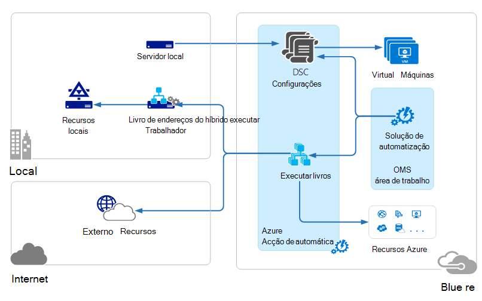
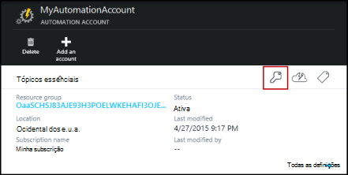
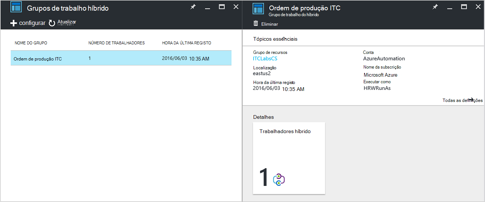
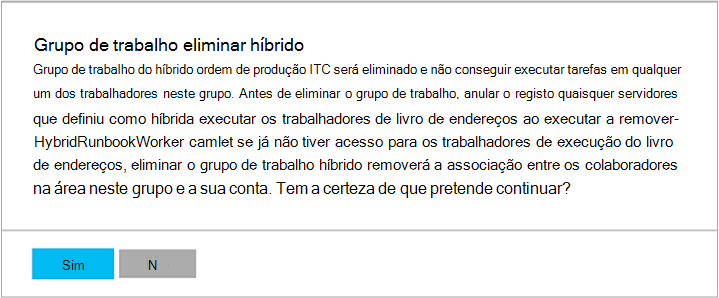

<properties
   pageTitle="Os trabalhadores de livro execuções do Azure automatização híbrido | Microsoft Azure"
   description="Este artigo fornece informações sobre como instalar e utilizar híbrido livro execuções trabalhador que é uma funcionalidade de automatização do Azure que permite-lhe executar runbooks no máquinas no Centro de dados locais."
   services="automation"
   documentationCenter=""
   authors="mgoedtel"
   manager="jwhit"
   editor="tysonn" />
<tags
   ms.service="automation"
   ms.devlang="na"
   ms.topic="article"
   ms.tgt_pltfrm="na"
   ms.workload="infrastructure-services"
   ms.date="10/14/2016"
   ms.author="bwren" />

# Trabalhadores de livro execuções do Azure automatização híbrido

Runbooks no Azure automatização não é possível aceder aos recursos no Centro de dados locais uma vez que são executadas na nuvem Azure.  A funcionalidade de trabalho de livro execuções híbrido do Azure automatização permite-lhe executar runbooks em máquinas localizadas no Centro de dados para gerir recursos locais. Os runbooks são armazenados e geridos no Azure automatização e, em seguida, entregue a uma ou mais máquinas no local.  

Esta funcionalidade é ilustrada na seguinte imagem.   

Pode designar um ou mais computadores no Centro de dados para funcionar como um trabalhador de livro execuções híbrido e executar runbooks a partir do Azure automatização.  Cada trabalhador requer o Microsoft Agent de gestão de com uma ligação para o conjunto de aplicações do Microsoft operações gestão e o ambiente de livro execuções do Azure automatização.  Conjunto de aplicações de gestão de operações só é utilizado para instalar e manter o agente de gestão e para monitorizar a funcionalidade do trabalhador.  A entrega de runbooks e a instrução de executá-los são executadas por Azure automatização.

Não existem requisitos firewall de entrada para os trabalhadores de livro execuções híbrido de suporte. O agente no computador local inicia a todas as comunicações com a automatização Azure na nuvem. Quando um livro de execuções for iniciado, Azure automatização cria uma instrução que é obtida por agente. O agente obtém, em seguida, para baixo o livro de execuções e quaisquer parâmetros antes de executá-la.  Também irá obter quaisquer [elementos](http://msdn.microsoft.com/library/dn939988.aspx) que são utilizados pelo livro de execuções a partir do Azure automatização.

>[AZURE.NOTE] Os trabalhadores de livro execuções híbrido não suportam atualmente [DSC configurações](automation-dsc-overview.md).

## Grupos de trabalho do livro execuções híbrido

Cada trabalhador de livro execuções híbrido é um membro de um grupo de trabalho de livro execuções híbrido que especificou quando instala o agente.  Um grupo, pode incluir um único agente, mas pode instalar agentes múltiplos num grupo para elevada disponibilidade.

Quando começa a um livro de execuções no livro execuções trabalhador híbrido, especifique o grupo que é executada no.  Os membros do grupo vai determinar qual trabalhador irá servir o pedido.  Não é possível especificar um determinado trabalhador.

## Requisitos de livro execuções trabalhador híbrido

Tem de designar pelo menos um computador local para executar tarefas de livro execuções híbrido.  Neste computador tem de ter o seguinte procedimento:

- Windows Server 2012 ou posterior
- Windows PowerShell 4.0 ou posterior
- Mínimo de dois núcleos e 4 GB de RAM

Tenha em atenção as seguintes recomendações para os trabalhadores de híbrido: 

- Designe vários híbrido os trabalhadores de cada grupo para elevada disponibilidade.  
- Trabalhadores híbrido podem coexistência com servidores de livro execuções do serviço de gestão de automatização ou Orchestrator do Centro de sistema.
- Considere utilizar um computador física localizado na ou perto da região da sua conta de automatização, uma vez que os dados da tarefa são enviados voltar a automatização Azure quando uma tarefa estiver concluída.

>[AZURE.NOTE] Híbrido livro execuções trabalhador versão 7.2.11136.0 atualmente, comunicar através de um servidor proxy apenas com scripts de PowerShell.  Suporte para scripts de PowerShell fluxo de trabalho estará disponível num lançamento futuro.  

### Configurar definições de proxy e a firewall

Para no local híbrido livro execuções de trabalho ligar e registe-se com o serviço do conjunto de aplicações de gestão operações (OMS) da Microsoft, tem de ter acesso ao número da porta e os URLs descritos abaixo.  Este é além das [portas e protocolos URLs necessários para o Microsoft monitorização Agent](../log-analytics/log-analytics-proxy-firewall.md#configure-proxy-and-firewall-settings-with-the-microsoft-monitoring-agent) para ligar à OMS. Se utilizar um servidor proxy para a comunicação entre o agente e o serviço OMS, terá de assegurar que os recursos adequados são acessíveis. Se utilizar uma firewall para restringir o acesso à Internet, terá de configurar a firewall para permitir o acesso. 

As informações abaixo da lista de porta e URLs que são necessários para o trabalho de livro execuções híbrido comunicar com a automatização.

- Porta: Apenas TCP 443 é necessário para acesso à Internet
- Global URL: *.azure-automation.net

Se tiver uma conta de automatização definida para uma região específica e que pretende restringir a comunicação com esse centro de dados regional, a tabela seguinte fornece o registo DNS para cada região.

|**Região**|**Registo DNS**|
|--------------|--------------|
|Sul Central (EUA)|scus-jobruntimedata-ordem de produção-su1.azure-automation.net|
|Leste dos EUA 2|eus2-jobruntimedata-ordem de produção-su1.azure-automation.net|
|Europa Ocidental|Pedimos-jobruntimedata-ordem de produção-su1.azure-automation.net|
|Europa Norte|-jobruntimedata-ordem de produção-su1.azure-automation.net|
|Canadá Central|Cc-jobruntimedata-ordem de produção-su1.azure-automation.net|
|Sudeste asiático|Mar-jobruntimedata-ordem de produção-su1.azure-automation.net|
|Índia central|CID-jobruntimedata-ordem de produção-su1.azure-automation.net|
|Japão leste|jpe-jobruntimedata-ordem de produção-su1.azure-automation.net|
|Posição sudeste Austrália|auxiliar-jobruntimedata-ordem de produção-su1.azure-automation.net|

## Instalar o trabalho de livro execuções híbrido

O procedimento que se segue descreve como instalar e configurar híbrido livro execuções trabalhador.  Executar uma vez os dois primeiros passos para o seu ambiente de automatização e, em seguida, repita os passos restantes para cada computador de trabalho.

### 1. a criar a área de trabalho do conjunto de aplicações de gestão de operações

Se ainda não tiver uma área de trabalho do conjunto de aplicações de gestão de operações, em seguida, crie um utilizando as instruções em [Configurar a área de trabalho](https://technet.microsoft.com/library/mt484119.aspx). Pode utilizar uma área de trabalho existente se já tiver um.

### 2. Adicionar solução de automatização a área de trabalho do conjunto de aplicações de gestão de operações

Soluções adicionam funcionalidade ao conjunto de aplicações de gestão de operações.  A solução de automatização adiciona funcionalidade para a automatização de Azure, incluindo o suporte para implementações livro execuções trabalhador.  Quando adiciona a solução à área de trabalho, automaticamente irá emissão para baixo de componentes de trabalho para o computador do agente que instala no próximo passo.

Siga as instruções [para adicionar uma solução através da Galeria de soluções](../log-analytics/log-analytics-add-solutions.md) para adicionar a solução de **Automatização** para a área de trabalho do conjunto de aplicações de gestão de operações.

### 3. de instalar o Microsoft agente de monitorização

O Microsoft monitorização Agent liga computadores ao conjunto de aplicações de gestão de operações.  Quando instalar o agente no seu computador no local e ligá-lo à área de trabalho, irá transferir automaticamente os componentes necessários para implementações livro execuções trabalhador.

Siga as instruções em [computadores com o Windows ligar-se para a análise de registo](../log-analytics/log-analytics-windows-agents.md) para instalar o agente no computador no local.  Pode repetir o processo para vários computadores adicionar vários trabalhadores ao seu ambiente.

Quando o agente com êxito tem ligado ao conjunto de aplicações de gestão de operações, este será listado no separador **Ligado origens** do painel de conjunto de aplicações de gestão de operações **Definições** .  Pode verificar que a solução de automatização corretamente tiver transferido o agente quando tiver uma pasta denominada **AzureAutomationFiles** em C:\Program Files\Microsoft monitorização Agent\Agent.  Para confirmar a versão do trabalhador livro execuções híbrido, pode navegar para C:\Program Files\Microsoft monitorização Agent\Agent\AzureAutomation\ e nota de \\subpasta de *versão* .   

### 4. Instale o ambiente do livro execuções e ligar a automatização do Azure

Quando adiciona um agente ao conjunto de aplicações de gestão de operações, a solução de automatização emite para baixo o módulo do PowerShell **HybridRegistration** que contém o cmdlet **HybridRunbookWorker adicionar** .  Utilize este cmdlet para instalar o ambiente do livro execuções no computador e registá-lo com a automatização Azure.

Abra uma sessão do PowerShell no modo de administrador e execute os seguintes comandos para importar o módulo.

    cd "C:\Program Files\Microsoft Monitoring Agent\Agent\AzureAutomation\<version>\HybridRegistration"
    Import-Module HybridRegistration.psd1

Em seguida, execute o cmdlet **Adicionar HybridRunbookWorker** utilizando a seguinte sintaxe:

    Add-HybridRunbookWorker –Name <String> -EndPoint <Url> -Token <String>

Pode obter as informações necessárias para este cmdlet a partir do pá **Gerir chaves** no portal do Azure.  Abra este pá clicando no ícone de chave no painel de elementos para a conta de automatização.

- **Nome** é o nome do grupo de trabalho do livro execuções híbrido. Se este grupo já existe na conta de automatização, em seguida, o computador atual é adicionado à mesma.  Se ainda não existir, em seguida, é adicionado.
- **Ponto final** é o campo de **URL** na **Gerir chaves** pá.
- **Token** é a **Chave primária de acesso** na **Gerir chaves** pá.  

Utilizar o **-verboso** mudar com **Adicionar HybridRunbookWorker** para receber informações detalhadas sobre a instalação.

### 5. instalar módulos PowerShell

Runbooks pode utilizar qualquer um das atividades e cmdlets definidos nos módulos instalados no seu ambiente de automatização do Azure.  Estes módulos não são automaticamente implementados em computadores no local no entanto, por isso tem instalar manualmente.  A exceção é o módulo Azure que é instalado por predefinição facultar o acesso aos cmdlets para todos os serviços do Azure e as atividades de automatização do Azure.

Uma vez que é o objetivo principal da funcionalidade híbrido livro execuções trabalho gerir recursos locais, provavelmente terá de instalar os módulos que estes recursos de suporte.  Pode referir-se para [Instalar o módulos](http://msdn.microsoft.com/library/dd878350.aspx) para obter informações sobre como instalar o Windows PowerShell módulos.

## Remover o trabalho de livro execuções híbrido

Pode remover um ou mais híbrido livro execuções colaboradores na área de um grupo ou pode remover do grupo, dependendo das suas necessidades.  Para remover um trabalhador de livro execuções híbrido a partir de um computador no local, abra uma sessão do PowerShell no modo de administrador e execute o seguinte comando - **Remover HybridRunbookWorker** cmdlet.  Utilizar o **-verboso** mudar para um registo detalhado do processo de remoção. 

Isto não remove o agente de monitorização da Microsoft a partir do computador, apenas a funcionalidade e a configuração da função híbrido livro execuções trabalhador.  

Para remover um grupo, tem primeiro de remover o trabalho de livro execuções híbrido de cada computador que é um membro do grupo utilizando o comando mostrado anteriormente e, em seguida, efetuar os seguintes passos para remover o grupo.  

1. Abra a conta de automatização no portal do Azure.
2. Selecione o mosaico **Híbrido grupos de trabalho** e no pá **Híbrido trabalhador grupos** , selecione o grupo que pretende eliminar.  Após selecionar o grupo específico, é apresentada a pá de propriedades do **grupo de trabalho do híbrido** .     
3. No pá propriedades para o grupo selecionado, clique em **Eliminar**.  Uma mensagem aparecer pedir para confirmar esta ação e selecione **Sim** , se tiver a certeza de que pretende continuar.    Este processo pode demorar alguns segundos para concluir e pode controlar o progresso em **notificações** a partir do menu.  

## Iniciar runbooks híbrido livro execuções trabalhador

[Iniciar um livro de execuções no Azure automatização](automation-starting-a-runbook.md) descreve os diferentes métodos para iniciar um livro de execuções.  Híbrido livro execuções trabalhador adiciona uma opção de **RunOn** onde pode especificar o nome de um grupo de trabalho do livro execuções híbrido.  Se não for especificado um grupo, em seguida, livro de execuções é obtido e execute dos trabalhadores nesse grupo.  Se esta opção não for especificada, em seguida, é executado no Azure automatização como habitualmente.

Quando começar a um livro de execuções no portal do Azure, será apresentada com a opção de **executar no** onde pode selecionar **Azure** ou **Híbrido trabalhador**.  Se selecionar **Trabalhador híbrido**, pode selecionar o grupo a partir de uma lista pendente.

Utilize o parâmetro **RunOn** poderia utilize o seguinte comando para iniciar um livro de execuções denominado teste-livro de execuções num grupo de trabalho livro execuções híbrida com o nome MyHybridGroup através do Windows PowerShell.

    Start-AzureRmAutomationRunbook –AutomationAccountName "MyAutomationAccount" –Name "Test-Runbook" -RunOn "MyHybridGroup"

>[AZURE.NOTE] O parâmetro **RunOn** foi adicionado ao cmdlet **Iniciar AzureAutomationRunbook** na versão 0.9.1 do Microsoft Azure PowerShell.  Deverá a [Transferir a versão mais recente](https://azure.microsoft.com/downloads/) se tiver antiga um instalado.  Só tem de instalar esta versão numa estação de trabalho onde que vai ser iniciar o livro de execuções do Windows PowerShell.  Não tem de instalá-lo no computador trabalhador a menos que pretenda partida runbooks nesse computador.  Atualmente não consegue iniciar um livro de execuções no livro execuções híbrido trabalhador a partir de outro livro de execuções, uma vez que isso, é necessário a versão mais recente do Azure o Powershell para estar instalada na sua conta de automatização.  A versão mais recente será atualizada automaticamente no Azure automatização e automaticamente deslocada para baixo para os trabalhadores mais rapidamente.

## Permissões de livro execuções

Runbooks em execução no livro execuções trabalhador híbrido não pode utilizar o mesmo [que é normalmente utilizado para runbooks de método de autenticação para recursos Azure](automation-configuring.md#configuring-authentication-to-azure-resources) desde ser aceder a recursos fora do Azure.  Livro de execuções quer pode fornecer a sua própria autenticação para recursos locais ou pode especificar uma conta de RunAs para fornecer um contexto de utilizador para todos os runbooks.

### Autenticação do livro execuções

Por predefinição, runbooks será executado no contexto da conta de sistema local no computador no local, para que tem de fornecer os seus próprios autenticação para recursos de que irão aceder a eles.  

Pode utilizar [credenciais](http://msdn.microsoft.com/library/dn940015.aspx) e [certificado](http://msdn.microsoft.com/library/dn940013.aspx) elementos no seu livro de execuções com os cmdlets do que lhe permitem especifique as credenciais para que possa autenticar para recursos diferentes.  O exemplo seguinte mostra uma parte de um livro de execuções reinicia um computador.  -Obtém credenciais a partir de um recurso de credenciais e o nome do computador a partir de um variável ativo e, em seguida, utilize estes valores com o cmdlet reiniciar o computador.

    $Cred = Get-AzureRmAutomationCredential -ResourceGroupName "ResourceGroup01" -Name "MyCredential"
    $Computer = Get-AzureRmAutomationVariable -ResourceGroupName "ResourceGroup01" -Name  "ComputerName"

    Restart-Computer -ComputerName $Computer -Credential $Cred

Também pode tirar partido [InlineScript](automation-powershell-workflow.md#inline-script) permitirá executar blocos de código noutro computador com credenciais especificadas pelo [parâmetro comuns PSCredential](http://technet.microsoft.com/library/jj129719.aspx).

### Conta RunAs

Em vez de ter runbooks fornecer os seus próprios autenticação para recursos locais, pode especificar uma conta de **RunAs** para um grupo de trabalho híbrido.  Pode especificar um [recurso de credenciais](automation-credentials.md) que tem acesso aos recursos locais e, todos os runbooks será executada nestas credenciais ao ser executada numa trabalhador livro execuções híbrido no grupo.  

O nome de utilizador para a credencial tem de ser dos seguintes formatos:

- domínio \ nomedeutilizador 
- username@domain
- nome de utilizador (para contas locais para o computador no local)

Utilize o seguinte procedimento para especificar uma conta de RunAs para um grupo de trabalho híbrido:

1. Crie um [recurso de credenciais](automation-credentials.md) com acesso aos recursos locais.
2. Abra a conta de automatização no portal do Azure.
2. Selecione o mosaico **Híbrido trabalhador grupos** e, em seguida, selecione o grupo.
3. Selecione **todas as definições** e, em seguida, **as definições de grupo de trabalho híbrido**.
4. Alterar a **Executar como** de **predefinido** para **personalizada**.
5. Selecione a credencial e clique em **Guardar**.

## Criar runbooks para implementações livro execuções trabalhador

Não existe nenhuma diferença na estrutura de runbooks que são executadas no Azure automatização e aquelas que são executados no livro execuções trabalhador híbrido. Runbooks que utiliza com cada serão provavelmente diferentes significativamente embora uma vez que runbooks para implementações livro execuções trabalhador normalmente irá gerir recursos locais no Centro de dados enquanto runbooks no Azure automatização normalmente gerir recursos na nuvem Azure. 

Pode editar um livro de execuções do trabalho de livro execuções híbrido no Azure automatização, mas poderá ter dificuldades se tentar testar o livro de execuções no editor.  Os módulos de PowerShell que acedem os recursos locais poderão não estar instalados no seu ambiente de automatização do Azure neste caso, o teste seria falhar.  Se instalar os módulos necessários, em seguida, livro de execuções será executada, mas não será possível aceder à recursos locais para um teste concluído.

## Resolução de problemas runbooks híbrido livro execuções trabalhador

[Saída do livro execuções e as mensagens](automation-runbook-output-and-messages.md) são enviadas para automatização Azure a partir do híbrido trabalhadores tal como faria com tarefas de livro execuções executar na nuvem.  Também pode ativar as sequências verboso e o progresso da mesma forma que faria para outros runbooks.  

Registos são armazenados localmente no cada trabalhador híbrido no C:\ProgramData\Microsoft\System Center\Orchestrator\7.2\SMA\Sandboxes.

Se o seu runbooks não estão com êxito de ligação foi efectuada e a tarefa de resumo mostra o estado **suspenso**, reveja o artigo resolução de problemas [híbrido livro execuções trabalhador: uma tarefa de livro execuções termina com o estado suspenso](automation-troubleshooting-hrw-runbook-terminates-suspended.md).   

## Relação a automatização de gestão de serviços

[Serviço de gestão de automatização (SMA)](https://technet.microsoft.com/library/dn469260.aspx) permite-lhe executar o mesmo runbooks que são suportadas pelo Azure automatização no Centro de dados locais. SMA geralmente é implementada juntamente com o Windows Azure Pack, como o Windows Azure Pack contém uma interface gráfica para gestão de SMA. Ao contrário de automatização do Azure, SMA requer uma instalação local que inclui os servidores de web API, uma base de dados para conter runbooks e SMA configuração e trabalhadores de livro execuções para executar tarefas de livro execuções do anfitrião. Automatização Azure fornece estes serviços na nuvem e requer apenas manter os trabalhadores de livro execuções híbrido no seu ambiente local.

Se for um utilizador SMA existente, pode mover o seu runbooks para Azure automatização para ser utilizado com híbrido livro execuções trabalhador com sem alterações, partindo do princípio que eles executar os seus próprios autenticação aos recursos como descrito em [Criar runbooks para implementações livro execuções trabalhador](#creating-runbooks-for-hybrid-runbook-worker).  Runbooks no SMA executar no contexto da conta de serviço do servidor de trabalho que disponibiliza a que a autenticação para o runbooks.

Pode utilizar os seguintes critérios para determinar se é mais adequada para os seus requisitos de automatização do Azure com híbrido livro execuções trabalhador ou serviço de gestão de automatização.

- SMA requer uma instalação local dos seus componentes subjacentes que estão ligadas ao Windows Azure Pack se for necessária uma interface de gestão de gráficos. Mais recursos locais serão necessárias com custos de manutenção mais elevados que Azure automatização, que só necessita de um agent instalado no livro de execuções local trabalhadores. Os agentes são geridos pelo operações de gestão de conjunto de aplicações, ainda mais diminuir os custos de manutenção.
- Automatização Azure armazena as suas runbooks na nuvem e oferece-los para os trabalhadores de livro execuções do híbrido no local. Se a política de segurança não permitir que este comportamento, deve utilizar SMA.
- SMA está incluído no Centro de sistema; e por conseguinte, precisa de uma licença de sistema Centro 2012 R2. Automatização Azure é baseada num modelo de subscrição em camadas.
- Automatização Azure tem avançadas funcionalidades como runbooks gráfica que não estão disponíveis no SMA.

## Próximos passos

- Para saber mais sobre os diferentes métodos que podem ser utilizados para iniciar um livro de execuções, consulte o artigo [Iniciar um livro de execuções na automatização do Azure](automation-starting-a-runbook.md)
- Para compreender os procedimentos diferentes para trabalhar com runbooks PowerShell e fluxo de trabalho do PowerShell no Azure automatização utilizando o editor de textual, consulte o artigo [Editar um livro de execuções na automatização do Azure](automation-edit-textual-runbook.md)

 
