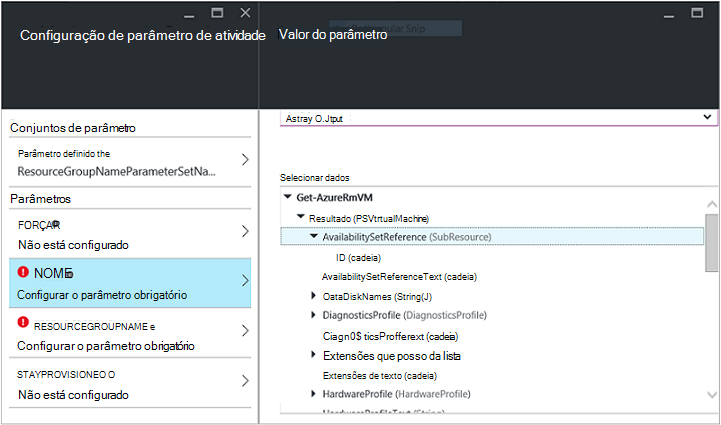

<properties
   pageTitle="Criar um módulo de integração de automatização Azure | Microsoft Azure"
   description="Tutorial que irá guiar pela utilização de criação, testar e de exemplo de módulos de integração no Azure automatização."
   services="automation"
   documentationCenter=""
   authors="mgoedtel"
   manager="jwhit"
   editor="" />

<tags
   ms.service="automation"
   ms.workload="tbd"
   ms.tgt_pltfrm="na"
   ms.devlang="na"
   ms.topic="get-started-article"
   ms.date="09/12/2016"
   ms.author="magoedte" />

# <a name="azure-automation-integration-modules"></a>Módulos de integração de automatização Azure

PowerShell é a tecnologia fundamental atrás de automatização do Azure. Uma vez Azure automatização está incorporada no PowerShell, PowerShell módulos são expansão de automatização do Azure. Neste artigo, iremos irá guiá-lo através dos detalhes da utilização do Azure automatização dos módulos PowerShell, designados de "Módulos de integração" e as melhores práticas para criar o seus próprio módulos do PowerShell para se certificar de que funcionam como módulos de integração dentro de automatização do Azure. 

## <a name="what-is-a-powershell-module"></a>O que é um módulo de PowerShell?

Um módulo de PowerShell é um grupo dos cmdlets do PowerShell como **Obter data** ou **Copiar Item**, que podem ser utilizadas da consola do PowerShell, scripts, fluxos de trabalho, runbooks e recursos de PowerShell DSC como WindowsFeature ou ficheiro, que pode ser utilizado de configurações PowerShell DSC. Todas as funcionalidades do PowerShell exposta através de cmdlets e recursos de DSC e todos os recursos do cmdlet/DSC são cópias por um módulo do PowerShell, muitos dos quais fornecidos com o PowerShell própria. Por exemplo, o cmdlet **Get-Data** faz parte de módulo Microsoft.PowerShell.Utility PowerShell e **Copiar Item** cmdlet faz parte do módulo Microsoft.PowerShell.Management PowerShell e o recurso de pacote DSC faz parte do módulo PSDesiredStateConfiguration PowerShell. Ambos estes módulos fornecidos com o PowerShell. Mas muitos PowerShell módulos não fornecidos como parte do PowerShell e, em vez disso, são distribuídos com produtos primeiros ou de terceiros, como Gestor de configuração do sistema Centro de 2012 ou pela Comunidade PowerShell vasta em locais como o PowerShell Gallery.  Os módulos são úteis porque disponibilizam tarefas complexas mais simples através da funcionalidade encapsulated.  Pode obter mais informações sobre [módulos PowerShell no MSDN](https://msdn.microsoft.com/library/dd878324%28v=vs.85%29.aspx). 

## <a name="what-is-an-azure-automation-integration-module"></a>O que é um módulo de integração de automatização do Azure?

Um módulo de integração não é muito diferente a partir de um módulo de PowerShell. Respetivo simplesmente um módulo de PowerShell que opcionalmente contém um ficheiro adicional - um ficheiro de metadados especificar um tipo de ligação do Azure automatização para ser utilizado com os cmdlets do módulo no runbooks. Opcional de ficheiro ou não, estes PowerShell módulos podem ser importados Azure automatização para tornar os respetivos cmdlets disponíveis para utilização dentro de runbooks e dos seus recursos DSC disponível para utilização no prazo de configurações DSC. Nos bastidores, Azure automatização armazena estes módulos e na tarefa de livro execuções e tempo de execução do DSC compiliation tarefa carrega-los para os areeiros Azure automatização onde são executados runbooks e configurações DSC são compiladas.  Dos recursos DSC na módulos são colocados também automaticamente no servidor de solicitação DSC de automatização, para que pode ser movidos pelo máquinas tentar aplicar as configurações de DSC.  Iremos enviar um número de Azure PowerShell módulos caixa no Azure automatização para utilizar o modo de introdução ao automatizar Azure gestão de imediato, mas pode importar facilmente módulos do PowerShell para qualquer sistema, serviço ou ferramenta que pretende integrar com o Assistente fora. 

>[AZURE.NOTE] Determinadas módulos são enviados como "módulos globais" no serviço de automatização. Estes módulos globais estão disponíveis para a caixa de quando criar uma conta de automatização e podemos atualizá-las, por vezes, que encaminha-los automaticamente à sua conta de automatização. Se não quiser que sejam atualizados automaticamente, pode sempre importar o mesmo módulo de si próprio e que terá precedência sobre a versão de módulo global desse módulo que fornecidos no serviço. 

O formato que irá importar um pacote de integração com o módulo é um ficheiro com o mesmo nome que o módulo e uma extensão. zip comprimido. Contém o módulo Windows PowerShell e quaisquer ficheiros de suporte, incluindo um ficheiro de manifesto (.psd1) se o módulo tiver um.

Se o módulo deve conter um tipo de ligação do Azure automatização, também tem de conter um ficheiro com o nome *<ModuleName>*-Automation.json que especifica as propriedades de tipo de ligação. Este é um ficheiro de json colocado dentro da pasta de módulo do seu ficheiro comprimido. zip e que contém os campos de "ligação" o que é necessário para se ligar ao sistema ou serviço que representa o módulo. Isto irá conclui criar um tipo de ligação no Azure automatização. Tipos de utilizar este ficheiro que pode definir nomes de campo, e se os campos devem ser encriptada e / ou opcional, para o tipo de ligação do módulo. Um modelo no formato de ficheiro json é o seguinte:

```
{ 
   "ConnectionFields": [
   {
      "IsEncrypted":  false,
      "IsOptional":  false,
      "Name":  "ComputerName",
      "TypeName":  "System.String"
   },
   {
      "IsEncrypted":  false,
      "IsOptional":  true,
      "Name":  "Username",
      "TypeName":  "System.String"
   },
   {
      "IsEncrypted":  true,
      "IsOptional":  false,
      "Name":  "Password",
   "TypeName":  "System.String"
   }],
   "ConnectionTypeName":  "DataProtectionManager",
   "IntegrationModuleName":  "DataProtectionManager"
}
```

Se tiver implementado automatização de gestão de serviços e criada pacotes módulos de integração para sua runbooks de automatização, este deverá ter um aspeto muito familiar para si. 


## <a name="authoring-best-practices"></a>Melhores práticas de criação

Só porque integração módulos são essencialmente PowerShell módulos, que não significa que não temos um conjunto de práticas para criação-los. Ainda existe um número de elementos, que recomendamos que considere durante a criação de um módulo do PowerShell, para o tornar mais úteis no Azure automatização. Algumas destas estão Azure automatização específicos e algumas páginas são úteis apenas para tornar os módulos funciona bem no fluxo de trabalho do PowerShell, independentemente da permissão ou não estiver a utilizar o automatização. 

1. Incluir um resumo, descrição e ajudam URI para cada cmdlet no módulo. No PowerShell, pode definir determinadas informações de ajuda para cmdlets para permitir que o utilizador recebe obter ajuda sobre como utilizá-los com o cmdlet **Get-Help** . Por exemplo, eis como pode definir um resumo e ajuda URI para um módulo de PowerShell escrito num ficheiro .psm1.<br>  

    ```
    <#
        .SYNOPSIS
         Gets all outgoing phone numbers for this Twilio account 
    #>
    function Get-TwilioPhoneNumbers {
    [CmdletBinding(DefaultParameterSetName='SpecifyConnectionFields', `
    HelpUri='http://www.twilio.com/docs/api/rest/outgoing-caller-ids')]
    param(
       [Parameter(ParameterSetName='SpecifyConnectionFields', Mandatory=$true)]
       [ValidateNotNullOrEmpty()]
       [string]
       $AccountSid,

       [Parameter(ParameterSetName='SpecifyConnectionFields', Mandatory=$true)]
       [ValidateNotNullOrEmpty()]
       [string]
       $AuthToken,

       [Parameter(ParameterSetName='UseConnectionObject', Mandatory=$true)]
       [ValidateNotNullOrEmpty()]
       [Hashtable]
       $Connection
    )

    $cred = CreateTwilioCredential -Connection $Connection -AccountSid $AccountSid -AuthToken $AuthToken

    $uri = "$TWILIO_BASE_URL/Accounts/" + $cred.UserName + "/IncomingPhoneNumbers"
    
    $response = Invoke-RestMethod -Method Get -Uri $uri -Credential $cred

    $response.TwilioResponse.IncomingPhoneNumbers.IncomingPhoneNumber
    }
    ```
<br> 
Fornecer apenas esta informação não apresentará esta ajuda utilizando o cmdlet de **Obter ajuda** na consola do PowerShell,-lo também serão expor esta funcionalidade ajuda dentro de automatização do Azure, por exemplo, quando inserir atividades durante a criação de livro execuções. Clicar em "Ver ajuda detalhada" será aberta a ajuda URI no outro separador do browser que utiliza para aceder a automatização Azure.<br>
2. Se for executado o módulo relativamente a um sistema remoto, um. Deve conter um ficheiro de metadados de integração com o módulo que define as informações necessárias para ligar a esse sistema remoto, que significa que o tipo de ligação. b. Cada cmdlet no módulo deverá conseguir tirar num objeto de ligação (uma instância desse tipo de ligação) como um parâmetro.  
    Cmdlets no módulo tornam-se mais fácil de utilizar no Azure automatização se permitir prisma um objeto com os campos do tipo de ligação como um parâmetro para o cmdlet. Neste modo como os utilizadores não tem de mapear parâmetros do elemento de ligação para parâmetros correspondentes o cmdlet de cada vez que um cmdlet de chamadas. Com base no livro execuções exemplo acima, utiliza um activo de ligação Twilio denominado CorpTwilio para aceder a Twilio e voltar a todos os números de telefone na conta.  Repare como é mapear os campos da ligação para os parâmetros do cmdlet?<br>

    ```
    workflow Get-CorpTwilioPhones
    {
      $CorpTwilio = Get-AutomationConnection -Name 'CorpTwilio'
    
      Get-TwilioPhoneNumbers 
        -AccountSid $CorpTwilio.AccountSid  
        -AuthToken $CorptTwilio.AuthToken
    }
    ```
<br>
Uma forma mais fácil e melhor abordagem isto é diretamente a passar o objeto de ligação para o cmdlet-

    ```
    workflow Get-CorpTwilioPhones
    {
      $CorpTwilio = Get-AutomationConnection -Name 'CorpTwilio'

      Get-TwilioPhoneNumbers -Connection $CorpTwilio
    }
    ```
<br>
Pode ativar o comportamento da seguinte forma para o seu cmdlets, permitindo-lhes aceitar um objeto de ligação diretamente como um parâmetro, em vez de apenas os campos de ligação para os parâmetros. Normalmente, irá querer um parâmetro definido para cada um, para que um utilizador não utilizar o Azure automatização pode ligar a sua cmdlets sem construir um hashtable para funcionar como o objeto de ligação. Conjunto de parâmetro **SpecifyConnectionFields** é utilizado para transmitir a ligação de propriedades do campo um a um. **UseConnectionObject** permite-lhe passar a ligação reta através de. Como pode ver, permite que o cmdlet enviar TwilioSMS no [módulo Twilio PowerShell](https://gallery.technet.microsoft.com/scriptcenter/Twilio-PowerShell-Module-8a8bfef8) prisma das duas formas: 

    ```
    function Send-TwilioSMS {
      [CmdletBinding(DefaultParameterSetName='SpecifyConnectionFields', `
      HelpUri='http://www.twilio.com/docs/api/rest/sending-sms')]
      param(
         [Parameter(ParameterSetName='SpecifyConnectionFields', Mandatory=$true)]
         [ValidateNotNullOrEmpty()]
         [string]
         $AccountSid,

         [Parameter(ParameterSetName='SpecifyConnectionFields', Mandatory=$true)]
         [ValidateNotNullOrEmpty()]
         [string]
         $AuthToken,

         [Parameter(ParameterSetName='UseConnectionObject', Mandatory=$true)]
         [ValidateNotNullOrEmpty()]
         [Hashtable]
         $Connection

       )
    }
    ```
<br>
3. Defina o tipo de saída para todos os cmdlets no módulo. Definir um tipo de saída para um cmdlet permite que o IntelliSense para o ajudar a determinar as propriedades de saída do cmdlet, para utilizar durante a criação de estrutura. É especialmente útil durante a automatização livro execuções gráficas criação e onde dados de conhecimento da estrutura tempo são fundamental para uma experiência de utilizador fácil com o seu módulo.<br> <br> Este passo é semelhante à funcionalidade "escrever com antecedência" de saída de um cmdlet no ISE do PowerShell sem ter de executá-la.<br> <br>
4. Cmdlets no módulo não deverá demorar tipos de objeto complexas para parâmetros. Fluxo de trabalho do PowerShell é diferente do PowerShell, que armazena tipos complexos no formulário. Tipos primitivos irão permanecer como primitivos, mas são convertidos tipos complexos as respectivas versões, que são essencialmente matrizes de propriedades. Por exemplo, se tiver utilizado o cmdlet **Get-Process** num livro de execuções (ou um fluxo de trabalho do PowerShell para essa questão), esta devolve um objeto do tipo [Deserialized.System.Diagnostic.Process], não é o tipo de [System.Diagnostic.Process] esperado. Este tipo tem os mesmos propriedades, como o tipo de que não sejam serialização, mas nenhum dos métodos. E se tentar transmitir este valor como um parâmetro para um cmdlet, onde o cmdlet espera um valor de [System.Diagnostic.Process] para este parâmetro, vai receber a seguinte mensagem de erro: *não é possível processar transformação argumento num parâmetro 'process'. Erro: "não é possível converter o valor de"System.Diagnostics.Process (CcmExec)"tipo"Deserialized.System.Diagnostics.Process"escrever"System.Diagnostics.Process".*   Este é porque existe correspondência entre o tipo de [System.Diagnostic.Process] esperado e o tipo de [Deserialized.System.Diagnostic.Process] determinado. A forma à volta deste problema é garantir que os cmdlets do seu módulo não têm tipos complexos para parâmetros. Eis de forma incorreta fazê-lo.

    ```
    function Get-ProcessDescription {
      param (
            [System.Diagnostic.Process] $process
      )
      $process.Description
    }
    ``` 
<br>
E esta é a forma à direita, tendo numa primitiva que pode ser utilizada pelo cmdlet para captar o objeto complexo e utilizá-lo. Uma vez que executem os cmdlets no contexto do PowerShell, não PowerShell fluxo de trabalho, dentro do cmdlet $process torna-se o tipo de [System.Diagnostic.Process] correto.  

    ```
    function Get-ProcessDescription {
      param (
            [String] $processName
      )
      $process = Get-Process -Name $processName

      $process.Description
    }
    ```
<br>
Elementos de ligação no runbooks são hashtables, que são um tipo complexo, e ainda estes hashtables parecer possam ser transmitidos cmdlets para os respetivos – parâmetro de ligação na perfeição, com exceção não cast. Tecnicamente, alguns tipos de PowerShell podem corretamente matiz, a partir do seu formulário série para o seu formato e, consequentemente, podem ser passados para cmdlets para aceitar o que não sejam tipo de parâmetros. Hashtable é um dos seguintes procedimentos. É possível para os tipos de um autor de módulo definido ser implementada de uma forma que corretamente pode serialização, assim, mas existem algumas concessões para fazer. O tipo de tem de ter um construtor predefinido, tem todas as respectivas propriedades públicas e ter um PSTypeConverter. No entanto, para tipos de já definido que não pertençam o autor do módulo, não existe nenhuma forma de "corrigir"-los, por conseguinte, a recomendação para evitar tipos complexos para parâmetros juntos. Criação de livro execuções Sugestão: se para alguns motivo suas necessidades cmdlets para tirar um parâmetro de tipo complexo, ou estiver a utilizar outra pessoa módulo que requer um parâmetro de tipo complexo, a solução no fluxo de trabalho do PowerShell runbooks e PowerShel fluxos de trabalho no local PowerShell, é moldar o cmdlet que gera o tipo de complexo e o cmdlet que consome o tipo de complexo a mesma atividade InlineScript. Uma vez que InlineScript executa os seus conteúdos como PowerShell em vez de fluxo de trabalho do PowerShell, o cmdlet gerar o tipo de complexo seria produzir esse tipo correto, não o tipo de complexo.
5. Tornar todos os cmdlets no módulo sem estado. PowerShell fluxo de trabalho é executado cada cmdlet denominado no fluxo de trabalho numa sessão de diferentes. Isto significa que não irá funcionar qualquer cmdlets que dependem de estado da sessão criado / modificado por outros cmdlets no mesmo módulo no fluxo de trabalho do PowerShell runbooks.  Eis um exemplo que não deve efetuar.

    ```
    $globalNum = 0
    function Set-GlobalNum {
       param(
           [int] $num
       )
      
       $globalNum = $num
    }
    function Get-GlobalNumTimesTwo {
       $output = $globalNum * 2
     
       $output
    }
    ```
<br>
6. O módulo deve estar totalmente contido num pacote Xcopy conseguir. Uma vez que módulos de automatização do Azure são distribuídos para areeiros a automatização quando precisar de executar runbooks, precisam de trabalhar independentemente do anfitrião do que são executados em. O que significa que está que deverá conseguir para código postal para cima o pacote do módulo, movê-la para qualquer outro anfitrião com a versão de PowerShell do mesmo ou mais recente e têm-funcionar como normal quando importados para o ambiente do PowerShell do anfitrião. Ordem para que deverá acontecer, o módulo não deve depender em quaisquer ficheiros fora da pasta de módulo (a pasta que obtém compactada para cima quando importar para o Azure automatização) ou em quaisquer definições do registo exclusivos num sistema anfitrião, como aqueles definido pela instalação de um produto. Se não for seguida esta prática recomendada, o módulo não será poderão ser utilizado no Azure automatização.  

## <a name="next-steps"></a>Próximos passos

- Para começar a trabalhar com runbooks de fluxo de trabalho do PowerShell, consulte o artigo [meu livro de execuções de fluxo de trabalho de PowerShell primeiro](automation-first-runbook-textual.md)
- Para saber mais sobre a criação de módulos PowerShell, consulte o artigo [escrever um módulo do Windows PowerShell](https://msdn.microsoft.com/library/dd878310%28v=vs.85%29.aspx)