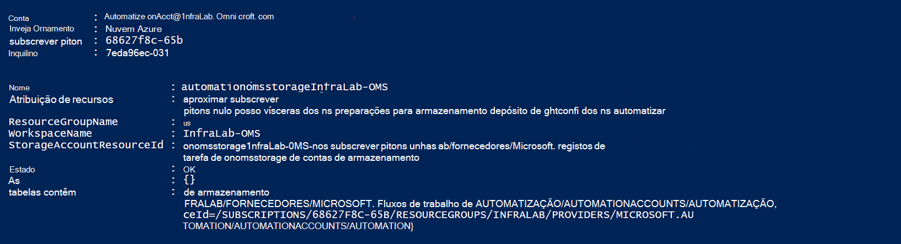

<properties
    pageTitle="Reencaminhar estado da tarefa e fluxos de trabalho a partir de automatização Log Analytics (OMS) | Microsoft Azure"
    description="Este artigo demonstra como enviar estado da tarefa e livro execuções fluxos de trabalho para gestão e de análise de registo do conjunto de aplicações do Microsoft operações gestão para a prestação conhecimentos aprofundados adicionais."
    services="automation"
    documentationCenter=""
    authors="MGoedtel"
    manager="jwhit"
    editor="tysonn" />
<tags
    ms.service="automation"
    ms.devlang="na"
    ms.topic="article"
    ms.tgt_pltfrm="na"
    ms.workload="infrastructure-services"
    ms.date="09/22/2016"
    ms.author="magoedte" />

# Reencaminhar estado da tarefa e fluxos de trabalho a partir de automatização para o registo de análise (OMS)

Automatização pode enviar as livro execuções sequências de estado e de projeto de tarefa para a área de trabalho de análise de registo do conjunto de aplicações de gestão de operações de Microsoft (OMS).  Enquanto o pode ver estas informações no portal do Azure ou com o PowerShell ao estado da tarefa individuais ou todas as tarefas de uma determinada conta de automatização, nada avançadas para suportar os seus requisitos operacionais requer que criar scripts de PowerShell personalizados.  Agora com o registo Anaytics, pode:

- Obter conhecimentos aprofundados no seus trabalhos de automatização 
- Acionar um e-mail ou um alerta com base no seu estado da tarefa livro execuções (por exemplo, falha ou suspensa) 
- Escrever consultas avançadas nos seus fluxos de trabalho 
- Correlacionar tarefas em contas de automatização 
- Visualizar o histórico de tarefa ao longo do tempo     

## Pré-requisitos e considerações de implementação

Para começar a enviar os registos de automatização para a análise de registo, tem de ter o seguinte procedimento:

1. Uma subscrição do OMS. Para obter informações adicionais, consulte o artigo [começar a trabalhar com a análise de registo](../log-analytics/log-analytics-get-started.md).  

    >[AZURE.NOTE]A área de trabalho OMS e a conta de Automatização precisam de ser na mesma subscrição do Azure para que esta configuração funcionar corretamente. 
  
2. Uma [conta de armazenamento do Windows Azure](../storage/storage-create-storage-account.md).  
   
    >[AZURE.NOTE]A conta de armazenamento *tem* de ser na mesma região como a conta de automatização. 
 
3. Azure PowerShell com a versão 1.0.8 ou mais recente dos cmdlets informações operacional. Para obter informações sobre este lançamento e como instalar, consulte o artigo [como instalar e configurar o Azure PowerShell](../powershell-install-configure.md).
4. Azure diagnóstico e registo Analytics PowerShell.  Para obter mais informações sobre este lançamento e como instalar, consulte o artigo [Azure diagnóstico e registo de análise](https://www.powershellgallery.com/packages/AzureDiagnosticsAndLogAnalytics/0.1).  
5. Transferir o script do PowerShell **Enable-AzureDiagnostics.ps1** a partir da [Galeria do PowerShell](https://www.powershellgallery.com/packages/Enable-AzureDiagnostics/1.0/DisplayScript). Este script irá configurar o seguinte procedimento:
 - Uma conta de armazenamento para manter os dados de estado e fluxo de trabalho de livro execuções para uma conta de automatização que especificar.
 - Active a recolha de dados da sua conta de automatização armazená-la numa conta de armazenamento de Blobs do Azure no formato JSON.
 - Configure a recolha de dados da sua conta de armazenamento de BLOBs para OMS Log Analytics.
 - Ative a solução de análise de registo de automatização a área de trabalho OMS.   

O script **Ativar AzureDiagnostics.ps1** requer seguintes parâmetros durante a execução:

- *AutomationAccountName* - o nome da sua conta de automatização
- *LogAnalyticsWorkspaceName* - no nome da área de trabalho OMS

Para localizar os valores para *AutomationAccountName*, no portal do Azure, selecione a sua conta de automatização do pá a **conta de automatização** e selecione **todas as definições**.  A partir do pá **todas as definições** , em **Definições da conta** , selecione **Propriedades**.  No pá **Propriedades** , pode anotar estes valores.  .

## Integração com o registo de análise de configuração

1. No seu computador, inicie o **Windows PowerShell** no ecrã **Iniciar** .  
2. A partir da shell de linha de comandos do PowerShell, navegue para a pasta que contém o script que transferiu e executá-la alterando os valores para os parâmetros *- AutomationAccountName* e *- LogAnalyticsWorkspaceName*.

    >[AZURE.NOTE] Será pedido para autenticar com Azure depois de executar o script.  **Tem** de iniciar a sessão com uma conta que é um membro da função Admins de subscrição e o administrador de cocriação da subscrição.   
    
        .\Enable-AzureDiagnostics -AutomationAccountName <NameofAutomationAccount> `
        -LogAnalyticsWorkspaceName <NameofOMSWorkspace> `

3. Depois de executar este script deverá ver registos no registo de análise cerca de 30 minutos depois de novos dados diagnóstico destina-se ao armazenamento.  Se registos não estão disponíveis depois desta vez consulte a secção Resolução de problemas na [ficheiros JSON armazenamento de BLOBs](../log-analytics/log-analytics-azure-storage-json.md#troubleshooting-configuration-for-azure-diagnostics-written-to-blob-in-json).

### Verificar a configuração

Para confirmar que o script foi configurado sua conta de automatização e OMS wokspace com êxito, pode executar os seguintes passos no PowerShell.  Antes de o fazer, para localizar que os valores para o seu nome de área de trabalho OMS e o nome do grupo de recursos, a partir do portal do Azure, navegue para a análise de registo (OMS) e no pá registo Analytics (OMS), observe o valor de **nome** e o **Grupo de recursos**.   irá Utilizamos estes dois valores quando podemos Verifique a configuração na área de trabalho OMS utilizando o cmdlet do PowerShell [Get-AzureRmOperationalInsightsStorageInsight](https://msdn.microsoft.com/library/mt603567.aspx).

1.  A partir do portal do Azure, navegue para a pesquisa para a conta de armazenamento seguintes, que utiliza a Convenção de nomenclatura - *AutomationAccountNameomsstorage*e contas de armazenamento.  Depois de um livro de execuções tarefa estiver concluída, brevemente posteriormente deverá ver dois contentores do Blob criados - **informações-registos-joblogs** e **informações-registos-jobstreams**.  

2.  A partir do PowerShell, execute o seguinte código de PowerShell, alterando os valores para os parâmetros **ResourceGroupName** e **NomeDaÁreaDeTrabalho** que copiou ou indicadas anterior.  

    Início de sessão AzureRmAccount Get-AzureRmSubscription - SubscriptionName 'SubscriptionName' | Conjunto AzureRmContext Get-AzureRmOperationalInsightsStorageInsight - ResourceGroupName "OMSResourceGroupName" '-Área de trabalho "OMSWorkspaceName" 

    Isto irá devolver o conhecimentos aprofundados armazenamento para a área de trabalho OMS especificado.  Pretendemos confirmar a visão de armazenamento para a conta de automatização que podemos especificados anteriormente existe e o objeto de **Estado** mostra um valor de **OK**.  .

## Análise de registos

Automatização cria dois tipos de registos no repositório de OMS.

### Registos de tarefa

Propriedade | Descrição|
----------|----------|
Tempo | Data e hora quando a tarefa de livro execuções executada.|
resourceId | Especifica o tipo de recurso no Azure.  Para a automatização, o valor é a conta de automatização associada livro de execuções.|
operationName | Especifica o tipo de operação executado no Azure.  Para automatização, o valor será tarefa.|
resultType | O estado da tarefa livro execuções.  Valores possíveis são: -Iniciado -Parado -Suspensa -Falha -Foi concluída com êxito|
resultDescription | Descreve o estado de resultado de tarefa de livro execuções.  Valores possíveis são: -Trabalho for iniciado -Falha na tarefa -Tarefa concluída|
CorrelationId | GUID que é o Id de correlação da tarefa de livro execuções.|
Categoria | Classificação do tipo de dados.  Automatização, o valor é JobLogs.|
RunbookName | O nome do livro de execuções.|
JobId | GUID que é o Id da tarefa livro execuções.|
Autor da chamada |  Quem iniciou a operação.  Valores possíveis são um endereço de e-mail ou o sistema para tarefas agendadas.|

### Fluxos de trabalho
Propriedade | Descrição|
----------|----------|
Tempo | Data e hora quando a tarefa de livro execuções executada.|
resourceId | Especifica o tipo de recurso no Azure.  Para a automatização, o valor é a conta de automatização associada livro de execuções.|
operationName | Especifica o tipo de operação executado no Azure.  Para automatização, o valor será tarefa.|
resultType | O estado da tarefa livro execuções.  Valores possíveis são: -Em curso|
resultDescription | Inclui a sequência de saída do livro de execuções.|
CorrelationId | GUID que é o Id de correlação da tarefa de livro execuções.|
Categoria | Classificação do tipo de dados.  Automatização, o valor é JobStreams.|
RunbookName | O nome do livro de execuções.|
JobId | GUID que é o Id da tarefa livro execuções.|
Autor da chamada | Quem iniciou a operação.  Valores possíveis são um endereço de e-mail ou o sistema para tarefas agendadas.| 
StreamType | O tipo de fluxo de trabalho. Valores possíveis são: -Progresso -Resultado -Aviso -Erro -Depurar -Verboso|

## Ver automatização registos na análise de registo 

Agora que tiver iniciado enviar os registos de tarefa de automatização para a análise de registo, vamos ver o que pode fazer com estes registos no interior OMS.   

### Enviar uma mensagem de e-mail quando uma tarefa de livro execuções falha ou suspender 

Um dos nossos clientes superior pede destina-se a capacidade enviar uma mensagem de e-mail ou um texto quando algo correr mal com uma tarefa de livro execuções.   

Para criar uma regra de alerta, comece por criar uma pesquisa de registo para que os registos de tarefa de livro execuções deverá chamar o alerta.  O botão de **alerta** , em seguida, estarão disponível para que possa criar e configurar a regra de alerta.

1.  Na página Descrição geral de OMS, clique em **Registo de pesquisa**.
2.  Criar uma consulta de pesquisa de registo para o alerta escrevendo o seguinte procedimento no campo de consulta: `Category=JobLogs (ResultType=Failed || ResultType=Suspended)`.  Também pode agrupar pelo RunbookName utilizando: `Category=JobLogs (ResultType=Failed || ResultType=Suspended) | measure Count() by RunbookName_s`.   
  
    Se configurou registos de mais do que uma conta de automatização ou de subscrição para a área de trabalho, também poderá estar interessado agrupar os alertas pela subscrição ou a conta de automatização.  Nome da conta automatização pode ser derivado de campo de recurso na pesquisa de JobLogs.  

3.  Clique em **alerta** na parte superior da página para abrir o ecrã de **Adicionar regra de alerta** .  Para obter mais detalhes sobre as opções para configurar o alerta, consulte o artigo [alertas no registo de análise](../log-analytics/log-analytics-alerts.md#creating-an-alert-rule).

### Localizar todas as tarefas que tem concluído com erros 

Para além de alertar com base fora de falhas, provavelmente gostaria de saber quando uma tarefa de livro execuções tem teve um erro que não termina (PowerShell produz uma sequência de um erro, mas que não termina erros não fazer com que a tarefa para suspender ou falhar).    

1. No portal do OMS, clique em **Registo de pesquisa**.
2. No campo de consulta, escreva `Category=JobStreams StreamType_s=Error | measure count() by JobId_g` e, em seguida, clique em **Procurar**.

### Fluxos de trabalho de vista para uma tarefa  

Quando estiver a depurar uma tarefa, também poderá querer analisar os fluxos de trabalho.  A consulta abaixo mostra todas as sequências para uma única tarefa com GUID 2ebd22ea-e05e-4eb9 - 9d 76-d73cbd4356e0:   

`Category=JobStreams JobId_g="2ebd22ea-e05e-4eb9-9d76-d73cbd4356e0" | sort TimeGenerated | select ResultDescription` 

### Ver estado da tarefa histórico 

Por fim, poderá precisar de visualizar o histórico de tarefa ao longo do tempo.  Pode utilizar esta consulta para procurar o estado dos seus trabalhos ao longo do tempo. 

`Category=JobLogs NOT(ResultType="started") | measure Count() by ResultType interval 1day`  
   

## Resumo

Ao enviar os dados de estado e sequência da tarefa de automatização para a análise de registo, pode obter uma melhor visão o estado dos seus trabalhos de automatização ao configurar alertas para notificá-lo quando existe um problema e dashboards personalizados com consultas avançadas para visualizar os resultados da sua livro execuções, livro execuções estado da tarefa e outros indicadores chaves relacionados ou métricas.  Isto irá ajudar a fornecer maior visibilidade operacional e incidentes de endereço mais rápidos.  

## Próximos passos

- Para saber mais sobre como construir consultas de pesquisa diferente e rever os registos de tarefa de automatização com a análise de registo, consulte [pesquisas de registo no registo de análise](../log-analytics/log-analytics-log-searches.md)
- Para compreender como criar e obter o resultado e mensagens de erro de runbooks, consulte o artigo [saída do livro execuções e mensagens](automation-runbook-output-and-messages.md) 
- Para saber mais sobre a execução do livro execuções, como monitorizar a livro execuções tarefas e outros detalhes técnicos, consulte o artigo [controlar uma tarefa de livro execuções](automation-runbook-execution.md)
- Para saber mais sobre a análise de registo OMS e origens de dados de coleções de sites, consulte o artigo [Azure recolher dados de armazenamento na descrição geral do registo de análise](../log-analytics/log-analytics-azure-storage.md)