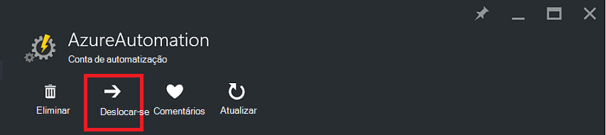

<properties
   pageTitle="Migrar contas de automatização e recursos | Microsoft Azure"
   description="Este artigo descreve como mover uma conta de automatização no Azure automatização e recursos associados a partir de uma subscrição para outra."
   services="automation"
   documentationCenter=""
   authors="MGoedtel"
   manager="jwhit"
   editor="tysonn" />
<tags
   ms.service="automation"
   ms.devlang="na"
   ms.topic="article"
   ms.tgt_pltfrm="na"
   ms.workload="infrastructure-services"
   ms.date="07/07/2016"
   ms.author="magoedte" />

# <a name="migrate-automation-account-and-resources"></a>Migrar contas de automatização e recursos

Para contas de automatização e respectivos recursos associados (ou seja, recursos, runbooks, módulos, etc.) que criou no portal do Azure e pretender migrar de um grupo de recursos para outro ou de uma subscrição para outro, consegui-lo facilmente com a funcionalidade [Mover recursos](../resource-group-move-resources.md) disponível no portal do Azure. No entanto, antes de prosseguir com esta ação, deverá pela primeira vez rever a seguinte [lista de verificação antes de passar recursos](../resource-group-move-resources.md#Checklist-before-moving-resources) e, para além disso, com a lista por baixo de específico de automatização.   

1.  O grupo de subscrição/recursos de destino tem de ser na mesma região como a origem.  O que significa que, não podem ser movidas contas de automatização através de regiões.
2.  Quando mover recursos (por exemplo, runbooks, tarefas, etc.), estão bloqueadas para a duração da operação de grupo de origem e o grupo de destino. Escrever e operações de eliminar os grupos bloqueados até a mudança estar concluída.  
3.  Qualquer runbooks ou variáveis de referenciam de um recurso ou subscrição ID da subscrição existente terão de ser actualizado depois de concluir a migração.   


>[AZURE.NOTE] Esta funcionalidade não suporta mover recursos de automatização clássica.

## <a name="to-move-the-automation-account-using-the-portal"></a>Para mover a conta de automatização através do portal

1. A partir da sua conta de automatização, clique em **Mover** no topo da pá.<br> <br> 
2. No pá **Mover recursos** , tenha em atenção que apresenta os recursos relacionados com a sua conta de automatização e o grupo de recursos (s).  Selecione a **subscrição** e o **grupo de recursos** a partir de listas pendentes, ou selecione a opção para **criar um novo grupo de recursos** e introduza um novo nome de grupo de recursos no campo fornecido.  
3. Rever e selecione a caixa de verificação para confirmar a *Compreender ferramentas e scripts terá de ser atualizadas para utilizar o novo recurso IDs depois de recursos tem sido movidos* e, em seguida, clique em **OK**.<br> <br>   

Esta ação irá demorar alguns minutos para concluir.  Em **notificações**, será apresentada com o estado cada ação que ocorre - validação, migração e, em seguida, por fim quando estiver concluída.     

## <a name="to-move-the-automation-account-using-powershell"></a>Para mover a conta de automatização através do PowerShell

Para mover os recursos de automatização existentes para outra subscrição ou grupo de recursos, utilize o cmdlet **Get-AzureRmResource** para obter a conta de automatização específica e, em seguida, **Mover AzureRmResource** cmdlet para executar o comando mover.

O primeiro exemplo mostra como mover uma conta de automatização para um novo grupo de recursos.

   ```
    $resource = Get-AzureRmResource -ResourceName "TestAutomationAccount" -ResourceGroupName "ResourceGroup01"
    Move-AzureRmResource -ResourceId $resource.ResourceId -DestinationResourceGroupName "NewResourceGroup"
   ``` 

Depois de executar o exemplo acima de código, ser-lhe-á pedido para confirmar que pretende efetuar esta ação.  Assim que clique em **Sim** e permitir que o script continuar, não receberá quaisquer notificações enquanto está a executar a migração.  

Para mover para uma nova subscrição, inclua um valor para o parâmetro *DestinationSubscriptionId* .

   ```
    $resource = Get-AzureRmResource -ResourceName "TestAutomationAccount" -ResourceGroupName "ResourceGroup01"
    Move-AzureRmResource -ResourceId $resource.ResourceId -DestinationResourceGroupName "NewResourceGroup" -DestinationSubscriptionId "SubscriptionId"
   ``` 

Tal como acontece com no exemplo anterior, vai ser-lhe para confirmar a mover.  

## <a name="next-steps"></a>Próximos passos

- Para obter mais informações sobre como mover recursos para o novo grupo de recursos ou a subscrição, consulte o artigo [Mover recursos para novo grupo de recursos ou subscrição](../resource-group-move-resources.md)
- Para mais informações sobre o controlo de acesso baseado em funções no Azure automatização, consulte [controlo de acesso baseado em funções no Azure automatização](../automation/automation-role-based-access-control.md).
- Para saber mais sobre os cmdlets do PowerShell para gerir a sua subscrição, consulte o artigo [Utilizar o PowerShell Azure com o Gestor de recursos](../powershell-azure-resource-manager.md)
- Para saber mais sobre funcionalidades portais para gerir a sua subscrição, consulte o artigo [utilizar o Portal do Azure para gerir os recursos](../azure-portal/resource-group-portal.md). 
