<properties 
   pageTitle="Controlo de acesso baseado em funções no Azure automatização | Microsoft Azure"
   description="Controlo de acesso baseado em funções (RBCA) permite a gestão de acesso para recursos Azure. Este artigo descreve como configurar o RBAC no Azure automatização."
   services="automation"
   documentationCenter=""
   authors="mgoedtel"
   manager="jwhit"
   editor="tysonn"
   keywords="automatização rbac, controlo de acesso, azure rbac baseado em funções" />
<tags 
   ms.service="automation"
   ms.devlang="na"
   ms.topic="get-started-article"
   ms.tgt_pltfrm="na"
   ms.workload="infrastructure-services"
   ms.date="09/12/2016"
   ms.author="magoedte;sngun"/>

# Controlo de acesso baseado em funções no Azure automatização

## Controlo de acesso baseado em funções

Controlo de acesso baseado em funções (RBCA) permite a gestão de acesso para recursos Azure. Utilizar [RBAC](../active-directory/role-based-access-control-configure.md), pode segregar direitos dentro da sua equipa e conceder apenas a quantidade de acesso a utilizadores, grupos e aplicações que são necessários para executarem as tarefas. Pode ser concedido acesso baseado em funções aos utilizadores utilizando o Azure portal, ferramentas de linha de comandos Azure ou APIs de gestão do Azure.

## RBAC nas contas de automatização

No Azure automatização, acesso é concedido através da atribuição à função RBAC apropriada a utilizadores, grupos e aplicações no âmbito da conta de automatização. Seguem-se as funções incorporadas suportadas por uma conta de automatização:  

|**Função** | **Descrição** |
|:--- |:---|
| Proprietário | A função de proprietário permite o acesso a todos os recursos e ações numa conta de automatização incluindo facultar o acesso a outros utilizadores, grupos e aplicações para gerir a conta de automatização. |
| Contribuinte | A função Contribuinte permite-lhe gerir tudo exceto modificar permissões de acesso de outro utilizador para uma conta de automatização. |
| Leitor | A função de leitor permite-lhe ver todos os recursos numa conta de automatização, mas não pode efetuar as alterações.|
| Operador de automatização | A função de operador de automatização permite-lhe efetuar tarefas operacionais avançadas, como iniciar, parar, suspender, retomar e agendar tarefas. Esta função é útil se quiser proteger os recursos da conta de automatização como recursos de credenciais e runbooks seja visualizado ou modificados, mas permitir que os membros da sua organização executar estes runbooks. |
| Administrador de acesso de utilizadores | A função de administrador de acesso do utilizador permite-lhe gerir o acesso do utilizador para contas do Azure automatização. |

>[AZURE.NOTE] Não é possível conceder os direitos de acesso a um livro de execuções específico ou runbooks, apenas para os recursos e ações dentro da conta de automatização.  

Neste artigo iremos irá guiá-lo como configurar o RBAC no Azure automatização. Mas, primeiro, vamos mais detalhada permissões individuais concedidas ao contribuinte, leitor, o operador de automatização e administrador de acesso do utilizador para que recomendamos ganhar uma boa compreensão antes de conceder a qualquer pessoa direitos para a conta de automatização.  Caso contrário, poderá resultar consequências inesperadas ou indesejáveis.     

## Permissões da função Contribuinte

A tabela seguinte apresenta as ações específicas que podem ser efetuadas pela função Contribuinte nos automatização.

| **Tipo de recurso** | **Leitura** | **Escrever** | **Eliminar** | **Outras ações** |
|:--- |:---|:--- |:---|:--- |
| Conta de automatização Azure |  |  |  | | 
| Elementos de certificado de automatização |  |  |  | |
| Elementos de ligação de automatização |  |  |  | | 
| Elementos de tipo de ligação de automatização |  |  |  | | 
| Elementos de credenciais de automatização |  |  |  | |
| Elementos de agenda de automatização |  |  |  | |
| Elementos de variáveis de automatização |  |  |  | |
| Automatização pretendido configuração de estado | | | |  |
| Tipo de recurso de trabalho do livro execuções híbrido |  | |  | | 
| Tarefa de automatização Azure |  |  | |  | 
| Fluxo de trabalho de automatização |  | | | | 
| Agendamento da tarefa de automatização |  |  |  | |
| Módulo de automatização |  |  |  | |
| Livro de execuções automatização Azure |  |  |  |  |
| Rascunho do livro execuções de automatização |  | | |  |
| Tarefa de teste do livro execuções rascunho de automatização |  |  | |  | 
| Webhook de automatização |  |  |  |  |

## Permissões da função leitor

A tabela seguinte apresenta as ações específicas que podem ser efetuadas pela função de leitor no automatização.

| **Tipo de recurso** | **Leitura** | **Escrever** | **Eliminar** | **Outras ações** |
|:--- |:---|:--- |:---|:--- |
| Administrador de subscrição clássico |  | | | 
| Bloquear de gestão |  | | | 
| Permissão |  | | |
| Operações de fornecedor |  | | | 
| Atribuição de funções |  | | | 
| Definição de função |  | | | 

## Permissões de função de operador de automatização

A tabela seguinte apresenta as ações específicas que podem ser efetuadas pela função de operador de automatização no automatização.

| **Tipo de recurso** | **Leitura** | **Escrever** | **Eliminar** | **Outras ações** |
|:--- |:---|:--- |:---|:--- |
| Conta de automatização Azure |  | | | 
| Elementos de certificado de automatização | | | |
| Elementos de ligação de automatização | | | |
| Elementos de tipo de ligação de automatização | | | |
| Elementos de credenciais de automatização | | | |
| Elementos de agenda de automatização |  |  | | |
| Elementos de variáveis de automatização | | | |
| Automatização pretendido configuração de estado | | | | |
| Tipo de recurso de trabalho do livro execuções híbrido | | | | | 
| Tarefa de automatização Azure |  |  | |  | 
| Fluxo de trabalho de automatização |  | | |  
| Agendamento da tarefa de automatização |  |  | | |
| Módulo de automatização | | | |
| Livro de execuções automatização Azure |  | | | |
| Rascunho do livro execuções de automatização | | | |
| Tarefa de teste do livro execuções rascunho de automatização | | | |  
| Webhook de automatização | | | |

Para obter mais detalhes, as [ações de operador de automatização](../active-directory/role-based-access-built-in-roles.md#automation-operator) lista as ações suportadas pela função de operador automatização a conta de automatização e os seus recursos.

## Permissões da função de administrador de acesso de utilizadores

A tabela seguinte apresenta as ações específicas que podem ser efetuadas pela função de administrador de acesso de utilizadores no automatização.

| **Tipo de recurso** | **Leitura** | **Escrever** | **Eliminar** | **Outras ações** |
|:--- |:---|:--- |:---|:--- |
| Conta de automatização Azure |  | | | |
| Elementos de certificado de automatização |  | | | |
| Elementos de ligação de automatização |  | | | |
| Elementos de tipo de ligação de automatização |  | | | |
| Elementos de credenciais de automatização |  | | | |
| Elementos de agenda de automatização |  | | | |
| Elementos de variáveis de automatização |  | | | |
| Automatização pretendido configuração de estado | | | | |
| Tipo de recurso de trabalho do livro execuções híbrido |  | | | | 
| Tarefa de automatização Azure |  | | | | 
| Fluxo de trabalho de automatização |  | | | | 
| Agendamento da tarefa de automatização |  | | | |
| Módulo de automatização |  | | | |
| Livro de execuções automatização Azure |  | | | |
| Rascunho do livro execuções de automatização |  | | | |
| Tarefa de teste do livro execuções rascunho de automatização |  | | | | 
| Webhook de automatização |  | | |

## Configurar RBAC para a sua conta de automatização através do Portal do Azure

1.  Inicie a sessão [Portal do Azure](https://portal.azure.com/) e abre a sua conta de automatização do pá contas de automatização.  

2.  Clique no controlo de **acesso** no canto superior direito. Esta ação abre a pá **utilizadores** qual pode adicionar novos utilizadores, grupos e aplicações para gerir a sua conta de automatização e ver existentes funções que podem ser configuradas para a conta de automatização.  

      

>[AZURE.NOTE] **Administradores de subscrição** já existe como o utilizador predefinido. Grupo do active directory administradores subscrição inclui o serviço administrador (es) e co-administrator(s) para a sua subscrição Azure. O administrador do serviço é o proprietário da sua subscrição do Azure e os seus recursos e irá têm a função de proprietário herdadas para as contas de automatização demasiado. Isto significa que o access é **herdadas** para **administradores do serviço e co-administradores** de uma subscrição e é **atribuído** para todos os outros utilizadores. Clique em **administradores de subscrição** para ver mais detalhes sobre as respetivas permissões.  

### Adicionar um novo utilizador e atribuir uma função

1.  Pá utilizadores, clique em **Adicionar** para abrir a **pá de acesso de adicionar** onde pode adicionar um utilizador, grupo ou aplicação e atribua-lhes uma função.  

    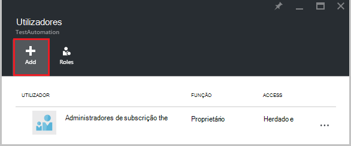  

2.  Selecione uma função da lista de funções disponíveis. Vamos será escolher a função de **leitor** , mas pode escolher qualquer uma das funções incorporadas disponíveis compatível com uma conta de automatização ou qualquer função personalizada, que pode ter definido.  

    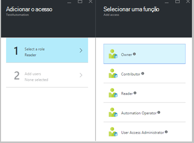  

3.  Clique em **Adicionar utilizadores** para abrir o pá **Adicionar utilizadores** . Se tiver adicionado todos os utilizadores, grupos, ou aplicações para gerir a sua subscrição, em seguida, esses utilizadores estão listados e pode selecioná-las para adicionar o access. Se não existir qualquer utilizadores listados, ou se o utilizador se estiver interessado em Adicionar não estiver listada, em seguida, clique em **Convidar** para abrir pá **Convidar convidado** , onde pode convidar um utilizador com um endereço de e-mail do Microsoft conta válido como o Outlook.com, OneDrive ou Xbox Live ID. Assim que introduziu o endereço de e-mail do utilizador, clique em **Selecionar** para adicionar o utilizador e, em seguida, clique em **OK**. 

    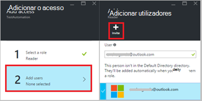  
 
    Agora deverá ver o utilizador adicionado à pá **utilizadores** com a função de **leitor** .  

      

    Também pode atribuir uma função para o utilizador a partir do pá **funções** . 

1. Clique em **funções** de pá os utilizadores para abrir a **pá de funções**. A partir deste pá, pode ver o nome da função, o número de utilizadores e grupos atribuídos a essa função.

    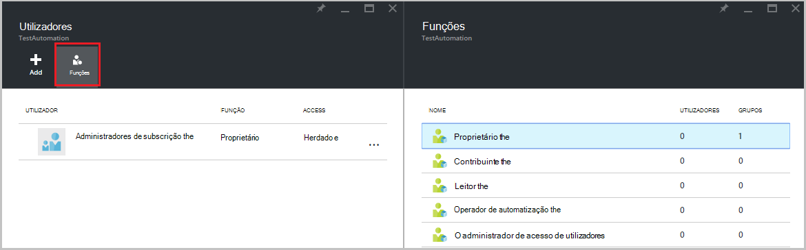  
   
    >[AZURE.NOTE] Controlo de acesso baseado em funções só pode ser definido no nível de automatização conta e não em todos os recursos abaixo da conta de automatização.

    Pode atribuir funções de mais do que um a um utilizador, grupo ou aplicação. Por exemplo, se a função de **Operador de automatização** juntamente com a **função de leitor** Recomendamos adicionar ao utilizador, em seguida, que podem ver todos os recursos de automatização, bem como executar as tarefas de livro execuções. Pode expandir no menu pendente para ver uma lista de funções atribuídas ao utilizador.  

    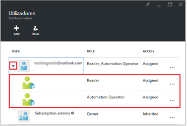  
 
### Remover um utilizador

Pode remover a permissão de acesso para um utilizador que não está a gerir a conta de automatização ou que já não funciona para a organização. Seguem-se os passos para remover um utilizador: 

1.  Pá **utilizadores** , selecione a atribuição de funções que pretende remover.

2.  Clique no botão **Remover** na pá de detalhes da atribuição.

3.  Clique em **Sim** para confirmar a remoção. 

    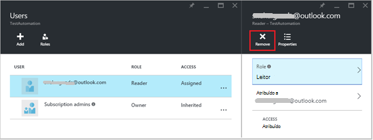  

## Função de utilizador atribuído

Quando um utilizador atribuído a uma função inicia sessão na sua conta de automatização, pode Verão agora conta o proprietário listada na lista de **Directórios predefinido**. Para poder ver a conta de automatização que tenham sido adicionadas a, eles tem de mudar o directório predefinido ao directório de predefinido o proprietário.  

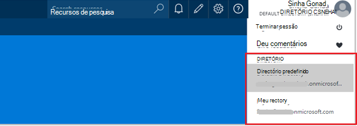  

### Experiência do utilizador para a função de operador de automatização

Quando um utilizador, o que é atribuído às vistas de funções de automatização operador a conta de automatização que estão atribuídos, eles só podem ver a lista de runbooks, trabalhos de livro execuções e agendas criadas na conta de automatização mas não consigo ver a sua definição. Estes podem iniciar, parar, suspender, retomar ou agendar a tarefa de livro execuções. O utilizador não terá acesso a outros recursos de automatização como configurações, grupos de trabalho de híbrido ou nós DSC.  

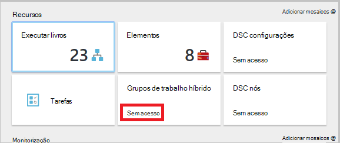  

Quando o utilizador clica no livro de execuções, os comandos para ver a origem ou editar o livro de execuções não são fornecidos como a função de operador de automatização não permite o acesso às mesmas.  

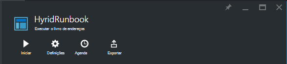  

O utilizador terá acesso para ver e criar agendas, mas não terão acesso a qualquer outro tipo de recurso.  

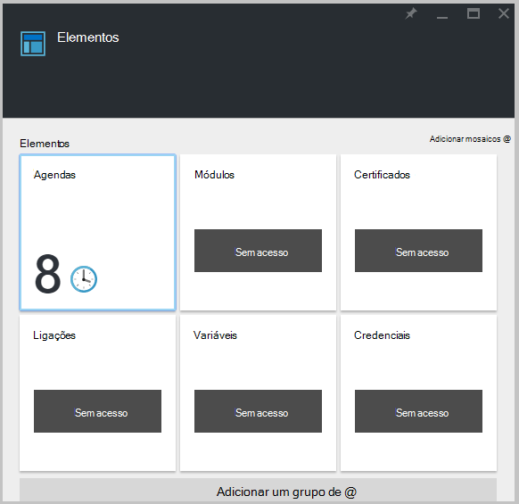  

Este utilizador também não tem acesso à ver webhooks associados a um livro de execuções

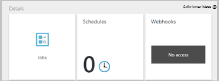  

## Configurar RBAC para a sua conta de automatização através do PowerShell do Azure

Acesso baseado em funções também pode ser configurado para uma conta de automatização utilizando os seguintes [cmdlets do Azure PowerShell](../active-directory/role-based-access-control-manage-access-powershell.md).

• [AzureRmRoleDefinition obter](https://msdn.microsoft.com/library/mt603792.aspx) uma lista de todas as funções RBAC que estão disponíveis no Azure Active Directory. Pode utilizar este comando juntamente com a propriedade **nome** para listar todas as ações que podem ser efetuadas por uma função específica.  
    **Exemplo:**  
    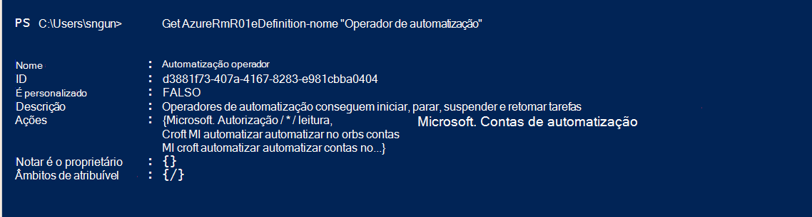  

• [AzureRmRoleAssignment obter](https://msdn.microsoft.com/library/mt619413.aspx) uma lista de atribuições de funções do Azure AD RBAC no âmbito especificado. Sem quaisquer parâmetros, este comando devolve todas as atribuições de funções efetuadas na subscrição. Utilize o parâmetro **ExpandPrincipalGroups** às atribuições de acesso de lista para o utilizador especificado, bem como os grupos do utilizador é membro.  
    **Exemplo:** Utilize o seguinte comando para listar todos os utilizadores e as suas funções dentro de uma conta de automatização.

    Get-AzureRMRoleAssignment -scope “/subscriptions/<SubscriptionID>/resourcegroups/<Resource Group Name>/Providers/Microsoft.Automation/automationAccounts/<Automation Account Name>” 

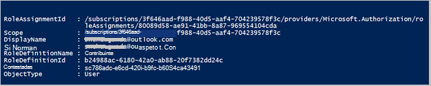

• [AzureRmRoleAssignment novo](https://msdn.microsoft.com/library/mt603580.aspx) para atribuir acesso a utilizadores, grupos e aplicações para um determinado âmbito.  
    **Exemplo:** Utilize o seguinte comando para atribuir uma função de "Operador de automatização" para um utilizador no âmbito da conta de automatização.

    New-AzureRmRoleAssignment -SignInName <sign-in Id of a user you wish to grant access> -RoleDefinitionName "Automation operator" -Scope “/subscriptions/<SubscriptionID>/resourcegroups/<Resource Group Name>/Providers/Microsoft.Automation/automationAccounts/<Automation Account Name>”  

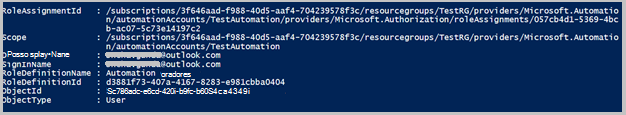

• Utilize [AzureRmRoleAssignment remover](https://msdn.microsoft.com/library/mt603781.aspx) para remover o acesso de um utilizador especificado, o grupo ou a aplicação a partir de um determinado âmbito.  
    **Exemplo:** Utilize o seguinte comando para remover o utilizador da função "Operador de automatização" no âmbito da conta de automatização.

    Remove-AzureRmRoleAssignment -SignInName <sign-in Id of a user you wish to remove> -RoleDefinitionName "Automation Operator" -Scope “/subscriptions/<SubscriptionID>/resourcegroups/<Resource Group Name>/Providers/Microsoft.Automation/automationAccounts/<Automation Account Name>”

Nos exemplos anteriores, substitua **Id de início de sessão**, **Id da subscrição**, **nome do grupo de recursos** e **nome da conta automatização** detalhes da sua conta. Escolha **Sim** quando lhe for pedido para confirmar antes de continuar para remover a atribuição de funções de utilizador.   

## Próximos passos
-  Para obter informações sobre as diferentes maneiras de configurar RBAC para Azure automatização, consulte [Gerir RBAC com PowerShell do Azure](../active-directory/role-based-access-control-manage-access-powershell.md).
- Para obter detalhes sobre diferentes formas de começar a um livro de execuções, consulte [Iniciar um livro de execuções](automation-starting-a-runbook.md)
- Para informações sobre tipos de livro de execuções diferente, consulte [tipos de livro execuções de automatização do Azure](automation-runbook-types.md)

