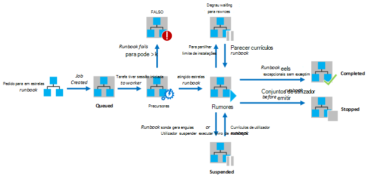
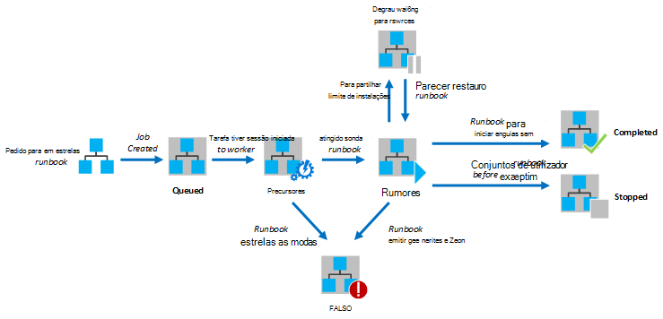

<properties
   pageTitle="Execução do livro execuções no Azure automatização"
   description="Descreve os detalhes da forma como um livro de execuções no Azure automatização é processado."
   services="automation"
   documentationCenter=""
   authors="mgoedtel"
   manager="stevenka"
   editor="tysonn" />
<tags
   ms.service="automation"
   ms.devlang="na"
   ms.topic="article"
   ms.tgt_pltfrm="na"
   ms.workload="infrastructure-services"
   ms.date="03/21/2016"
   ms.author="bwren" />

# Execução do livro execuções no Azure automatização

Quando começar a um livro de execuções no Azure automatização, é criada uma tarefa. Uma tarefa é uma instância de execução individual de um livro de execuções. Um trabalhador Azure automatização está atribuído a executar cada tarefa. Enquanto trabalhadores são partilhados por várias contas do Azure, tarefas a partir de diferentes contas de automatização são isoladas uns dos outros. Não tem controlo sobre o qual trabalhador será o pedido para a tarefa de serviço.  Um livro de execuções única pode ter várias tarefas a executar uma só vez. Quando visualizar a lista de runbooks no portal do Azure, irá mostrar o estado da tarefa última que foi iniciado para cada livro de execuções. Pode ver a lista de tarefas para cada livro de execuções para poder controlar o estado de cada. Para obter uma descrição dos Estados tarefa diferente, consulte o artigo [Estados de tarefa](#job-statuses).

O diagrama seguinte mostra o ciclo de vida de uma tarefa de livro execuções do [runbooks gráficas](automation-runbook-types.md#graphical-runbooks) e [runbooks PowerShell fluxo de trabalho](automation-runbook-types.md#powershell-workflow-runbooks).

O diagrama seguinte mostra o ciclo de vida de uma tarefa de livro execuções do [PowerShell runbooks](automation-runbook-types.md#powershell-runbooks).

As tarefas terá acesso aos recursos Azure ao efetuar uma ligação à sua subscrição do Azure. Só terão acesso aos recursos no Centro de dados se os recursos são acessíveis a partir da nuvem pública.

## Estados de tarefa

A tabela seguinte descreve os diferentes Estados que são possíveis para uma tarefa.

| Estado| Descrição|
|:---|:---|
|Concluído|A tarefa foi concluída com êxito.|
|Ocorreu uma falha| Para [runbooks gráficos e fluxo de trabalho do PowerShell](automation-runbook-types.md), livro de execuções Falha ao compilar.  Para [runbooks de Script do PowerShell](automation-runbook-types.md), livro de execuções Falha ao iniciar ou a tarefa se tenha deparado ou uma exceção. |
|Ocorreu uma falha com, a aguardar por recursos|A tarefa Ocorreu uma falha porque atingiu o limite de [partilha da feira da ciência](#fairshare) três vezes e iniciado a partir do ponto de verificação mesmo ou desde o início do livro de execuções cada vez.|
|Em fila de espera|A tarefa está à espera para recursos num trabalhador automatização breve disponíveis para que pode ser iniciado.|
|Iniciar|A tarefa foi atribuída a um trabalhador e o sistema está a iniciá-lo.|
|Retomar|O sistema está a retomar a tarefa depois de foi suspensa.|
|Em execução|A tarefa está em execução.|
|Em execução, a aguardar por recursos|A tarefa foi descarregada porque atingiu o limite [da feira da ciência partilhar](#fairshare) . Irá retomar a pouco a partir do seu ponto de verificação último.|
|Parado|A tarefa foi parada pelo utilizador antes de ser concluída.|
|Parar a|É o sistema de processo de parar a tarefa.|
|Suspensa|A tarefa foi suspensa pelo utilizador, pelo sistema ou por um comando no livro de execuções. Uma tarefa que está suspensa pode ser iniciada novamente e irá retomar a partir do seu ponto de verificação último ou desde o início do livro de execuções se não tiver sem pontos de verificação. Livro de execuções só será suspensa pelo sistema no caso de uma exceção. Por predefinição, ErrorActionPreference está definido para **continuar** significado que a tarefa continuarão a ser executadas num erro. Se esta variável de preferência estiver definido para **Parar** a tarefa irá suspender num erro.  Aplicável apenas ao [runbooks gráficos e PowerShell fluxo de trabalho](automation-runbook-types.md) .|
|Suspensão|O sistema está a tentar suspender a tarefa de pedido do utilizador. Livro de execuções tem de atingir o ponto de verificação seguinte antes de-pode ser suspensa. Se já passou o último ponto de verificação, em seguida,-lo será concluída antes de-pode ser suspensa.  Aplicável apenas ao [runbooks gráficos e PowerShell fluxo de trabalho](automation-runbook-types.md) .|

## Ver o estado da tarefa utilizando o Portal de gestão do Azure

### Dashboard de automatização

Dashboard de automatização apresenta um resumo de todos os runbooks para uma conta de automatização específico. Também inclui uma descrição geral a utilização da conta. O gráfico de resumo mostra o número total de tarefas de para todos os runbooks que introduzido cada Estado ao longo de um determinado número de dias ou horas. Pode selecionar o intervalo de tempo no canto superior direito do gráfico. O eixo de tempo do gráfico irá mudam de acordo com o tipo de intervalo de tempo que selecionar. Pode escolher se pretende apresentar a linha para um determinado Estado ao clicar no mesmo na parte superior do ecrã.

Pode utilizar os seguintes passos para apresentar o Dashboard de automatização.

1. No Portal de gestão do Azure, selecione **Automatização** e, em seguida, em seguida, clique no nome de uma conta de automatização.
1. Selecione o separador **Dashboard** .

### Dashboard do livro execuções

Dashboard do livro execuções apresenta um resumo para um livro de execuções único. O gráfico de resumo mostra o número total de tarefas de para o livro de execuções introduzido cada Estado ao longo de um determinado número de dias ou horas. Pode selecionar o intervalo de tempo no canto superior direito do gráfico. O eixo de tempo do gráfico irá mudam de acordo com o tipo de intervalo de tempo que selecionar. Pode escolher se pretende apresentar a linha para um determinado Estado ao clicar no mesmo na parte superior do ecrã.

Pode utilizar os seguintes passos para apresentar o Dashboard do livro execuções.

1. No Portal de gestão do Azure, selecione **Automatização** e, em seguida, em seguida, clique no nome de uma conta de automatização.
1. Clique no nome de um livro de execuções.
1. Selecione o separador **Dashboard** .

### Resumo da tarefa

Pode ver uma lista de todas as tarefas que foram criadas para um determinado livro de execuções e o respetivo estado mais recente de. Pode filtrar esta lista ao estado da tarefa e o intervalo de datas para a última alteração à tarefa. Clique no nome de uma tarefa para ver as suas informações detalhadas e respectiva saída. Vista detalhada da tarefa de inclui os valores para os parâmetros de livro execuções que foram fornecidos para essa tarefa.

Pode utilizar os seguintes passos para ver as tarefas para um livro de execuções.

1. No Portal de gestão do Azure, selecione **Automatização** e, em seguida, em seguida, clique no nome de uma conta de automatização.
1. Clique no nome de um livro de execuções.
1. Selecione o separador **tarefas** .
1. Clique na coluna **Tarefa criada** para uma tarefa para ver os detalhes e a saída.

## Obter o estado da tarefa através do Windows PowerShell

Pode utilizar a [Obter AzureAutomationJob](http://msdn.microsoft.com/library/azure/dn690263.aspx) para obter as tarefas criadas para um livro de execuções e os detalhes de uma tarefa específica. Se iniciar um livro de execuções com o Windows PowerShell utilizando [AzureAutomationRunbook iniciar](http://msdn.microsoft.com/library/azure/dn690259.aspx), em seguida, irá devolver a tarefa resultante. Utilize a saída de [Obter AzureAutomationJob](http://msdn.microsoft.com/library/azure/dn690263.aspx)para obter o resultado de uma tarefa.

Os comandos de exemplo seguinte obtém a última tarefa para um livro de execuções do exemplo e apresenta o estado da mesma, fornecem os valores para os parâmetros de livro execuções e o resultado da tarefa.

    $job = (Get-AzureAutomationJob –AutomationAccountName "MyAutomationAccount" –Name "Test-Runbook" | sort LastModifiedDate –desc)[0]
    $job.Status
    $job.JobParameters
    Get-AzureAutomationJobOutput –AutomationAccountName "MyAutomationAccount" -Id $job.Id –Stream Output

## Partilhar da feira da ciência

Para poder partilhar recursos entre todos os runbooks na nuvem, Azure automatização temporariamente será descarregado qualquer tarefa depois de ter sido executada 3 horas.    [Gráficos](automation-runbook-types.md#graphical-runbooks) e [Fluxo de trabalho do PowerShell](automation-runbook-types.md#powershell-workflow-runbooks) runbooks será retomada a partir do seu último [ponto de verificação](http://technet.microsoft.com/library/dn469257.aspx#bk_Checkpoints). Durante este período de tempo, a tarefa mostrará um Estado de execução, a aguardar por recursos. Se o livro de execuções tiver sem pontos de verificação ou se a tarefa não tivesse atingido o primeiro ponto de verificação antes de a ser descarregadas, em seguida, irá reiniciar desde o início.  [PowerShell](automation-runbook-types.md#powershell-runbooks) runbooks são sempre reiniciados desde o início, desde que não suportam os pontos de verificação.

>[AZURE.NOTE] O limite da feira da ciência partilhar não é aplicável ao livro execuções tarefas em execução no híbrido livro execuções trabalhadores.

Se o livro de execuções for reiniciado a partir do ponto de verificação mesmo ou desde o início do livro de execuções três vezes consecutivas, ser terminada com o estado falhou, a aguardar por recursos. Esta é a proteger-se de runbooks a ser executado indefinidamente sem concluir, tal como não estiverem conseguir para o tornar para o ponto de verificação seguinte sem a ser descarregadas novamente. Neste caso, vai receber a seguinte exceção com a falha.

*A tarefa não é possível continuar a ser executado porque-repetidamente foi retirado do mesmo ponto de verificação. Certifique-se de que o seu livro de execuções não efetua operações compridas sem persistência o seu estado.*

Quando cria um livro de execuções, deverá Certifique-se de que a hora para executar outras atividades entre dois pontos de verificação não podem exceder 3 horas. Poderá ter de adicionar os pontos de verificação ao seu livro de execuções para se certificar de que não atingir este limite de hora 3 ou dividir longo a executar operações. Por exemplo, o seu livro de execuções pode desempenhar uma reindexar numa base de dados do SQL grande. Se não for concluído dentro do limite da feira da ciência partilhar esta operação única, em seguida, a tarefa será descarregada e reiniciada desde o início. Neste caso, deve quebrar a operação de reindexar para vários passos, tal como a reindexação de uma tabela cada vez e em seguida, insira um ponto de verificação após cada operação para que a tarefa foi retomar após a última operação para concluir.

## Próximos passos

- [Iniciar um livro de execuções no Azure automatização](automation-starting-a-runbook.md)
