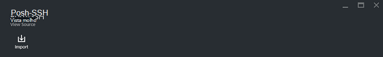

<properties
    pageTitle="Livro execuções e módulo galerias de automatização do Azure | Microsoft Azure"
    description="Runbooks e módulos Microsoft e a Comunidade estão disponíveis instalar e utilizar no seu ambiente de automatização do Azure.  Este artigo descreve como pode aceder a estes recursos e contribuir seu runbooks na galeria."
    services="automation"
    documentationCenter=""
    authors="mgoedtel"
    manager="jwhit"
    editor="tysonn" />
<tags
    ms.service="automation"
    ms.devlang="na"
    ms.topic="article"
    ms.tgt_pltfrm="na"
    ms.workload="infrastructure-services"
    ms.date="09/18/2016"
    ms.author="magoedte;bwren" />

# Livro execuções e módulo galerias de automatização do Azure

Em vez de criar o seu próprio runbooks e módulos no Azure automatização, pode aceder a uma variedade de cenários que já foram incorporadas pela Microsoft e da Comunidade.  Pode utilizar estes cenários sem modificação ou pode utilizá-los como ponto de partida e editá-los para os requisitos específicos.

Pode obter runbooks a partir da [Galeria de livro execuções](#runbooks-in-runbook-gallery) e módulos a partir da [Galeria do PowerShell](#modules-in-powerShell-gallery).  Também podem contribuir para a Comunidade através da partilha de cenários que desenvolver.

## Runbooks na Galeria de livro execuções

A [Galeria de livro execuções](http://gallery.technet.microsoft.com/scriptcenter/site/search?f[0].Type=RootCategory&f[0].Value=WindowsAzure&f[1].Type=SubCategory&f[1].Value=WindowsAzure_automation&f[1].Text=Automation) fornece uma variedade de runbooks Microsoft e da Comunidade, que pode importar para o Azure automatização. É possível em transferir um livro de execuções a partir da galeria que está alojado no [Centro de Script do TechNet](http://gallery.technet.microsoft.com/), ou pode importar runbooks diretamente a partir da galeria do Azure portal clássico ou Azure portal.

Só pode importar diretamente a partir da Galeria de livro execuções utilizando o portal clássica Azure ou Azure portal. Não é possível executar esta função através do Windows PowerShell.

>[AZURE.NOTE] Deve validar os conteúdos de qualquer runbooks que aceder a partir da Galeria de livro execuções e tome cuidado representarem ao instalar e executá-los num ambiente de produção. |

### Para importar um livro de execuções a partir da Galeria de livro execuções com portal clássico do Azure

1. No Portal do Azure, clique em **Novo**, **Serviços de aplicação**, **Automatização**, **livro execuções**, **A partir da Galeria**.
2. Selecione uma categoria para ver runbooks relacionados e selecione um livro de execuções para ver os detalhes. Quando selecionar livro de execuções que pretende, clique no botão de seta para a direita.

    

3. Reveja o conteúdo do livro de execuções e tome nota quaisquer requisitos na descrição. Quando terminar, clique no botão de seta para a direita.
4. Introduza os detalhes do livro execuções e, em seguida, clique no botão de marca de verificação. O nome do livro execuções já vai ser preenchido.
5. Livro de execuções aparecerá no separador **Runbooks** para a conta de automatização.

### Para importar um livro de execuções a partir da Galeria de livro execuções com o portal do Azure

1. No Portal do Azure, abre a sua conta de automatização.
2. Clique no mosaico **Runbooks** para abrir a lista de runbooks.
3. Clique em botão **Procurar Galeria** .

    

4. Localize o item que pretende e selecione-a para ver os detalhes da galeria.

    

4. Clique em **projeto de origem de vista** para ver o item no [Centro de Script do TechNet](http://gallery.technet.microsoft.com/).
5. Para importar um item, clique na mesma para ver os detalhes e, em seguida, clique no botão **Importar** .

    

6. Opcionalmente, altere o nome do livro de execuções e, em seguida, clique em **OK** para importar o livro de execuções.
5. Livro de execuções aparecerá no separador **Runbooks** para a conta de automatização.

### Adicionar um livro de execuções na Galeria de livro execuções

Microsoft encoraje-lhe adicionar runbooks na Galeria de livro execuções acredita que possam ser úteis para outros clientes.  Pode adicionar um livro de execuções ao [carregá-lo para o Centro de Script](http://gallery.technet.microsoft.com/site/upload) tendo em conta os seguintes detalhes.

- Tem de especificar *Do Windows Azure* para a **categoria** e a *Automatização* para a **subcategoria** do livro de execuções para que seja apresentado no assistente.  

- O carregamento tem de ser um único ficheiro. ps1 ou .graphrunbook.  Se o livro de execuções exigir qualquer módulos, subordinado runbooks ou activos, em seguida, deve listar as na descrição da apresentação e na secção comentários do livro de execuções.  Se tiver um cenário que exige o runbooks várias, em seguida, carregue cada separadamente e listar os nomes do runbooks relacionados em cada uma das respectivas descrições. Certifique-se de que utiliza as mesmas marcas para que irá aparecer na mesma categoria. Um utilizador terá de ler a descrição para saber que outros runbooks são necessários o cenário para trabalhar.

- Adicione a etiqueta "GraphicalPS" caso esteja a publicar um **livro de execuções gráfico** (não um fluxo de trabalho gráficas). 

- Inserir uma PowerShell ou o fluxo de trabalho do PowerShell fragmento de código para a descrição utilizar o ícone de **Inserir código secção** .

- O resumo para o carregamento será apresentado nos resultados da Galeria de livro execuções para que deve fornecer informações detalhadas que o ajudarão um utilizador identificar a funcionalidade do livro de execuções.

- Deverá atribuir um a três das seguintes Tags para o carregamento.  Livro de execuções será listado no Assistente de em categorias que correspondam às suas etiquetas.  Quaisquer etiquetas não conste da lista serão ignoradas pelo assistente. Se não especificar quaisquer etiquetas correspondentes, livro de execuções estará listado em à outra categoria.

 - Cópia de segurança
 - Gestão de capacidade
 - Alterar controlo
 - Conformidade
 - Dev Center / testar ambientes
 - Recuperação de falhas
 - Monitorização
 - Aplicação de patches
 - Aprovisionamento
 - Remediação
 - Gestão de ciclo de vida VM

- Automatização atualiza a Galeria de uma vez por hora, para que não ver as suas contribuições imediatamente.

## Módulos na Galeria de PowerShell

Os módulos PowerShell contêm cmdlets que pode utilizar no seu runbooks e módulos existentes que pode instalar no Azure automatização estão disponíveis na [Galeria de PowerShell](http://www.powershellgallery.com).  Pode iniciar este Galeria a partir do portal do Azure e instalá-los diretamente no Azure automatização ou pode transferi-los e instalá-los manualmente.  Não é possível instalar os módulos diretamente a partir do portal de clássico Azure, mas pode transferi-los instalá-las, tal como faria com qualquer outro módulo.

### Para importar um módulo a partir da Galeria de módulo de automatização com o portal do Azure

1. No Portal do Azure, abre a sua conta de automatização.
2. Clique no mosaico **elementos** para abrir a lista de recursos.
3. Clique no mosaico **módulos** para abrir a lista de módulos.
4. Clique no botão **Procurar Galeria** e o pá Galeria procurar é iniciada.

      
5. Depois de ter iniciado o pá da Galeria de procurar, pode procurar pelos seguintes campos:

   - Nome do módulo
   - Etiquetas
   - Autor
   - Nome do recurso cmdlet/DSC

6. Localize um módulo que está interessado em e selecione-o para ver os detalhes.  
Quando explorar um módulo específico, pode ver mais informações acerca do módulo, incluindo uma ligação para o PowerShell Gallery, quaisquer obrigatórias dependências e todos os cmdlets e/ou recursos DSC que contém o módulo.

      

7. Para instalar o módulo diretamente para o Azure automatização, clique no botão de **importação** .

    

8. Quando clica no botão Importar, verá o nome do módulo que está prestes a importar. Se estiverem instaladas todas as dependências, o botão **OK** estará ativo. Se dependências estão em falta, terá de importar os antes de poder importar este módulo.
9. Clique em **OK** para importar o módulo, e a pá módulo será executado. Quando o Azure automatização importa um módulo à sua conta, este extrai metadados sobre o módulo e os cmdlets.

    

    Isto pode demorar alguns minutos, uma vez que cada actividade tem de ser extraída.
10. Receberá uma notificação a indicar que o módulo está a ser implementado e uma notificação quando tiver concluído.
11. Depois do módulo é importado, irá ver as atividades disponíveis e pode utilizar os seus recursos nos seus runbooks e configuração do Estado de pretendido.

## Pedir um livro execuções ou um módulo

Pode enviar pedidos para [Voz do utilizador](https://feedback.azure.com/forums/246290-azure-automation/).  Se necessitar de ajuda a escrever um livro de execuções ou tiver uma pergunta sobre o PowerShell, publique uma questão ao nosso [Fórum](http://social.msdn.microsoft.com/Forums/windowsazure/en-US/home?forum=azureautomation&filter=alltypes&sort=lastpostdesc).

## Próximos passos

- Para começar com runbooks, consulte o artigo [criar ou importar um livro de execuções na automatização do Azure](automation-creating-importing-runbook.md)
- Para compreender as diferenças entre PowerShell e fluxo de trabalho do PowerShell com runbooks, consulte o artigo [formação PowerShell fluxo de trabalho](automation-powershell-workflow.md)
