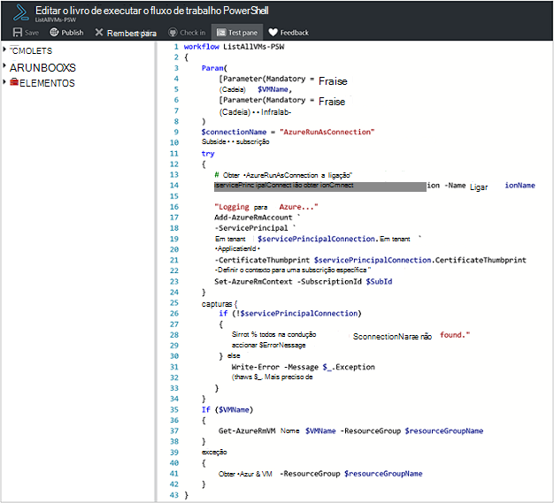
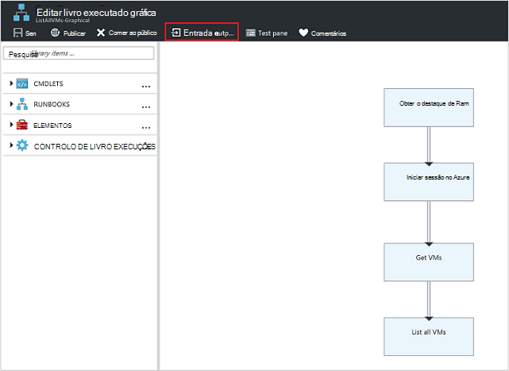
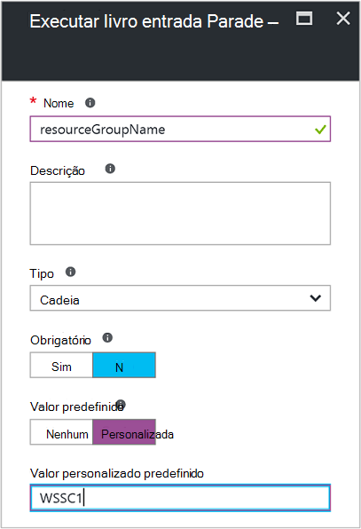
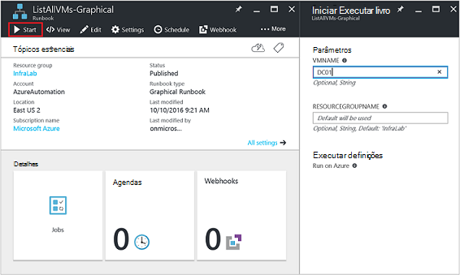
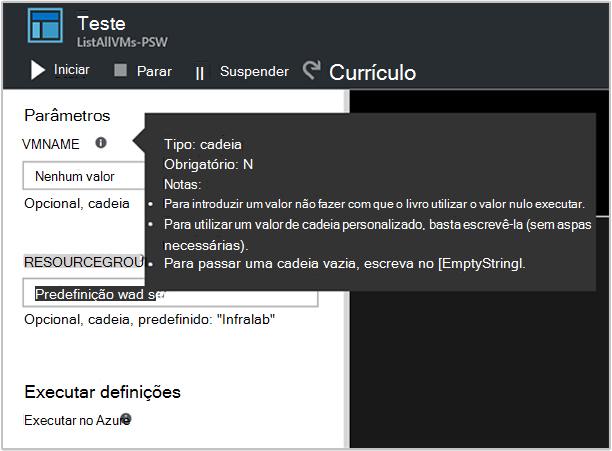
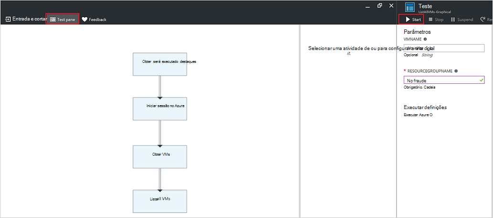
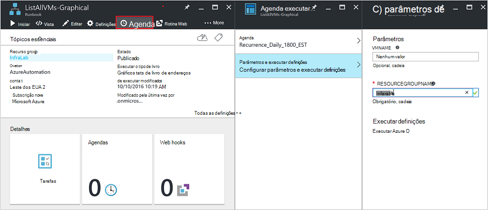
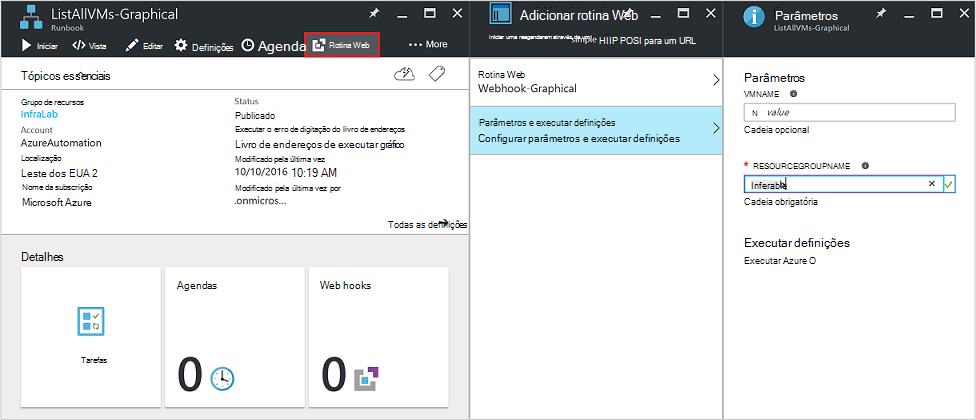
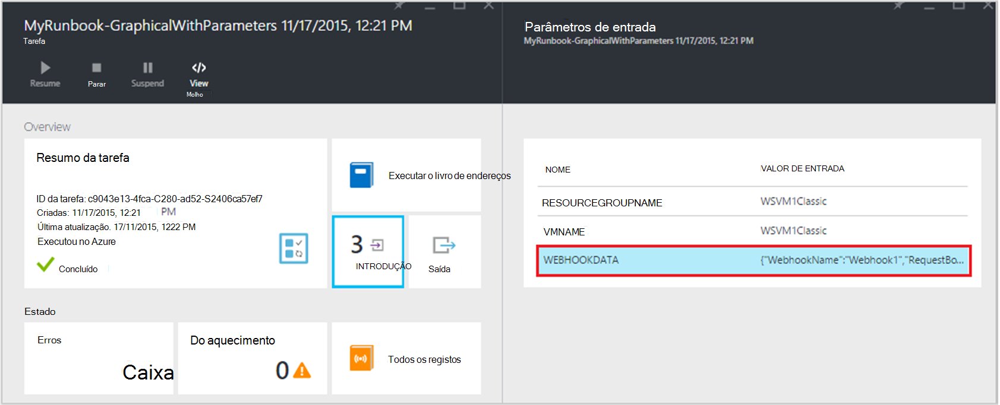

<properties
   pageTitle="Parâmetros de entrada do livro execuções | Microsoft Azure"
   description="Parâmetros de entrada do livro execuções aumentam a flexibilidade de runbooks, permitindo-lhe transmitir dados para um livro de execuções quando for iniciado. Este artigo descreve os diferentes cenários onde os parâmetros de entrada são utilizados em runbooks."
   services="automation"
   documentationCenter=""
   authors="MGoedtel"
   manager="jwhit"
   editor="tysonn" />
<tags
   ms.service="automation"
   ms.devlang="na"
   ms.topic="article"
   ms.tgt_pltfrm="na"
   ms.workload="infrastructure-services"
   ms.date="10/11/2016"
   ms.author="sngun"/>

# <a name="runbook-input-parameters"></a>Parâmetros de entrada do livro execuções

Parâmetros de entrada do livro execuções aumentam a flexibilidade de runbooks, permitindo-lhe transmitir dados para o mesmo quando for iniciado. Os parâmetros permitem as ações de livro execuções ser alvo para cenários específicos e ambientes. Neste artigo, iremos irá guiá-lo cenários diferentes onde os parâmetros de entrada são utilizados em runbooks.

## <a name="configure-input-parameters"></a>Configurar parâmetros de entrada

Parâmetros de entrada podem ser configurados no PowerShell, PowerShell fluxo de trabalho e runbooks gráfica. Um livro de execuções pode ter vários parâmetros com diferentes tipos de dados ou sem parâmetros de todo. Parâmetros de entrada podem ser obrigatório ou opcional e pode atribuir um valor predefinido para os parâmetros opcionais. Pode atribuir valores para os parâmetros de entrada para um livro de execuções quando inicia através de um dos métodos disponíveis. Alguns exemplos destes métodos começando um livro de execuções do portal ou um serviço web. Também pode iniciar um como um livro de execuções subordinado denominado inline no livro de execuções outra.

## <a name="configure-input-parameters-in-powershell-and-powershell-workflow-runbooks"></a>Configurar parâmetros de entrada no runbooks PowerShell e PowerShell fluxo de trabalho

Parâmetros de entrada que são definidos através dos seguintes atributos de suporte PowerShell e [runbooks de fluxo de trabalho do PowerShell](automation-first-runbook-textual.md) no Azure automatização.  

| **Propriedade** | **Descrição** |
|:--- |:---|
| Tipo | Obrigatório. O tipo de dados esperado para o valor do parâmetro. Qualquer tipo de .NET é válido. |
| Nome | Obrigatório. O nome do parâmetro. Isto tem de ser exclusivo no livro de execuções e pode conter apenas letras, números ou carateres de sublinhado. Tem de iniciar por uma letra. |
| Obrigatório | Opcional. Especifica se deve ser fornecido um valor para o parâmetro. Se definir este para **$true**, em seguida, deve ser fornecido um valor quando o livro de execuções é iniciado. Se definir este para **$false**, um valor é opcional. |
| Valor predefinido | Opcional.  Especifica um valor que será utilizado para o parâmetro se um valor não é transmitido quando o livro de execuções é iniciado. Um valor predefinido pode ser definido para qualquer parâmetro e será automaticamente tornar o parâmetro opcional, independentemente da definição obrigatória. |

Windows PowerShell suporta mais atributos de parâmetros de entrada que aqueles listadas aqui, como validação, aliases, cores e conjuntos de parâmetro. No entanto, o Azure automatização atualmente suporta apenas os parâmetros de entrada listados em cima.

Definição de um parâmetro no fluxo de trabalho do PowerShell runbooks tem o seguinte formato geral, onde vários parâmetros são separados por vírgulas.

   ```
     Param
     (
         [Parameter (Mandatory= $true/$false)]
         [Type] Name1 = <Default value>,

         [Parameter (Mandatory= $true/$false)]
         [Type] Name2 = <Default value>
     )
   ```

>[AZURE.NOTE] Quando estiver a definir parâmetros, se não especificar atributo **obrigatório** , em seguida, por predefinição, o parâmetro é considerado opcional. Além disso, se configurou um valor predefinido para um parâmetro runbooks de fluxo de trabalho do PowerShell,-lo será tratado ao PowerShell como um parâmetro opcional, independentemente do valor do atributo **obrigatório** .

Por exemplo, vamos configurar parâmetros de entrada de um livro de execuções do fluxo de trabalho de PowerShell que exporta detalhes sobre máquinas virtuais, uma única VM ou todos os VMs dentro de um grupo de recursos. Este livro de execuções tem dois parâmetros, tal como apresentado na seguinte captura de ecrã: o nome de máquina virtual e o nome do grupo de recursos.



Neste parâmetro definição, os parâmetros **$VMName** e **$resourceGroupName** são parâmetros simples do tipo cadeia. No entanto, runbooks PowerShell e PowerShell fluxo de trabalho suportam todos os tipos de simples e tipos complexos, tais como **objeto** ou **PSCredential** para parâmetros de entrada.

Se o seu livro de execuções tiver um parâmetro de entrada de tipo de objeto, em seguida, utilize um hashtable do PowerShell com o valor de (nome) pares para transmitir um valor. Por exemplo, se tiver o parâmetro seguinte num livro de execuções:

     [Parameter (Mandatory = $true)]
     [object] $FullName

Em seguida, pode passar o seguinte valor para o parâmetro:

    @{"FirstName"="Joe";"MiddleName"="Bob";"LastName"="Smith"}


## <a name="configure-input-parameters-in-graphical-runbooks"></a>Configurar parâmetros de entrada no runbooks gráfica

Para [configurar um livro de execuções gráfico](automation-first-runbook-graphical.md) com parâmetros de entrada, vamos criar um livro de execuções gráfico exporta detalhes sobre máquinas virtuais, uma única VM ou todos os VMs dentro de um grupo de recursos. Configurar um livro de execuções consiste em duas atividades principais, conforme descrito abaixo.

[**Runbooks autenticar com a conta Azure executar como**](automation-sec-configure-azure-runas-account.md) para autenticar com Azure.

[**Get-AzureRmVm**](https://msdn.microsoft.com/library/mt603718.aspx) para obter as propriedades de um máquinas virtuais.

Pode utilizar a atividade de [**Saída de escrita**](https://technet.microsoft.com/library/hh849921.aspx) para exportar os nomes dos máquinas virtuais. A atividade **Get-AzureRmVm** aceita dois parâmetros, o **nome da máquina virtual** e o **nome do grupo de recursos**. Uma vez que estes parâmetros poderiam requerem diferentes valores sempre que inicia o livro de execuções, pode adicionar parâmetros de entrada ao seu livro de execuções. Eis os passos para adicionar parâmetros de entrada:

1. Selecione o livro de execuções gráfico a pá **Runbooks** e, em seguida, clique em [**editá**](automation-graphical-authoring-intro.md) -lo.

2. A partir do editor do livro execuções, clique em **entrada e saída** para abrir o pá **entrada e saída** .

    

3. A **entrada e saída** pá apresenta uma lista de parâmetros de entrada que estão definidas para o livro de execuções. Neste pá, pode adicionar um novo parâmetro de entrada ou editar a configuração de um parâmetro de entrada existente. Para adicionar um novo parâmetro para o livro de execuções, clique em **Adicionar a entrada** para abrir o **parâmetro de entrada do livro execuções** pá. Não existem, pode configurar os seguintes parâmetros:

  	| **Propriedade** | **Descrição** |
  	|:--- |:---|
  	| Nome | Obrigatório.  O nome do parâmetro. Isto tem de ser exclusivo no livro de execuções e pode conter apenas letras, números ou carateres de sublinhado. Tem de iniciar por uma letra. |
  	| Descrição | Opcional. Descrição sobre o objetivo do parâmetro de entrada. |
  	| Tipo | Opcional. O tipo de dados que é esperado para o valor do parâmetro. Tipos de parâmetro suportadas são **cadeia**, **Int32**, **Int64**, **Decimal**, **Booleano**, **DateTime**e **objeto**. Se um tipo de dados não estiver seleccionado, esta assume a predefinição **cadeia**. |
  	| Obrigatório | Opcional. Especifica se deve ser fornecido um valor para o parâmetro. Se escolher **Sim**, em seguida, deve ser fornecido um valor quando o livro de execuções é iniciado. Se optar por **não**, em seguida, um valor não é necessário quando o livro de execuções é iniciado e pode ser definido um valor predefinido. |
  	| Valor predefinido | Opcional. Especifica um valor que será utilizado para o parâmetro se um valor não é transmitido quando o livro de execuções é iniciado. Um valor predefinido pode ser definido para um parâmetro que não seja obrigatório. Para definir um valor predefinido, selecione **personalizada**. Este valor é utilizada a menos que outro valor é fornecido quando o livro de execuções é iniciado. Selecione **nenhum** se não quiser fornecer qualquer valor predefinido. |  

    

4. Crie dois parâmetros com as seguintes propriedades que serão utilizadas pela atividade de **Obter AzureRmVm** :

    - **Parâmetro1:**
      - Name - VMName
      - Tipo de-cadeia
      - Obrigatório - n

    - **Parâmetro2:**
      - Name - resourceGroupName
      - Tipo de-cadeia
      - Obrigatório - n
      - Valor predefinido - personalizada
      - Valor predefinido personalizado - \<nome do grupo de recursos que contém as máquinas virtuais >

5. Assim que adicionar os parâmetros, clique em **OK**.  Agora pode vê-los na **entrada e pá saída**. Clique novamente em **OK** e, em seguida, clique em **Guardar** e **Publicar** o livro de execuções.

## <a name="assign-values-to-input-parameters-in-runbooks"></a>Atribuir valores de parâmetros na runbooks de entrada

Pode passar valores para a entrada de parâmetros numa runbooks nos cenários seguintes.

### <a name="start-a-runbook-and-assign-parameters"></a>Iniciar um livro de execuções e atribuir parâmetros

Um livro de execuções pode ser iniciado a várias formas: através do portal do Azure, com um webhook, com os cmdlets do PowerShell, com a API REST ou com o SDK. Abaixo discutimos métodos diferentes para iniciar um livro de execuções e atribuir parâmetros.

#### <a name="start-a-published-runbook-by-using-the-azure-portal-and-assign-parameters"></a>Iniciar um livro de execuções publicado utilizando o portal do Azure e atribuir parâmetros

Quando [Iniciar o livro de execuções](automation-starting-a-runbook.md#starting-a-runbook-with-the-azure-portal), o **Livro de execuções iniciar** pá abre e pode configurar os valores para os parâmetros que acabou de criar.



Na etiqueta abaixo da caixa de entrada, pode ver os atributos que definiu para o parâmetro. Atributos incluem obrigatório ou opcional, tipo e valor predefinido. No balão de ajuda junto ao nome do parâmetro, pode ver todas as informações chave que necessita de tomar decisões sobre valores de entrada do parâmetro. Estas informações incluem se um parâmetro é obrigatório ou opcional. Também inclui o tipo e valor predefinido (se existir) e outras notas úteis.



>[AZURE.NOTE] Parâmetros de tipo de cadeia suportam valores de cadeia **vazia** .  Introdução **[cadeia vazia]** na caixa de parâmetro de entrada irá passar para o parâmetro de uma cadeia vazia. Além disso, os parâmetros de tipo de cadeia não suportam valores **nulos** a ser transmitidos. Se não ser efetuada com qualquer valor para o parâmetro de cadeia, em seguida, PowerShell interpreta-a como nulo.

#### <a name="start-a-published-runbook-by-using-powershell-cmdlets-and-assign-parameters"></a>Iniciar um livro de execuções publicado utilizando os cmdlets do PowerShell e atribuir parâmetros

  - **Cmdlets do Gestor de recursos do azure:** Pode começar a um livro de execuções de automatização que foi criado um grupo de recursos utilizando [AzureRmAutomationRunbook iniciar](https://msdn.microsoft.com/library/mt603661.aspx).

    **Exemplo:**

   ```
    $params = @{“VMName”=”WSVMClassic”;”resourceGroupeName”=”WSVMClassicSG”}
 
    Start-AzureRmAutomationRunbook -AutomationAccountName “TestAutomation” -Name “Get-AzureVMGraphical” –ResourceGroupName $resourceGroupName -Parameters $params
   ```

  - **Cmdlets de gestão de serviço do azure:** Pode começar a um livro de execuções de automatização que foi criado num grupo de recursos predefinido utilizando [AzureAutomationRunbook iniciar](https://msdn.microsoft.com/library/dn690259.aspx).

    **Exemplo:**

   ```
    $params = @{“VMName”=”WSVMClassic”; ”ServiceName”=”WSVMClassicSG”}

    Start-AzureAutomationRunbook -AutomationAccountName “TestAutomation” -Name “Get-AzureVMGraphical” -Parameters $params
   ```

>[AZURE.NOTE] Quando começar a um livro de execuções utilizando os cmdlets do PowerShell, um parâmetro predefinido, **MicrosoftApplicationManagementStartedBy** é criado com o valor **PowerShell**. Pode ver este parâmetro no pá **Detalhes de tarefa** .  

#### <a name="start-a-runbook-by-using-an-sdk-and-assign-parameters"></a>Iniciar um livro de execuções utilizando um SDK e atribuir parâmetros

  - **Gestor de recursos do azure método:** Pode iniciar um livro de execuções utilizando o SDK da linguagem de programação. Abaixo está um fragmento de código c# para iniciar um livro de execuções na sua conta de automatização. Pode ver todo o código no nosso [GitHub repositório](https://github.com/Azure/azure-sdk-for-net/blob/master/src/ResourceManagement/Automation/Automation.Tests/TestSupport/AutomationTestBase.cs).  

   ```
     public Job StartRunbook(string runbookName, IDictionary<string, string> parameters = null)
        {
          var response = AutomationClient.Jobs.Create(resourceGroupName, automationAccount, new JobCreateParameters
           {
              Properties = new JobCreateProperties
               {
                  Runbook = new RunbookAssociationProperty
                   {
                     Name = runbookName
                   },
                     Parameters = parameters
               }
           });
        return response.Job;
        }
   ```

  - **Método de gestão de serviço do azure:** Pode iniciar um livro de execuções utilizando o SDK da linguagem de programação. Abaixo está um fragmento de código c# para iniciar um livro de execuções na sua conta de automatização. Pode ver todo o código no nosso [GitHub repositório](https://github.com/Azure/azure-sdk-for-net/blob/master/src/ServiceManagement/Automation/Automation.Tests/TestSupport/AutomationTestBase.cs).

   ```      
    public Job StartRunbook(string runbookName, IDictionary<string, string> parameters = null)
      {
        var response = AutomationClient.Jobs.Create(automationAccount, new JobCreateParameters
      {
        Properties = new JobCreateProperties
           {
             Runbook = new RunbookAssociationProperty
           {
             Name = runbookName
                },
                  Parameters = parameters
                }
         });
        return response.Job;
      }
   ```

  Para iniciar este método, crie um dicionário para armazenar os parâmetros de livro execuções, **VMName** e **resourceGroupName**e os respetivos valores. Em seguida, inicie o livro de execuções. Segue-se c# fragmento de código para chamar o método que é definido acima.

   ```
    IDictionary<string, string> RunbookParameters = new Dictionary<string, string>();

    // Add parameters to the dictionary.
    RunbookParameters.Add("VMName", "WSVMClassic");
    RunbookParameters.Add("resourceGroupName", "WSSC1");

    //Call the StartRunbook method with parameters
    StartRunbook(“Get-AzureVMGraphical”, RunbookParameters);
   ```

#### <a name="start-a-runbook-by-using-the-rest-api-and-assign-parameters"></a>Iniciar um livro de execuções utilizando REST API e atribuir parâmetros

Uma tarefa de livro execuções pode ser criada e introdução ao Azure automatização REST API utilizando o método **colocar** com o pedido seguinte URI.

    https://management.core.windows.net/<subscription-id>/cloudServices/<cloud-service-name>/resources/automation/~/automationAccounts/<automation-account-name>/jobs/<job-id>?api-version=2014-12-08`

No pedido de URI, substitua os seguintes parâmetros:

  - **id da subscrição:** A ID da subscrição Azure.  
  - **nome do serviço na nuvem:** O nome do serviço em nuvem para o qual deve ser enviado o pedido.  
  - **nome da conta de automatização:** O nome da sua conta de automatização que está alojado dentro do serviço de nuvem especificada.  
  - **id da tarefa:** GUID da tarefa. GUID no PowerShell podem ser criados utilizando o **[GUID]::NewGuid(). ToString ()** comando.

Para passar para a tarefa de livro execuções os parâmetros, utilize o corpo do pedido. Bastam as seguintes propriedades de duas fornecidas no formato JSON:

  - **Livro execuções nome:** Obrigatório. O nome do livro de execuções do projecto iniciar.  
  - **Parâmetros de livro execuções:** Opcional. Formatar um dicionário da lista de parâmetro na (nome, valor) onde nome deve ser do tipo de cadeia e valor pode ser qualquer valor JSON válido.

Se pretender iniciar o livro de execuções do **Get-AzureVMTextual** que foi criado anteriormente com **VMName** e **resourceGroupName** como parâmetros, utilize o seguinte formato JSON para corpo do pedido.

   ```
    {
      "properties":{
        "runbook":{
        "name":"Get-AzureVMTextual"},
      "parameters":{
         "VMName":"WSVMClassic",
         "resourceGroupName":”WSCS1”}
        }
    }
   ```

Um código de estado HTTP 201 é devolvido se a tarefa é criada com êxito. Para mais informações sobre cabeçalhos de resposta e o corpo da resposta, consulte o artigo sobre como [criar uma tarefa de livro execuções ao utilizar a API REST.](https://msdn.microsoft.com/library/azure/mt163849.aspx)

### <a name="test-a-runbook-and-assign-parameters"></a>Teste de um livro de execuções e atribuir parâmetros

Quando a [testar a versão de rascunho do seu livro de execuções](automation-testing-runbook.md) utilizando a opção de teste, o pá **Testar** abre e pode configurar os valores para os parâmetros que acabou de criar.



### <a name="link-a-schedule-to-a-runbook-and-assign-parameters"></a>Ligar uma agenda de um livro de execuções e atribuir parâmetros

Pode [ligar uma agenda](automation-schedules.md) para o seu livro de execuções para que inicia o livro de execuções num momento específico. Atribuir parâmetros de entrada quando cria a agenda e livro de execuções irão utilizar estes valores quando é iniciado pela agenda. Não pode guardar a agenda até que todos os valores de parâmetro obrigatório são fornecidos.



### <a name="create-a-webhook-for-a-runbook-and-assign-parameters"></a>Criar um webhook para um livro de execuções e atribuir parâmetros

Pode criar um [webhook](automation-webhooks.md) para o seu livro de execuções e configurar parâmetros de entrada do livro execuções. Não pode guardar o webhook até que todos os valores de parâmetro obrigatório são fornecidos.



Quando executa a um livro de execuções utilizando um webhook, o parâmetro de entrada predefinido **[Webhookdata](automation-webhooks.md#details-of-a-webhook)** ser enviada, juntamente com os parâmetros de entrada que definiu. Pode clicar para expandir o parâmetro **WebhookData** para obter mais detalhes.




## <a name="next-steps"></a>Próximos passos

- Para mais informações sobre o livro execuções entrada e saída, consulte o artigo [Azure automatização: livro execuções entrada, saída e runbooks aninhadas](https://azure.microsoft.com/blog/azure-automation-runbook-input-output-and-nested-runbooks/).
- Para obter detalhes sobre diferentes formas de começar a um livro de execuções, consulte [Iniciar um livro de execuções](automation-starting-a-runbook.md).
- Para editar um livro de execuções textual, consulte [runbooks textual de edição](automation-edit-textual-runbook.md).
- Para editar um livro de execuções gráfico, consulte a [criação de gráficos no Azure automatização](automation-graphical-authoring-intro.md).
