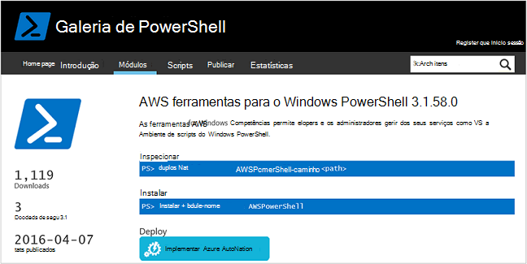
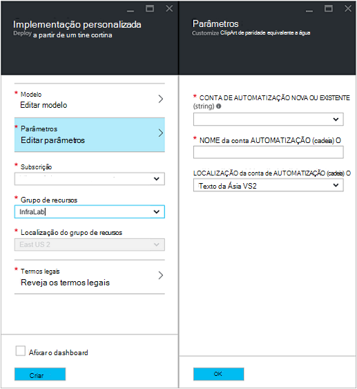
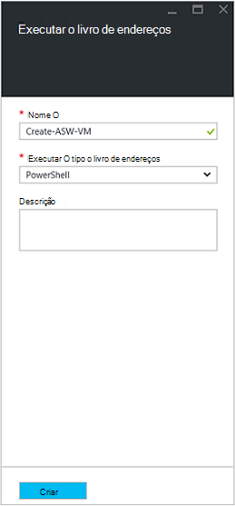
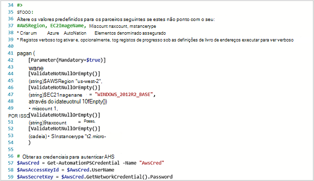
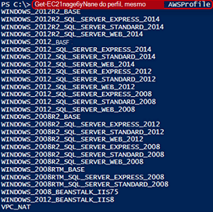
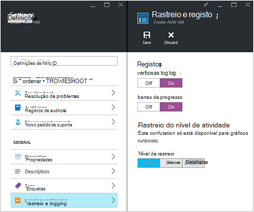
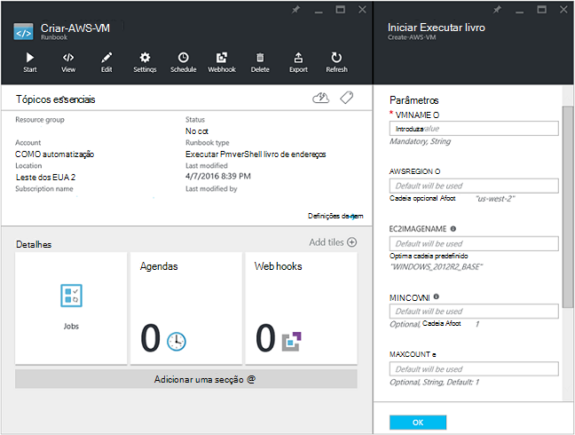
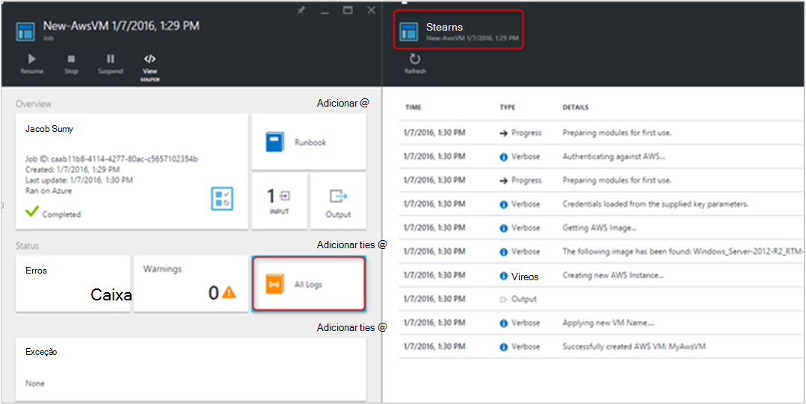
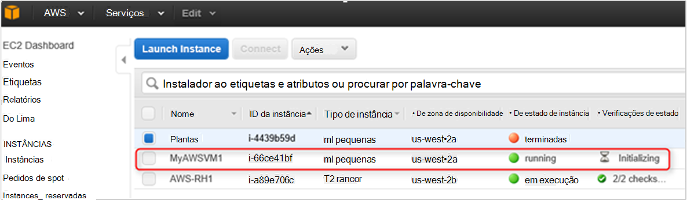

<properties
   pageTitle="A automatização de implementação de uma VM no Amazon Web Services | Microsoft Azure"
   description="Este artigo demonstra como utilizar o Azure automatização para automatizar a criação de um VM de serviço Web Amazon"
   services="automation"
   documentationCenter=""
   authors="mgoedtel"
   manager="jwhit"
   editor="" />
<tags
   ms.service="automation"
   ms.devlang="na"
   ms.topic="article"
   ms.tgt_pltfrm="na"
   ms.workload="na"
   ms.date="08/17/2016"
   ms.author="tiandert; bwren" />

# <a name="azure-automation-scenario---provision-an-aws-virtual-machine"></a>Cenário de automatização Azure - aprovisionar uma máquina de virtual AWS 

Neste artigo, iremos demonstram como pode tirar partido Azure automatização para Aprovisionar uma máquina virtual na sua subscrição do serviço de Web Amazon (AWS) e atribua um nome específico – que se refere AWS como "etiquetagem" a VM a esse VM.

## <a name="prerequisites"></a>Pré-requisitos

Para efeitos deste artigo, tem de ter uma conta de automatização do Azure e uma subscrição do AWS. Para mais informações sobre como configurar uma conta de automatização do Azure e configurá-la com as credenciais de subscrição AWS, reveja [Configurar autenticação com os serviços Web Amazon](../automation/automation-sec-configure-aws-account.md).  Esta conta deverá ser criada ou atualizada com as suas credenciais de subscrição AWS antes de continuar, podemos fizer referência a esta conta nos passos abaixo.


## <a name="deploy-amazon-web-services-powershell-module"></a>Implementar Amazon Web Services PowerShell módulo

Os nossos VM aprovisionamento livro execuções irá tirar partido o módulo AWS PowerShell fazer o seu trabalho. Execute os seguintes passos para adicionar o módulo à sua conta de automatização está configurada com as suas credenciais de subscrição AWS.  

1. Abra o browser e navegue para a [Galeria de PowerShell](http://www.powershellgallery.com/packages/AWSPowerShell/) e clique na **Implementar a automatização Azure botão**.<br> 

2. São redirecionado para a página de início de sessão Azure e depois de autenticação, será encaminhado para o Portal do Azure e apresentados com a seguinte pá.<br> 

3. Selecione o grupo de recursos a partir da lista pendente do **Grupo de recursos** e na pá parâmetros, forneça as seguintes informações:
   * A partir da lista pendente **novo ou existente automatização conta (cadeia)** selecione **existente**.  
   * Na caixa **Nome da conta automatização (cadeia)** , escreva o nome da conta de automatização que inclui as credenciais para a sua subscrição AWS exacto.  Por exemplo, se tiver criado uma conta dedicada denominada **AWSAutomation**, em seguida, que é o que escreve na caixa.
   * Selecione a região apropriada a partir da lista pendente de **Localização da conta de automatização** .

4. Quando tiver concluído a introduzir as informações necessárias, clique em **Criar**.

    >[AZURE.NOTE]Enquanto importar um módulo do PowerShell para Azure automatização, é também extrair os cmdlets e estas actividades não serão apresentados até o módulo completamente já terminou importar e extrair os cmdlets. Este processo pode demorar alguns minutos.  
<br>
5. No Portal do Azure, abre a sua conta de automatização referenciada no passo 3.
6. Clique no mosaico **elementos** e no pá a **elementos** , selecione o mosaico **módulos** .
7. Na pá **módulos** irá ver o módulo **AWSPowerShell** na lista.

## <a name="create-aws-deploy-vm-runbook"></a>Criar AWS implementar o livro de execuções VM

Depois de ter sido implementado o módulo do PowerShell AWS, podemos pode agora seja o autor um livro de execuções para automatizar uma máquina virtual AWS utilizando um script PowerShell de aprovisionamento. Os passos abaixo irão demonstram como tirar partido nativo script do PowerShell no Azure automatização.  

>[AZURE.NOTE] Para mais opções e obter informações sobre este script, visite o [PowerShell Gallery](https://www.powershellgallery.com/packages/New-AwsVM/DisplayScript).


1. Transferir o script do PowerShell AwsVM novo a partir da Galeria de PowerShell ao abrir uma sessão do PowerShell e escrever o seguinte procedimento:<br>
   ```
   Save-Script -Name New-AwsVM -Path \<path\>
   ```
<br>
2. A partir do Portal do Azure, abre a sua conta de automatização e clique no mosaico **Runbooks** .  
3. A partir do pá **Runbooks** , selecione **Adicionar um livro de execuções**.
4. No pá **Adicionar um livro de execuções** , selecione **Criar rápida** (criar um novo livro de execuções).
5. No pá de propriedades **livro execuções** , escreva um nome na caixa Nome do seu livro de execuções e o **tipo de livro execuções** lista pendente selecione **PowerShell**e, em seguida, clique em **Criar**.<br> 
6. Quando for apresentada a pá Editar livro de execuções do PowerShell, copiar e colar o script do PowerShell para o livro de execuções tela de criação.<br> <br>

    >[AZURE.NOTE] Tenha em atenção o seguinte quando trabalhar com o exemplo de script do PowerShell:
    >
    > - Livro de execuções contém um número de valores predefinidos do parâmetro. Fórum avaliar todos os valores predefinidos e atualize se necessário.
    > - Se tiver armazenado as suas credenciais AWS como um activo credencial dado um nome diferente **AWScred**, terá de atualizar o script na linha 57 para corresponder em conformidade.  
    > - Quando trabalha com os comandos de AWS clip no PowerShell, especialmente com este livro de execuções do exemplo, tem de especificar a região AWS. Caso contrário, os cmdlets irá falhar.  Ver o tópico AWS [Especificar região AWS](http://docs.aws.amazon.com/powershell/latest/userguide/pstools-installing-specifying-region.html) nas ferramentas de AWS para documento PowerShell para obter mais detalhes.  
<br>
7. Para obter uma lista de nomes de imagem da sua subscrição AWS, inicie o ISE do PowerShell e importar o módulo do PowerShell AWS.  Autenticar AWS substituindo **Get-AutomationPSCredential** no seu ambiente de ISE com **AWScred = Get-credencial**.  Isto irá pedir-lhe para as suas credenciais e pode fornecer o seu **ID de chave do Access** para o nome de utilizador e uma **Tecla de acesso de palavra-passe** para a palavra-passe.  Veja o exemplo abaixo:

        #Sample to get the AWS VM available images
        #Please provide the path where you have downloaded the AWS PowerShell module
        Import-Module AWSPowerShell
        $AwsRegion = "us-west-2"
        $AwsCred = Get-Credential
        $AwsAccessKeyId = $AwsCred.UserName
        $AwsSecretKey = $AwsCred.GetNetworkCredential().Password

        # Set up the environment to access AWS
        Set-AwsCredentials -AccessKey $AwsAccessKeyId -SecretKey $AwsSecretKey -StoreAs AWSProfile
        Set-DefaultAWSRegion -Region $AwsRegion

        Get-EC2ImageByName -ProfileName AWSProfile
   É devolvido o seguinte resultado:<br>
     
8. Copiar e colar um dos nomes de imagem numa variável de automatização como referenciado no livro de execuções como **$InstanceType**. Uma vez que neste exemplo estamos a utilizar o AWS gratuito camadas subscrição, vamos utilizar **t2.micro** para o nosso exemplo livro execuções.
9. Guardar o livro de execuções, em seguida, clique em **Publicar** para publicar o livro de execuções e, em seguida, **Sim** quando lhe for pedido.


### <a name="testing-the-aws-vm-runbook"></a>Livro de execuções AWS VM a testar
Antes de prosseguir com testes livro de execuções, precisamos de verificar algumas coisas. Especificamente:

   -  Foi criado um ativo para autenticar contra AWS denominados **AWScred** ou o script foi atualizado para o nome do seu recurso de credenciais de referência.  
   -  O módulo AWS PowerShell tenha sido importado na automatização do Azure
   -  Foi criado um novo livro de execuções e valores de parâmetros foram verificados e actualizados sempre que necessário
   -  Foram definidas **no** **verbosas registos** e, opcionalmente, **registos de progresso** em livro de execuções definição **rastreio e registo** .<br> 

1. Pretendemos iniciar o livro de execuções, por isso, clique em **Iniciar** e, em seguida, clique em **OK** quando abre o livro de execuções iniciar pá.
2. Pá iniciar o livro de execuções, fornece um **VMname**.  Aceite os valores predefinidos para os outros parâmetros pré-configurado no script anterior.  Clique em **OK** para iniciar a tarefa de livro execuções.<br> 
3. É aberto um painel de tarefas para a tarefa de livro execuções podemos acabou de criar. Feche o painel de presente.
4. Pode ver o progresso da tarefa e vista de **fluxos de** saída ao selecionar o mosaico de **Todos os registos** de pá de tarefa o livro execuções.<br> 
5. Para confirmar que a VM está a ser aprovisionada, inicie a sessão na consola de gestão de AWS se atualmente não iniciou.<br> 

## <a name="next-steps"></a>Próximos passos
-   Para começar a trabalhar com gráficos runbooks, consulte o artigo [meu livro de execuções gráfico primeiro](automation-first-runbook-graphical.md)
-   Para começar a trabalhar com runbooks de fluxo de trabalho do PowerShell, consulte o artigo [meu livro de execuções de fluxo de trabalho de PowerShell primeiro](automation-first-runbook-textual.md)
-   Para saber mais sobre tipos de livro execuções, os respetivos vantagens e limitações, consulte o artigo [tipos de livro execuções de automatização do Azure](automation-runbook-types.md)
-   Para mais informações sobre o PowerShell script suporta a funcionalidade, consulte o artigo [de suporte no Azure automatização de script do PowerShell nativo](https://azure.microsoft.com/blog/announcing-powershell-script-support-azure-automation-2/)
