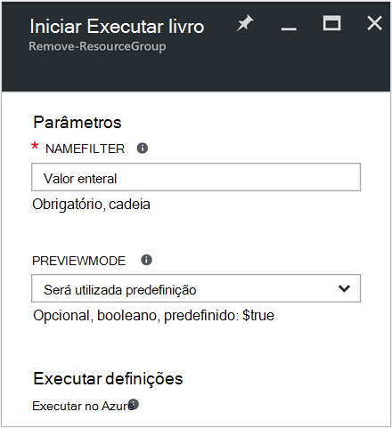

<properties
    pageTitle="Automatizar a remoção de grupos de recursos | Microsoft Azure"
    description="Versão do fluxo de trabalho do PowerShell de um cenário de automatização do Azure incluindo runbooks para remover todos os grupos de recursos na sua subscrição."
    services="automation"
    documentationCenter=""
    authors="MGoedtel"
    manager="jwhit"
    editor=""
    />
<tags
    ms.service="automation"
    ms.workload="tbd"
    ms.tgt_pltfrm="na"
    ms.devlang="na"
    ms.topic="get-started-article"
    ms.date="09/26/2016"
    ms.author="magoedte"/>

# Cenário de automatização Azure - automatizar a remoção de grupos de recursos

Muitos clientes criam mais do que um grupo de recursos. Algumas podem ser utilizadas para gerir aplicações de produção e outras pessoas podem ser utilizadas como desenvolvimento, testar e teste ambientes. Automatizar a implementação destes recursos são uma coisa, mas ser capaz de encerrar um grupo de recursos com um clique do botão é outra. Pode simplificar esta tarefa de gestão comuns utilizando o Azure automatização. Isto é útil se estiver a trabalhar com uma subscrição do Azure que tem um limite de despesas através de uma oferta de membro como MSDN ou o programa Microsoft Partner Network Cloud Essentials.

Este cenário baseia-se um livro de execuções do PowerShell e foi concebido para remover um ou mais grupos de recursos que especificar da sua subscrição. É a predefinição do livro de execuções testar antes de continuar. Este procedimento garante que acidentalmente não elimina o grupo de recursos antes de estiver pronto para concluir este procedimento.   

## Obter o cenário

Este cenário é constituída por um livro de execuções do PowerShell que pode transferir a partir da [Galeria do PowerShell](https://www.powershellgallery.com/packages/Remove-ResourceGroup/1.0/DisplayScript). Também pode importar diretamente a partir da [Galeria de livro execuções](automation-runbook-gallery.md) no portal do Azure.  

Livro execuções | Descrição|
----------|------------|
Remover ResourceGroup | Remove um ou mais grupos de recursos Azure e recursos associados da subscrição.  
 
Os parâmetros de entrada seguintes são definidos para este livro de execuções:

Parâmetro | Descrição|
----------|------------|
NameFilter (obrigatório) | Especifica um filtro de nome para limitar os grupos de recursos que pretenda sobre como eliminar. Pode ser efetuada com múltiplos valores utilizando uma lista separados por vírgulas. O filtro não está entre maiúsculas e minúsculas e irá corresponder a qualquer grupo de recursos que contém a cadeia.|
PreviewMode (opcional) | Executa o livro de execuções para ver quais os grupos de recursos ser eliminados, mas não demora nenhuma ação. A predefinição é **Verdadeiro** para ajudar a evitar acidental eliminação de um ou mais grupos de recurso transmitido ao livro de execuções.  

## Instalar e configurar este cenário

### Pré-requisitos

Este livro de execuções autentica através da [conta Azure executar como](automation-sec-configure-azure-runas-account.md).    

### Instalar e publicar a runbooks

Depois de transferir o livro de execuções, pode importá-lo utilizando o procedimento em [Importar livro execuções procedimentos](automation-creating-importing-runbook.md#importing-a-runbook-from-a-file-into-Azure-Automation). Publica o livro de execuções depois-tenha sido importado com êxito para a sua conta de automatização.

## Utilizar o livro de execuções

Os passos seguintes irão guiá-lo através da execução deste livro execuções e da ajuda que se familiarizar com o funcionamento. Que irá apenas ser testar livro de execuções neste exemplo, não realmente eliminar o grupo de recursos.  

1. A partir do portal do Azure, abre a sua conta de automatização e clique em **Runbooks**.
2. Selecione o livro de execuções **ResourceGroup remover** e clique em **Iniciar**.
3. Quando inicia o livro de execuções, abre o **Livro de execuções iniciar** pá e pode configurar os parâmetros. Introduza os nomes dos grupos de recursos na sua subscrição que pode utilizar para testar a ligação e irá danificar sem se eliminado acidentalmente.  

    >[AZURE.NOTE] Certifique-se de **que previewmode** é definido como **Verdadeiro** para evitar eliminar os grupos de recursos selecionado.  **Nota** que este livro de execuções não remove o grupo de recursos que contém a conta de automatização que esteja a executar este livro de execuções.  

4. Depois de ter configurado o parâmetro all valores, clique em **OK**e livro de execuções vai ser em fila de espera para execução.  

Para ver os detalhes da tarefa de livro execuções **Remover ResourceGroup** no portal do Azure, selecione **tarefas** no livro de execuções. A tarefa de resumo apresenta os parâmetros de entrada e na sequência de saída para além de informações gerais sobre a tarefa e quaisquer exceções que ocorreram.  .

A **Tarefa de resumo** inclui mensagens de saída, aviso e fluxos de erro. Seleccione **saída** para ver os resultados detalhados proveniente da execução do livro execuções.  

## Próximos passos

- Para começar a criar o seu próprio livro de execuções, consulte o artigo [criar ou importar um livro de execuções no Azure automatização](automation-creating-importing-runbook.md).
- Para começar com runbooks de fluxo de trabalho do PowerShell, consulte o artigo [meu livro de execuções do fluxo de trabalho do PowerShell primeiro](automation-first-runbook-textual.md).
