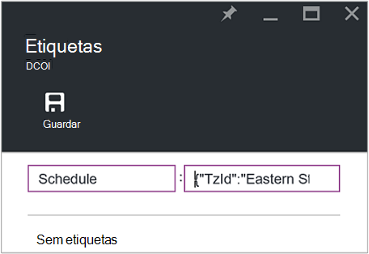

<properties
   pageTitle="Utilizar etiquetas formatados como JSON para criar uma agenda para Azure VM arranque e encerramento | Microsoft Azure"
   description="Este artigo demonstra como utilizar cadeias JSON no etiquetas para automatizar o agendamento da VM arranque e encerramento."
   services="automation"
   documentationCenter=""
   authors="MGoedtel"
   manager="jwhit"
   editor="tysonn" />
<tags
   ms.service="automation"
   ms.devlang="na"
   ms.topic="article"
   ms.tgt_pltfrm="na"
   ms.workload="infrastructure-services"
   ms.date="07/18/2016"
   ms.author="magoedte;paulomarquesc" />

# Cenário de automatização Azure: utilizar etiquetas formatados como JSON para criar uma agenda para Azure VM arranque e encerramento

Os clientes com frequência pretendem agendar o arranque e encerramento das máquinas virtuais para o ajudar a reduzir os custos de subscrição ou suporte negócio e requisitos técnicos.  

Cenário que se segue permite-lhe configurar o arranque automatizado e o encerramento do seu VMs utilizando uma etiqueta denominada agenda a um nível de máquina virtual no Azure ou nível de grupo de recursos. Esta agenda pode ser configurada de Domingo a Sábado com um tempo de arranque e o tempo de encerramento.  

Temos algumas opções de out of box. Estes incluem:
-  [Escala de Máquina Virtual define](../virtual-machine-scale-sets/virtual-machine-scale-sets-overview.md) com as definições de autoscale que permitem-lhe dimensionar ou para fora.
- Serviço de [DevTest Labs](../devtest-lab/devtest-lab-overview.md) , que tem a funcionalidade incorporada do agendamento operações de arranque e encerramento.

No entanto, estas opções suportam apenas cenários específicos e não podem ser aplicados ao VMs infraestrutura-como-a-service (IaaS).   

Quando a etiqueta de agenda é aplicada a um grupo de recursos, também é aplicada a todos os máquinas virtuais dentro desse grupo de recursos. Se uma agenda também diretamente é aplicada a uma VM, a agenda última terá precedência pela seguinte ordem:

1.  Agenda aplicada a um grupo de recursos
2.  Agenda aplicada a um grupo de recursos e máquina virtual no grupo de recursos
3.  Agenda aplicada a uma máquina virtual

Neste cenário, essencialmente, leva-o até uma cadeia JSON com um formato especificado e adiciona-lo como o valor de uma tag denominada agenda. Em seguida, um livro de execuções lista todos os grupos de recursos e máquinas virtuais e identifica as agendas para cada VM com base em cenários listados anteriormente. Em seguida percorre os VMs que têm agendas anexadas e avalia que acção. Por exemplo, determina qual VMs precisa de ser parado, encerrar ou ignoradas.

Estes runbooks autenticar através da [conta Azure executar como](../automation/automation-sec-configure-azure-runas-account.md).

## Transferir o runbooks para o cenário

Este cenário é constituído pelos quatro runbooks PowerShell fluxo de trabalho que pode transferir a partir da [Galeria do TechNet](https://gallery.technet.microsoft.com/Azure-Automation-Runbooks-84f0efc7) ou o repositório de [GitHub](https://github.com/paulomarquesdacosta/azure-automation-scheduled-shutdown-and-startup) para este projeto.

Livro execuções | Descrição
----------|----------
Teste ResourceSchedule | Verifica cada agenda de máquina virtual e executa encerramento ou arranque consoante a agenda.
ResourceSchedule adicionar | Adiciona a etiqueta de agenda para um VM ou grupo de recursos.
ResourceSchedule de actualização | Modifica a etiqueta de agenda existente ao substituí-la com um novo.
Remover ResourceSchedule | Remove a etiqueta de agenda de um VM ou grupo de recursos.

## Instalar e configurar este cenário

### Instalar e publicar a runbooks

Depois de transferir o runbooks, pode importá-los através do procedimento [Criar](automation-creating-importing-runbook.md#importing-a-runbook-from-a-file-into-Azure-Automation)ou importar um livro de execuções no Azure automatização.  Publica cada livro de execuções depois-tenha sido importado com êxito para a sua conta de automatização.

### Adicionar uma agenda ao livro de execuções ResourceSchedule de teste

Siga estes passos para ativar a agenda de livro de execuções ResourceSchedule de teste. Este é o livro de execuções que verifica que máquinas virtuais deve ser iniciadas, encerrar ou deixadas tal como está.

1. A partir do portal do Azure, abre a sua conta de automatização e, em seguida, clique no mosaico de **Runbooks** .
2. No pá **ResourceSchedule de teste** , clique no mosaico de **agendas** .
3. No pá **agendas** , clique em **Adicionar uma agenda**.
4. Na pá **agendas** , selecione **associar uma agenda para o seu livro de execuções**. Em seguida, selecione **criar uma nova agenda**.
5.  No pá **nova agenda** , escreva o nome esta agenda, por exemplo: *HourlyExecution*.
6. Para **Iniciar**a agenda, defina a hora de início para um incremento de hora.
7. Selecione **Periodicidade**e, em seguida, para **que se repita cada intervalo**, selecione **1 hora**.
8. Certifique-se de que o **conjunto de expiração** está definido para **não**e, em seguida, clique em **Criar** para guardar a sua agenda de nova.
9. No pá de opções de **Livro de execuções agenda** , selecione **parâmetros e definições de executar**. Na pá teste ResourceSchedule **parâmetros** , introduza o nome da sua subscrição no campo **SubscriptionName** .  Este é o único parâmetro necessário para ao livro de execuções.  Quando tiver terminado, clique em **OK**.  

A agenda de livro execuções deverá ter o aspeto semelhante ao seguinte quando estiver concluída:

 

## Formatar a cadeia JSON

Esta solução que mostra basicamente demorar um JSON cadeia com um formato especificado e adiciona-a como o valor para uma etiqueta denominado agenda. Em seguida, um livro de execuções lista todos os grupos de recursos e máquinas virtuais e identifica as agendas para cada máquina virtual.

Livro de execuções ciclos sobre as máquinas virtuais que têm agendas anexadas e verifica que ações deverão ser reencaminhadas. Segue-se um exemplo de como as soluções que devem ser formatadas:

    {
       "TzId": "Eastern Standard Time",
        "0": {  
           "S": "11",
           "E": "17"
        },
        "1": {
           "S": "9",
           "E": "19"
        },
        "2": {
           "S": "9",
           "E": "19"
        },
    }

Eis algumas informações detalhadas sobre esta estrutura:

1. O formato desta estrutura JSON está optimizado para contornar a limitação de 256 carateres de um valor de etiqueta única no Azure.

2. *TzId* representa o fuso horário da máquina virtual. Este ID pode ser obtido utilizando a classe de TimeZoneInfo .NET numa sessão de PowerShell –**[System.TimeZoneInfo]::/ GetSystemTimeZones()**.

    

    - Dias da semana são representados com um valor numérico de zero como seis. O valor zero é igual ao Domingo.
    - A hora de início é representada com o atributo **S** e o valor é num formato de 24 horas.
    - A hora de fim ou encerramento é representada com o atributo **"e"** , e o valor é num formato de 24 horas.

    Se os **S** e **E** atributos de cada tem um valor de zero (0), a máquina virtual ser deixada no seu estado de presença no momento da avaliação.   

3. Se pretender ignorar a avaliação para um determinado dia da semana, não adicione uma secção para esse dia da semana. No seguinte exemplo, segunda-feira apenas é avaliada e os outros dias da semana são ignorados:

        {
          "TzId": "Eastern Standard Time",
           "1": {
             "S": "11",
             "E": "17"
           }
        }

## Grupos de recursos de etiqueta ou VMs

Para encerrar VMs, tem de marcar os VMs ou em que se encontram os grupos de recursos. Não são avaliadas em máquinas virtuais que não tem uma etiqueta de agenda. Consequentemente, não são iniciados ou encerrar.

Existem duas formas de grupos de recursos de etiqueta ou VMs com esta solução. Pode fazê-lo diretamente a partir do portal. Ou pode utilizar o ResourceSchedule adicionar, atualizar ResourceSchedule e remover ResourceSchedule runbooks.

### Marcar através do portal

Siga estes passos para marcar uma máquina virtual ou grupo de recursos no portal:

1. Aplanar a cadeia JSON e certifique-se de que não existem ficheiros não são espaços.  A cadeia de caracteres JSON deve ter este aspeto:

        {"TzId":"Eastern Standard Time","0":{"S":"11","E":"17"},"1":{"S":"9","E":"19"},"2": {"S":"9","E":"19"},"3":{"S":"9","E":"19"},"4":{"S":"9","E":"19"},"5":{"S":"9","E":"19"},"6":{"S":"11","E":"17"}}

2. Selecione o ícone de **etiqueta** para um VM ou grupo de recursos aplicar esta agenda.

    
3. Etiquetas são definidas seguir um par de chave/valor. Escreva a **agenda** no campo de **chave** e, em seguida, cole a cadeia JSON no campo de **valor** . Clique em **Guardar**. A nova etiqueta deverá agora aparecer na lista de etiquetas para o seu recurso.

### Etiqueta a partir do PowerShell

Todos os runbooks importados conter informações de ajuda no início do script que descreve como executar a runbooks diretamente a partir do PowerShell. Pode ligar a runbooks ScheduleResource adicionar e atualizar ScheduleResource a partir do PowerShell. Pode fazê-lo, passando parâmetros necessários que permitem-lhe criar ou atualizar a etiqueta de agenda num grupo VM ou recurso fora do portal.  

Para criar, adicionar e eliminar etiquetas através do PowerShell, primeiro tem de [configurar o seu ambiente do PowerShell para Azure](../powershell-install-configure.md). Depois de concluir a configuração, pode continuar com os seguintes passos.

### Criar uma etiqueta de agenda com o PowerShell

1. Abra uma sessão de PowerShell. Em seguida, utilize o exemplo seguinte para autenticar com a sua conta executar como e especifique uma subscrição:   

        Conn = Get-AutomationConnection -Name AzureRunAsConnection
        Add-AzureRMAccount -ServicePrincipal -Tenant $Conn.TenantID `
        -ApplicationId $Conn.ApplicationID -CertificateThumbprint $Conn.CertificateThumbprint
        Select-AzureRmSubscription -SubscriptionName "MySubscription"

2. Defina uma tabela de hash agenda. Eis um exemplo de como devem ser construída:

        $schedule= @{ "TzId"="Eastern Standard Time"; "0"= @{"S"="11";"E"="17"};"1"= @{"S"="9";"E"="19"};"2"= @{"S"="9";"E"="19"};"3"= @{"S"="9";"E"="19"};"4"= @{"S"="9";"E"="19"};"5"= @{"S"="9";"E"="19"};"6"= @{"S"="11";"E"="17"}}

3. Defina os parâmetros que são necessários ao livro de execuções. No seguinte exemplo, vamos está a filtrar uma VM:

        $params = @{"SubscriptionName"="MySubscription";"ResourceGroupName"="ResourceGroup01"; `
        "VmName"="VM01";"Schedule"=$schedule}

    Se estiver a etiquetagem um grupo de recursos, remova o parâmetro de *VMName* a partir da tabela de hash $params da seguinte forma:

        $params = @{"SubscriptionName"="MySubscription";"ResourceGroupName"="ResourceGroup01"; `
        "Schedule"=$schedule}

4. Execute o livro de execuções adicionar ResourceSchedule com os seguintes parâmetros para criar a etiqueta de agenda:

        Start-AzureRmAutomationRunbook -Name "Add-ResourceSchedule" -Parameters $params `
        -AutomationAccountName "AutomationAccount" -ResourceGroupName "ResourceGroup01"

5. Para atualizar um grupo de recursos ou etiqueta de máquina virtual, execute o livro de execuções **ResourceSchedule actualização** com os seguintes parâmetros:

        Start-AzureRmAutomationRunbook -Name "Update-ResourceSchedule" -Parameters $params `
        -AutomationAccountName "AutomationAccount" -ResourceGroupName "ResourceGroup01"

### Remover uma etiqueta de agenda com o PowerShell

1. Abra uma sessão do PowerShell e execute o seguinte procedimento para autenticar com a sua conta executar como e para seleccionar e especificar uma subscrição:

        Conn = Get-AutomationConnection -Name AzureRunAsConnection
        Add-AzureRMAccount -ServicePrincipal -Tenant $Conn.TenantID `
        -ApplicationId $Conn.ApplicationID -CertificateThumbprint $Conn.CertificateThumbprint
        Select-AzureRmSubscription -SubscriptionName "MySubscription"

2. Defina os parâmetros que são necessários ao livro de execuções. No seguinte exemplo, vamos está a filtrar uma VM:

        $params = @{"SubscriptionName"="MySubscription";"ResourceGroupName"="ResourceGroup01" `
        ;"VmName"="VM01"}

    Se estiver a remover uma etiqueta a partir de um grupo de recursos, remova o parâmetro de *VMName* a partir da tabela de hash $params da seguinte forma:

        $params = @{"SubscriptionName"="MySubscription";"ResourceGroupName"="ResourceGroup01"}

3. Execute o livro de execuções ResourceSchedule remover para remover a etiqueta de agenda:

        Start-AzureRmAutomationRunbook -Name "Remove-ResourceSchedule" -Parameters $params `
        -AutomationAccountName "AutomationAccount" -ResourceGroupName "ResourceGroup01"

4. Para atualizar um grupo de recursos ou etiqueta de máquina virtual, execute o livro de execuções remover ResourceSchedule com os seguintes parâmetros:

        Start-AzureRmAutomationRunbook -Name "Remove-ResourceSchedule" -Parameters $params `
        -AutomationAccountName "AutomationAccount" -ResourceGroupName "ResourceGroup01"

>[AZURE.NOTE] Vamos Recomendamos que é importante monitorizar estes runbooks (e os Estados de máquina virtual) para verificar que estão a ser encerrar máquinas virtuais para baixo e iniciado em conformidade.  

Para ver os detalhes da tarefa de livro execuções teste ResourceSchedule no portal do Azure, selecione o mosaico de **tarefas** do livro de execuções. A tarefa de resumo apresenta os parâmetros de entrada e na sequência de saída, para além de informações gerais sobre a tarefa e quaisquer exceções que tenham ocorrido.  

A **Tarefa de resumo** inclui mensagens de saída, aviso e fluxos de erro. Selecione o mosaico de **saída** para ver os resultados detalhados da execução livro execuções.

  

## Próximos passos

-  Para começar a trabalhar com runbooks de fluxo de trabalho do PowerShell, consulte o [meu livro de execuções de fluxo de trabalho de PowerShell primeiro](automation-first-runbook-textual.md).
-  Para saber mais sobre tipos de livro execuções e os respetivos vantagens e limitações, consulte o artigo [tipos de livro execuções do Azure automatização](automation-runbook-types.md).
-  Para mais informações sobre o PowerShell script suporta funcionalidades, consulte o artigo [script do PowerShell nativo suporta automatização Azure](https://azure.microsoft.com/blog/announcing-powershell-script-support-azure-automation-2/).
-  Para saber mais sobre o registo do livro execuções e de saída, consulte o artigo [saída do livro execuções e mensagens no Azure automatização](automation-runbook-output-and-messages.md).
-  Para saber mais sobre uma conta Azure executar como e como autenticar o runbooks por utilizá-lo, consulte o artigo [runbooks autenticar com a conta Azure executar como](../automation/automation-sec-configure-azure-runas-account.md).
