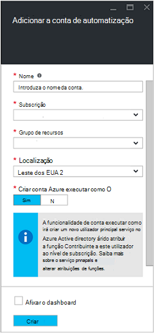
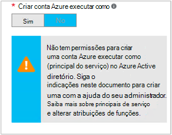

<properties
   pageTitle="Configurar conta de utilizador do Azure AD | Microsoft Azure"
   description="Este artigo descreve como configurar as credenciais de conta de utilizador do Azure AD para runbooks no Azure automatização para autenticar contra processador e ASM."
   services="automation"
   documentationCenter=""
   authors="MGoedtel"
   manager="jwhit"
   editor="tysonn"
   keywords="conta de utilizador do Azure do active directory utilizador, azure service gestão, azure ad" />
<tags
   ms.service="automation"
   ms.devlang="na"
   ms.topic="get-started-article"
   ms.tgt_pltfrm="na"
   ms.workload="infrastructure-services"
   ms.date="09/12/2016"
   ms.author="magoedte" />

# Autenticar Runbooks com gestão de serviços Azure e o Gestor de recursos

Este artigo descreve os passos que deve efetuar para configurar uma conta de utilizador do Azure AD para runbooks Azure automatização executar relativamente a recursos de gestão de serviço do Azure (ASM) ou Gestor de recursos do Azure (processador).  Enquanto este continua a ser que uma identidade de autenticação suportados para o seu processador com base runbooks, o método recomendado está a utilizar a nova conta Azure executar como.       

## Criar um novo utilizador do Azure Active Directory

1. Inicie sessão no Portal clássica do Azure como um administrador de serviços para a subscrição Azure que pretende gerir.
2. Selecione **Do Active Directory**e, em seguida, selecione o nome do diretório da sua organização.
3. Selecione o separador de **utilizadores** e, em seguida, na área de comando, selecione **Adicionar utilizador**.
4. Na página **diga-nos acerca deste utilizador** , em **tipo de utilizador**, selecione **novo utilizador na sua organização**.
5. Introduza um nome de utilizador.  
6. Selecione o nome do directório que está associado a sua subscrição do Azure na página do Active Directory.
7. Na página de **perfil de utilizador** , forneça um primeiro e último nome, um nome amigável e utilizador a partir da lista de **funções** .  Faça não **Ativar a autenticação Multifator**.
8. Nota nome completo do utilizador e a palavra-passe temporária.
9. Selecione **Definições > administradores > Adicionar**.
10. Escreva o nome de utilizador completo do utilizador que criou.
11. Selecione a subscrição que pretende que o utilizador para gerir.
12. Inicie sessão fora do Azure e, em seguida, inicie sessão novamente com a conta que acabou de criar. Vai ser-lhe para alterar a palavra-passe de utilizador.

## Criar uma conta de automatização no Portal clássica do Azure
Nesta secção, irá efetuar os seguintes passos para criar uma nova conta de automatização do Azure no Portal do Azure que será utilizada com o seu runbooks gestão de recursos no modo de ASM e processador.  

>[AZURE.NOTE] Contas de automatização criadas com o Portal clássica Azure podem ser geridas por tanto o Azure clássica e Azure Portal e um conjunto de cmdlets. Assim que a conta estiver criada, não fizer diferença como criar e gerir os recursos dentro da conta. Se estiver a planear continuar a utilizar o Portal do Azure clássica, em seguida, deve utilizá-lo em vez de Portal do Azure para criar todas as contas de automatização.

1. Inicie sessão no Portal clássica do Azure como um administrador de serviços para a subscrição Azure que pretende gerir.
2. Selecione **Automatização**.
3. Na página de **Automatização** , selecione **criar uma conta de automatização**.
4. Na caixa **criar uma conta de automatização** , escreva um nome para a sua nova conta de automatização e selecione uma **região** a partir da lista pendente.  
5. Clique em **OK** para aceitar as definições e criar a conta.
6. Após ter sido criada, este será listado na página de **Automatização** .
7. Clique na conta de e -lo irá levá-lo para a página do Dashboard.  
8. Na página do Dashboard de automatização, selecione **recursos**.
9. Na página **elementos** , selecione **Adicionar definições** localizada na parte inferior da página.
10. Na página **Definições de adicionar** , selecione **Adicionar credenciais**.
11. Na página **Definir credenciais** , selecione **Credenciais do Windows PowerShell** a partir da lista pendente de **Tipo de credencial** e forneça um nome para a credencial.
12. No seguinte **Definir credenciais** página, escreva o nome de utilizador da conta de utilizador de AD criado anteriormente no campo **Nome de utilizador** e a palavra-passe nos campos **palavra-passe** e **Confirmar palavra-passe** . Clique em **OK** para guardar as alterações.

## Criar uma conta de automatização no Portal do Azure

Nesta secção, irá efetuar os seguintes passos para criar uma nova conta de automatização do Azure no Portal do Azure que será utilizada com os recursos de gestão de runbooks no modo de processador.  

1. Inicie sessão no portal do Azure como um administrador de serviços para a subscrição Azure que pretende gerir.
2. Selecione **contas de automatização**.
3. Na pá automatização contas, clique em **Adicionar**. 
2. No pá **Adicionar conta de automatização** , na caixa **nome** , escreva um nome para a sua nova conta de automatização.
5. Se tiver mais do que uma subscrição, especifique a uma para a nova conta, bem como um **grupo de recursos** nova ou existente e um **localização**de centro de dados Azure.
3. Selecione o valor de **n** para a opção **Criar Azure executar como conta** e clique no botão **Criar** .  

    >[AZURE.NOTE] Se optar por não criar a conta executar como ao selecionar a opção **n**, será apresentada uma mensagem de aviso a pá **Adicionar conta de automatização** .  Enquanto a conta é criada e atribuída à função de **Contribuinte** na subscrição, não terá uma identidade de autenticação correspondente dentro do seu serviço de diretório de subscrições por conseguinte, sem aceder e recursos na sua subscrição.  Isto irá impedir qualquer runbooks referenciar esta conta a partir de ser capaz de autenticar e efetuar tarefas de recursos de processador.

    

4. Enquanto o Azure cria a conta de automatização, pode controlar o progresso em **notificações** a partir do menu.

Quando a criação da credencial estiver concluída, em seguida, terá de criar um activo credenciais para associar a conta de automatização com a conta de utilizador do AD criou anteriormente.  Lembre-se que criámos apenas a conta de automatização e não está associada uma identidade de autenticação.  Execute os passos descritos nos [elementos de credencial artigo de automatização do Azure](../automation/automation-credentials.md#creating-a-new-credential) e introduza o valor para **nome de utilizador** no formato **domínio \ utilizador**.

## Utilize a credencial de um livro de execuções

Pode obter a credencial de um livro de execuções utilizando a atividade de [Obter AutomationPSCredential](http://msdn.microsoft.com/library/dn940015.aspx) e, em seguida, utilizá-la com [Adicionar AzureAccount](http://msdn.microsoft.com/library/azure/dn722528.aspx) para ligar à sua subscrição do Azure. Se a credencial for um administrador de múltiplas subscrições Azure, também deve utilizar [Selecione AzureSubscription](http://msdn.microsoft.com/library/dn495203.aspx) para especificar o correto. Isto é mostrado no exemplo do Windows PowerShell abaixo que normalmente será apresentado na parte superior da maioria dos runbooks de automatização do Azure.

    $cred = Get-AutomationPSCredential –Name "myuseraccount.onmicrosoft.com"
    Add-AzureAccount –Credential $cred
    Select-AzureSubscription –SubscriptionName "My Subscription"

Deverá repetir estas linhas após qualquer [pontos de verificação](http://technet.microsoft.com/library/dn469257.aspx#bk_Checkpoints) no seu livro de execuções. Se o livro de execuções está suspensa e, em seguida, currículos no outro trabalhador, em seguida,-terão efetuar a autenticação novamente.

## Próximos passos
* Rever os tipos de livro de execuções diferente e passos para criar o seu próprio runbooks do seguinte artigo [tipos de livro execuções de automatização do Azure](../automation/automation-runbook-types.md)
