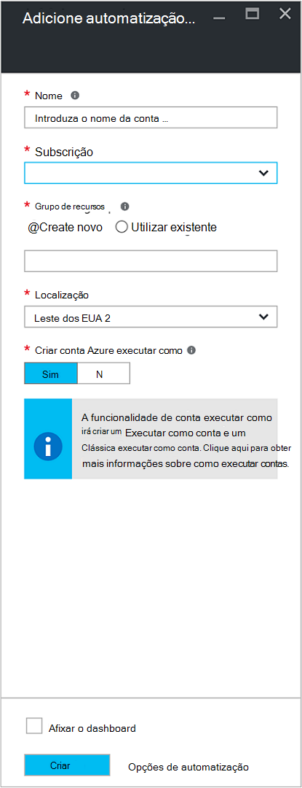
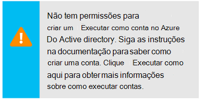
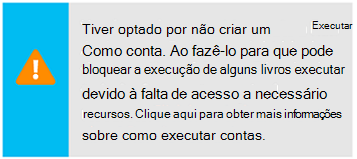
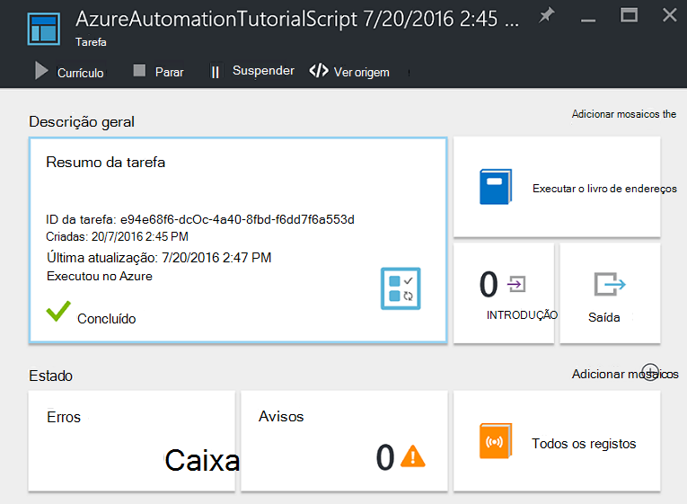
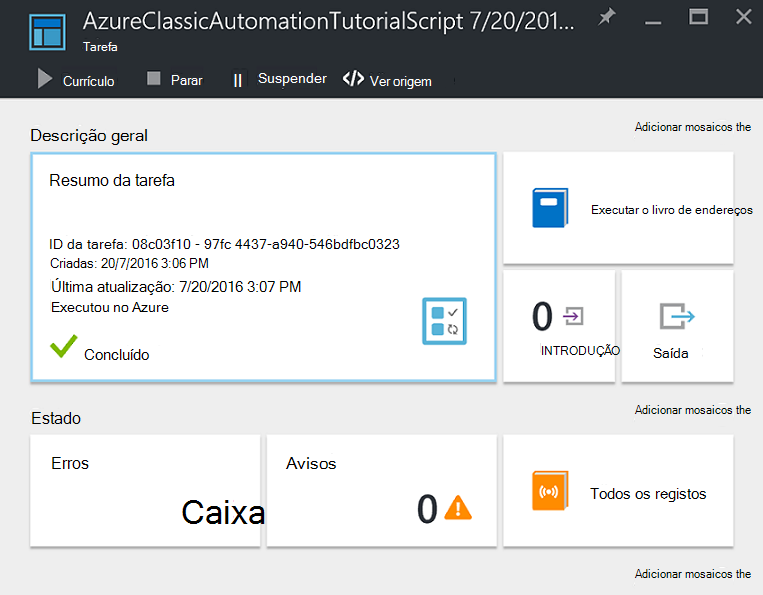
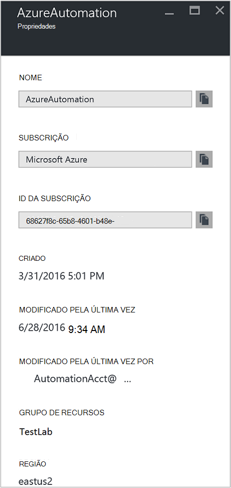

<properties
    pageTitle="Configurar o Azure executar como conta | Microsoft Azure"
    description="Tutorial que irá guiar pela utilização de criação, testar e de exemplo de autenticação principal de segurança no Azure automatização."
    services="automation"
    documentationCenter=""
    authors="mgoedtel"
    manager="jwhit"
    editor=""
    keywords="nome principal do serviço, setspn, autenticação azure"/>
<tags
    ms.service="automation"
    ms.workload="tbd"
    ms.tgt_pltfrm="na"
    ms.devlang="na"
    ms.topic="get-started-article"
    ms.date="08/17/2016"
    ms.author="magoedte"/>

# Autenticar Runbooks com a conta Azure executar como

Este tópico irá mostrar-lhe como configurar uma conta de automatização a partir do portal do Azure ao utilizar a funcionalidade de conta executar como para autenticar recursos de gestão de runbooks no Gestor de recursos do Azure ou gestão de serviço do Azure.

Quando cria uma nova conta de automatização no portal do Azure, cria automaticamente:

- Executar como conta que cria um novo principal de serviço no Azure Active Directory, um certificado e atribui o controlo de acesso baseado em funções de contribuinte RBCA (), que irão ser utilizado para gerir os recursos de Gestor de recursos utilizando runbooks.   
- Clássica executar como conta ao carregá um certificado de gestão, que será utilizado para gerir o serviço de gestão de Azure ou recursos clássicos utilizando runbooks.  

Isto simplifica o processo para si e ajuda a começar rapidamente criar e implementar runbooks para suportar as suas necessidades de automatização.      

Utilizar uma conta de executar como e clássica executar, pode:

- Fornece uma maneira padronizada para autenticar com Azure ao gerir os recursos de Gestor de recursos do Azure ou gestão de serviço do Azure a partir do runbooks no portal do Azure.  
- Automatize a utilização de runbooks global configurado no Azure alertas.

>[AZURE.NOTE] A [funcionalidade de integração do alerta](../monitoring-and-diagnostics/insights-receive-alert-notifications.md) de Azure com Runbooks Global automatização requer uma conta de automatização que está configurada com uma executar de como e clássica executar como conta. Pode selecionar uma conta de automatização que já tem uma conta de executar como e clássica executar como definida ou selecione para criar um novo.

Iremos mostrar-lhe como criar a conta de automatização a partir do portal Azure, atualizar uma conta de automatização através do PowerShell e demonstrar como autenticar-se no seu runbooks.

Antes de podemos fazê-lo, existem algumas coisas que deve compreender e ter em conta antes de continuar.

1. Isto não afeta as contas de automatização existentes já criadas o classic ou modelo de implementação do Gestor de recursos.  
2. Só irá funcionar para contas de automatização criadas através do portal do Azure.  Tentar criar uma conta a partir do portal clássico não serão replicadas executar como configuração da conta de.
3. Se possui atualmente runbooks e ativos (ou seja, agendas, variáveis, etc.) criados anteriormente para gerir os recursos clássicos e pretende que essas runbooks para autenticar com a nova conta clássica executar como, terá de migrá-las para a nova conta de automatização ou atualizar a sua conta existente utilizando o script do PowerShell abaixo.  
4. Para autenticar utilizando as novas contas de executar como e executar clássica como o automatização, terá de modificar o seu runbooks existente com o código de exemplo abaixo.  **Nota** que está a executar como conta para a autenticação de recursos de Gestor de recursos utilizando o serviço baseado no certificado principal e a conta clássica executar como é para autenticar relativamente a recursos de gestão de serviços com o certificado de gestão.     

## Criar uma nova conta de automatização a partir do Portal do Azure

Nesta secção, irá efetuar os seguintes passos para criar uma nova conta de automatização do Azure a partir do portal do Azure.  Esta ação cria executar como tanto clássica executar como conta.  

>[AZURE.NOTE] O utilizador a executar estes passos, *tem* de ser um membro da função Admins de subscrição e o administrador de cocriação da subscrição do qual está a conceder acesso para a subscrição para o utilizador.  O utilizador também tem de ser adicionado como um utilizador para que as subscrições predefinido do Active Directory; a conta não é necessário ser atribuído a uma função privilegiada.

1. Inicie sessão no portal do Azure com uma conta que é um membro da função Admins de subscrição e o administrador de cocriação da subscrição.
2. Selecione **contas de automatização**.
3. Na pá automatização contas, clique em **Adicionar**. 

    >[AZURE.NOTE]Se vir o aviso seguinte no pá a **Adicionar a conta de automatização** , é porque a sua conta não é um membro da função Admins de subscrição e co-administração da subscrição. 

4. No pá **Adicionar conta de automatização** , na caixa **nome** , escreva um nome para a sua nova conta de automatização.
5. Se tiver mais do que uma subscrição, especifique um para a nova conta, bem como um **grupo de recursos** nova ou existente e um **localização**de centro de dados Azure.
6. Verifique se o valor **que Sim** está selecionado para a opção **Criar Azure executar como conta** e clique no botão **Criar** .  

    >[AZURE.NOTE] Se optar por não criar a conta executar como ao selecionar a opção **n**, será apresentada uma mensagem de aviso a pá **Adicionar conta de automatização** .  Enquanto a conta estiver criada no portal do Azure, não terá uma identidade de autenticação correspondente dentro do seu classic ou serviço de diretório de subscrição do Gestor de recursos e por conseguinte, sem acesso aos recursos na sua subscrição.  Isto irá impedir qualquer runbooks referenciar esta conta a partir de ser capaz de autenticar e executar tarefas relativamente a recursos nesses modelos de implementação.

    > 
Quando o capital de serviço não é criado a função Contribuinte não será atribuída.

7. Enquanto o Azure cria a conta de automatização, pode controlar o progresso em **notificações** a partir do menu.

### Recursos incluídos

Quando a conta de automatização é criada com êxito, vários recursos são automaticamente criados por si.  A tabela seguinte resume recursos para a conta executar como. 

Recurso|Descrição
--------|-----------
Livro de execuções AzureAutomationTutorial|Uma exemplo PowerShell livro execuções que demonstra como autenticar através da conta executar como e obtém todos os recursos de Gestor de recursos.
Livro de execuções AzureAutomationTutorialScript|Uma exemplo PowerShell livro execuções que demonstra como autenticar através da conta executar como e obtém todos os recursos de Gestor de recursos.
AzureRunAsCertificate|Elementos de certificado automaticamente criado durante a criação de conta de automatização ou utilizar o script do PowerShell abaixo para uma conta existente.  Permite-lhe autenticar com Azure, de modo a que possa gerir Gestor de recursos do Azure recursos a partir do runbooks.  Este certificado tem uma esperança de vida de um ano.
AzureRunAsConnection|Elementos de ligação automaticamente criado durante a criação de conta de automatização ou utilizar o script do PowerShell abaixo para uma conta existente.

A tabela seguinte resume recursos para a conta clássica executar como. 

Recurso|Descrição
--------|-----------
Livro de execuções AzureClassicAutomationTutorial|Uma livro exemplo execuções que obtém todos os VMs clássica numa subscrição através da clássica executar como conta (certificado) e, em seguida, exporta o nome VM e o estado.
Livro de execuções AzureClassicAutomationTutorial Script|Uma livro exemplo execuções que obtém todos os VMs clássica numa subscrição através da clássica executar como conta (certificado) e, em seguida, exporta o nome VM e o estado.
AzureClassicRunAsCertificate|Elementos de certificado criado automaticamente que são utilizado para autenticar com Azure, de modo a que possa gerir Azure recursos clássicos de runbooks.  Este certificado tem uma esperança de vida de um ano.
AzureClassicRunAsConnection|Elementos de ligação criado automaticamente que são utilizado para autenticar com Azure, de modo a que possa gerir Azure recursos clássicos de runbooks.  

## Verificar a autenticação do executar como

Vamos fará seguinte um teste pequenas para confirmar que é possível autenticar com êxito utilizando a nova conta executar como.     

1. No Portal do Azure, abra a conta de automatização que criou anteriormente.  
2. Clique no mosaico **Runbooks** para abrir a lista de runbooks.
3. Selecione o livro de execuções **AzureAutomationTutorialScript** e, em seguida, clique em **Iniciar** para iniciar o livro de execuções.  Vai receber um pedido a confirmar que pretende iniciar o livro de execuções.
4. É criada uma [tarefa de livro execuções](automation-runbook-execution.md) , a tarefa é apresentada pá e o estado da tarefa apresentada no mosaico **Resumo da tarefa** .  
5. O estado da tarefa será iniciado como *em fila de espera* , indicando que está à espera para um livro execuções trabalhador na nuvem para se tornar disponível. Em seguida, passará para *Iniciar* quando um trabalhador afirmações o projecto e, em seguida, *em execução* quando o livro de execuções começa realmente a funcionar.  
6. Quando concluir a tarefa de livro execuções, podemos deverá ver estado de **concluída**.   
7. Para ver os resultados detalhados do livro de execuções, clique no mosaico de **saída** .
8. No pá **saída** , deverá ver tem com êxito autenticados e devolveram uma lista de todos os recursos disponíveis no grupo de recursos.
9. Feche o pá de **saída** para regressar ao pá a **Tarefa de resumo** .
13. Feche o **Resumo da tarefa** e o correspondente livro execuções pá **AzureAutomationTutorialScript** .

## Verificar a autenticação do clássico executar como

Vamos fará seguinte um teste pequenas para confirmar que é possível autenticar com êxito utilizando a nova conta clássica executar como.     

1. No Portal do Azure, abra a conta de automatização que criou anteriormente.  
2. Clique no mosaico **Runbooks** para abrir a lista de runbooks.
3. Selecione o livro de execuções **AzureClassicAutomationTutorialScript** e, em seguida, clique em **Iniciar** para iniciar o livro de execuções.  Vai receber um pedido a confirmar que pretende iniciar o livro de execuções.
4. É criada uma [tarefa de livro execuções](automation-runbook-execution.md) , a tarefa é apresentada pá e o estado da tarefa apresentada no mosaico **Resumo da tarefa** .  
5. O estado da tarefa será iniciado como *em fila de espera* , indicando que está à espera para um livro execuções trabalhador na nuvem para se tornar disponível. Em seguida, passará para *Iniciar* quando um trabalhador afirmações o projecto e, em seguida, *em execução* quando o livro de execuções começa realmente a funcionar.  
6. Quando concluir a tarefa de livro execuções, podemos deverá ver estado de **concluída**.   
7. Para ver os resultados detalhados do livro de execuções, clique no mosaico de **saída** .
8. No pá **saída** , deverá ver tem com êxito autenticados e devolvida uma lista de todos os VM clássica estiverem a subscrição.
9. Feche o pá de **saída** para regressar ao pá a **Tarefa de resumo** .
13. Feche o **Resumo da tarefa** e o correspondente livro execuções pá **AzureClassicAutomationTutorialScript** .

## Atualizar uma conta de automatização através do PowerShell

Aqui fornecemos-lhe com a opção para utilizar o PowerShell para atualizar a sua conta de automatização existente se:

1. Criar uma conta de automatização, mas recusado criar a conta executar como
2. Já tem uma conta de automatização para gerir os recursos de Gestor de recursos e que quer atualizar-a para incluir a conta executar como livro execuções autenticação
2. Já tem uma conta de automatização para gerir os recursos clássicos e que quer atualizar-o para utilizar clássica executar como em vez de criar uma nova conta e migrar o seu runbooks e elementos ao mesmo   

Antes de continuar, verifique se o seguinte procedimento:

1. Ter transferiu e instalou o [Windows Management Framework (WMF) 4.0](https://www.microsoft.com/download/details.aspx?id=40855) se estiver a executar o Windows 7.   
    Se estiver a executar o Windows Server 2012 R2, Windows Server 2012, Windows 2008 R2, Windows 8.1 e Windows 7 SP1, [Windows Management Framework 5.0](https://www.microsoft.com/download/details.aspx?id=50395) está disponível para a instalação.
2. Azure PowerShell 1.0. Para obter informações sobre este lançamento e como instalar, consulte o artigo [como instalar e configurar o Azure PowerShell](../powershell-install-configure.md).
3. Ter criado uma conta de automatização.  Esta conta será referenciada como o valor para parâmetros – AutomationAccountName e - ApplicationDisplayName em ambos os scripts abaixo.

Para obter os valores para *SubscriptionID*, *ResourceGroup*e *AutomationAccountName*, que são necessários parâmetros para os scripts, no portal do Azure selecione a sua conta de automatização do pá a **conta de automatização** e selecione **todas as definições**.  A partir do pá **todas as definições** , em **Definições da conta** , selecione **Propriedades**.  No pá **Propriedades** , pode anotar estes valores.    

### Criar script executar como conta PowerShell

O script do PowerShell irá configurar o seguinte procedimento:

- Uma aplicação do Azure AD que vai ser autenticada com o certificado autoassinado, crie uma conta principal de serviço para esta aplicação no Azure AD e foi atribuída a função Contribuinte (pode alterar esta para proprietário ou qualquer outro papel) para esta conta na sua subscrição atual.  Para obter mais informações, reveja o artigo de [controlo de acesso baseado em funções no Azure automatização](../automation/automation-role-based-access-control.md) .
- O nome de um ativo de certificado de automatização na conta de automatização especificado **AzureRunAsCertificate**, que detém o certificado utilizado pelo serviço principal.
- O nome de um ativo de ligação de automatização na conta de automatização especificado **AzureRunAsConnection**, que detém o applicationId, tenantId, subscriptionId e impressão digital do certificado.    

Os passos abaixo irão guiá-lo durante o processo de executar o script.

1. Guarde o seguinte script no seu computador.  Neste exemplo, guarde-o com o nome do ficheiro **AzureServicePrincipal.ps1 novo**.  

        #Requires -RunAsAdministrator
        Param (
        [Parameter(Mandatory=$true)]
        [String] $ResourceGroup,

        [Parameter(Mandatory=$true)]
        [String] $AutomationAccountName,

        [Parameter(Mandatory=$true)]
        [String] $ApplicationDisplayName,

        [Parameter(Mandatory=$true)]
        [String] $SubscriptionId,

        [Parameter(Mandatory=$true)]
        [String] $CertPlainPassword,

        [Parameter(Mandatory=$false)]
        [int] $NoOfMonthsUntilExpired = 12
        )

        Login-AzureRmAccount
        Import-Module AzureRM.Resources
        Select-AzureRmSubscription -SubscriptionId $SubscriptionId

        $CurrentDate = Get-Date
        $EndDate = $CurrentDate.AddMonths($NoOfMonthsUntilExpired)
        $KeyId = (New-Guid).Guid
        $CertPath = Join-Path $env:TEMP ($ApplicationDisplayName + ".pfx")

        $Cert = New-SelfSignedCertificate -DnsName $ApplicationDisplayName -CertStoreLocation cert:\LocalMachine\My -KeyExportPolicy Exportable -Provider "Microsoft Enhanced RSA and AES Cryptographic Provider"

        $CertPassword = ConvertTo-SecureString $CertPlainPassword -AsPlainText -Force
        Export-PfxCertificate -Cert ("Cert:\localmachine\my\" + $Cert.Thumbprint) -FilePath $CertPath -Password $CertPassword -Force | Write-Verbose

        $PFXCert = New-Object -TypeName System.Security.Cryptography.X509Certificates.X509Certificate -ArgumentList @($CertPath, $CertPlainPassword)
        $KeyValue = [System.Convert]::ToBase64String($PFXCert.GetRawCertData())

        $KeyCredential = New-Object  Microsoft.Azure.Commands.Resources.Models.ActiveDirectory.PSADKeyCredential
        $KeyCredential.StartDate = $CurrentDate
        $KeyCredential.EndDate= $EndDate
        $KeyCredential.KeyId = $KeyId
        $KeyCredential.Type = "AsymmetricX509Cert"
        $KeyCredential.Usage = "Verify"
        $KeyCredential.Value = $KeyValue

        # Use Key credentials
        $Application = New-AzureRmADApplication -DisplayName $ApplicationDisplayName -HomePage ("http://" + $ApplicationDisplayName) -IdentifierUris ("http://" + $KeyId) -KeyCredentials $keyCredential

        New-AzureRMADServicePrincipal -ApplicationId $Application.ApplicationId | Write-Verbose
        Get-AzureRmADServicePrincipal | Where {$_.ApplicationId -eq $Application.ApplicationId} | Write-Verbose

        $NewRole = $null
        $Retries = 0;
        While ($NewRole -eq $null -and $Retries -le 6)
        {
           # Sleep here for a few seconds to allow the service principal application to become active (should only take a couple of seconds normally)
           Sleep 5
           New-AzureRMRoleAssignment -RoleDefinitionName Contributor -ServicePrincipalName $Application.ApplicationId | Write-Verbose -ErrorAction SilentlyContinue
           Sleep 10
           $NewRole = Get-AzureRMRoleAssignment -ServicePrincipalName $Application.ApplicationId -ErrorAction SilentlyContinue
           $Retries++;
        }

        # Get the tenant id for this subscription
        $SubscriptionInfo = Get-AzureRmSubscription -SubscriptionId $SubscriptionId
        $TenantID = $SubscriptionInfo | Select TenantId -First 1

        # Create the automation resources
        New-AzureRmAutomationCertificate -ResourceGroupName $ResourceGroup -AutomationAccountName $AutomationAccountName -Path $CertPath -Name AzureRunAsCertificate -Password $CertPassword -Exportable | write-verbose

        # Create a Automation connection asset named AzureRunAsConnection in the Automation account. This connection uses the service principal.
        $ConnectionAssetName = "AzureRunAsConnection"
        Remove-AzureRmAutomationConnection -ResourceGroupName $ResourceGroup -AutomationAccountName $AutomationAccountName -Name $ConnectionAssetName -Force -ErrorAction SilentlyContinue
        $ConnectionFieldValues = @{"ApplicationId" = $Application.ApplicationId; "TenantId" = $TenantID.TenantId; "CertificateThumbprint" = $Cert.Thumbprint; "SubscriptionId" = $SubscriptionId}
        New-AzureRmAutomationConnection -ResourceGroupName $ResourceGroup -AutomationAccountName $AutomationAccountName -Name $ConnectionAssetName -ConnectionTypeName AzureServicePrincipal -ConnectionFieldValues $ConnectionFieldValues

2. No seu computador, inicie o **Windows PowerShell** no ecrã **Iniciar** com direitos de utilizador elevados.
3. A partir da shell de linha de comandos do PowerShell elevada, navegue para a pasta que contém o script que criou no passo 1 e executar o script alterando os valores para os parâmetros *– ResourceGroup*, *- AutomationAccountName*, *- ApplicationDisplayName*, *- SubscriptionId*e *- CertPlainPassword*. 

    >[AZURE.NOTE] Será pedido para autenticar com Azure depois de executar o script. Tem de iniciar sessão com uma conta que é um membro da função Admins de subscrição e co-administração da subscrição.

        .\New-AzureServicePrincipal.ps1 -ResourceGroup <ResourceGroupName>
        -AutomationAccountName <NameofAutomationAccount> `
        -ApplicationDisplayName <DisplayNameofAutomationAccount> `
        -SubscriptionId <SubscriptionId> `
        -CertPlainPassword "<StrongPassword>"  
 

Depois do script foi concluída com êxito, consulte o [código de exemplo](#sample-code-to-authenticate-with-resource-manager-resources) abaixo para autenticar com recursos de Gestor de recursos e validar a configuração de credenciais.

### Criar clássica executar como conta PowerShell script

O script do PowerShell irá configurar o seguinte procedimento:

- **AzureClassicRunAsCertificate**, que detém o certificado utilizado para autenticar o runbooks o nome de um ativo de certificado de automatização na conta de automatização especificado.
- **AzureClassicRunAsConnection**, que contém o nome da subscrição, o nome de elementos subscriptionId e certificado o nome de um ativo de ligação de automatização na conta de automatização especificado.

O script irá criar um certificado autoassinado gestão e guardá-lo para a pasta de ficheiros temporários no seu computador em que o perfil de utilizador utilizado para executar a sessão do PowerShell - *%USERPROFILE%\AppData\Local\Temp*.  Após a execução de script, terá de carregar o certificado de gestão Azure para o arquivo de gestão para a subscrição que a conta de automatização foi criada.  Os passos abaixo irão guiá-lo durante o processo de executar o script e carregar o certificado.  

1. Guarde o seguinte script no seu computador.  Neste exemplo, guarde-o com o nome do ficheiro **AzureClassicRunAsAccount.ps1 novo**.

        #Requires -RunAsAdministrator
        Param (
        [Parameter(Mandatory=$true)]
        [String] $ResourceGroup,

        [Parameter(Mandatory=$true)]
        [String] $AutomationAccountName,

        [Parameter(Mandatory=$true)]
        [String] $ApplicationDisplayName,

        [Parameter(Mandatory=$true)]
        [String] $SubscriptionId,

        [Parameter(Mandatory=$true)]
        [String] $CertPlainPassword,

        [Parameter(Mandatory=$false)]
        [int] $NoOfMonthsUntilExpired = 12
        )

        Login-AzureRmAccount
        Import-Module AzureRM.Resources
        $Subscription = Select-AzureRmSubscription -SubscriptionId $SubscriptionId
        $SubscriptionName = $subscription.Subscription.SubscriptionName

        $CurrentDate = Get-Date
        $EndDate = $CurrentDate.AddMonths($NoOfMonthsUntilExpired)
        $KeyId = (New-Guid).Guid
        $CertPath = Join-Path $env:TEMP ($ApplicationDisplayName + ".pfx")
        $CertPathCer = Join-Path $env:TEMP ($ApplicationDisplayName + ".cer")

        $Cert = New-SelfSignedCertificate -DnsName $ApplicationDisplayName -CertStoreLocation cert:\LocalMachine\My -KeyExportPolicy Exportable -Provider "Microsoft Enhanced RSA and AES Cryptographic Provider"

        $CertPassword = ConvertTo-SecureString $CertPlainPassword -AsPlainText -Force
        Export-PfxCertificate -Cert ("Cert:\localmachine\my\" + $Cert.Thumbprint) -FilePath $CertPath -Password $CertPassword -Force | Write-Verbose
        Export-Certificate -Cert ("Cert:\localmachine\my\" + $Cert.Thumbprint) -FilePath $CertPathCer -Type CERT | Write-Verbose

        # Create the automation resources
        $ClassicCertificateAssetName = "AzureClassicRunAsCertificate"
        New-AzureRmAutomationCertificate -ResourceGroupName $ResourceGroup -AutomationAccountName $AutomationAccountName -Path $CertPath -Name $ClassicCertificateAssetName  -Password $CertPassword -Exportable | write-verbose

        # Create a Automation connection asset named AzureClassicRunAsConnection in the Automation account. This connection uses the ClassicCertificateAssetName.
        $ConnectionAssetName = "AzureClassicRunAsConnection"
        Remove-AzureRmAutomationConnection -ResourceGroupName $ResourceGroup -AutomationAccountName $AutomationAccountName -Name $ConnectionAssetName -Force -ErrorAction SilentlyContinue
        $ConnectionFieldValues = @{"SubscriptionName" = $SubscriptionName; "SubscriptionId" = $SubscriptionId; "CertificateAssetName" = $ClassicCertificateAssetName}
        New-AzureRmAutomationConnection -ResourceGroupName $ResourceGroup -AutomationAccountName $AutomationAccountName -Name $ConnectionAssetName -ConnectionTypeName AzureClassicCertificate -ConnectionFieldValues $ConnectionFieldValues

        Write-Host -ForegroundColor red "Please upload the cert $CertPathCer to the Management store by following the steps below."
        Write-Host -ForegroundColor red "Log in to the Microsoft Azure Management portal (https://manage.windowsazure.com) and select Settings -> Management Certificates."
        Write-Host -ForegroundColor red "Then click Upload and upload the certificate $CertPathCer"

2. No seu computador, inicie o **Windows PowerShell** no ecrã **Iniciar** com direitos de utilizador elevados.  
3. A partir da shell de linha de comandos do PowerShell elevada, navegue para a pasta que contém o script que criou no passo 1 e executar o script alterando os valores para os parâmetros *– ResourceGroup*, *- AutomationAccountName*, *- ApplicationDisplayName*, *- SubscriptionId*e *- CertPlainPassword*. 

    >[AZURE.NOTE] Será pedido para autenticar com Azure depois de executar o script. Tem de iniciar sessão com uma conta que é um membro da função Admins de subscrição e co-administração da subscrição.

        .\New-AzureClassicRunAsAccount.ps1 -ResourceGroup <ResourceGroupName>
        -AutomationAccountName <NameofAutomationAccount> `
        -ApplicationDisplayName <DisplayNameofAutomationAccount> `
        -SubscriptionId <SubscriptionId> `
        -CertPlainPassword "<StrongPassword>"

Depois do script foi concluída com êxito, terá de copiar o certificado criado na pasta **Temp** de perfil de utilizador.  Siga os passos para [carregar um certificado de gestão da API](../azure-api-management-certs.md) portal clássica do Azure e, em seguida, indique o [código de exemplo](#sample-code-to-authenticate-with-service-management-resources) para validar a configuração de credenciais com recursos de gestão de serviços.

## Exemplo de código para autenticar com recursos de Gestor de recursos

Pode utilizar o código de atualizada exemplo abaixo, tirado de livro de execuções do exemplo de **AzureAutomationTutorialScript** , autenticar utilizando a conta executar como para gerir os recursos de Gestor de recursos com o seu runbooks.   

    $connectionName = "AzureRunAsConnection"
    $SubId = Get-AutomationVariable -Name 'SubscriptionId'
    try
    {
       # Get the connection "AzureRunAsConnection "
       $servicePrincipalConnection=Get-AutomationConnection -Name $connectionName         

       "Logging in to Azure..."
       Add-AzureRmAccount `
         -ServicePrincipal `
         -TenantId $servicePrincipalConnection.TenantId `
         -ApplicationId $servicePrincipalConnection.ApplicationId `
         -CertificateThumbprint $servicePrincipalConnection.CertificateThumbprint
       "Setting context to a specific subscription"  
       Set-AzureRmContext -SubscriptionId $SubId             
    }
    catch {
        if (!$servicePrincipalConnection)
        {
           $ErrorMessage = "Connection $connectionName not found."
           throw $ErrorMessage
         } else{
            Write-Error -Message $_.Exception
            throw $_.Exception
         }
    }

O script inclui duas linhas de código para suportar a referenciar um contexto de subscrição para que possa trabalhar facilmente entre múltiplas subscrições adicionais. Um variável ativos com o nome SubscriptionId contém o ID da subscrição e depois da instrução Add AzureRmAccount do cmdlet, o [cmdlet Set-AzureRmContext](https://msdn.microsoft.com/library/mt619263.aspx) é indicado com o parâmetro definido *- SubscriptionId*. Se o nome da variável for demasiado genérico, pode rever o nome da variável para incluir um prefixo ou outros Convenção de nomenclatura para que seja mais fácil identificar para os seus fins. Em alternativa, pode utilizar o parâmetro definido - SubscriptionName em vez de-SubscriptionId com um activo variável correspondente.  

Repare que o cmdlet utilizado para autenticar no livro de execuções - **Adicionar AzureRmAccount**, utiliza o conjunto de parâmetro de *ServicePrincipalCertificate* .  -Autentica utilizando o certificado principal de serviço, não credenciais.  

## Exemplo de código para autenticar com recursos de gestão de serviços

Pode utilizar o código de atualizada exemplo abaixo, tirado de livro de execuções do exemplo de **AzureClassicAutomationTutorialScript** , autenticar utilizando a conta clássica executar como para gerir os recursos clássicos com o seu runbooks.

    $ConnectionAssetName = "AzureClassicRunAsConnection"
    # Get the connection
    $connection = Get-AutomationConnection -Name $connectionAssetName        

    # Authenticate to Azure with certificate
    Write-Verbose "Get connection asset: $ConnectionAssetName" -Verbose
    $Conn = Get-AutomationConnection -Name $ConnectionAssetName
    if ($Conn -eq $null)
    {
       throw "Could not retrieve connection asset: $ConnectionAssetName. Assure that this asset exists in the Automation account."
    }

    $CertificateAssetName = $Conn.CertificateAssetName
    Write-Verbose "Getting the certificate: $CertificateAssetName" -Verbose
    $AzureCert = Get-AutomationCertificate -Name $CertificateAssetName
    if ($AzureCert -eq $null)
    {
       throw "Could not retrieve certificate asset: $CertificateAssetName. Assure that this asset exists in the Automation account."
    }

    Write-Verbose "Authenticating to Azure with certificate." -Verbose
    Set-AzureSubscription -SubscriptionName $Conn.SubscriptionName -SubscriptionId $Conn.SubscriptionID -Certificate $AzureCert
    Select-AzureSubscription -SubscriptionId $Conn.SubscriptionID

## Próximos passos

- Para obter mais informações sobre principais de serviço, consulte [objectos da aplicação e objetos do Principal do serviço](../active-directory/active-directory-application-objects.md).
- Para mais informações sobre o controlo de acesso baseado em funções no Azure automatização, consulte [controlo de acesso baseado em funções no Azure automatização](../automation/automation-role-based-access-control.md).
- Para mais informações sobre os certificados e Azure serviços, consulte a [Descrição geral de certificados para serviços em nuvem Azure](../cloud-services/cloud-services-certs-create.md)
