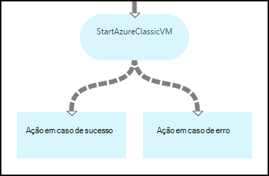
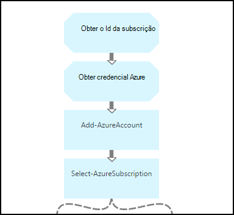
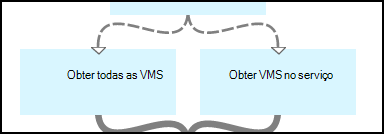
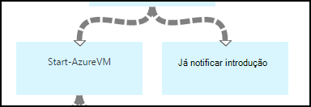
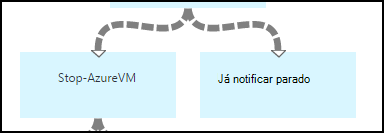
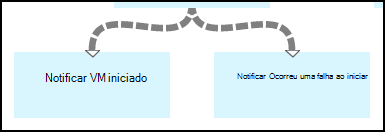
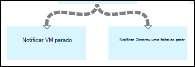

<properties 
    pageTitle="Iniciar e parar máquinas virtuais - Graph | Microsoft Azure"
    description="Versão de fluxo de trabalho do PowerShell do cenário de automatização do Azure, incluindo runbooks para iniciar e parar máquinas virtuais clássicas."
    services="automation"
    documentationCenter=""
    authors="mgoedtel"
    manager="jwhit"
    editor="tysonn" />
<tags 
    ms.service="automation"
    ms.devlang="na"
    ms.topic="article"
    ms.tgt_pltfrm="na"
    ms.workload="infrastructure-services"
    ms.date="07/06/2016"
    ms.author="bwren" />

# Cenário de automatização Azure - iniciar e parar máquinas virtuais

Este cenário de automatização do Azure inclui runbooks para iniciar e parar máquinas virtuais clássicas.  Pode utilizar este cenário para qualquer um dos seguintes procedimentos:  

- Utilize runbooks sem modificação no seu ambiente. 
- Modificar runbooks para efetuar uma funcionalidade personalizada.  
- Ligar a runbooks a partir de outro livro de execuções como parte de uma solução global. 
- Utilize o runbooks como tutoriais para saber o livro de execuções conceitos de criação. 

> [AZURE.SELECTOR]
- [Gráficos](automation-solution-startstopvm-graphical.md)
- [Fluxo de trabalho do PowerShell](automation-solution-startstopvm-psworkflow.md)

Esta é a versão de livro de execuções gráficas deste cenário. Também está disponível com o [fluxo de trabalho do PowerShell runbooks](automation-solution-startstopvm-psworkflow.md).

## Obter o cenário

Este cenário consiste em duas duas runbooks gráficos que pode transferir das ligações seguintes.  Ver a [versão do fluxo de trabalho do PowerShell](automation-solution-startstopvm-psworkflow.md) deste cenário para ligações para o fluxo de trabalho do PowerShell runbooks.

| Livro execuções | Ligação | Tipo | Descrição |
|:---|:---|:---|:---|
| StartAzureClassicVM | [Iniciar o livro de execuções gráfico Azure VM clássico](https://gallery.technet.microsoft.com/scriptcenter/Start-Azure-Classic-VM-c6067b3d) | Gráficos | Inicia a todas as máquinas virtuais clássicas uma subscrição do Azure ou todas as máquinas virtuais com um nome de serviço em particular. |
| StopAzureClassicVM | [Parar o livro de execuções gráfico Azure VM clássico](https://gallery.technet.microsoft.com/scriptcenter/Stop-Azure-Classic-VM-397819bd) | Gráficos | Deixa de todas as máquinas virtuais numa conta de automatização ou todas as máquinas virtuais com um nome de serviço em particular.  |

## Instalar e configurar o cenário

### 1. a instalar o runbooks

Depois de transferir o runbooks, pode importá-los com o procedimento no [livro de execuções gráficas procedimentos](automation-graphical-authoring-intro.md#graphical-runbook-procedures).

### 2. rever os requisitos e descrição
Os runbooks incluir uma actividade denominada **Leia-Me** que inclui uma descrição e elementos necessários.  Pode ver estas informações ao selecionar a atividade **Leia-Me** e, em seguida, o parâmetro de **Script de fluxo de trabalho** .  Também pode obter as mesmas informações a partir deste artigo. 

### 3. Configurar elementos
Os runbooks necessitam os ativos seguintes que tem de criar e preencher com valores adequados.  Os nomes estão predefinido.  Pode utilizar activos com nomes diferentes se especificar os nomes os [parâmetros de entrada](#using-the-runbooks) ao iniciar o livro de execuções.

| Tipo de elementos | Nome predefinido | Descrição |
|:---|:---|:---|:---|
| [Credenciais](automation-credentials.md) | AzureCredential | Contém as credenciais para uma conta que possua autoridade para iniciar e parar máquinas virtuais na subscrição Azure.  |
| [Variável](automation-variables.md) | AzureSubscriptionId | Contém o ID da subscrição da sua subscrição do Azure. |

## Utilizar o cenário

### Parâmetros

Os runbooks tem os seguintes [parâmetros de entrada](automation-starting-a-runbook.md#runbook-parameters).  Tem de fornecer valores para qualquer parâmetros obrigatórios e opcionalmente, pode fornecer valores para outros parâmetros dependendo das suas necessidades.

| Parâmetro | Tipo | Obrigatório | Descrição |
|:---|:---|:---|:---|
| ServiceName | cadeia | N | Se for fornecido um valor, em seguida, todas as máquinas virtuais com esse nome de serviço são iniciadas ou paradas.  Não se for fornecido nenhum valor, em seguida, todas as máquinas virtuais clássicas na subscrição do Azure são iniciadas ou paradas. |
| AzureSubscriptionIdAssetName | cadeia | N | Contém o nome do [recurso variável](#installing-and-configuring-the-scenario) que contém o ID da subscrição da sua subscrição do Azure.  Se não especificar um valor, é utilizado *AzureSubscriptionId* .  |
| AzureCredentialAssetName | cadeia | N | Contém o nome do [recurso de credenciais](#installing-and-configuring-the-scenario) que contém as credenciais para o livro de execuções utilizar.  Se não especificar um valor, é utilizado *AzureCredential* .  |

### Iniciar o runbooks

Pode utilizar qualquer um dos métodos no [início de um livro de execuções no Azure automatização](automation-starting-a-runbook.md) para iniciar um da runbooks neste artigo.

Os comandos de exemplo seguinte utiliza o Windows PowerShell para executar **StartAzureClassicVM** para iniciar a todas as máquinas virtuais com o nome do serviço *MyVMService*.

    $params = @{"ServiceName"="MyVMService"}
    Start-AzureAutomationRunbook –AutomationAccountName "MyAutomationAccount" –Name "StartAzureClassicVM" –Parameters $params

### Saída

Os runbooks irá [uma mensagem de saída](automation-runbook-output-and-messages.md) para cada máquina virtual que indica se ou não a instrução comece ou deixe de foram submetida com êxito.  Pode procurar uma cadeia específica na saída para determinar o resultado de cada livro de execuções.  As cadeias de saída possíveis estão listadas na tabela seguinte.

| Livro execuções | Condição | Mensagem |
|:---|:---|:---|
| StartAzureClassicVM | Já está em execução máquina virtual  | MyVM já está em execução |
| StartAzureClassicVM | Iniciar pedido para máquina virtual submetido com êxito | MyVM ter sido iniciado |
| StartAzureClassicVM | Ocorreu uma falha de pedido de início para máquina virtual  | MyVM Ocorreu uma falha ao iniciar |
| StopAzureClassicVM | Já está em execução máquina virtual  | Já está parado MyVM |
| StopAzureClassicVM | Iniciar pedido para máquina virtual submetido com êxito | MyVM ter sido iniciado |
| StopAzureClassicVM | Ocorreu uma falha de pedido de início para máquina virtual  | MyVM Ocorreu uma falha ao iniciar |

Segue-se uma imagem de como utilizar o **StartAzureClassicVM** enquanto um [livro de execuções subordinado](automation-child-runbooks.md) num livro de execuções de gráficos de exemplo.  Esta opção utiliza as ligações condicional na tabela seguinte.

| Ligação | Critérios |
|:---|:---|
| Ligação de sucesso | $ActivityOutput ['StartAzureClassicVM']-como "\* foi iniciado"    |
| Ligação de erro   | $ActivityOutput ['StartAzureClassicVM']-notlike "\* foi iniciado" |

## Pormenor

Segue-se uma divisão detalhada de runbooks neste cenário.  Pode utilizar estas informações para personalizar a runbooks ou apenas para saber das mesmas para o seus próprio cenários de automatização de criação.
 

### Autenticação

Livro de execuções começa com atividades para definir as [credenciais](automation-configuring.md#configuring-authentication-to-azure-resources) e subscrição Azure que será utilizada para o resto do livro de execuções.

As duas primeiras atividades, **Obter Id da subscrição** e **Obter credencial Azure**, obtenha os [elementos](#installing-the-runbook) que são utilizadas pelas duas atividades.  As atividades diretamente podem especificar os ativos, mas que necessitam os nomes de elementos.  Uma vez que recomendamos são permitindo que o utilizador especificar os nomes nos [parâmetros de entrada](#using-the-runbooks), é necessário estas actividades para obter os ativos com um nome especificado por um parâmetro de entrada.

**Adicionar AzureAccount** define as credenciais que serão utilizadas para o resto do livro de execuções.  Elemento credencial que-obtém de **Obter credencial Azure** tem de ter acesso ao iniciar e parar máquinas virtuais na subscrição Azure.  A subscrição que é utilizada está selecionada por **Selecione AzureSubscription** que utiliza o Id de **Obter Id da subscrição**da subscrição.

### Obter máquinas virtuais

Livro de execuções tem de determinar que máquinas virtuais vai trabalhar com e se são já iniciados ou parados (consoante o livro de execuções).   Uma das duas atividades irá obter os VMs.  **Obter VMs no serviço** será executada se o parâmetro de entrada *ServiceName* para o livro de execuções contiver um valor.  **Obter todas as VMs** será executada se o parâmetro de entrada *ServiceName* para o livro de execuções não contiver um valor.  Esta lógica é executada pelas ligações condicional anterior cada atividade.

Ambas as atividades utilizam o cmdlet **Get-AzureVM** .  **Obter todas as VMs** utiliza o parâmetro de **ListAllVMs** definido para devolver todas as máquinas virtuais.  **Obter VMs no serviço** utiliza o conjunto de parâmetro **GetVMByServiceAndVMName** e fornece o parâmetro de entrada **ServiceName** para o parâmetro **ServiceName** .  

### Intercalar VMs

A atividade de **Impressão em série VMs** é necessária para fornecer entrada ao **Iniciar AzureVM** precisa do nome e o nome do serviço da vm(s) para começar.  Dados introduzidos poderiam provenientes de **Obter todas as VMs** ou **Obter VMs no serviço**, mas **Iniciar AzureVM** só pode especificar uma atividade para a respectiva entrada.   

O cenário é criar a **Impressão em série VMs** que executa o cmdlet de **Saída de escrita** .  O parâmetro **InputObject** para esse cmdlet é uma expressão de PowerShell que combina a entrada das duas actividades anterior.  Apenas um dessas actividades será executado, apenas um conjunto de saída é esperado.  **Iniciar AzureVM** pode utilizar esse resultado para os parâmetros de entrada. 

### Início/fim máquinas virtuais

 

Dependendo do livro de execuções, as atividades seguintes tentarem iniciar ou parar o livro de execuções utilizando **AzureVM iniciar** ou **Parar AzureVM**.  Uma vez que a atividade é precedida por uma ligação em curso, será executada uma vez para cada objeto devolvido por **VMs de impressão em série**.  A ligação é condicional para que a atividade só serão executadas se a *RunningState* da máquina virtual está *parado* para **AzureVM de início** e de *Introdução* para **Parar AzureVM**. Se esta condição do não for cumprida, em seguida, **Notifique já iniciou** ou **Já notificar parado** é executado para enviar uma mensagem com o **Resultado de escrita**.

### Enviar a saída

 

É o último passo no livro de execuções enviar a saída se o pedido comece ou deixe de cada máquina virtual foram submetido com êxito. Existe um separado atividade de **Saída de escrita** para cada um, e podemos determinar qual deles para executar com ligações condicional.  **Notificar VM iniciado** ou **Notificar VM parado** é executada se *OperationStatus* é *bem sucedida*.  Se *OperationStatus* for qualquer outro valor, em seguida, **Notificar Ocorreu uma falha ao iniciar** ou **Notificar Ocorreu uma falha ao parar** é executado.

## Próximos passos

- [Gráficos de cocriação na automatização do Azure](automation-graphical-authoring-intro.md)
- [Subordinado runbooks na automatização do Azure](automation-child-runbooks.md) 
- [Saída do livro execuções e mensagens de automatização do Azure](automation-runbook-output-and-messages.md)