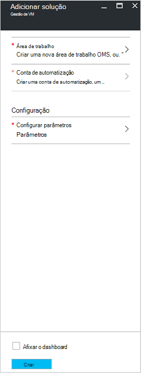
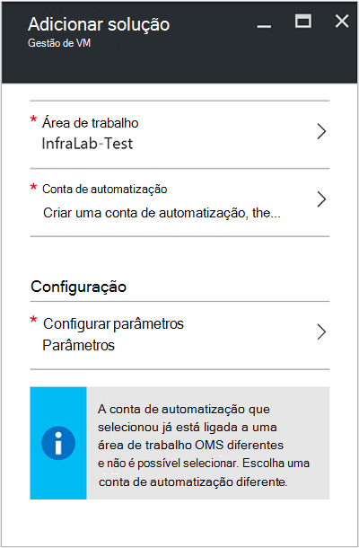
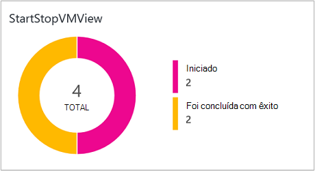
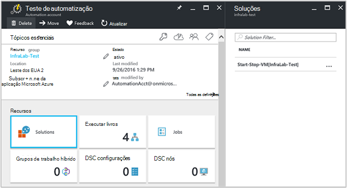
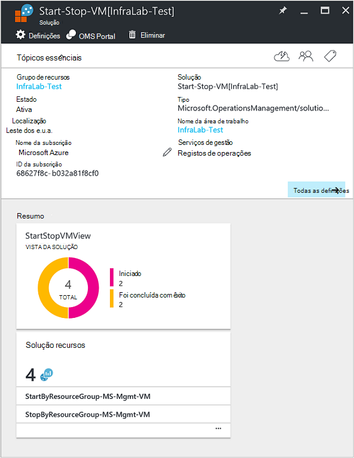

<properties
    pageTitle="Início/fim VMs durante a solução fora de horas [pré-visualização] | Microsoft Azure"
    description="As soluções de gestão de VM é iniciado e deixa de seu máquinas virtuais do Azure Gestor de recursos com base numa agenda e importante monitorizar a partir do registo de análise."
    services="automation"
    documentationCenter=""
    authors="MGoedtel"
    manager="jwhit"
    editor=""
    />
<tags
    ms.service="automation"
    ms.workload="tbd"
    ms.tgt_pltfrm="na"
    ms.devlang="na"
    ms.topic="get-started-article"
    ms.date="10/07/2016"
    ms.author="magoedte"/>

# Início/fim VMs durante a solução fora de horas [pré-visualização] na automatização

O VMs início/fim durante a solução fora de horas [pré-visualização] é iniciado e deixa de seu máquinas virtuais do Gestor de recursos do Azure numa agenda definidos pelo utilizador e fornece visão o sucesso das tarefas de automatização que iniciar e parar o seu máquinas virtuais com OMS a análise de registo.  

## Pré-requisitos

- Os runbooks trabalhar com uma [conta Azure executar como](automation-sec-configure-azure-runas-account.md).  A conta executar como é o método de autenticação preferido, uma vez que utiliza a autenticação de certificados em vez de uma palavra-passe que pode expirar ou alterados com frequência.  

- Esta solução só pode gerir VMs que são na mesma subscrição e grupo de recursos como onde reside a conta de automatização.  

- Esta solução implementa apenas as seguintes regiões Azure - Austrália Sudeste, Leste dos EUA, Sudeste asiático e Europa Ocidental.  O runbooks que gerir a agenda de VM pode direccionar VMs qualquer região.  

- Para enviar notificações de correio eletrónico quando runbooks VM início e concluir, é necessária uma subscrição de classe executiva do Office 365.  

## Componentes da solução

Esta solução é composta pelos seguintes recursos que serão importados e adicionados à sua conta de automatização.

### Runbooks

Livro execuções | Descrição|
--------|------------|
CleanSolution MS-gestão VM | Este livro de execuções removerá contidos todos os recursos e agendas ao aceder a eliminar a solução da sua subscrição.|  
SendMailO365-MS-gestão | Este livro de execuções envia uma mensagem de e-mail através do Office 365 Exchange.|
StartByResourceGroup MS-gestão VM | Este livro de execuções destina-se para iniciar VMs (ambos os clássica e processador com base VMs) que se encontra numa determinada lista de recursos Azure grupo (s).
StopByResourceGroup MS-gestão VM | Este livro de execuções destina-se para parar de VMs (ambos os clássica e processador com base VMs) que se encontra numa determinada lista de recursos Azure grupo (s).|
 

### Variáveis

Variável | Descrição|
---------|------------|
**SendMailO365-MS-gestão** Livro execuções ||
SendMailO365-IsSendEmail MS gestão | Especifica se StartByResourceGroup MS-gestão VM e StopByResourceGroup MS-gestão VM runbooks pode enviar notificação por correio eletrónico após a conclusão.  Selecione **Verdadeiro** para ativar e **Falso** para desativar alertas de e-mail. Valor predefinido é **Falso**.| 
**StartByResourceGroup MS-gestão VM** Livro execuções ||
StartByResourceGroup-ExcludeList-MS-gestão-VM | Introduza os nomes VM a excluir da operação de gestão Separe os nomes utilizando semi-colon(;). Os valores são entre maiúsculas e minúsculas e universais (asterisco) são suportada.|
StartByResourceGroup-SendMailO365-EmailBodyPreFix-MS-gestão | Texto que pode ser acrescentado para o início do corpo da mensagem de correio eletrónico.|
StartByResourceGroup-SendMailO365-EmailRunBookAccount-MS-gestão | Especifica o nome da conta de automatização que contém o livro de execuções do E-Mail.  **Não modifique esta variável.**|
StartByResourceGroup-SendMailO365-EmailRunbookName-MS-gestão | Especifica o nome do livro de execuções do e-mail.  Isto é utilizado pelo StartByResourceGroup MS-gestão VM e StopByResourceGroup MS-gestão VM runbooks para enviar mensagens de e-mail.  **Não modifique esta variável.**|
StartByResourceGroup-SendMailO365-EmailRunbookResourceGroup-MS-gestão | Especifica o nome do grupo de recursos que contém o livro de execuções do E-Mail.  **Não modifique esta variável.**|
StartByResourceGroup-SendMailO365-EmailSubject-MS-gestão | Especifica o texto para a linha de assunto do correio eletrónico.|  
StartByResourceGroup-SendMailO365-EmailToAddress-MS-gestão | Especifica os destinatários do correio eletrónico.  Introduza nomes separados utilizando semi-colon(;).|
StartByResourceGroup-TargetResourceGroups-MS-gestão-VM | Introduza os nomes VM a excluir da operação de gestão Separe os nomes utilizando semi-colon(;). Os valores são entre maiúsculas e minúsculas e universais (asterisco) são suportada.  Valor predefinido (asterisco) irá incluir todos os grupos de recursos na subscrição.|
StartByResourceGroup-TargetSubscriptionID-MS-gestão-VM | Especifica a subscrição que contém VMs ser gerido por esta solução.  Tem de ser a mesma subscrição onde reside a conta de automatização desta solução.|
**StopByResourceGroup MS-gestão VM** Livro execuções ||
StopByResourceGroup-ExcludeList-MS-gestão-VM | Introduza os nomes VM a excluir da operação de gestão Separe os nomes utilizando semi-colon(;). Os valores são entre maiúsculas e minúsculas e universais (asterisco) são suportada.|
StopByResourceGroup-SendMailO365-EmailBodyPreFix-MS-gestão | Texto que pode ser acrescentado para o início do corpo da mensagem de correio eletrónico.|
StopByResourceGroup-SendMailO365-EmailRunBookAccount-MS-gestão | Especifica o nome da conta de automatização que contém o livro de execuções do E-Mail.  **Não modifique esta variável.**|
StopByResourceGroup-SendMailO365-EmailRunbookResourceGroup-MS-gestão | Especifica o nome do grupo de recursos que contém o livro de execuções do E-Mail.  **Não modifique esta variável.**|
StopByResourceGroup-SendMailO365-EmailSubject-MS-gestão | Especifica o texto para a linha de assunto do correio eletrónico.|  
StopByResourceGroup-SendMailO365-EmailToAddress-MS-gestão | Especifica os destinatários do correio eletrónico.  Introduza nomes separados utilizando semi-colon(;).|
StopByResourceGroup-TargetResourceGroups-MS-gestão-VM | Introduza os nomes VM a excluir da operação de gestão Separe os nomes utilizando semi-colon(;). Os valores são entre maiúsculas e minúsculas e universais (asterisco) são suportada.  Valor predefinido (asterisco) irá incluir todos os grupos de recursos na subscrição.|
StopByResourceGroup-TargetSubscriptionID-MS-gestão-VM | Especifica a subscrição que contém VMs ser gerido por esta solução.  Tem de ser a mesma subscrição onde reside a conta de automatização desta solução.|  
 

### Agendas

Agenda | Descrição|
---------|------------|
StartByResourceGroup-agenda MS gestão | Agenda para o livro de execuções StartByResourceGroup, que executa o arranque VMs gerido por esta solução.|
StopByResourceGroup-agenda MS gestão | Agenda para o livro de execuções StopByResourceGroup, que executa o encerramento do VMs gerido por esta solução.|

### Credenciais

Credenciais | Descrição|
-----------|------------|
O365Credential | Especifica uma conta de utilizador do Office 365 válida para enviar e-mail.  Só necessária se variável SendMailO365-IsSendEmail-MS-gestão é definido como **Verdadeiro**.

## Configuração

Execute os seguintes passos para adicionar o VMs início/fim durante a solução fora de horas [pré-visualização] à sua conta de automatização e, em seguida, configure as variáveis para personalizar a solução.

1. No ecrã principal no portal do Azure, selecione o mosaico **Marketplace** .  Se o mosaico já não é afixado à sua ecrã principal, a partir do painel de navegação esquerdo, selecione **Novo**.  
2. Na pá Marketplace, escreva **Iniciar VM** na caixa de pesquisa e, em seguida, selecione a solução de **Início/fim VMs horas de expediente [pré-visualização]** nos resultados da pesquisa.  
3. No pá **Início/fim VMs horas de expediente [pré-visualização]** para a solução seleccionada, reveja as informações de resumo e, em seguida, clique em **Criar**.  
4. O pá **Adicionar solução** é apresentada sempre que lhe for pedido para configurar a solução antes de poder importá-lo para a sua subscrição de automatização.     
5.  No pá **Adicionar solução** , selecione **área de trabalho** e aqui seleciona uma área de trabalho do OMS que está associada a mesma subscrição do Azure que a conta de automatização está no ou cria uma nova área de trabalho OMS.  Se não tiver uma área de trabalho OMS, pode selecionar **Criar nova área de trabalho** e na pá a **Área de trabalho OMS** faça o seguinte: 
   - Especifique um nome para o novo **OMS área de trabalho**.
   - Selecione uma **subscrição** para ligar ao selecionar a partir da lista pendente se a predefinição selecionada não for adequada.
   - Para o **Grupo de recursos**, pode criar um novo grupo de recursos ou selecione um grupo de recursos existente.  
   - Selecione uma **localização**.  Atualmente as localizações apenas fornecidas para seleção são **Austrália Sudeste**, **Leste dos EUA**, **Sudeste asiático**e **Europa Ocidental**.
   - Selecione uma **camada de preços**.  A solução é oferecida no duas camadas: Liberte e OMS pago camada.  A camada gratuita tem um limite a quantidade de dados recolhidos diariamente, período de retenção e livro execuções tarefa runtime minutos.  A camada OMS pago não tem um limite a quantidade de dados recolhidos diariamente.  

        > [AZURE.NOTE]
        > Enquanto autónomo pago camada é apresentado como opção, não é aplicável.  Se selecionar e continuar com a criação desta solução na sua subscrição, irá falhar.  Isto irá endereçado quando esta solução é disponibilizada oficialmente. Se utilizar esta solução, serão só utiliza o saldo do projecto automatização e inicie sessão ingestão.  A solução não adiciona nós OMS adicionais para o seu ambiente.  

6. Depois de fornecer as informações necessárias no pá a **área de trabalho OMS** , clique em **Criar**.  Enquanto a informação é verificada e a área de trabalho for criada, pode controlar o progresso em **notificações** a partir do menu.  Será devolvido para o **Adicionar solução** pá.  
7. No pá **Adicionar solução** , selecione a **Conta de automatização**.  Se estiver a criar uma nova área de trabalho OMS, será necessário também pode criar uma nova conta de automatização que será associada com a nova OMS área de trabalho especificada anteriormente, incluindo a sua subscrição do Azure, grupo de recursos e região.  Pode selecionar **criar uma conta de automatização** e no pá **Automatização adicionar conta** , forneça as seguintes: 
  - No campo **nome** , introduza o nome da conta de automatização.

    Todas as outras opções são automaticamente preenchidas com base na área de trabalho OMS selecionada e não podem ser modificadas estas opções.  Uma conta Azure executar como é o método de autenticação predefinido para runbooks incluídas nesta solução.  Depois de clicar em **OK**, as opções de configuração são validadas e a conta de automatização é criada.  Pode controlar o progresso em **notificações** a partir do menu. 

    Caso contrário, pode selecionar uma conta de automatização executar como existente.  Será apresentada a nota que a conta que selecionar não pode já estar associada a outra área de trabalho OMS, caso contrário, uma mensagem no pá para informá-lo.  Se já estiver ligado, terá de selecionar uma conta diferente automatização executar como ou criar um novo.    

8. Finalmente no pá **Adicionar solução** , selecione **a configuração** e é apresentada a pá **parâmetros** .  No pá **parâmetros** , lhe for pedido para:  
   - Especificar os **Nomes de ResourceGroup de destino**, que é o nome do grupo de recursos que contém VMs ser gerido por esta solução.  Pode introduzir mais do que um nome e separe cada utilizando um ponto e vírgula (valores são entre maiúsculas e minúsculas).  Utilizar caracteres universais é suportada se pretender destino VMs em todos os grupos de recursos na subscrição.
   - Selecione uma **agenda** que é uma periódica data e hora para iniciar e parar a VM no grupo de recursos de destino (s).  

10. Assim que tiver concluído a configurar as definições iniciais necessárias para a solução, selecione **Criar**.  Serão validadas todas as definições e, em seguida, tentará implementar a solução na sua subscrição.  Este processo pode demorar alguns segundos para concluir e pode controlar o progresso em **notificações** a partir do menu. 

## Frequência de coleções de sites

Automatização registo e de projeto da cadeia dados da tarefa são penetração para o repositório OMS intervalos de cinco minutos.  

## Utilizar a solução

Quando adiciona a solução de gestão de VM, na área de trabalho OMS a **Vista de StartStopVM** mosaico será adicionado ao OMS dashboard.  Este mosaico apresenta uma contagem e uma representação gráfica das tarefas para a solução runbooks que iniciaram e tiver concluído com êxito.     

Na sua conta de automatização, pode aceder e gerir a solução selecionando o mosaico de **soluções** e, em seguida, a partir pá **soluções** , selecionar a solução **Início-tabulação-VM [Workspace]** a partir da lista.     

Selecionar a solução irá apresentar pá de solução **Início-tabulação-VM [Workspace]** , onde pode rever detalhes importantes, como o mosaico **StartStopVM** , como na sua área de trabalho OMS, que apresenta uma contagem e uma representação gráfica das tarefas para a solução runbooks que iniciaram e tiver concluído com êxito.     

A partir daqui também pode abrir a área de trabalho OMS e ainda mais efetuar uma análise dos registos de tarefa.  Basta clique em **todas as definições**e na pá **Definições** , selecione **Início rápido** e, em seguida, na pá **Guia de introdução** , selecione **OMS Portal**.   Isto irá abrir um novo separador ou uma nova sessão no browser e apresentar a área de trabalho OMS associada à sua conta de automatização e subscrição.  

### Configurar notificações de correio electrónico

Para ativar notificações de correio eletrónico quando os runbooks VM concluídas, que terá de modificar o **O365Credential** início e de credenciais e no mínimo, variáveis que se seguem:

 - SendMailO365-IsSendEmail MS gestão
 - StartByResourceGroup-SendMailO365-EmailToAddress-MS-gestão
 - StopByResourceGroup-SendMailO365-EmailToAddress-MS-gestão

Para configurar a credencial **O365Credential** , execute os seguintes passos:

1. A partir da sua conta de automatização, clique em **Todas as definições** na parte superior da janela. 
2. No pá **Definições** , na secção **Recursos de automatização**, selecione **recursos**. 
3. No pá **ativos** , selecione o mosaico de **credenciais** e pá **credenciais** , selecione o **O365Credential**.  
4. Introduza um nome de utilizador do Office 365 válido e uma palavra-passe e, em seguida, clique em **Guardar** para guardar as alterações.  

Para configurar as variáveis realçadas anterior, execute os seguintes passos:

1. A partir da sua conta de automatização, clique em **Todas as definições** na parte superior da janela. 
2. No pá **Definições** , na secção **Recursos de automatização**, selecione **recursos**. 
3. No pá **elementos** , selecione o mosaico de **variáveis** e pá **variáveis** , selecione a variável de listado acima e, em seguida, modifique o seguinte valor a descrição para o mesmo especificada na secção [variável](##variables) anteriormente.  
4. Clique em **Guardar** para guardar as alterações à variável.   

### Modificar a agenda de arranque e encerramento

Gerir a agenda de arranque e encerramento nesta solução segue os mesmos passos conforme descrito no [agendamento de um livro de execuções no Azure automatização](automation-scheduling-a-runbook.md).  Lembre-se de que não é possível modificar a configuração de agenda.  Terá de desativar a agenda existente e, em seguida, crie um novo e, em seguida, ligar ao **StartByResourceGroup MS-gestão VM** ou livro de execuções **StopByResourceGroup MS-gestão VM** que pretende que a agenda para aplicar a.   

## Análise de registos

Automatização cria dois tipos de registos no repositório de OMS.

### Registos de tarefa

Propriedade | Descrição|
----------|----------|
Autor da chamada |  Quem iniciou a operação.  Valores possíveis são um endereço de e-mail ou o sistema para tarefas agendadas.|
Categoria | Classificação do tipo de dados.  Automatização, o valor é JobLogs.|
CorrelationId | GUID que é o Id de correlação da tarefa de livro execuções.|
JobId | GUID que é o Id da tarefa livro execuções.|
operationName | Especifica o tipo de operação executado no Azure.  Para automatização, o valor será tarefa.|
resourceId | Especifica o tipo de recurso no Azure.  Para a automatização, o valor é a conta de automatização associada livro de execuções.|
ResourceGroup | Especifica o nome do grupo de recursos da tarefa livro execuções.|
ResourceProvider | Especifica o serviço Azure que fornece os recursos que pode implementar e gerir.  Automatização, o valor é Azure automatização.|
Tipo de recurso | Especifica o tipo de recurso no Azure.  Para a automatização, o valor é a conta de automatização associada livro de execuções.|
resultType | O estado da tarefa livro execuções.  Valores possíveis são: -Iniciado -Parado -Suspensa -Falha -Foi concluída com êxito|
resultDescription | Descreve o estado de resultado de tarefa de livro execuções.  Valores possíveis são: -Trabalho for iniciado -Falha na tarefa -Tarefa concluída|
RunbookName | Especifica o nome do livro de execuções.|
SourceSystem | Especifica o sistema de origem para os dados apresentados.  Para a automatização, o valor será: OpsManager|
StreamType | Especifica o tipo de evento. Valores possíveis são: -Verboso -Resultado -Erro -Aviso|
SubscriptionId | Especifica o ID da subscrição da tarefa.
Tempo | Data e hora quando a tarefa de livro execuções executada.|

### Fluxos de trabalho

Propriedade | Descrição|
----------|----------|
Autor da chamada |  Quem iniciou a operação.  Valores possíveis são um endereço de e-mail ou o sistema para tarefas agendadas.|
Categoria | Classificação do tipo de dados.  Automatização, o valor é JobStreams.|
JobId | GUID que é o Id da tarefa livro execuções.|
operationName | Especifica o tipo de operação executado no Azure.  Para automatização, o valor será tarefa.|
ResourceGroup | Especifica o nome do grupo de recursos da tarefa livro execuções.|
resourceId | Especifica o Id do recurso no Azure.  Para a automatização, o valor é a conta de automatização associada livro de execuções.|
ResourceProvider | Especifica o serviço Azure que fornece os recursos que pode implementar e gerir.  Automatização, o valor é Azure automatização.|
Tipo de recurso | Especifica o tipo de recurso no Azure.  Para a automatização, o valor é a conta de automatização associada livro de execuções.|
resultType | O resultado da tarefa livro execuções ao tempo que o evento foi gerado.  Valores possíveis são: -Em curso|
resultDescription | Inclui a sequência de saída do livro de execuções.|
RunbookName | O nome do livro de execuções.|
SourceSystem | Especifica o sistema de origem para os dados apresentados.  Para a automatização, o valor será OpsManager|
StreamType | O tipo de fluxo de trabalho. Valores possíveis são: -Progresso -Resultado -Aviso -Erro -Depurar -Verboso|
Tempo | Data e hora quando a tarefa de livro execuções executada.|

Quando executar qualquer procura de registo devolve registos de categoria de **JobLogs** ou **JobStreams**, pode selecionar a vista de **JobLogs** ou **JobStreams** que apresenta um conjunto de mosaicos resumir as atualizações devolvidas pela pesquisa.

## Pesquisas de registo de exemplo

A tabela seguinte fornece as pesquisas de registo de exemplo para registos de tarefa recolhidas por esta solução. 

Consulta | Descrição|
----------|----------|
Localizar tarefas para o livro de execuções StartVM tiver concluído com êxito | Categoria = JobLogs RunbookName_s = "StartByResourceGroup-MS-gestão-VM" ResultType = foi concluída com êxito & #124; medir count() por JobId_g|
Localizar tarefas para o livro de execuções StopVM tiver concluído com êxito | Categoria = JobLogs RunbookName_s = "StartByResourceGroup-MS-gestão-VM" ResultType = falhou & #124; medir count() por JobId_g
Mostrar o estado da tarefa ao longo do tempo para runbooks StartVM e StopVM | Categoria = JobLogs RunbookName_s = NOT(ResultType="started") "StartByResourceGroup-MS-gestão-VM" ou "StopByResourceGroup-MS-gestão-VM" | medir Count() pelo intervalo ResultType 1 dia|

## Próximos passos

- Para saber mais sobre como construir consultas de pesquisa diferente e rever os registos de tarefa de automatização com a análise de registo, consulte [pesquisas de registo no registo de análise](../log-analytics/log-analytics-log-searches.md)
- Para saber mais sobre a execução do livro execuções, como monitorizar a livro execuções tarefas e outros detalhes técnicos, consulte o artigo [controlar uma tarefa de livro execuções](automation-runbook-execution.md)
- Para saber mais sobre a análise de registo OMS e origens de dados de coleções de sites, consulte o artigo [Azure recolher dados de armazenamento na descrição geral do registo de análise](../log-analytics/log-analytics-azure-storage.md)

   

