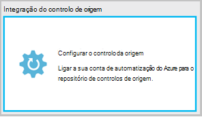
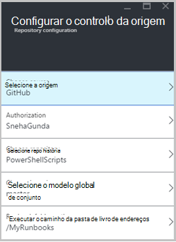
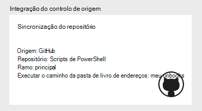
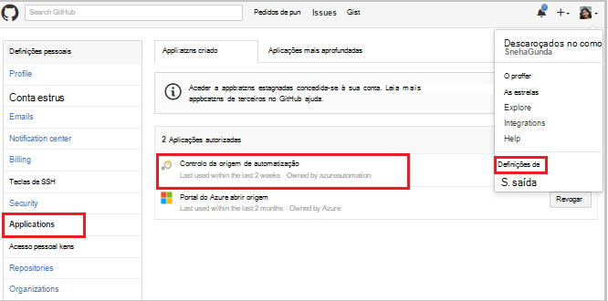
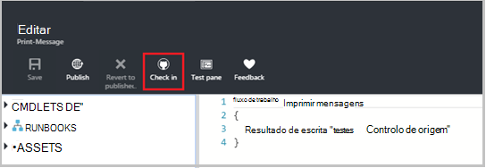
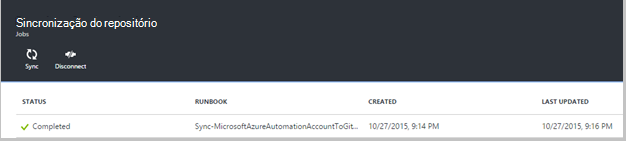
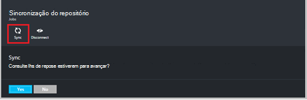
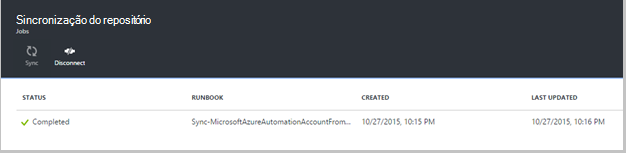
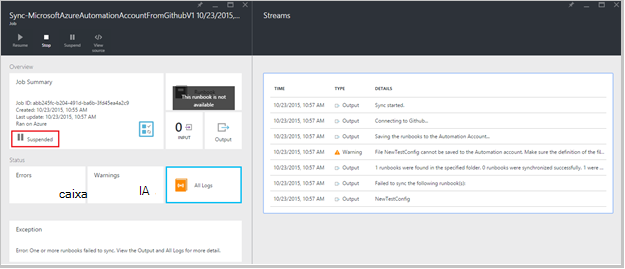
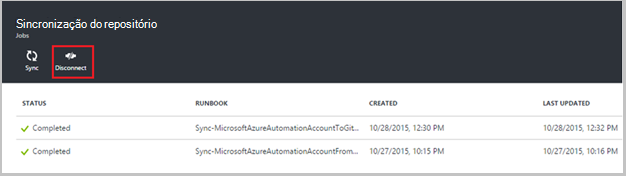

<properties 
    pageTitle=" Integração do controlo no Azure automatização de origem | Microsoft Azure"
    description="Este artigo descreve a integração do controlo de origem com GitHub no Azure automatização."
    services="automation"
    documentationCenter=""
    authors="mgoedtel"
    manager="jwhit"
    editor="tysonn" />    
<tags 
    ms.service="automation"
    ms.devlang="na"
    ms.topic="article"
    ms.tgt_pltfrm="na"
    ms.workload="infrastructure-services"
    ms.date="09/12/2016"
    ms.author="magoedte;sngun" />

# Integração do controlo de origem no Azure automatização

Integração do controlo de origem permite-lhe associar runbooks na sua conta de automatização para um repositório de controlo da origem de GitHub. Controlo da origem de permite-lhe colaborar com a sua equipa, registar alterações e reverter para versões anteriores do seu runbooks facilmente. Por exemplo, o controlo da origem de permite-lhe sincronizar ramos diferentes no controlo de fonte para as suas contas de automatização desenvolvimento, teste ou produção, tornando mais fácil promover código que foi testado no seu ambiente de desenvolvimento à sua conta de automatização de produção.

Controlo da origem de permite-lhe transmitir código a partir do Azure automatização para controlo de origem ou separar o runbooks a partir do controlo de origem para automatização Azure. Este artigo descreve como configurar o controlo de origem no seu ambiente de automatização do Azure. Vamos será iniciado através da configuração de automatização do Azure para aceder ao seu repositório GitHub e percorra os diferentes operações que podem ser executadas utilizando a integração do controlo de origem. 

>[AZURE.NOTE]Controlo da origem de suporta no e conduza [runbooks de fluxo de trabalho do PowerShell](automation-runbook-types.md#powershell-workflow-runbooks) , bem como [PowerShell runbooks](automation-runbook-types.md#powershell-runbooks). [Runbooks gráficas](automation-runbook-types.md#graphical-runbooks) ainda não são suportadas.  

Existem dois passos simples necessários para configurar o controlo de origem para a sua conta de automatização e apenas um se já tiver uma conta de GitHub. São descritos abaixo:
## Passo 1 – criar um repositório de GitHub

Se já tiver uma conta de GitHub e um repositório à qual pretende associar a automatização Azure, em seguida, iniciar sessão na sua conta existente e comece a partir do passo 2 abaixo. Caso contrário, navegue até ao [GitHub](https://github.com/), início de sessão para cima para uma nova conta e, em seguida, [criar um repositório de novo](https://help.github.com/articles/create-a-repo/).

## Passo 2 – configurar o controlo de origem no Azure automatização

1. A partir de pá de automatização conta no portal do Azure, clique em **o controlo de origem.** 
 
    

2. O **Controlo da origem de** pá abre-se, onde pode configurar os detalhes da sua conta GitHub. Segue-se a lista de parâmetros para configurar:  

  	|**Parâmetro**            |**Descrição** |
  	|:---|:---| 
  	|Selecione a origem   | Selecione a origem. Atualmente, só **GitHub** é suportada. |
  	|Autorização | Clique no botão **autorizar** para conceder acesso a automatização Azure para o seu repositório GitHub. Se já tiver sessão iniciada sua conta GitHub numa janela diferente, em seguida, são utilizadas as credenciais dessa conta. Depois de autorização de é efetuada com êxito, o pá irá mostrar o seu nome de utilizador GitHub em **Propriedade de autorização**. |
  	|Selecione o repositório | Selecione um repositório de GitHub na lista de repositórios disponíveis. |
  	|Selecione ramo | Selecione um ramo na lista de ramos disponíveis. Apenas o **principal** ramo é apresentado se ainda não criou qualquer ramificações. |
  	|Caminho da pasta de livro execuções | O caminho da pasta de livro execuções Especifica o caminho no repositório de GitHub a partir do qual pretende emissão ou separar o código. Têm de ser introduzida no formato **/foldername/subfoldername**. Apenas runbooks no caminho da pasta de livro execuções serão sincronizados à sua conta de automatização. Runbooks nas subpastas do irá de caminho de pasta de livro execuções **não** sincronizados. Utilizar **/** para sincronizar todas as runbooks do repositório. |

3. Por exemplo, se tiver um repositório denominado **PowerShellScripts** que contém uma pasta denominada **RootFolder**, que contém uma pasta com o nome **subpasta**. Pode utilizar as seguintes cadeias para cada nível de pasta de sincronização:

    1. Para sincronizar runbooks a partir do **repositório**, o caminho da pasta de livro execuções é*/*
    2. Para sincronizar runbooks a partir do **RootFolder**, o caminho da pasta de livro execuções é */RootFolder*
    3. Para sincronizar runbooks da **subpasta**, o caminho da pasta de livro execuções é */RootFolder/SubFolder*.
  

4. Depois de configurar os parâmetros, estes são apresentados os **pá o controlo de origem.**  
 
    

5. Depois de clicar em OK, integração do controlo de origem está agora configurada para a sua conta de automatização e deve ser atualizada com as suas informações de GitHub. Agora pode clicar nesta peça para ver todos os do seu histórico de tarefa de sincronização de controlo de origem.  

    

6. Depois de configurar o controlo de origem, os seguintes recursos de automatização serão criados na sua conta de automatização:  
 Dois [activos variáveis](automation-variables.md) são criadas.  
      
    * A variável **Microsoft.Azure.Automation.SourceControl.Connection** contém os valores de cadeia de ligação, conforme apresentado abaixo.  

  	|**Parâmetro**            |**Valor** |
  	|:---|:---|
  	| Nome  | Microsoft.Azure.Automation.SourceControl.Connection |
  	| Tipo | Cadeia |
  	| Valor  | {"Ramo":\<*nome do seu ramo*>, "RunbookFolderPath":\<*caminho da pasta de livro execuções*>, "tipo de fornecedor":\<*tem um valor de 1 para o GitHub*>, "Repositório":\<*nome do seu repositório*>, "Nome de utilizador":\<*GitHub o nome de utilizador*>} |   

    * Variável **Microsoft.Azure.Automation.SourceControl.OAuthToken**, contém o valor encriptado seguro da sua OAuthToken.  

  	|**Parâmetro**            |**Valor** |
  	|:---|:---|
  	| Nome  | Microsoft.Azure.Automation.SourceControl.OAuthToken |
  	| Tipo | UNKNOWN(Encrypted) |
  	| Valor | <*OAuthToken encriptada*> |  

      

    * **Controlo da origem de automatização** é adicionado como uma aplicação para a sua conta GitHub autorizada. Para ver a aplicação: a partir da sua home page GitHub, navegue até ao seu **perfil** > **Definições** > **aplicações**. Esta aplicação permite que o Azure automatização sincronizar seu repositório GitHub a uma conta de automatização.  

    

## Utilizar o controlo de origem de automatização

### Dar entrada um livro de execuções a partir do Azure automatização ao controlo de origem

Dar entrada livro execuções permite-lhe transmitir as alterações efetuadas a um livro de execuções no Azure automatização para o repositório de controlos de origem. Seguem-se os passos para dar entrada um livro de execuções:

1. A partir da sua conta de automatização, [criar um novo livro de execuções textual](automation-first-runbook-textual.md)ou [Editar uma livro existente, textual execuções](automation-edit-textual-runbook.md). Este livro de execuções pode ser um fluxo de trabalho do PowerShell ou um livro de execuções de script do PowerShell.  

2. Após editar o seu livro de execuções, guarde-o e clique em **dar entrada** a partir de pá **Editar** .  

    

     >[AZURE.NOTE] Dar entrada a partir do Azure automatização irá substituir o código que atualmente no seu controlo da origem. A instrução de linha de comandos equivalente Git para dar entrada é **git adicionar + git consolidar + git notificações push**  

3. Quando clica em **dar entrada**, ser-lhe-á pedido com uma mensagem de confirmação, clique em Sim para continuar.  

    

4. Dar entrada é iniciado o livro de execuções do controlo de origem: **MicrosoftAzureAutomationAccountToGitHubV1 de sincronização**. Este livro de execuções liga-se ao GitHub e emite alterações a partir do Azure automatização para o seu repositório. Para visualizar o histórico de dar entrada de tarefa, regresse ao separador **Integração do controlo de origem** e clique em para abrir o pá de sincronização do repositório. Este pá mostra todas as tarefas de controlo de origem.  Selecione a tarefa que pretende ver e clique em ver os detalhes.  

    

    >[AZURE.NOTE] Origem controlo runbooks são runbooks automatização especial que não é possível ver ou editar. Enquanto que não aparecerão na sua lista de livro execuções, irá ver as tarefas de sincronização a aparecer na sua lista de tarefas.
 
5. O nome do livro de execuções modificado é enviado como um parâmetro de entrada para o livro de execuções dar entrada. Pode [ver os detalhes do projecto](automation-runbook-execution.md#viewing-job-status-using-the-azure-management-portal) expandindo livro de execuções no pá **Repositório de sincronização** .  

    

6. Atualize o seu repositório GitHub assim que a tarefa estiver concluída para ver as alterações.  Deverá haver um consolidar no seu repositório de com uma mensagem de confirmação: *Nome do livro execuções *actualizado ** no Azure Automation.* *  

### Runbooks de sincronização a partir do controlo da origem para automatização do Azure 

O botão Sincronizar na pá a sincronização de repositório permite-lhe separar todos os as runbooks no caminho da pasta de livro execuções do seu repositório à sua conta de automatização. Pode ser sincronizado mesmo repositório de mais do que uma conta de automatização. Seguem-se os passos para sincronizar um livro de execuções:

1. A conta de automatização onde configurar o controlo de origem, abra a **origem de controlo integração/repositório sincronização pá** e clique em **sincronizar** , em seguida, ser-lhe-á pedido com uma mensagem de confirmação, clique em **Sim** para continuar.  

    

2. Sincronização inicia o livro de execuções: **MicrosoftAzureAutomationAccountFromGitHubV1 de sincronização**. Este livro de execuções liga-se ao GitHub e obtém as alterações do seu repositório à automatização Azure. Deverá visualizar uma nova tarefa no pá **Repositório de sincronização** para que esta ação. Para ver os detalhes sobre a tarefa de sincronização, clique em para abrir o separador de detalhes de tarefa.  
 
    

 
    >[AZURE.NOTE] Uma sincronização a partir do controlo da origem de substitui a versão de rascunho da runbooks atualmente existentes na sua conta de automatização para **todos os** runbooks que se encontram atualmente no controlo de origem. A instrução de linha de comandos equivalente Git para sincronizar é **git solicitação**

## Resolução de problemas de controlo da origem

Se existirem algum erro com uma tarefa de dar entrada ou sincronizar, o estado da tarefa deve ser suspensa e pode ver mais detalhes sobre o erro no pá a tarefa.  A peça de **Todos os registos de** Mostrar todas as sequências de PowerShell associadas a essa tarefa. Isto irá fornecer-lhe os detalhes conforme necessários para o ajudar a resolver quaisquer problemas com a dar entrada ou sincronização. -Lo também mostrar-lhe a sequência de ações que ocorreu durante a sincronização ou verificação-in de um livro de execuções.  

## Desligar o controlo da origem

Para desligar a partir da sua conta de GitHub, abra a pá repositório sincronização e clique em **Desligar**. Uma vez desligar controlo da origem, runbooks que foram sincronizadas anteriormente permanecerá na sua conta de automatização mas não irão estar ativada pá o repositório de sincronização.  

  

## Próximos passos

Para mais informações sobre a integração do controlo de origem, consulte os seguintes recursos:  
- [Azure automatização: Integração do controlo de origem na automatização Azure](https://azure.microsoft.com/blog/azure-automation-source-control-13/)  
- [Vote no seu sistema de controlo de origem Favoritos](https://www.surveymonkey.com/r/?sm=2dVjdcrCPFdT0dFFI8nUdQ%3d%3d)  
- [Azure automatização: Integrar o controlo da origem de livro execuções utilizando os serviços de equipa do Visual Studio](https://azure.microsoft.com/blog/azure-automation-integrating-runbook-source-control-using-visual-studio-online/)  
