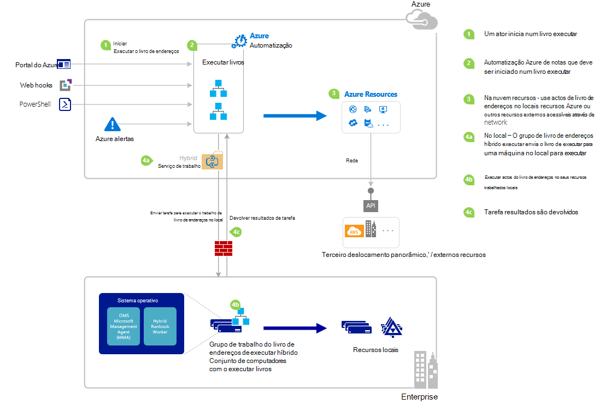

<properties
   pageTitle="Iniciar um livro de execuções no Azure automatização | Microsoft Azure"
   description="Resume os diferentes métodos que podem ser utilizados para iniciar um livro de execuções no Azure automatização e fornece detalhes sobre como utilizar o portal do Azure e o Windows PowerShell."
   services="automation"
   documentationCenter=""
   authors="mgoedtel"
   manager="jwhit"
   editor="tysonn" />
<tags
   ms.service="automation"
   ms.devlang="na"
   ms.topic="article"
   ms.tgt_pltfrm="na"
   ms.workload="infrastructure-services"
   ms.date="10/08/2016"
   ms.author="magoedte;bwren"/>

# <a name="starting-a-runbook-in-azure-automation"></a>Iniciar um livro de execuções no Azure automatização

A tabela seguinte irá ajudá-lo a determinar o método para iniciar um livro de execuções Azure automatização que é mais adequado para o seu cenário em particular. Este artigo inclui detalhes sobre como iniciar um livro de execuções com o portal do Azure e com o Windows PowerShell. Para obter detalhes sobre os outros métodos são fornecidos na outra documentação que pode aceder a partir as ligações em baixo.

| **MÉTODO**                                                                    | **CARACTERÍSTICAS**                                                                                                                                                                                                                                                                                                                                                |
|-------------------------------------------------------------------------------|--------------------------------------------------------------------------------------------------------------------------------------------------------------------------------------------------------------------------------------------------------------------------------------------------------------------------------------------------------------------|
| [Portal do Azure](#starting-a-runbook-with-the-azure-portal)                     | <li>Método mais simples com interface de utilizador interativos.<br> <li>Formulário para fornecer valores de parâmetros simples.<br> <li>Controle facilmente o estado da tarefa.<br> <li>Acesso autenticado com o Azure de início de sessão.                                                                                                                                                                               |
| [Windows PowerShell](https://msdn.microsoft.com/library/dn690259.aspx)        | <li>Ligar a partir da linha de comandos com os cmdlets do Windows PowerShell.<br> <li>Podem ser incluídos no solução automatizada com vários passos.<br> <li>Pedido é autenticado com o certificado ou utilizador OAuth principal / serviço principal.<br> <li>Forneça os valores de parâmetros simples e complexas.<br> <li>Controlar o estado da tarefa.<br> <li>Cliente necessário para suportar os cmdlets do PowerShell. |
| [API de automatização Azure](https://msdn.microsoft.com/library/azure/mt662285.aspx) | <li>Método mais flexível, mas também a maior parte dos complexo.<br> <li>Ligar a partir de qualquer código personalizado que pode fazer pedidos de HTTP.<br> <li>Pedido de autenticada com o certificado ou utilizador Oauth principal / serviço principal.<br> <li>Forneça os valores de parâmetros simples e complexas.<br> <li>Controlar o estado da tarefa.                                                                          |
| [Webhooks](automation-webhooks.md)                                            | <li>Inicie o livro execuções do pedido de HTTP único.<br> <li>Autenticada com o token de segurança no URL.<br> <li>Cliente não é possível substituir valores de parâmetros especificados quando webhook criada. Livro execuções podem definir único parâmetro é povoado com os detalhes do pedido HTTP.<br> <li>Sem possibilidade de controlar o estado da tarefa através de webhook URL.                                      |
| [Responder a alerta Azure](../log-analytics/log-analytics-alerts.md)               | <li>Inicie um livro de execuções em resposta ao alerta Azure.<br> <li>Configure webhook para livro execuções e ligação para alertar.<br> <li>Autenticada com o token de segurança no URL.<br> <li>Atualmente suporta um alerta métricas apenas.                                                                                                                                                       |
| [Agenda](automation-schedules.md)                                | <li>Inicie automaticamente o livro execuções dentro do prazo de hora a hora, diário ou semanal.<br> <li>Manipular agenda através do Azure portal, os cmdlets do PowerShell ou API do Azure.<br> <li>Forneça os valores de parâmetros para ser utilizado com a agenda.                                                                                                                                               |
| [A partir de outro livro de execuções](automation-child-runbooks.md)                          | <li>Utilize um livro de execuções como uma atividade no livro de execuções outra.<br> <li>É útil para obter a funcionalidade utilizada pelo runbooks múltiplos.<br> <li>Forneça os valores de parâmetros para o livro de execuções subordinado e utilize saída no livro de execuções do principal.                                                                                                                                                               |

A imagem seguinte ilustra detalhado processo passo a passo no ciclo de vida de um livro de execuções. Inclui formas diferentes, que um livro de execuções é iniciado no Azure automatização, componentes necessários para o trabalho de livro execuções híbrido executar runbooks de automatização do Azure e interações entre diferentes componentes. Para obter informações sobre como executar automatização runbooks no seu centro de dados, referir-se para [os trabalhadores de livro execuções híbrido](automation-hybrid-runbook-worker.md)



## <a name="starting-a-runbook-with-the-azure-portal"></a>Iniciar um livro de execuções com o portal do Azure

1.  No portal do Azure, selecione **Automatização** e, em seguida, em seguida, clique no nome de uma conta de automatização.
2.  Selecione o separador **Runbooks** .
3.  Selecione um livro de execuções e, em seguida, clique em **Iniciar**.
4.  Se o livro de execuções tiver parâmetros, ser-lhe-á pedido para fornecer valores com uma caixa de texto para cada parâmetro. Consulte o artigo [Parâmetros de livro execuções](#Runbook-parameters) abaixo para obter mais detalhes sobre os parâmetros.
5.  Selecione a **Vista de tarefa** ao lado da mensagem de livro execuções **inicial** ou selecione o separador de **tarefas** para o livro de execuções ver o livro execuções estado da tarefa.

## <a name="starting-a-runbook-with-the-azure-portal"></a>Iniciar um livro de execuções com o portal do Azure

1.  A partir da sua conta de automatização, clique na parte **Runbooks** para abrir o pá **Runbooks** .
2.  Clique num livro de execuções para abrir o **livro execuções** pá.
3.  Clique em **Iniciar**.
4.  Se o livro de execuções não tem parâmetros, lhe ser pedido para confirmar se pretende iniciá-lo. Se o livro de execuções tiver parâmetros, o **Livro de execuções iniciar** pá será aberto para que possam fornecer valores de parâmetros. Consulte o artigo [Parâmetros de livro execuções](#Runbook-parameters) abaixo para obter mais detalhes sobre os parâmetros.
5.  Pá a **tarefa** é aberto para que pode controlar o estado da tarefa.

## <a name="starting-a-runbook-with-windows-powershell"></a>Iniciar um livro de execuções com o Windows PowerShell

Pode utilizar o [AzureRmAutomationRunbook de início](https://msdn.microsoft.com/library/mt603661.aspx) para começar a um livro de execuções com o Windows PowerShell. O seguinte código de exemplo é iniciado um livro de execuções denominado Livro de execuções teste.

```
Start-AzureRmAutomationRunbook -AutomationAccountName "MyAutomationAccount" -Name "Test-Runbook" -ResourceGroupName "ResourceGroup01"
```

Iniciar AzureRmAutomationRunbook devolve um objecto de tarefa que pode utilizar para controlar o respetivo estado assim que o livro de execuções é iniciado. Em seguida, pode utilizar este objeto de tarefa com [Get-AzureRmAutomationJob](https://msdn.microsoft.com/library/mt619440.aspx) para determinar o estado da tarefa e [Obter AzureRmAutomationJobOutput](https://msdn.microsoft.com/library/mt603476.aspx) para obter o resultado. O seguinte código de exemplo é iniciado um livro de execuções denominado livro teste-execuções aguarda até foi concluída e, em seguida, apresenta o seu resultado.

```
$runbookName = "Test-Runbook"
$ResourceGroup = "ResourceGroup01"
$AutomationAcct = "MyAutomationAccount"

$job = Start-AzureRmAutomationRunbook –AutomationAccountName $AutomationAcct -Name $runbookName -ResourceGroupName $ResourceGroup

$doLoop = $true
While ($doLoop) {
   $job = Get-AzureRmAutomationJob –AutomationAccountName $AutomationAcct -Id $job.JobId -ResourceGroupName $ResourceGroup
   $status = $job.Status
   $doLoop = (($status -ne "Completed") -and ($status -ne "Failed") -and ($status -ne "Suspended") -and ($status -ne "Stopped"))
}

Get-AzureRmAutomationJobOutput –AutomationAccountName $AutomationAcct -Id $job.JobId -ResourceGroupName $ResourceGroup –Stream Output
```

Se o livro de execuções requerer parâmetros, em seguida, tem de fornecê-los como um [hashtable](http://technet.microsoft.com/library/hh847780.aspx) onde a chave do hashtable coincidir com o nome do parâmetro e o valor for o valor do parâmetro. O exemplo seguinte mostra como iniciar um livro de execuções com dois parâmetros de cadeia com o nome NomePróprio e apelido, um número inteiro com o nome RepeatCount e um parâmetro booleano denominada mostrar. Para obter informações adicionais sobre os parâmetros, consulte o artigo [Parâmetros de livro execuções](#Runbook-parameters) .

```
$params = @{"FirstName"="Joe";"LastName"="Smith";"RepeatCount"=2;"Show"=$true}
Start-AzureRmAutomationRunbook –AutomationAccountName "MyAutomationAccount" –Name "Test-Runbook" -ResourceGroupName "ResourceGroup01" –Parameters $params
```

## <a name="runbook-parameters"></a>Parâmetros de livro execuções

Quando começar a um livro de execuções do Azure Portal ou o Windows PowerShell, a instrução é enviada através do serviço web de automatização do Azure. Este serviço não suporta parâmetros com tipos de dados complexos. Se precisar de fornecer um valor para um parâmetro complexo, em seguida, tem de chamar-inline a partir de outro livro de execuções conforme descrito no [subordinado runbooks no Azure automatização](automation-child-runbooks.md).

O serviço web de automatização do Azure irá fornecer funcionalidades especiais para os parâmetros utilizam determinados tipos de dados, tal como descrito nas secções seguintes.

### <a name="named-values"></a>Valores com nome

Se o parâmetro é o tipo de dados [objecto], em seguida, pode utilizar o seguinte formato JSON enviá-la uma lista de valores com nome: *{Nome1: 'Valor1', Nome2: 'Valor2', Name3: 'Valor3'}*. Estes valores tem de ser tipos simples. Livro de execuções irão receber o parâmetro como um [PSCustomObject](https://msdn.microsoft.com/library/system.management.automation.pscustomobject%28v=vs.85%29.aspx) com as propriedades que correspondem a cada valor com nome.

Considere o livro de execuções teste seguinte que aceita um parâmetro chamado utilizador.

```
Workflow Test-Parameters
{
   param (
      [Parameter(Mandatory=$true)][object]$user
   )
    $userObject = $user | ConvertFrom-JSON
    if ($userObject.Show) {
        foreach ($i in 1..$userObject.RepeatCount) {
            $userObject.FirstName
            $userObject.LastName
        }
    }
}
```

O seguinte texto pode ser utilizado para o parâmetro de utilizador.

```
{FirstName:'Joe',LastName:'Smith',RepeatCount:'2',Show:'True'}
```

Isto resulta no resultado seguinte.

```
Joe
Smith
Joe
Smith
```

### <a name="arrays"></a>Matrizes

Se o parâmetro é uma matriz como [matriz] ou [, em seguida, pode utilizar o seguinte formato JSON enviá-la uma lista de valores de cadeia [],]: *[valor1, valor2, Valor3]*. Estes valores tem de ser tipos simples.

Considere o livro de execuções teste seguinte que aceita um parâmetro chamado *utilizador*.

```
Workflow Test-Parameters
{
   param (
      [Parameter(Mandatory=$true)][array]$user
   )
    if ($user[3]) {
        foreach ($i in 1..$user[2]) {
            $ user[0]
            $ user[1]
        }
    }
}
```

O seguinte texto pode ser utilizado para o parâmetro de utilizador.

```
["Joe","Smith",2,true]
```

Isto resulta no resultado seguinte.

```
Joe
Smith
Joe
Smith
```

### <a name="credentials"></a>Credenciais

Se o parâmetro for o tipo de dados **PSCredential**, em seguida, pode fornecer o nome de um [ativo de credenciais](automation-credentials.md)de automatização do Azure. Livro de execuções irá obter a credencial com o nome que especificar.

Considere o livro de execuções teste seguinte que aceita um parâmetro chamado credenciais.

```
Workflow Test-Parameters
{
   param (
      [Parameter(Mandatory=$true)][PSCredential]$credential
   )
   $credential.UserName
}
```

O seguinte texto pode ser utilizado para o parâmetro de utilizador partindo do princípio de que existia um activo credencial denominado *Minhas credenciais*.

```
My Credential
```

Assumindo que o nome de utilizador a credencial foi *jsmith*, isto resulta no resultado seguinte.

```
jsmith
```

## <a name="next-steps"></a>Próximos passos

-   A arquitetura de livro execuções atual artigo fornece uma descrição geral de runbooks gestão de recursos no Azure e no local com o trabalhador de livro execuções híbrido.  Para saber mais sobre a execução de automatização runbooks no seu centro de dados, consulte [Híbrido livro execuções trabalhadores](automation-hybrid-runbook-worker.md).
-   Para saber mais sobre a criação runbooks modular para ser utilizado por outro runbooks para as funções específicas ou comuns, consulte [Runbooks subordinado](automation-child-runbooks.md).
