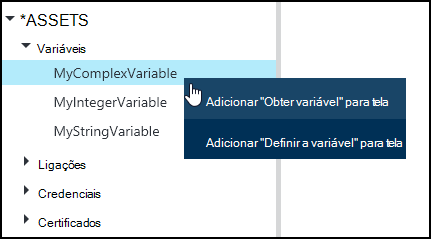
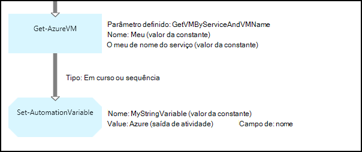
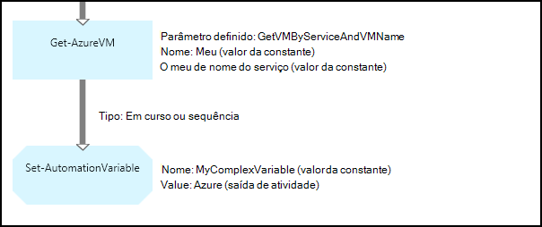
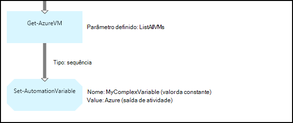
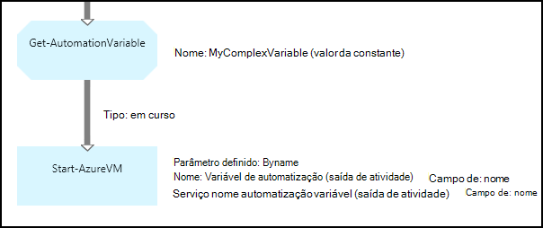
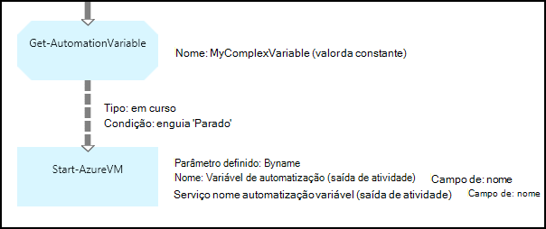

<properties 
   pageTitle="Variáveis ativos na Azure automatização | Microsoft Azure"
   description="Elementos de variáveis são valores que estão disponíveis para todos os runbooks e configurações DSC no Azure automatização.  Este artigo explica os detalhes de variáveis e como trabalhar com os mesmos no textuais e gráficos de criação."
   services="automation"
   documentationCenter=""
   authors="mgoedtel"
   manager="jwhit"
   editor="tysonn" />
<tags 
   ms.service="automation"
   ms.devlang="na"
   ms.topic="article"
   ms.tgt_pltfrm="na"
   ms.workload="infrastructure-services"
   ms.date="05/24/2016"
   ms.author="magoedte;bwren" />

# Variáveis ativos na automatização do Azure

Elementos de variáveis são valores que estão disponíveis para todos os runbooks e configurações DSC na sua conta de automatização. Estes podem ser criados, modificados e obtidos a partir do portal do Azure, o Windows PowerShell e a partir de uma configuração de DSC ou livro execuções. Variáveis de automatização são úteis para os cenários seguintes:

- Partilhe um valor entre várias runbooks ou configurações DSC.

- Partilhe um valor entre várias tarefas a partir da mesma livro de execuções ou configuração DSC.

- Gerir um valor a partir do portal ou da linha de comandos do Windows PowerShell que é utilizada pelo runbooks ou configurações DSC.

Variáveis de automatização são permanentes para que continuem a estar disponível mesmo se o livro execuções ou configuração DSC falha.  Isto também permite que um valor a ser definido por um livro execuções que, em seguida, são utilizada por outro ou são utilizada pelo mesmo livro de execuções ou configuração DSC da próxima vez que é executado.

Quando é criada uma variável, pode especificar que seja armazenada encriptada.  Quando uma variável está encriptada, este é armazenado de forma segura na automatização do Azure e não é possível obter o valor a partir do cmdlet [Get-AzureAutomationVariable](http://msdn.microsoft.com/library/dn913772.aspx) que vem incluído como parte do módulo Azure PowerShell.  A única forma que pode ser obtido um valor encriptado é a partir da atividade de **Obter AutomationVariable** num livro execuções ou configuração DSC.

>[AZURE.NOTE]Activos seguros no Azure automatização incluem as credenciais, certificados, ligações e variáveis encriptadas. Estes elementos são encriptados e armazenados na automatização Azure utilizando uma chave exclusiva gerado para cada conta de automatização. Esta chave é encriptado por um certificado principal e armazenada no Azure automatização. Antes de os guardar um activo seguro, a chave da conta de automatização é desencriptada utilizando o certificado principal e, em seguida, utilizado para encriptar o elemento.

## Tipos de variável

Quando cria uma variável com o portal do Azure, tem de especificar um tipo de dados na lista pendente para que o portal possa apresentar o controlo adequado para introduzir o valor da variável. A variável não está restringida a este tipo de dados, mas tem de definir a variável de utilizar o Windows PowerShell se pretender especificar um valor de um tipo diferente. Se especificar **não definido**, em seguida, o valor da variável terão configurado para **$null**e tem de definir o valor com o cmdlet [Set-AzureAutomationVariable](http://msdn.microsoft.com/library/dn913767.aspx) ou **Conjunto AutomationVariable** atividade.  Não é possível criar ou alterar o valor para um tipo de variável complexo no portal do, mas pode fornecer um valor de qualquer tipo de utilizar o Windows PowerShell. Tipos de complexos serão devolvidos como um [PSCustomObject](http://msdn.microsoft.com/library/system.management.automation.pscustomobject.aspx).

Pode armazenar vários valores para uma única variável através da criação de uma matriz ou hashtable e guardá-la para a variável.

## Atividades de fluxo de trabalho e os cmdlets do

Os cmdlets na seguinte tabela são utilizados para criar e gerir variáveis de automatização com o Windows PowerShell. São fornecidos como parte do [módulo Azure PowerShell](../powershell-install-configure.md) que se encontra disponível para utilização em automatização runbooks e configuração DSC.

|Cmdlets|Descrição|
|:---|:---|
|[Get-AzureAutomationVariable](http://msdn.microsoft.com/library/dn913772.aspx)|Obtém o valor de uma variável de existente.|
|[Novo AzureAutomationVariable](http://msdn.microsoft.com/library/dn913771.aspx)|Cria uma nova variável e define o valor.|
|[Remover AzureAutomationVariable](http://msdn.microsoft.com/library/dn913775.aspx)|Remove uma variável existente.|
|[Definir AzureAutomationVariable](http://msdn.microsoft.com/library/dn913767.aspx)|Define o valor de uma variável existente.|

As atividades de fluxo de trabalho na seguinte tabela são utilizadas para aceder a automatização as variáveis num livro de execuções. Só estão disponíveis para utilização numa configuração de DSC ou livro execuções e não pode fornecer como parte do módulo Azure PowerShell.

|Atividades de fluxo de trabalho|Descrição|
|:---|:---|
|Get-AutomationVariable|Obtém o valor de uma variável de existente.|
|Definir AutomationVariable|Define o valor de uma variável existente.|

>[AZURE.NOTE] Deve evitar utilizar variáveis no – nome parâmetro do **Get-AutomationVariable** num livro execuções ou configuração DSC uma vez que este pode complicar identificação dependências entre runbooks ou configuração DSC e variáveis de automatização, na altura da estruturação.

## Criar uma nova variável de automatização

### Para criar uma nova variável com o portal do Azure

1. A partir da sua conta de automatização, clique em **recursos** na parte superior da janela.
1. Na parte inferior da janela, clique em **Adicionar definição**.
1. Clique em **Adicionar variável**.
1. Concluir o assistente e clique em caixa de verificação para guardar a nova variável.

### Para criar uma nova variável com o portal do Azure

1. A partir da sua conta de automatização, clique na parte de **elementos** para abrir o pá de **activos** .
1. Clique na parte de **variáveis** para abrir o pá **variáveis** .
1. Clique em **Adicionar uma variável** no topo da pá.
1. Preencha o formulário e clique em **Criar** para guardar a nova variável.

### Para criar uma nova variável com o Windows PowerShell

O cmdlet [Novo AzureAutomationVariable](http://msdn.microsoft.com/library/dn913771.aspx) cria uma nova variável e define o valor inicial. Pode obter o valor de utilizando [Get-AzureAutomationVariable](http://msdn.microsoft.com/library/dn913772.aspx). Se o valor é um tipo simples, em seguida, é devolvido desse mesmo tipo. Se for um tipo complexo, em seguida, é devolvido um **PSCustomObject** .

Os comandos de exemplo seguintes mostram como criar uma variável do tipo cadeia e, em seguida, o valor de retorno.

    New-AzureAutomationVariable –AutomationAccountName "MyAutomationAccount" –Name 'MyStringVariable' –Encrypted $false –Value 'My String'
    $string = (Get-AzureAutomationVariable –AutomationAccountName "MyAutomationAccount" –Name 'MyStringVariable').Value

Os comandos de exemplo seguintes mostram como criar uma variável com um tipo complexo e em seguida, regresse as respetivas propriedades. Neste caso, é utilizado um objeto de máquina virtual de **Obter AzureVM** .

    $vm = Get-AzureVM –ServiceName "MyVM" –Name "MyVM"
    New-AzureAutomationVariable –AutomationAccountName "MyAutomationAccount" –Name "MyComplexVariable" –Encrypted $false –Value $vm
    
    $vmValue = (Get-AzureAutomationVariable –AutomationAccountName "MyAutomationAccount" –Name "MyComplexVariable").Value
    $vmName = $vmValue.Name
    $vmIpAddress = $vmValue.IpAddress

## Utilizar uma variável num livro execuções ou configuração DSC

Utilize a atividade de **Conjunto AutomationVariable** para definir o valor de uma variável de automatização um livro de execuções ou configuração DSC e a **Obter AutomationVariable** para obtê-la.  Não deva utilizar os cmdlets **Conjunto AzureAutomationVariable** ou **Obter AzureAutomationVariable** num livro execuções ou configuração DSC uma vez que são menos eficaz do que as atividades de fluxo de trabalho.  Também não consegue obter o valor de variáveis seguros com **Get-AzureAutomationVariable**.  A única forma de criar uma nova variável de dentro de um livro execuções ou configuração DSC é utilizar o cmdlet [AzureAutomationVariable novo](http://msdn.microsoft.com/library/dn913771.aspx) .

### Livro de execuções textual amostras

#### Definir e obter um valor simples a partir de uma variável

Os seguintes comandos de exemplo mostram como definir e obter uma variável de um livro de execuções textual. Neste exemplo, é assumido que variáveis de número inteiro de tipo com o nome *NumberOfIterations* e *NumberOfRunnings* e uma variável do tipo cadeia com nome *SampleMessage* já foram criadas.

    $NumberOfIterations = Get-AutomationVariable -Name 'NumberOfIterations'
    $NumberOfRunnings = Get-AutomationVariable -Name 'NumberOfRunnings'
    $SampleMessage = Get-AutomationVariable -Name 'SampleMessage'
    
    Write-Output "Runbook has been run $NumberOfRunnings times."
    
    for ($i = 1; $i -le $NumberOfIterations; $i++) {
       Write-Output "$i`: $SampleMessage"
    }
    Set-AutomationVariable –Name NumberOfRunnings –Value ($NumberOfRunnings += 1)

#### Definir e obter um objeto complexo numa variável

O código de exemplo seguinte mostra como atualizar uma variável com um valor complexo num livro de execuções textual. Neste exemplo, uma máquina virtual Azure é obtida com **Get-AzureVM** e guardada uma variável de automatização existente.  Como é explicado em [tipos de variável](#variable-types), este é armazenado como um PSCustomObject.

    $vm = Get-AzureVM -ServiceName "MyVM" -Name "MyVM"
    Set-AutomationVariable -Name "MyComplexVariable" -Value $vm

O código seguinte, o valor é obtido a partir da variável e utilizado para iniciar a máquina virtual.

    $vmObject = Get-AutomationVariable -Name "MyComplexVariable"
    if ($vmObject.PowerState -eq 'Stopped') {
       Start-AzureVM -ServiceName $vmObject.ServiceName -Name $vmObject.Name
    }

#### Definir e obter uma coleção de uma variável

O código de exemplo seguinte mostra como utilizar uma variável com um conjunto de valores complexas um livro de execuções textual. Neste exemplo, várias máquinas virtuais Azure são obtidas com **Get-AzureVM** e guardadas uma variável de automatização existente.  Como é explicado em [tipos de variável](#variable-types), este é armazenado como uma colecção de PSCustomObjects.

    $vms = Get-AzureVM | Where -FilterScript {$_.Name -match "my"}     
    Set-AutomationVariable -Name 'MyComplexVariable' -Value $vms

O código seguinte, a coleção de é obtida a partir da variável e utilizada para iniciar cada máquina virtual.

    $vmValues = Get-AutomationVariable -Name "MyComplexVariable"
    ForEach ($vmValue in $vmValues)
    {
       if ($vmValue.PowerState -eq 'Stopped') {
          Start-AzureVM -ServiceName $vmValue.ServiceName -Name $vmValue.Name
       }
    }

### Livro de execuções gráficas amostras

No livro de execuções gráfico, adicione a **Obter AutomationVariable** ou **Conjunto AutomationVariable** ao clicar em variável no painel de biblioteca do editor de gráfico e selecionar a atividade que pretende.

#### Definição de valores numa variável

A imagem seguinte mostra as atividades de exemplo para atualizar uma variável com um valor simple no livro de execuções gráfico. Neste exemplo, uma única máquina de virtual Azure serem recuperada com **Get-AzureVM** e o nome do computador é guardado uma variável de automatização existente com um tipo de cadeia.  Não interessa se a [ligação é um pipeline ou sequência](automation-graphical-authoring-intro.md#links-and-workflow) uma vez que podemos esperar apenas num único objeto no resultado.

A imagem seguinte mostra as atividades utilizadas para atualizar uma variável com um valor complexo no livro de execuções gráfico. A única alteração do exemplo anterior está não a especificar um **caminho de campo** para a **saída de atividade** na atividade **Conjunto AutomationVariable** para que o objeto está armazenado em vez de apenas uma propriedade do objeto.  Como é explicado em [tipos de variável](#variable-types), este é armazenado como um PSCustomObject.

A imagem seguinte mostra uma funcionalidade semelhante como no exemplo anterior, com várias máquinas virtuais guardadas a variável.  Uma [ligação de sequência](automation-graphical-authoring-intro.md#links-and-workflow) deve ser utilizado aqui para que a atividade de **Conjunto AutomationVariable** recebe todo o conjunto de máquinas virtuais como uma colecção.  Se tiver sido utilizado uma [ligação em curso](automation-graphical-authoring-intro.md#links-and-workflow) , em seguida, a atividade de **Conjunto AutomationVariable** seria executado separadamente para cada objeto com o resultado que apenas o último virtual machine na coleção de seria guardado.  Como é explicado em [tipos de variável](#variable-types), este é armazenado como uma colecção de PSCustomObjects.

#### Obter os valores a partir de uma variável

A imagem seguinte mostra as atividades de exemplo que obter e utilizam uma variável de um livro de execuções gráfico.  À primeira atividade obtém as máquinas virtuais que foram guardadas para a variável no exemplo anterior.  A ligação tem de estar uma [pipeline de](automation-graphical-authoring-intro.md#links-and-workflow) modo a que a atividade de **AzureVM iniciar** é executada uma vez para cada objeto enviado a partir da atividade de **Obter AutomationVariable** .  Isto irá funcionar da mesma se num único objeto ou vários objetos são armazenados na variável.  A atividade de **Início AzureVM** utiliza as propriedades do PSCustomObject que representa a cada máquina virtual. 

A imagem seguinte mostra como os objetos que estão armazenados a uma variável de um livro de execuções gráfica de filtro.  Uma [condição](automation-graphical-authoring-intro.md#links-and-workflow) é adicionada à ligação no exemplo anterior para filtrar apenas máquinas virtuais que foram paradas quando a variável de foi definida.

## Próximos passos

- Para saber mais sobre como ligar atividades em conjunto na criação de gráficos, consulte [ligações na criação de gráficos](automation-graphical-authoring-intro.md#links-and-workflow)
- Para começar a trabalhar com gráficos runbooks, consulte o artigo [meu livro de execuções gráfico primeiro](automation-first-runbook-graphical.md) 
