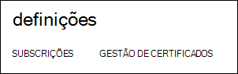
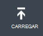
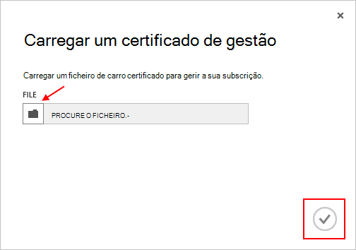

<properties 
    pageTitle="Carregar um certificado de API do Azure gestão | Azure Microsoft" 
    description="Saiba como carregar certificado de gestão API athe para o Portal clássica Azure." 
    services="cloud-services" 
    documentationCenter=".net" 
    authors="Thraka" 
    manager="timlt" 
    editor=""/>

<tags 
    ms.service="na" 
    ms.workload="tbd" 
    ms.tgt_pltfrm="na" 
    ms.devlang="na" 
    ms.topic="article" 
    ms.date="04/18/2016"
    ms.author="adegeo"/>

# Carregar um certificado de gestão de gestão API do Azure

Certificados de gestão da permitem-lhe autenticar com a API de gestão do serviço fornecido pelo Azure. Vários programas e ferramentas (como Visual Studio ou o SDK do Azure) irão utilizar estes certficates para automatizar a configuração e implementação de vários serviços Azure. **Só se aplica ao portal do Azure clássico**. 

>[AZURE.WARNING] Tenha o cuidado de! Estes tipos de certificados permitir que qualquer pessoa que autentica com os mesmos para gerir a subscrição que estão associadas. 

Mais informações sobre Azure certificados (incluindo a criação de um certificado autoassinado) estão [disponível](cloud-services/cloud-services-certs-create.md#what-are-management-certificates) para si caso precise da mesma.

Também pode utilizar o [Azure Active Directory](/services/active-directory/) para autenticar o código do cliente para fins de automatização.

## Carregar um certificado de gestão

Assim que tiver um certificado de gestão criado, (ficheiro. cer com apenas a chave pública) pode carregá-lo para o portal. Quando o certificado está disponível no portal do, qualquer pessoa com um certficiate correspondente (chave privada) pode ligar através da API de gestão e aceder aos recursos para a subscrição associada.

1. Inicie sessão no [portal clássica Azure](http://manage.windowsazure.com).

2. Certifique-se selecionar a subscrição correta à qual pretende associar um certificado com. Prima o texto de **subscrições** na parte superior direita do portal.

    

3. Depois de ter a subscrição correta selecionada, prima **as definições** no lado esquerdo do portal (poderá ter de deslocar para baixo). 
    
    

4. Prima o separador **Gestão de certificados** .

    
    
5. Prima o botão **carregar** .

    
    
6. Preencha as informações de caixa de diálogo e prima a **marca de verificação**concluído.

    

## Próximos passos

Agora que tem um certificado de gestão associado a uma subscrição, pode (depois de ter instalado o certificado correspondente localmente) forma programática ligar à [API REST do serviço de gestão](https://msdn.microsoft.com/library/azure/mt420159.aspx) e automatizar vários recursos Azure que também estão associados essa subscrição. 