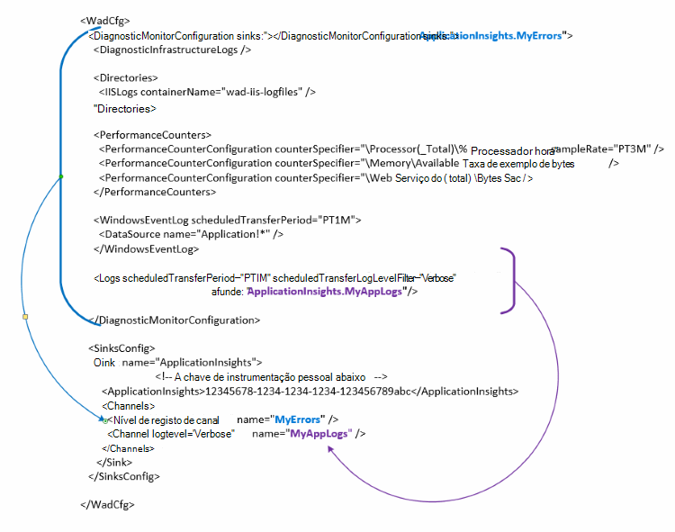

<properties
   pageTitle="Configurar o Azure diagnóstico para enviar dados para informações de aplicação | Microsoft Azure"
   description="Atualize a configuração do pública Azure diagnóstico para enviar dados para informações de aplicação."
   services="multiple"
   documentationCenter=".net"
   authors="sbtron"
   manager="douge"
   editor="" />
<tags
   ms.service="application-insights"
   ms.devlang="na"
   ms.topic="article"
   ms.tgt_pltfrm="na"
   ms.workload="na"
   ms.date="12/15/2015"
   ms.author="saurabh" />

# Configurar o Azure diagnóstico para enviar dados para informações de aplicação

Diagnósticos do Azure armazena os dados a tabelas de armazenamento do Windows Azure.  No entanto, pode também pipe todos os ou um subconjunto de dados para informações de aplicação configurando "sumidouros" e "canais" na configuração quando utiliza a extensão de diagnósticos do Azure 1.5 ou posterior.

Este artigo descreve como criar a configuração do pública para a extensão do Azure diagnóstico para que configurado enviar dados para informações de aplicação.

## Configurar a aplicação informações como um Sink

Apresenta a extensão do Azure diagnóstico 1,5 a **<SinksConfig>** elemento na configuração do público. Isto define o adicionais *sink* onde os dados do Azure diagnóstico podem ser enviados. Pode especificar os detalhes do recurso aplicação informações em que pretende enviar os dados de diagnóstico Azure como parte desta **<SinksConfig>**.
Um exemplo **SinksConfig** tem este aspeto-  

    <SinksConfig>
        <Sink name="ApplicationInsights">
          <ApplicationInsights>{Insert InstrumentationKey}</ApplicationInsights>
          <Channels>
            <Channel logLevel="Error" name="MyTopDiagData"  />
            <Channel logLevel="Verbose" name="MyLogData"  />
          </Channels>
        </Sink>
      </SinksConfig>

Para o elemento **Sink** o atributo *nome* Especifica um valor de cadeia que será utilizado para exclusivamente consultar o sink.
O elemento **ApplicationInsights** Especifica a chave de instrumentação o informações de recurso de aplicação onde os dados de diagnóstico Azure serão enviados. Se não tiver um recurso de informações de aplicação existente, consulte o artigo [criar um novo recurso de informações de aplicação](./application-insights/app-insights-create-new-resource.md) para obter mais informações sobre como criar um recurso e obter a chave de instrumentação.

Se estiver a desenvolver um projeto de serviço na nuvem com Azure SDK 2,8 esta tecla instrumentação é preenchida automaticamente na configuração do pública baseada a definição de configuração do serviço **APPINSIGHTS_INSTRUMENTATIONKEY** quando embalagem o projeto de serviço de nuvem. Consulte o artigo [Informações de aplicação de utilização com o Azure diagnóstico para resolver problemas de serviço na nuvem](./cloud-services/cloud-services-dotnet-diagnostics-applicationinsights.md).

O elemento de **canais** permite-lhe definir um ou mais elementos de **canal** para os dados que serão enviados para o sink. O canal age como um filtro e permite-lhe selecionar níveis de registo específico que pretende enviar para o sink. Por exemplo que poderia recolher registos verbosas e enviá-los ao armazenamento, mas pode escolher definir um canal com um nível de registo de erros e quando envia registos através de que os registos de erros apenas de canal serão enviados para esse sink.
Para um **canal** o atributo *nome* é utilizado para exclusivamente fazer referência a esse canal.
O atributo *loglevel* permite-lhe especificar o nível de registo que irá permitir que o canal. Os níveis de registo disponíveis na ordem de informações mais menos são
 - Verboso
 - Informações
 - Aviso
 - Erro
 - Crítica

## Enviar dados para o sink informações de aplicação
Assim que tenha sido definido o sink de informações da aplicação pode enviar dados para esse sink adicionando o atributo *sink* aos elementos sob o nó **DiagnosticMonitorConfiguration** . Adicionar o elemento *afunde* a cada nó Especifica que pretende que os dados recolhidos a partir desse nó e qualquer nó em-la para ser enviada para sink especificado.

Por exemplo, se pretender enviar todos os dados que estão a ser recolhidos pelo diagnóstico Azure, em seguida, pode adicionar o atributo *sink* diretamente para o nó **DiagnosticMonitorConfiguration** . Defina o valor de *afunde* para o nome de Sink que foi especificado na **SinkConfig**.

    <DiagnosticMonitorConfiguration overallQuotaInMB="4096" sinks="ApplicationInsights">

Se pretender enviar registos de erros para as informações de aplicação receber, em seguida, pode definir o valor de *sumidouros* a ser o nome de Sink seguido do nome do canal separado por um período ("."). Por exemplo para enviar registos de erro apenas para as informações de aplicação sink utilize o canal de MyTopDiagdata que tenha sido definido na SinksConfig acima.  

    <DiagnosticMonitorConfiguration overallQuotaInMB="4096" sinks="ApplicationInsights.MyTopDiagdata">

Se quiser enviar registos de aplicação verboso para informações de aplicação, em seguida, seria necessário adicionar o atributo *afunde* o nó de **registos** .

    <Logs scheduledTransferPeriod="PT1M" scheduledTransferLogLevelFilter="Verbose" sinks="ApplicationInsights.MyLogData"/>

Também pode incluir várias sumidouros na configuração em diferentes níveis na hierarquia. Nesse caso sink especificado no nível superior da hierarquia age como uma definição de global e um especificado aos factos de elemento de elemento individual, como uma substituição para essa definição global.    

Eis um exemplo completo do ficheiro de configuração público que envia todos os erros para registos de nível para além disso verbosas e informações de aplicação (especificado no nó **DiagnosticMonitorConfiguration** ) para que os registos de aplicação (especificado no nó de **registos** ).

    <WadCfg>
      <DiagnosticMonitorConfiguration overallQuotaInMB="4096"
           sinks="ApplicationInsights.MyTopDiagData"> <!-- All info below sent to this channel -->
        <DiagnosticInfrastructureLogs />
        <PerformanceCounters>
          <PerformanceCounterConfiguration counterSpecifier="\Processor(_Total)\% Processor Time" sampleRate="PT3M" sinks="ApplicationInsights.MyLogData/>
          <PerformanceCounterConfiguration counterSpecifier="\Memory\Available MBytes" sampleRate="PT3M" />
          <PerformanceCounterConfiguration counterSpecifier="\Web Service(_Total)\Bytes Total/Sec" sampleRate="PT3M" />
        </PerformanceCounters>
        <WindowsEventLog scheduledTransferPeriod="PT1M">
          <DataSource name="Application!*" />
        </WindowsEventLog>
        <Logs scheduledTransferPeriod="PT1M" scheduledTransferLogLevelFilter="Verbose"
                sinks="ApplicationInsights.MyLogData"/> <!-- This specific info sent to this channel -->
      </DiagnosticMonitorConfiguration>

    <SinksConfig>
        <Sink name="ApplicationInsights">
          <ApplicationInsights>{Insert InstrumentationKey}</ApplicationInsights>
          <Channels>
            <Channel logLevel="Error" name="MyTopDiagData"  />
            <Channel logLevel="Verbose" name="MyLogData"  />
          </Channels>
        </Sink>
      </SinksConfig>
    </WadCfg>

Existem algumas limitações ter em consideração com esta funcionalidade

- Canais destinam-se apenas para funcionar com o tipo de registo e não contadores de desempenho. Se especificar um canal com um elemento de contador de desempenho será ignorada.
- O nível de registo de um canal, não pode exceder o nível de registo para o que está a ser recolhido pelo Azure diagnóstico. Por exemplo: não é possível recolher erros de registo de aplicações no elemento de registos e tente enviar verboso registos para o sink conhecimentos aprofundados de aplicação. O atributo *scheduledTransferLogLevelFilter* sempre tem de recolher igual ou mais registos que os registos está a tentar enviar para um sink.
- Não é possível enviar quaisquer dados blob recolhidos pela extensão do Azure diagnósticos para informações de aplicação. Por exemplo nada especificado no nó *directórios* . Para falha de sistema copia a informação de falha real continuarão a ser enviada para o armazenamento de blob e apenas uma notificação a indicar que a informação de falha de foi gerada será enviada para informações de aplicação.

## Próximos passos

- Utilize o [PowerShell](./cloud-services/cloud-services-diagnostics-powershell.md) para activar a extensão do Azure diagnósticos para a sua aplicação. 
- Utilizar o [Visual Studio](vs-azure-tools-diagnostics-for-cloud-services-and-virtual-machines.md) para ativar a extensão do Azure diagnósticos para a sua aplicação
