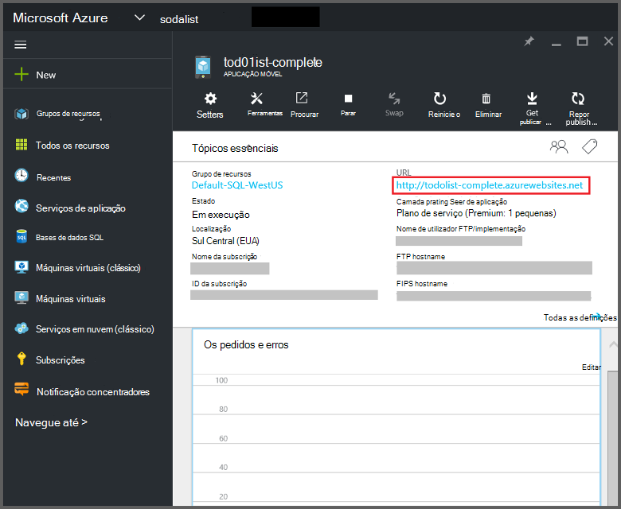
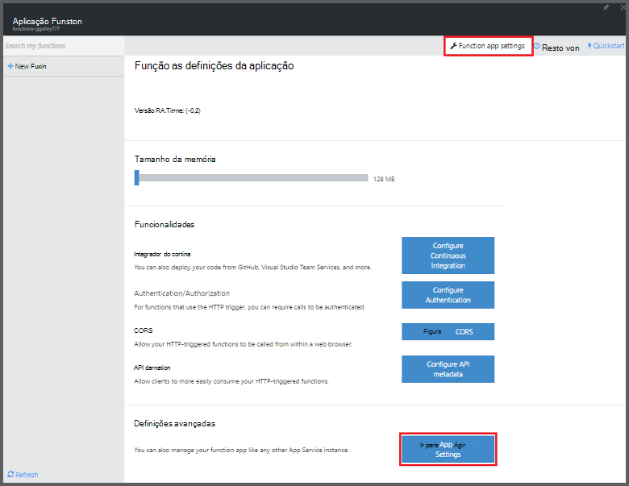
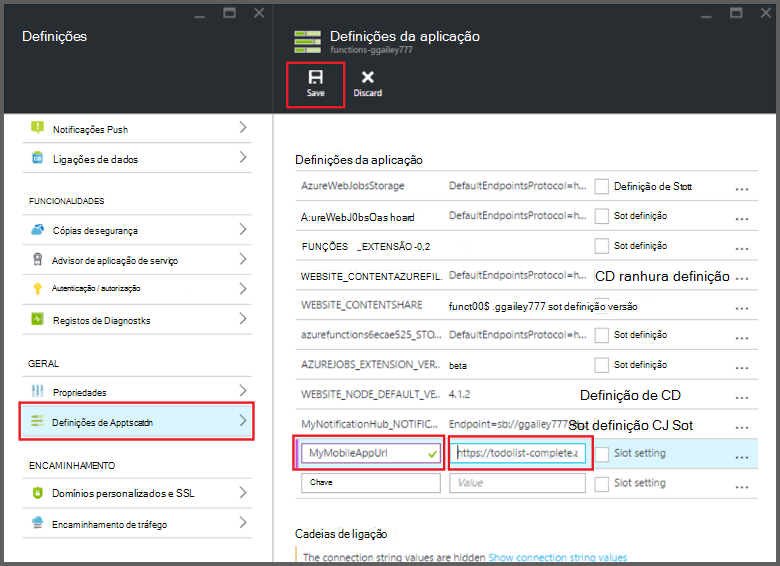

<properties
    pageTitle="Azure enlaces de aplicações do Mobile funções | Microsoft Azure"
    description="Compreenda como utilizar enlaces de aplicações do Azure Mobile no Azure funções."
    services="functions"
    documentationCenter="na"
    authors="ggailey777"
    manager="erikre"
    editor=""
    tags=""
    keywords="funções de Azure, funções, evento processamento, cluster dinâmico, sem servidor arquitetura"/>

<tags
    ms.service="functions"
    ms.devlang="multiple"
    ms.topic="reference"
    ms.tgt_pltfrm="multiple"
    ms.workload="na"
    ms.date="08/30/2016"
    ms.author="glenga"/>

# Azure enlaces de aplicações do Mobile funções

[AZURE.INCLUDE [functions-selector-bindings](../../includes/functions-selector-bindings.md)]

Este artigo explica como configurar e código Azure Mobile aplicações enlaces Azure funções. 

[AZURE.INCLUDE [intro](../../includes/functions-bindings-intro.md)] 

Azure iniciador de aplicações móveis serviço permite-lhe expor os dados da tabela ponto final para clientes móveis. Estes mesmos dados em tabela podem ser utilizados com ambos os entrada e saída enlaces nas funções Azure. Porque suporta esquema dinâmica, uma aplicação móvel do Node.js back-end é ideal para expor os dados de tabela para utilização com o seu funções. Esquema dinâmica está ativada por predefinição e deve ser desactivada numa aplicação móvel de produção. Para mais informações sobre os pontos finais de tabela no Node.js back-end, consulte o artigo [Descrição geral: operações da tabela](../app-service-mobile/app-service-mobile-node-backend-how-to-use-server-sdk.md#TableOperations). Em aplicações do telemóvel, o back-end Node.js suporta no portal de navegação e edição de tabelas. Para mais informações, consulte o artigo [no portal de edição](../app-service-mobile/app-service-mobile-node-backend-how-to-use-server-sdk.md#in-portal-editing) no tópico Node.js SDK. Quando utiliza uma aplicação móvel do .NET back-end com funções Azure, tem de atualizar manualmente um modelo de dados conforme necessário pela sua função. Para mais informações sobre os pontos finais de tabela numa aplicação móvel .NET back-end, consulte o artigo [como: definir um controlador de tabela](../app-service-mobile/app-service-mobile-dotnet-backend-how-to-use-server-sdk.md#define-table-controller) no tópico .NET back-end SDK. 

## Criar uma variável de ambiente para o seu URL de back-end da aplicação móvel

Enlaces aplicações Mobile atualmente necessitam criar uma variável de ambiente devolve o URL do aplicação móvel do back-end própria. Este URL pode encontrar no [portal do Azure](https://portal.azure.com) localizar a sua aplicação móvel e abrindo o pá.

Para definir este URL como uma variável de ambiente na sua aplicação de função:

1. Na sua aplicação de função no [portal do Azure funções](https://functions.azure.com/signin), clique em **definições de aplicação de função** > **aceda a definições de aplicação de serviço**. 

    

2. Na sua aplicação de função, clique em **todas as definições**, desloque para baixo para **as definições da aplicação**, em seguida, em tipo das **definições da aplicação** um novo **nome** para a variável de ambiente, cole o URL para o **valor**, certificando-se utilizar o esquema de HTTPS, em seguida, clique em **Guardar** e fechar pá de aplicação a função para devolver o portal de funções.   

    

Agora pode definir esta variável de ambiente de novo como o campo de *ligação* no seu enlaces.

## Utilize uma chave de API para acesso seguro a sua os pontos finais da tabela de aplicações Mobile.

Nas funções de Azure, enlaces tabela móvel permitem-lhe especificar uma tecla API, que é uma palavra-passe partilhada que pode ser utilizada para impedir o acesso indesejado a partir das aplicações que não seja o seu funções. Aplicações móveis não tem suporte incorporado para autenticação por chave API. No entanto, pode implementar uma tecla de API na sua aplicação móvel do Node.js back-end ao seguir os exemplos [back-end aplicações do Azure aplicação serviço Mobile a execução de uma chave de API](https://github.com/Azure/azure-mobile-apps-node/tree/master/samples/api-key). Do mesmo modo que possa implementar uma tecla de API numa [aplicação móvel do .NET back-end](https://github.com/Azure/azure-mobile-apps-net-server/wiki/Implementing-Application-Key).

>[AZURE.IMPORTANT] Esta chave API não pode ser distribuído com os seus clientes aplicação móvel, -deve apenas ser distribuído em segurança para os clientes de lado do serviço, como o Azure funções. 

## Encadernação de entrada do Azure aplicações Mobile

Ligações de entrada podem carregar um registo a partir de um ponto final de tabela móvel e transmiti-lo diretamente para a encadernação. O registo que ID é determinado com base no accionador que chamado a função. Numa função c#, quaisquer alterações efetuadas para o registo são enviadas automaticamente para a tabela quando a função sai com êxito.

#### Function.JSON enlaces entrada aplicações Mobile

O ficheiro *function.json* suporta as seguintes propriedades:

- `name`: Nome variável utilizado no código de função do novo registo.
- `type`: Biding tipo tem de estar definida para *mobileTable*.
- `tableName`: A tabela onde será criado o novo registo.
- `id`: O ID do registo para obter. Esta propriedade suporta enlaces semelhantes ao `{queueTrigger}`, que irá utilizar o valor de cadeia da mensagem fila como o registo ID.
- `apiKey`: Cadeia que é a definição de aplicação que especifica a chave de API opcional para a aplicação móvel. O que é necessário quando a sua aplicação móvel utiliza uma tecla de API para restringir o acesso de cliente.
- `connection`: Cadeia que é o nome da variável de ambiente nas definições da aplicação que especifica o URL do seu back-end da aplicação móvel.
- `direction`: Direcção de encadernação, tem de estar definida *na*.

Exemplo de ficheiro *function.json* :

    {
      "bindings": [
        {
          "name": "record",
          "type": "mobileTable",
          "tableName": "MyTable",
          "id" : "{queueTrigger}",
          "connection": "My_MobileApp_Url",
          "apiKey": "My_MobileApp_Key",
          "direction": "in"
        }
      ],
      "disabled": false
    }

#### Exemplo de código do Azure aplicações móveis para um accionador c# fila de espera

Com base no function.json exemplo acima, obtém a ligação de entrada o registo a partir de um aplicações móveis ponto final com o ID que corresponde a cadeia da mensagem fila de espera e transmite-lo para o parâmetro de *registo* da tabela. Quando o registo não for encontrado, o parâmetro é nulo. O registo, em seguida, será atualizado com o novo valor de *texto* quando sai a função.

    #r "Newtonsoft.Json"    
    using Newtonsoft.Json.Linq;
    
    public static void Run(string myQueueItem, JObject record)
    {
        if (record != null)
        {
            record["Text"] = "This has changed.";
        }    
    }

#### Exemplo de código do Azure aplicações móveis para um accionador de fila Node.js

Com base no function.json exemplo acima, obtém a ligação de entrada o registo a partir de um aplicações móveis ponto final com o ID que corresponde a cadeia da mensagem fila de espera e transmite-lo para o parâmetro de *registo* da tabela. Nas funções de Node.js, os registos actualizados não são enviados novamente à tabela. Este exemplo de código escreve o registo obtido para o registo.

    module.exports = function (context, input) {    
        context.log(context.bindings.record);
        context.done();
    };

## Ligação de saída aplicações Mobile Azure

A função pode escrever um registo para um ponto final de tabela aplicações Mobile utilizando uma ligação de saída. 

#### ligação de saída Function.JSON para aplicações Mobile

O ficheiro function.json suporta as seguintes propriedades:

- `name`: Nome variável utilizado no código de função do novo registo.
- `type`: Tipo de enlace tem de estar definido para *mobileTable*.
- `tableName`: A tabela onde é criado o novo registo.
- `apiKey`: Cadeia que é a definição de aplicação que especifica a chave de API opcional para a aplicação móvel. O que é necessário quando a sua aplicação móvel utiliza uma tecla de API para restringir o acesso de cliente.
- `connection`: Cadeia que é o nome da variável de ambiente nas definições da aplicação que especifica o URL do seu back-end da aplicação móvel.
- `direction`: Direcção de encadernação, tem de estar definida para *fora*.

Exemplo function.json:

    {
      "bindings": [
        {
          "name": "record",
          "type": "mobileTable",
          "tableName": "MyTable",
          "connection": "My_MobileApp_Url",
          "apiKey": "My_MobileApp_Key",
          "direction": "out"
        }
      ],
      "disabled": false
    }

#### Exemplo de código do Azure aplicações móveis para um accionador c# fila de espera

Este exemplo de código c# insere um novo registo de um ponto final de tabela aplicações Mobile com uma propriedade de *texto* na tabela especificada no enlace acima.

    public static void Run(string myQueueItem, out object record)
    {
        record = new {
            Text = $"I'm running in a C# function! {myQueueItem}"
        };
    }

#### Exemplo de código do Azure aplicações móveis para um accionador de fila Node.js

Este exemplo de código Node.js insere um novo registo de um ponto final de tabela aplicações Mobile com uma propriedade de *texto* na tabela especificada no enlace acima.

    module.exports = function (context, input) {
    
        context.bindings.record = {
            text : "I'm running in a Node function! Data: '" + input + "'"
        }   
    
        context.done();
    };

## Próximos passos

[AZURE.INCLUDE [next steps](../../includes/functions-bindings-next-steps.md)]
