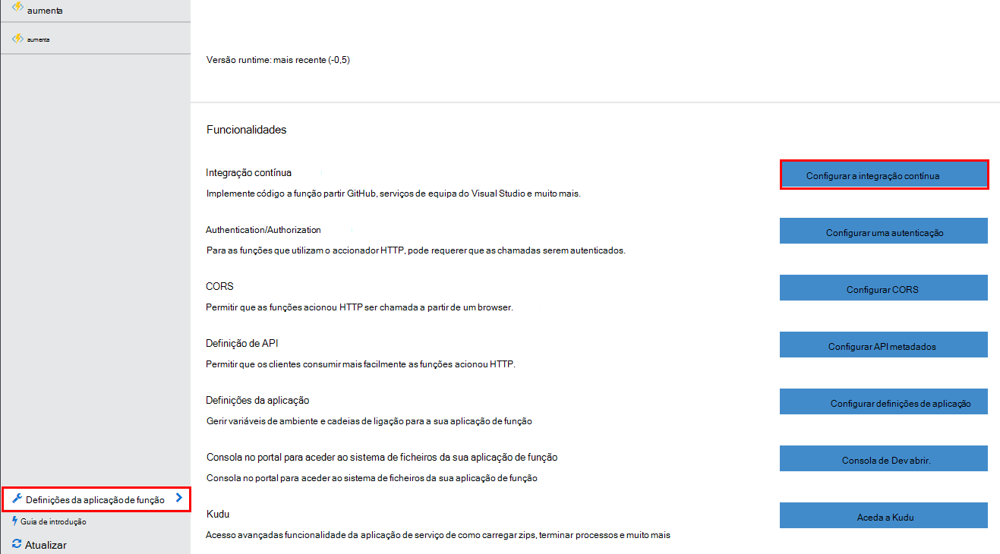
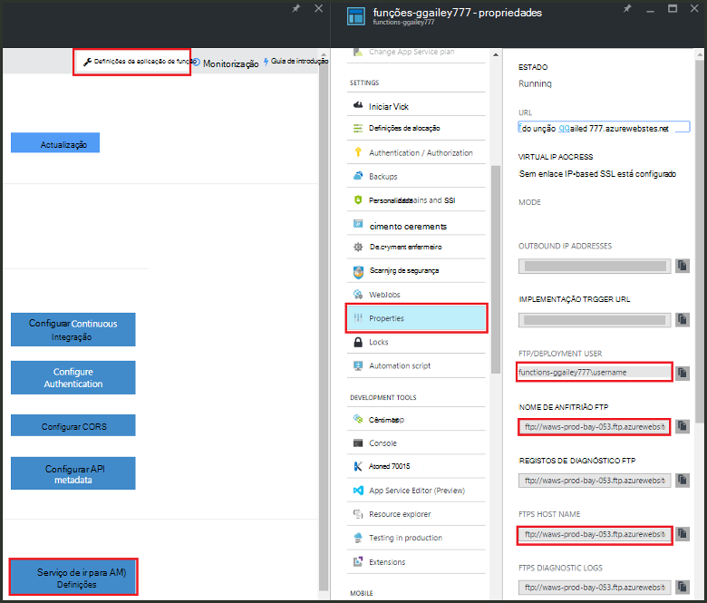

<properties
   pageTitle="Implementação do Azure funções como contínua | Microsoft Azure"
   description="Utilize instalações contínua implementação da aplicação de serviço de Azure para publicar o seu funções Azure."
   services="functions"
   documentationCenter="na"
   authors="ggailey777"
   manager="erikre"
   editor=""
   tags=""
   />

<tags
   ms.service="functions"
   ms.devlang="multiple"
   ms.topic="article"
   ms.tgt_pltfrm="multiple"
   ms.workload="na"
   ms.date="09/25/2016"
   ms.author="glenga"/>

# Implementação do Azure funções como contínua 

Funções Azure torna mais fácil configurar a implementação contínua para a sua aplicação de função. Funções tira partido de integração de aplicação de serviço do Azure com BitBucket, Dropbox, GitHub e serviços de equipa do Visual Studio (VSTS) para ativar um fluxo de trabalho de implementação contínua onde Azure obtém atualizações para o seu código funções quando são publicados para um destes serviços. Se estiver familiarizado com o Azure funções, comece com [Descrição geral das funções do Azure](functions-overview.md).

Implementação contínua é uma ótima opção para projetos onde vários e contribuições frequentes estão a ser integradas. Também lhe permite manter o controlo de origem no seu código de funções. As seguintes fontes de implementação atualmente são suportadas:

+ [Bitbucket](https://bitbucket.org/)
+ [Dropbox](https://bitbucket.org/)
+ [Git local repo](../app-service-web/app-service-deploy-local-git.md)
+ Repo externo Git
+ [GitHub]
+ Que repo externo
+ [OneDrive](https://onedrive.live.com/)
+ Serviços de equipa do Visual Studio

Implementações estão configuradas numa base por-função-app. Depois de implementação contínua é activada, o acesso ao código de função no portal do está definido como *só de leitura*.

## Requisitos de implementação contínuo

Tem de ter configurado a origem de implementação e o código de funções na origem de implementação antes da configuração da compilação contínua implementação. Na implementação de aplicações determinada função, cada função encontra-se num subdirectório com nome, o nome do directório existe o nome da função. Esta estrutura de pastas é, essencialmente, o código do site. 

[AZURE.INCLUDE [functions-folder-structure](../../includes/functions-folder-structure.md)]

## Definição de segurança contínua implementação

Utilize o seguinte procedimento para configurar a implementação contínua para uma aplicação de função existente:

1. Na sua aplicação de função no [portal do Azure funções](https://functions.azure.com/signin), clique em **definições de aplicação de função** > **integração contínua configurar** > **configuração**.

    
    
    
    
    Também pode aceder à pá de implementações do guia de introdução funções, clicando em **Iniciar a partir do controlo da origem**.

2. Na pá híbridas, clique em **Escolher origem**, em seguida, Fill-in as informações para a sua origem de implementação que selecionou e clique em **OK**.

    

Depois de implementação de contínua está configurada, todos os ficheiros de alterações na sua origem de implementação são copiados para a aplicação de função e uma implementação do site completo é acionada. O site é novamente implementado quando os ficheiros na origem são actualizados.

##Opções de implementação

Seguem-se alguns cenários de implementação típica:

+ 

###Criar uma implementação de transição

Função aplicações ainda não suporta faixas de implementação. No entanto, ainda pode gerir implementações de teste e de produção separadas utilizando integração contínua.

O processo para configurar e trabalhar com uma implementação transição geralmente este aspeto:

1. Crie duas função aplicações na sua subscrição, uma para o código de produção e outra para transição. 

2. Crie uma origem de implementação, se ainda não tiver uma. Vamos utilizar o [GitHub].
 
3. Para a sua aplicação de função de produção, conclua os passos acima, na **definição de segurança contínua implementação** e configure o ramo de implementação para o ramo principal da sua repo GitHub.

    

4. Repita este passo para a aplicação de função transição, mas desta vez escolher o ramo de transição no seu repo GitHub. Se a sua origem de implementação não suporta ramificação, utilize uma pasta diferente.
 
5. Tornar as atualizações no código na transição ramo ou pasta e, em seguida, certifique-se de que essas alterações serão refletidas na implementação transição.

6. Depois de a testar, intercalar as alterações de ramo de transição para o ramo principal. Isto irá acionar a implementação de para a aplicação de função de produção. Se a sua origem de implementação não suporta ramificações, substitua os ficheiros na pasta de produção com os ficheiros a partir da pasta de teste.

###Deslocar-se funções existentes para implementação contínua

Quando tiver funções existentes que tenha criadas e mantidas no portal do, é necessário transferir os seus ficheiros de código de função existente utilizando o FTP ou o repositório Git local antes de pode implementação contínua de configuração da compilação como é descrito acima. Pode fazê-lo nas definições do serviço de aplicação para a sua aplicação de função. Depois dos ficheiros são transferidos, pode carregá-las para a sua origem de implementação contínua que selecionou.

>[AZURE.NOTE]Depois de configurar integração contínua, já não será possível editar os seus ficheiros de origem no portal do funções.

####Como: configurar as credenciais de implementação
Antes de poder transferir ficheiros da sua aplicação de função, tem de configurar as suas credenciais para aceder ao site, que pode efetuar a partir do portal. As credenciais estão definidas ao nível da aplicação de função.

1. Na sua aplicação de função no [portal do Azure funções](https://functions.azure.com/signin), clique em **definições de aplicação de função** > **aceda a definições de aplicação de serviço de** > **credenciais de implementação**.

    

2. Escreva um nome de utilizador e palavra-passe e, em seguida, clique em **Guardar**. Agora pode utilizar estas credenciais para aceder à sua aplicação de função de FTP ou o repo Git incorporado.

####Como: transferir ficheiros utilizando FTP

1. Na sua aplicação de função no [portal do Azure funções](https://functions.azure.com/signin), clique em **definições de aplicação de função** > **aceda a definições de aplicação de serviço de** > **Propriedades** e copie os valores para o **Utilizador FTP/implementação**, **Nome de anfitrião FTP**e **Ftps:// Host Name**.  
**Utilizador FTP/implementação** têm de ser introduzidas como é apresentado no portal do, incluindo o nome da aplicação para fornecer um contexto adequado para o servidor FTP.

    
    
2. A partir do seu cliente de FTP, utilize as informações de ligação reuniu para ligar para a sua aplicação e transferir os ficheiros de origem para o seu funções.

####Como: transferir ficheiros através do repositório de Git local

1. Na sua aplicação de função no [portal do Azure funções](https://functions.azure.com/signin), clique em **definições de aplicação de função** > **integração contínua configurar** > **configuração**.

2. No pá híbridas, clique em **Escolher origem** **Local Git repositório**, em seguida, clique em **OK**.
 
3. Clique em **Ir para definições do serviço de aplicação** > **Propriedades** e nota o valor de Git URL. 
    
    

4. Clonar repo no seu computador local com uma linha de comandos em atenção Git ou a ferramenta de Git favorita. O comando de clonar Git tem o seguinte aspeto:

        git clone https://username@my-function-app.scm.azurewebsites.net:443/my-function-app.git

5. Obtenção de ficheiros da sua aplicação de função para a clonar no seu computador local, tal como no exemplo seguinte:

        git pull origin master

    Se lhe for solicitado, fornece o nome de utilizador e palavra-passe da sua implementação da aplicação de função.  

[GitHub]: https://github.com/
