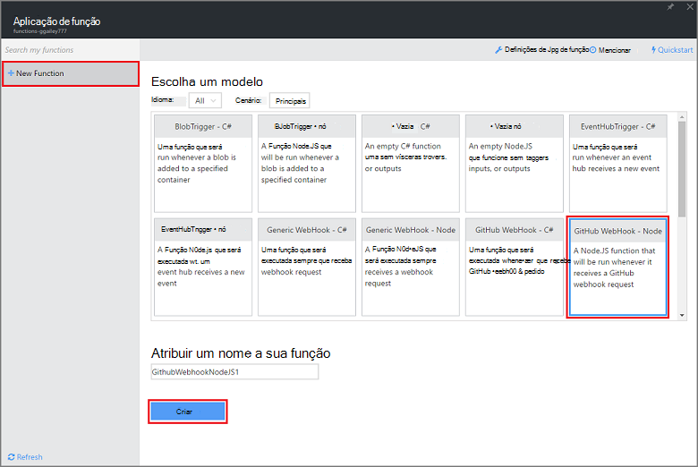
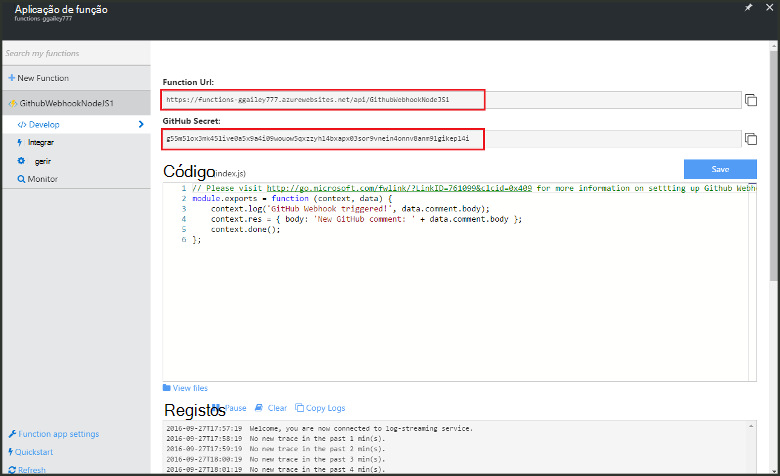
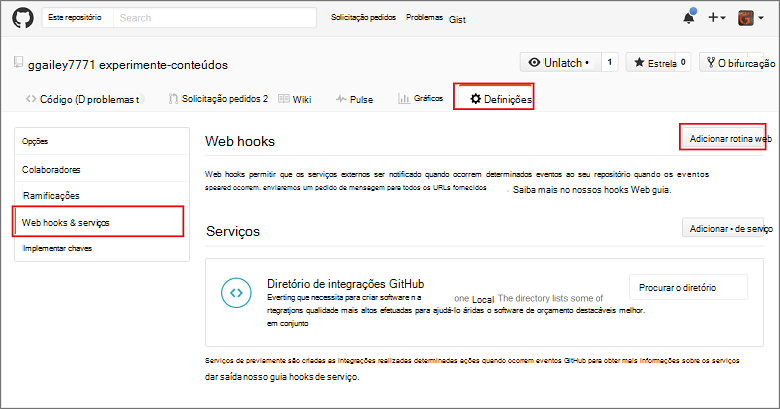
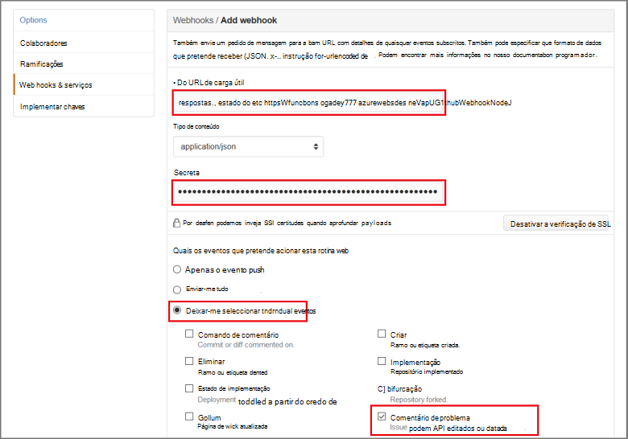

<properties
   pageTitle="Criar um rotina web ou a função da API do Azure | Microsoft Azure"
   description="Utilize as funções de Azure para criar uma função que é chamada por uma WebHook ou API chamar."
   services="azure-functions"
   documentationCenter="na"
   authors="ggailey777"
   manager="erikre"
   editor=""
   tags=""
   />

<tags
   ms.service="functions"
   ms.devlang="multiple"
   ms.topic="get-started-article"
   ms.tgt_pltfrm="multiple"
   ms.workload="na"
   ms.date="08/30/2016"
   ms.author="glenga"/>
   
# Criar um webhook ou a função da API do Azure

Funções Azure é uma experiência de condicionada por eventos, cluster a pedido que permite criar agendado ou acionou unidades de código implementado numa variedade de linguagens de programação. Para saber mais sobre Azure funções, consulte o artigo [Descrição geral das funções do Azure](functions-overview.md).

Este tópico mostra-lhe como criar uma nova função Node.js que é chamada por uma webhook GitHub. A nova função é criada com base num modelo predefinido no portal do Azure funções. Também pode ver um breve vídeo para ver como estes passos são executados no portal.

## Veja o vídeo

O vídeo seguinte Mostrar como efetuar os passos básicos neste tutorial 

[AZURE.VIDEO create-a-web-hook-or-api-azure-function]

##Criar uma função acionou webhook do modelo

Uma aplicação de função aloja a execução do seu funções no Azure. Antes de poder criar uma função, tem de ter uma conta do Azure active. Se ainda não tiver uma conta Azure, [contas gratuitas estão disponíveis](https://azure.microsoft.com/free/). 

1. Aceda ao [portal de funções do Azure](https://functions.azure.com/signin) e iniciar sessão com a sua conta Azure.

2. Se tiver uma aplicação de função existente para utilizar, selecione-a partir do **seu aplicações de função** , em seguida, clique em **Abrir**. Para criar uma nova aplicação de função, escreva um **nome** exclusivo para a sua nova aplicação de função ou aceitar aquele gerado, selecione o seu preferido **região**, em seguida, clique em **Criar + começar**. 

3. Na sua aplicação de função, clique em **+ nova função** > **GitHub Webhook - nó** > **Criar**. Esta ação cria uma função com um nome de predefinido que é baseado no modelo especificado. 

     

4. Na **desenvolver**, repare a função de express.js de exemplo na janela de **código** . Esta função recebe um pedido de GitHub de webhook de comentário um problema, inicia o texto de problema e envia uma resposta a webhook como `New GitHub comment: <Your issue comment text>`.

     

5. Copie os valores de **URL de função** e **GitHub secreta** . Terá estes quando cria a webhook no GitHub. 

6. Desloque para baixo para **Executar**, tenha em atenção o corpo JSON predefinido de um comentário de problema no corpo do pedido e, em seguida, clique em **Executar**. 
 
    Pode testar sempre uma função nova com base no modelo diretamente no separador **desenvolver** , fornecendo qualquer esperado corpo dados JSON e clicando no botão **Executar** . Neste caso, o modelo tem um corpo predefinido de um comentário de problema. 
 
Em seguida, irá criar a webhook real no seu repositório GitHub.

##Configurar o webhook

1. No GitHub, navegue para um repositório de que é o proprietário; Isto inclui qualquer repositórios de que tem a forked.
 
2. Clique em **Definições** > **Webhooks & serviços** > **webhook adicionar**.

       

3. Cole URL e a palavra-passe a função **Carga útil URL** e **secreta**, em seguida, clique em **Deixar-me selecione eventos individuais**, selecione **problema comentário** e clique em **Adicionar webhook**.

     

Neste momento, o GitHub webhook está configurado para acionar a sua função quando é adicionado um novo comentário de problema.  
Agora, é altura de testá-la.

##Testar a função

1. No seu repo GitHub, abra o separador de **problemas** numa nova janela do browser, clique em **Novo problema**, escreva um título, em seguida, clique em **Submeter novo problema**. Também pode abrir um problema existente.

2. No problema, escreva um comentário e clique em **comentário**. Neste momento, pode voltar a sua nova webhook no GitHub e em **Recentes entregas** veem que foi enviado um pedido de webhook e que o corpo da resposta é `New GitHub comment: <Your issue comment text>`.

3. Novamente no portal de funções, desloque para baixo para os registos de início e consulte o artigo que foi aciona a função e o valor `New GitHub comment: <Your issue comment text>` escrito aos registos de transmissão.

##Próximos passos

Consulte os tópicos seguintes para obter mais informações sobre funções Azure.

+ [Referência para programadores do Azure funções](functions-reference.md)  
Referência de programador para codificação de funções.
+ [Testes funções Azure](functions-test-a-function.md)  
Descreve várias ferramentas e técnicas para testar as suas funções.
+ [Como dimensionar funções Azure](functions-scale.md)  
Descreve os planos do serviço disponíveis com as funções de Azure, incluindo o plano de serviço dinâmicos e como escolher o plano à direita.  

[AZURE.INCLUDE [Getting Started Note](../../includes/functions-get-help.md)]
