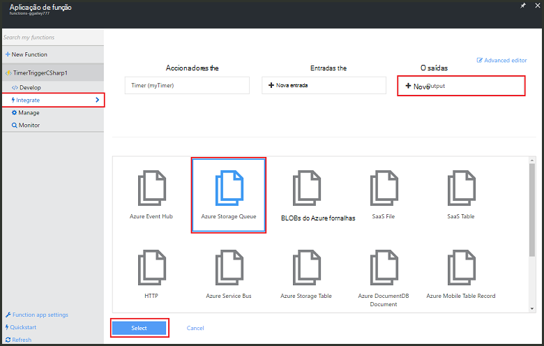
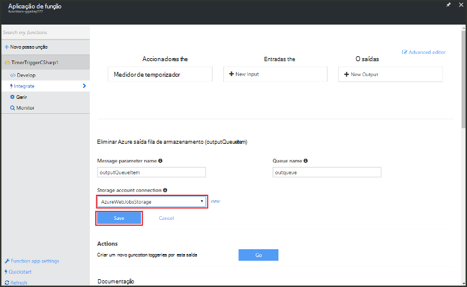

<properties
   pageTitle="Criar um evento processamento função | Microsoft Azure"
   description="Utilize funções de Azure criar uma função c# que é executada com base num temporizador do evento."
   services="functions"
   documentationCenter="na"
   authors="ggailey777"
   manager="erikre"
   editor=""
   tags=""
   />

<tags
   ms.service="functions"
   ms.devlang="multiple"
   ms.topic="get-started-article"
   ms.tgt_pltfrm="multiple"
   ms.workload="na"
   ms.date="09/25/2016"
   ms.author="glenga"/>
   
# Criar um evento processamento função Azure

Funções Azure é uma experiência de condicionada por eventos, cluster a pedido que permite criar agendado ou acionou unidades de código implementado numa variedade de linguagens de programação. Para saber mais sobre Azure funções, consulte o artigo [Descrição geral das funções do Azure](functions-overview.md).

Este tópico mostra-lhe como criar uma nova função no c# que executa com base em temporizador um evento para adicionar mensagens a uma fila de armazenamento. 

## Pré-requisitos 

Antes de poder criar uma função, tem de ter uma conta do Azure active. Se ainda não tiver uma conta Azure, [contas gratuitas estão disponíveis](https://azure.microsoft.com/free/).

## Criar uma função acionou temporizador do modelo

Uma aplicação de função aloja a execução do seu funções no Azure. Antes de poder criar uma função, tem de ter uma conta do Azure active. Se ainda não tiver uma conta Azure, [contas gratuitas estão disponíveis](https://azure.microsoft.com/free/). 

1. Aceda ao [portal de funções do Azure](https://functions.azure.com/signin) e iniciar sessão com a sua conta Azure.

2. Se tiver uma aplicação de função existente para utilizar, selecione-a partir do **seu aplicações de função** , em seguida, clique em **Abrir**. Para criar uma nova aplicação de função, escreva um **nome** exclusivo para a sua nova aplicação de função ou aceitar aquele gerado, selecione o seu preferido **região**, em seguida, clique em **Criar + começar**. 

3. Na sua aplicação de função, clique em **+ nova função** > **TimerTrigger - c#** > **Criar**. Esta ação cria uma função com um nome de predefinido que é executado na agenda de predefinido de uma vez por minuto. 

    

4. Na sua nova função, clique no separador de **integrar** > **Nova saída** > **Fila de armazenamento do Azure** > **Selecione**.

    

5. Na **fila de armazenamento do Azure saída**, selecione uma **ligação de conta de armazenamento**de existente, ou crie um novo, em seguida, clique em **Guardar**. 

    

6. No separador **desenvolver** , substitua o script do c# existente na janela de **código** com o seguinte código:

        using System;
        
        public static void Run(TimerInfo myTimer, out string outputQueueItem, TraceWriter log)
        {
            // Add a new scheduled message to the queue.
            outputQueueItem = $"Ping message added to the queue at: {DateTime.Now}.";
            
            // Also write the message to the logs.
            log.Info(outputQueueItem);
        }

    Este código adiciona uma nova mensagem para a fila com a data e hora atuais quando a função é executada.

7. Clique em **Guardar** e ver as janelas de **registos** para a execução de função seguinte.

8. (Opcional) Navegue para a conta de armazenamento e certifique-se de que as mensagens estiverem a ser adicionadas para a fila.

9. Regresse ao separador **integrar** e alterar o campo de agenda para `0 0 * * * *`. A função agora é executado cada hora. 

Esta é uma muito versão simplificada do exemplo de um accionador temporizador e uma fila de armazenamento de ligação de saída. Para obter mais informações, consulte o [Azure funções temporizador acionador](functions-bindings-timer.md) e os tópicos [Accionadores de funções do Azure e enlaces para armazenamento do Windows Azure](functions-bindings-storage.md) .

##Próximos passos

Consulte os tópicos seguintes para obter mais informações sobre funções Azure.

+ [Referência para programadores do Azure funções](functions-reference.md)  
Referência de programador para funções de codificação e definir accionadores e enlaces.
+ [Testes funções Azure](functions-test-a-function.md)  
Descreve várias ferramentas e técnicas para testar as suas funções.
+ [Como dimensionar funções Azure](functions-scale.md)  
Descreve os planos do serviço disponíveis com as funções de Azure, incluindo o plano de serviço dinâmicos e como escolher o plano à direita.  

[AZURE.INCLUDE [Getting Started Note](../../includes/functions-get-help.md)]
