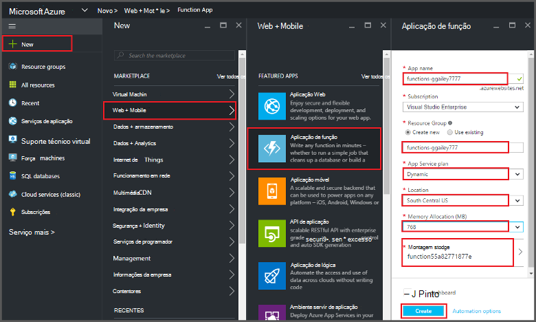
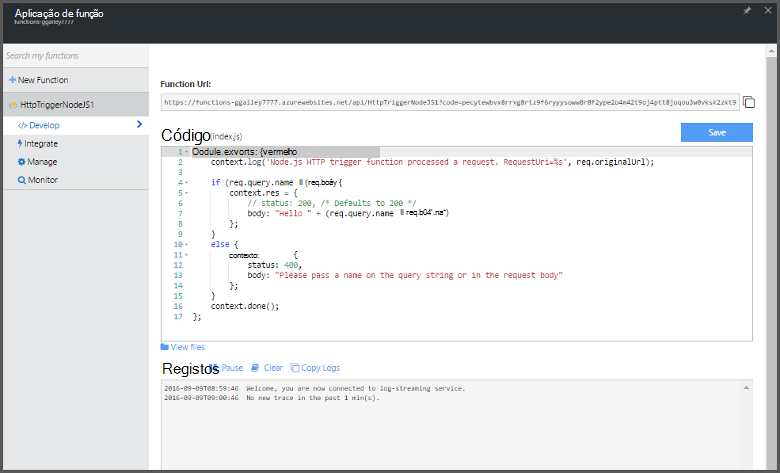

<properties
   pageTitle="Criar uma função a partir do Portal do Azure | Microsoft Azure"
   description="Construa a sua função Azure primeiro, uma aplicação sem servidor, em menos de dois minutos."
   services="functions"
   documentationCenter="na"
   authors="ggailey777"
   manager="erikre"
   editor=""
   tags=""
/>

<tags
   ms.service="functions"
   ms.devlang="multiple"
   ms.topic="article"
   ms.tgt_pltfrm="multiple"
   ms.workload="na"
   ms.date="09/08/2016"
   ms.author="glenga"/>

#Criar uma função a partir do portal do Azure

##Descrição geral
Funções Azure é uma experiência condicionada por eventos, cluster a pedido que se expande a plataforma de aplicação Azure existente com capacidades para implementar o código acionado ao eventos que ocorram noutras Azure serviços, produtos SaaS e sistemas de no local. Com as funções de Azure, as aplicações com base no pedido de escala e pagar apenas para os recursos que consumir. Azure funções activa criar agendado ou acionou unidades de código implementado em diversos idiomas de programação. Para saber mais sobre Azure funções, consulte o artigo [Descrição geral das funções do Azure](functions-overview.md).

Este tópico mostra-lhe como utilizar o portal do Azure para criar uma simples "Olá" Node.js Azure função que é chamado por um acionador de HTTP. Antes de poder criar uma função no portal do Azure, explicitamente tem de criar uma aplicação de função na aplicação de serviço de Azure. Para que a aplicação de função criada automaticamente para si, consulte [o tutorial de guia de introdução outras funções Azure](functions-create-first-azure-function.md), que é uma experiência de guia de introdução mais simples e inclui um vídeo.

##Criar uma aplicação de função

Uma aplicação de função aloja a execução do seu funções no Azure. Siga estes passos para criar uma aplicação de função no portal do Azure.

Antes de poder criar a sua função primeira, tem de ter uma conta do Azure active. Se ainda não tiver uma conta Azure, [contas gratuitas estão disponíveis](https://azure.microsoft.com/free/).

1. Aceda ao [portal do Azure](https://portal.azure.com) e iniciar sessão com a sua conta Azure.

2. Clique em **+ Novo** > **Web + Mobile** > **Função aplicação**, selecione a sua **subscrição**, escreva um **nome da aplicação** exclusivo que identifica a aplicação de função, em seguida, especifique as seguintes definições:

    + **[Grupo de recursos](../azure-portal/resource-group-portal.md/)**: selecione **Criar novo** e introduza um nome para o novo grupo de recursos. Também pode escolher um grupo de recursos existente, no entanto, não poderá criar um plano de serviço de aplicação dinâmico para a sua aplicação de função.
    + **[Plano de serviço de aplicação](../app-service/azure-web-sites-web-hosting-plans-in-depth-overview.md)**: selecione *dinâmicos* ou *clássico*. 
        + **Dinâmicos**: O tipo de plano predefinido para as funções de Azure. Quando escolher um plano dinâmico, também tem escolha a **localização** e definir a **Alocação de memória** (em MB). Para obter informações sobre como afeta a alocação de memória custos, consulte o artigo [Azure funções preços](https://azure.microsoft.com/pricing/details/functions/). 
        + **Clássico**: um plano de serviço de aplicação clássico requer que criar uma **aplicação de serviço de plano/localização** ou selecionar uma existente. Estas definições determinam a [localização, funcionalidades, de custos e recursos de calcular](https://azure.microsoft.com/pricing/details/app-service/) associadas com a sua aplicação.  
    + **Conta de armazenamento**: aplicação cada função requer uma conta de armazenamento. Pode escolher uma conta de armazenamento existente ou criar uma. 

    

3. Clique em **Criar** a aprovisionar e implementar a nova aplicação de função.  

Agora que a aplicação de função está aprovisionada, pode criar a sua primeira função.

## Criar uma função

Estes passos criam uma função a partir do guia de introdução o funções de Azure.

1. No separador do **Guia de introdução** , clique em **WebHook + API** e **JavaScript**, em seguida, clique em **criar uma função**. É criada uma nova função Node.js predefinida. 

    

2. (Opcional) Neste momento no guia de introdução, pode escolher ver uma apresentação rápida das funcionalidades do Azure funções no portal.   Assim que tiver concluído ou ignorado a visita guiada, pode testar a nova função, utilizando o accionador HTTP.

##Testar a função

Uma vez que a tutoriais Azure funções contenham código funcional, pode testar a nova função imediatamente.

1. No separador **desenvolver** , reveja a janela de **código** e repare que este código Node.js espera um pedido de HTTP com um valor de *nome* passado no corpo da mensagem ou numa cadeia de consulta. Quando a função é executado, este valor é devolvido na mensagem de resposta.

    

2. Desloque para baixo para a caixa de texto **Pedir corpo** , altere o valor da propriedade *nome* para o seu nome e clique em **Executar**. Verá que execução é acionada por um pedido HTTP de teste, informações destina-se aos registos de transmissão e a resposta "Olá" é apresentada no **resultado**. 

3. Para desencadear a execução da função mesmo a partir de outra janela do browser ou tab, copie o **URL da função** valor a partir do separador **desenvolver** e colá-lo numa barra de endereço do browser, em seguida, acrescente o valor de cadeia de consulta `&name=yourname` e prima enter. As mesmas informações destina-se para os registos de início e o browser apresenta a resposta "Olá" como antes.

##Próximos passos

Este guia de introdução demonstra a execução de um muito simple de uma função acionou HTTP básica. Consulte os tópicos seguintes para obter mais informações sobre como utilizar a potência das funções Azure nas suas aplicações.

+ [Referência para programadores do Azure funções](functions-reference.md)  
Referência de programador para funções de codificação e definir accionadores e enlaces.
+ [Testes funções Azure](functions-test-a-function.md)  
Descreve várias ferramentas e técnicas para testar as suas funções.
+ [Como dimensionar funções Azure](functions-scale.md)  
Descreve os planos do serviço disponíveis com as funções de Azure, incluindo o plano de serviço dinâmicos e como escolher o plano à direita. 
+ [O que é a aplicação de serviço de Azure?](../app-service/app-service-value-prop-what-is.md)  
Funções Azure utiliza a plataforma de aplicação de serviço do Azure para funcionalidades principais como híbridas, variáveis de ambiente e diagnóstico. 

[AZURE.INCLUDE [Getting Started Note](../../includes/functions-get-help.md)]
