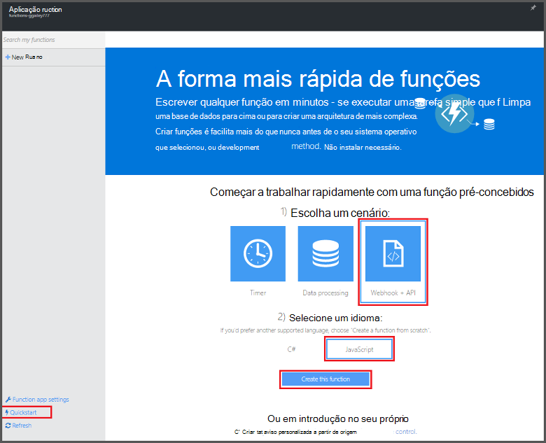
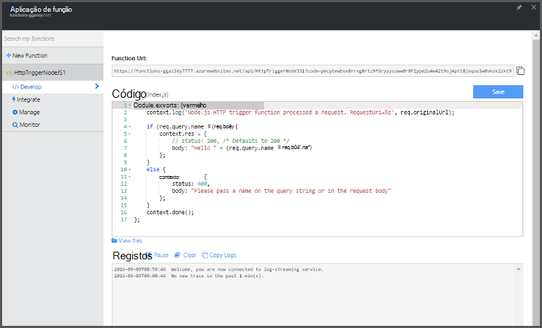

<properties
   pageTitle="Criar a sua primeira função Azure | Microsoft Azure"
   description="Construa a sua função Azure primeiro, uma aplicação sem servidor, em menos de dois minutos."
   services="functions"
   documentationCenter="na"
   authors="ggailey777"
   manager="erikre"
   editor=""
   tags=""
/>

<tags
   ms.service="functions"
   ms.devlang="multiple"
   ms.topic="hero-article"
   ms.tgt_pltfrm="multiple"
   ms.workload="na"
   ms.date="09/08/2016"
   ms.author="glenga"/>

#Criar a sua primeira função Azure

##Descrição geral
Funções Azure é uma experiência condicionada por eventos, cluster a pedido que se expande a plataforma de aplicação Azure existente com capacidades para implementar o código acionado ao eventos que ocorram noutras Azure serviços, produtos SaaS e sistemas de no local. Com as funções de Azure, as aplicações com base no pedido de escala e pagar apenas para os recursos que consumir. Azure funções activa criar agendado ou acionou unidades de código implementado numa variedade de linguagens de programação. Para saber mais sobre Azure funções, consulte o artigo [Descrição geral das funções do Azure](functions-overview.md).

Este tópico mostra-lhe como utilizar o guia de introdução do Azure funções no portal para criar uma simple "Olá mundo" Node.js função que é chamada por um acionador de HTTP. Também pode ver um breve vídeo para ver como estes passos são executados no portal.

## Veja o vídeo

O vídeo seguinte Mostrar como efetuar os passos básicos neste tutorial. 

[AZURE.VIDEO create-your-first-azure-function-simple]

##Criar uma função a partir do guia de introdução

Uma aplicação de função aloja a execução do seu funções no Azure. Siga estes passos para criar uma nova aplicação de função, bem como a nova função. A nova aplicação de função é criada com uma configuração predefinida. Para um exemplo sobre como criar explicitamente a sua aplicação de função, consulte [o tutorial de guia de introdução outras funções Azure](functions-create-first-azure-function-azure-portal.md).

Antes de poder criar a sua função primeira, tem de ter uma conta do Azure active. Se ainda não tiver uma conta Azure, [contas gratuitas estão disponíveis](https://azure.microsoft.com/free/).

1. Aceda ao [portal de funções do Azure](https://functions.azure.com/signin) e iniciar sessão com a sua conta Azure.

2. Escreva um **nome** exclusivo para a sua nova aplicação de função ou aceitar aquele gerado, selecione o seu preferido **região**, em seguida, clique em **Criar + começar**. 

3. No separador do **Guia de introdução** , clique em **WebHook + API** e **JavaScript**, em seguida, clique em **criar uma função**. É criada uma nova função Node.js predefinida. 

    

4. (Opcional) Neste momento no guia de introdução, pode escolher ver uma apresentação rápida das funcionalidades do Azure funções no portal.   Assim que tiver concluído ou ignorado a visita guiada, pode testar a nova função, utilizando o accionador HTTP.

##Testar a função

Uma vez que a tutoriais Azure funções contenham código funcional, pode testar a nova função imediatamente.

1. No separador **desenvolver** , reveja a janela de **código** e repare que este código Node.js espera um pedido de HTTP com um valor de *nome* passado no corpo da mensagem ou numa cadeia de consulta. Quando a função é executado, este valor é devolvido na mensagem de resposta.

    

2. Desloque para baixo para a caixa de texto **Pedir corpo** , altere o valor da propriedade *nome* para o seu nome e clique em **Executar**. Pode ver que execução é acionada por um pedido HTTP de teste, informações destina-se aos registos de transmissão e a resposta "Olá" é apresentada no **resultado**. 

3. Para desencadear a execução da função mesmo a partir de outra janela do browser ou tab, copie o **URL da função** valor a partir do separador **desenvolver** e colá-lo numa barra de endereço do browser, em seguida, acrescente o valor de cadeia de consulta `&name=yourname` e prima enter. As mesmas informações destina-se para os registos de início e o browser apresenta a resposta "Olá" como antes.

##Próximos passos

Este guia de introdução demonstra a execução de um muito simple de uma função acionou HTTP básica. Consulte os tópicos seguintes para obter mais informações sobre as potencialidades do Azure funções nas suas aplicações.

+ [Referência para programadores do Azure funções](functions-reference.md)  
Referência de programador para funções de codificação e definir accionadores e enlaces.
+ [Testes funções Azure](functions-test-a-function.md)  
Descreve várias ferramentas e técnicas para testar as suas funções.
+ [Como dimensionar funções Azure](functions-scale.md)  
Descreve os planos do serviço disponíveis com as funções de Azure, incluindo o plano de serviço dinâmicos e como escolher o plano à direita. 
+ [O que é a aplicação de serviço de Azure?](../app-service/app-service-value-prop-what-is.md)  
Funções Azure tira partido da plataforma de aplicação de serviço do Azure para funcionalidades principais como híbridas, variáveis de ambiente e diagnóstico. 

[AZURE.INCLUDE [Getting Started Note](../../includes/functions-get-help.md)]
