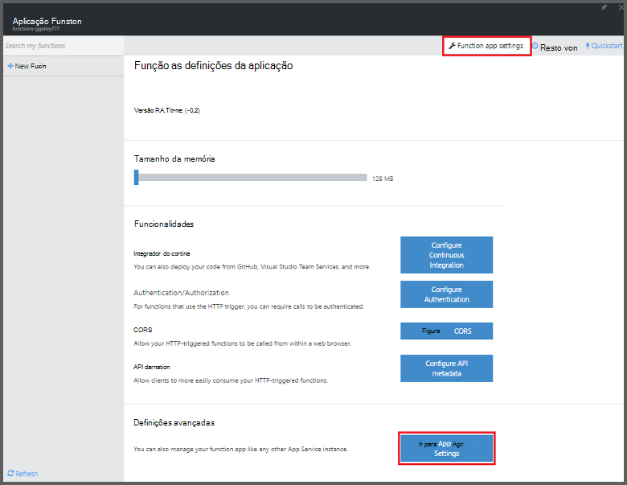
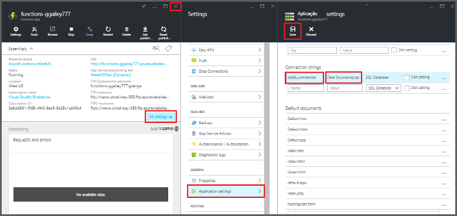
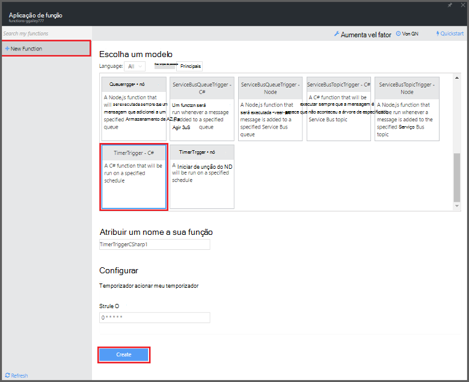

<properties
   pageTitle="Utilize as funções Azure para executar uma tarefa de limpeza agendada | Microsoft Azure"
   description="Utilize funções de Azure criar uma função c# que é executada com base num temporizador do evento."
   services="functions"
   documentationCenter="na"
   authors="ggailey777"
   manager="erikre"
   editor=""
   tags=""
   />

<tags
   ms.service="functions"
   ms.devlang="multiple"
   ms.topic="article"
   ms.tgt_pltfrm="multiple"
   ms.workload="na"
   ms.date="09/26/2016"
   ms.author="glenga"/>
   
# Utilize as funções Azure para executar uma tarefa de limpeza agendada

Este tópico mostra-lhe como utilizar funções Azure para criar uma nova função no c# que é executada com base no temporizador evento para de limpeza linhas numa tabela da base de dados. A nova função é criada com base num modelo predefinido no portal do Azure funções. Para suportar neste cenário, também tem de definir uma cadeia de ligação de base de dados como uma aplicação de serviço de configurar a aplicação de função. 

## Pré-requisitos 

Antes de poder criar uma função, tem de ter uma conta do Azure active. Se ainda não tiver uma conta Azure, [contas gratuitas estão disponíveis](https://azure.microsoft.com/free/).

Este tópico demonstra um comando de Transact-SQL que executa uma operação de limpeza em massa tabela denominada *TodoItems* numa base de dados SQL. Esta tabela TodoItems mesmo é criada quando concluir o [aplicações do Azure aplicação serviço Mobile guia de introdução tutorial](../app-service-mobile/app-service-mobile-ios-get-started.md). Também pode utilizar uma base de dados de exemplo se optar por utilizar uma tabela diferente, terá de modificar o comando.

Pode obter a cadeia de ligação utilizada pelo back-end aplicação Mobile no portal em **todas as definições de** > **definições da aplicação** > **cadeias de ligação** > **Mostrar valores de cadeia de ligação** > **MS_TableConnectionString**. Também pode obter a cadeia de ligação direta a partir de uma base de dados do SQL no portal em **todas as definições de** > **Propriedades** > **Mostrar cadeias de texto de ligação de base de dados** > **ADO.NET (autenticação do SQL)**.

Este cenário utiliza uma operação em massa contra a base de dados. Para que a sua função processo CRUD as operações individuais numa tabela de aplicações Mobile, em vez disso, deve utilizar encadernação tabela móvel.

## Definir uma cadeia de ligação de base de dados SQL na aplicação de função

Uma aplicação de função aloja a execução do seu funções no Azure. É aconselhável para armazenar as cadeias de ligação e outros segredos nas definições de aplicação do função. Isto impede que a divulgação acidental, quando o seu código de função extremidades de cópia de segurança num repo num local. 

1. Aceda ao [portal de funções do Azure](https://functions.azure.com/signin) e iniciar sessão com a sua conta Azure.

2. Se tiver uma aplicação de função existente para utilizar, selecione-a partir do **seu aplicações de função** , em seguida, clique em **Abrir**. Para criar uma nova aplicação de função, escreva um **nome** exclusivo para a sua nova aplicação de função ou aceitar aquele gerado, selecione o seu preferido **região**, em seguida, clique em **Criar + começar**. 

3. Na sua aplicação de função, clique em **definições de aplicação de função** > **aceda a definições de aplicação de serviço**. 

    

4. Na sua aplicação de função, clique em **todas as definições**, desloque-se para baixo para **as definições da aplicação**, em seguida, em tipo de **cadeias de ligação** `sqldb_connection` **nome**, cole o **valor de**cadeia de ligação, clique em **Guardar**, em seguida, feche o pá de aplicação de função para devolver o portal de funções.

    

Agora, pode adicionar o função código c# que se liga à base de dados SQL.

## Criar uma função acionou temporizador do modelo

1. Na sua aplicação de função, clique em **+ nova função** > **TimerTrigger - c#** > **Criar**. Esta ação cria uma função com um nome de predefinido que é executado na agenda de predefinido de uma vez por minuto. 

    

2. No painel de **código** no separador **desenvolver** , adicione as seguintes referências assemblagem na parte superior do código de função existente:

        #r "System.Configuration"
        #r "System.Data"

3. Adicione o seguinte `using` declarações para a função:

        using System.Configuration;
        using System.Data.SqlClient;
        using System.Threading.Tasks; 

4. Substitua a função **Executar** existente com o seguinte código:

        public static async Task Run(TimerInfo myTimer, TraceWriter log)
        {
            var str = ConfigurationManager.ConnectionStrings["sqldb_connection"].ConnectionString;
            using (SqlConnection conn = new SqlConnection(str))
            {
                conn.Open();
                var text = "DELETE from dbo.TodoItems WHERE Complete='True'";
                using (SqlCommand cmd = new SqlCommand(text, conn))
                {
                    // Execute the command and log the # rows deleted.
                    var rows = await cmd.ExecuteNonQueryAsync();
                    log.Info($"{rows} rows were deleted");
                }
            }
        }

5. Clique em **Guardar**, veja as janelas de **registos** para a execução de função seguinte e, em seguida, tenha em atenção o número de linhas eliminado a partir da tabela TodoItems.

6. (Opcional) Utilizar a [aplicação do aplicações Mobile guia de introdução](../app-service-mobile/app-service-mobile-ios-get-started.md), marca itens adicionais, como "concluído", em seguida, voltar para a janela de **registos** e monitorização o mesmo número de linhas ser eliminado pela função durante a execução do seguinte. 

##Próximos passos

Consulte os tópicos seguintes para obter mais informações sobre funções Azure.

+ [Referência para programadores do Azure funções](functions-reference.md)  
Referência de programador para funções de codificação e definir accionadores e enlaces.
+ [Testes funções Azure](functions-test-a-function.md)  
Descreve várias ferramentas e técnicas para testar as suas funções.
+ [Como dimensionar funções Azure](functions-scale.md)  
Descreve os planos do serviço disponíveis com as funções de Azure, incluindo o plano de serviço dinâmicos e como escolher o plano à direita.  

[AZURE.INCLUDE [Getting Started Note](../../includes/functions-get-help.md)]