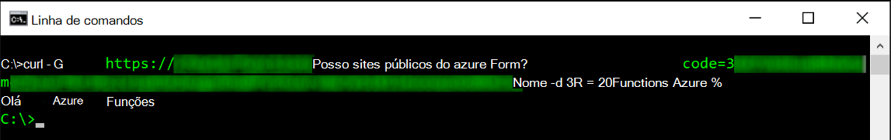
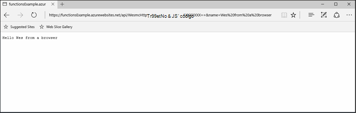
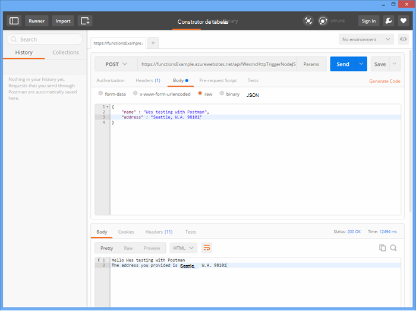

<properties
   pageTitle="Testes funções Azure | Microsoft Azure"
   description="Teste as suas funções Azure utilizando Postman, laço e Node.js."
   services="functions"
   documentationCenter="na"
   authors="wesmc7777"
   manager="erikre"
   editor=""
   tags=""
   keywords="Azure funções, funções, processamento de eventos, webhooks, cluster dinâmico, sem servidor arquitetura, testes"/>

<tags
   ms.service="functions"
   ms.devlang="multiple"
   ms.topic="article"
   ms.tgt_pltfrm="multiple"
   ms.workload="na"
   ms.date="08/19/2016"
   ms.author="wesmc"/>

# Testes funções Azure

## Descrição geral

Neste tutorial, iremos guiá aos testes dos funções é feita através de diferentes abordagens. Vamos definirá uma função de accionador de http aceita entradas através de um parâmetro da cadeia de consulta ou corpo do pedido. O código do modelo **HttpTrigger Node.js função** predefinido suporta um `name` parâmetro da cadeia de consulta. Recomendamos também irá adicionar código para suportar desse parâmetro juntamente com `address` informações do utilizador no corpo do pedido.

## Criar uma função para testar a ligação

Para a maioria deste tutorial, utilizamos uma versão do modelo **HttpTrigger Nodejs função** que está disponível quando criar uma nova função ligeiramente modificada.  Pode rever para [criar a sua primeira tutorial de função Azure](functions-create-first-azure-function.md) se precisar de ajuda para criar uma nova função.  Basta escolha o modelo de **HttpTrigger Nodejs função** quando criar a função de teste no [Portal do Azure].

O modelo de função predefinido que mostra basicamente é uma função de mundo de Olá que ecos novamente o nome do parâmetro pedido corpo ou consulta cadeia, `name=<your name>`.  Vamos irão atualizar o código para também lhe permitem fornecer o nome e um endereço como conteúdo JSON no corpo do pedido. Em seguida, a função irá devolver estes anterior para o cliente quando se encontra disponível.   

Atualize a função com o seguinte código que utilizamos para testar a ligação:

    module.exports = function(context, req) {
        context.log("Node.js HTTP trigger function processed a request. RequestUri=%s", req.originalUrl);
        context.log("Request Headers = " + JSON.stringify(req.headers));    
    
        if (req.query.name || (req.body && req.body.name)) {
            if (typeof req.query.name != "undefined") {
                context.log("Name was provided as a query string param..."); 
                ProcessNewUserInformation(context, req.query.name);
            }
            else {
                context.log("Processing user info from request body..."); 
                ProcessNewUserInformation(context, req.body.name, req.body.address);
            }
        }
        else {
            context.res = {
                status: 400,
                body: "Please pass a name on the query string or in the request body"
            };
        }
        context.done();
    };
    
    function ProcessNewUserInformation(context, name, address)
    {    
        context.log("Processing User Information...");            
        context.log("name = " + name);            
        echoString = "Hello " + name;
        
        if (typeof address != "undefined")
        {
            echoString += "\n" + "The address you provided is " + address;
            context.log("address = " + address);            
        }
        
        context.res = {
                // status: 200, /* Defaults to 200 */
                body: echoString
            };
    }

## Testar uma função com ferramentas

### Testar com laço

Muitas vezes quando testar o software, não é necessário procurar qualquer ainda mais do que a linha de comandos para ajudar a sua aplicação de depurar, esta é não diferente com funções.

Para experimentar a função acima, copie o **Url da função** a partir do portal. Este terá o seguinte formato: 

    https://<Your Function App>.azurewebsites.net/api/<Your Function Name>?code=<your access code>
    
Este é o Url para acionar uma função, podemos testar este utilizando o comando de Laço na linha de comandos para tornar um Get (`-G` ou `--get`) pedido contra a nossa função:

    curl -G https://<Your Function App>.azurewebsites.net/api/<Your Function Name>?code=<your access code>
    
Este exemplo determinado acima requer um parâmetro da cadeia de consulta que pode ser transmitido como dados (`-d`) no comando Laço:

    curl -G https://<Your Function App>.azurewebsites.net/api/<Your Function Name>?code=<your access code> -d name=<Enter a name here>
    
Premir enter e irá ver o resultado da função na linha de comandos.

Na janela do portal **registos** , saída semelhante ao seguinte é registada ao executar a função:

    2016-04-05T21:55:09  Welcome, you are now connected to log-streaming service.
    2016-04-05T21:55:30.738 Function started (Id=ae6955da-29db-401a-b706-482fcd1b8f7a)
    2016-04-05T21:55:30.738 Node.js HTTP trigger function processed a request. RequestUri=https://functionsExample.azurewebsites.net/api/HttpTriggerNodeJS1?code=XXXXXXX&name=Azure Functions
    2016-04-05T21:55:30.738 Function completed (Success, Id=ae6955da-29db-401a-b706-482fcd1b8f7a)

### Teste com um browser

Funções que não necessitam de parâmetros, ou só precisa de parâmetros de cadeia de consulta, podem ser testadas utilizando um browser.

Para experimentar a função definido acima, copie o **Url da função** a partir do portal. Este terá o seguinte formato:

    https://<Your Function App>.azurewebsites.net/api/<Your Function Name>?code=<your access code>

Acrescentar a `name` consulta parâmetro da cadeia da seguinte forma, utilizando um nome real para o `<Enter a name here>` marcador de posição.

    https://<Your Function App>.azurewebsites.net/api/<Your Function Name>?code=<your access code>&name=<Enter a name here>

Cole o URL no seu browser e deve obter uma resposta semelhante ao seguinte.

Na janela do portal **registos** , saída semelhante ao seguinte é registada ao executar a função:

    2016-03-23T07:34:59  Welcome, you are now connected to log-streaming service.
    2016-03-23T07:35:09.195 Function started (Id=61a8c5a9-5e44-4da0-909d-91d293f20445)
    2016-03-23T07:35:10.338 Node.js HTTP trigger function processed a request. RequestUri=https://functionsExample.azurewebsites.net/api/WesmcHttpTriggerNodeJS1?code=XXXXXXXXXX==&name=Wes from a browser
    2016-03-23T07:35:10.338 Request Headers = {"cache-control":"max-age=0","connection":"Keep-Alive","accept":"text/html","accept-encoding":"gzip","accept-language":"en-US"}
    2016-03-23T07:35:10.338 Name was provided as a query string param.
    2016-03-23T07:35:10.338 Processing User Information...
    2016-03-23T07:35:10.369 Function completed (Success, Id=61a8c5a9-5e44-4da0-909d-91d293f20445)

### Teste com Postman

A ferramenta recomendada para testar a maior parte das suas funções é Postman. Para instalar Postman, consulte o artigo [Obter Postman](https://www.getpostman.com/). Postman fornece controlo sobre muitos atributos mais de um pedido de HTTP.

> [AZURE.TIP] Utilize o cliente do resto em que se à vontade. Eis algumas alternativas aos Postman:  
> 
> * [Fiddler](http://www.telerik.com/fiddler)  
> * [Pégadas](https://luckymarmot.com/paw)  

Para experimentar a função com um corpo do pedido no Postman: 

1. Inicie o Postman a partir do botão de **aplicações** no canto superior esquerdo do canto da janela do browser Chrome.
2. Copie o **Url de função** e colá-la Postman. Inclui o parâmetro de cadeia de consulta do código de acesso.
3. Altere o método HTTP a **mensagem**.
4. Clique em **corpo** > **não processados** e adicionar corpo do pedido JSON semelhante ao seguinte:

        {
            "name" : "Wes testing with Postman",
            "address" : "Seattle, W.A. 98101"
        }

5. Clique em **Enviar**.

A imagem seguinte mostra testes de exemplo da função eco simples neste tutorial. 

Na janela do portal **registos** , saída semelhante ao seguinte é registada ao executar a função:

    2016-03-23T08:04:51  Welcome, you are now connected to log-streaming service.
    2016-03-23T08:04:57.107 Function started (Id=dc5db8b1-6f1c-4117-b5c4-f6b602d538f7)
    2016-03-23T08:04:57.763 Node.js HTTP trigger function processed a request. RequestUri=https://functions841def78.azurewebsites.net/api/WesmcHttpTriggerNodeJS1?code=XXXXXXXXXX==
    2016-03-23T08:04:57.763 Request Headers = {"cache-control":"no-cache","connection":"Keep-Alive","accept":"*/*","accept-encoding":"gzip","accept-language":"en-US"}
    2016-03-23T08:04:57.763 Processing user info from request body...
    2016-03-23T08:04:57.763 Processing User Information...
    2016-03-23T08:04:57.763 name = Wes testing with Postman
    2016-03-23T08:04:57.763 address = Seattle, W.A. 98101
    2016-03-23T08:04:57.795 Function completed (Success, Id=dc5db8b1-6f1c-4117-b5c4-f6b602d538f7)
    
### Testar um accionador blob através do Explorador de armazenamento

Pode testar uma função de accionador blob através do [Explorador de armazenamento do Microsoft Azure](http://storageexplorer.com/).

1. No [Portal do Azure] para a sua aplicação de funções, crie uma nova c#, F # ou nó blob accionador função. Defina o caminho para monitorizar a para o nome da sua contentor blob. Por exemplo:

        files

2. Clique na **+** botão para selecionar ou criar a conta de armazenamento que pretende utilizar. Em seguida, clique em **Criar**.

3. Criar um ficheiro de texto com o seguinte texto e guardá-lo:

        A text file for blob trigger function testing.

4. Execute [O Explorador de armazenamento do Microsoft Azure](http://storageexplorer.com/) e ligue para o contentor blob na conta de armazenamento a ser controlado.

5. Clique no botão **carregar** e carregue o ficheiro de texto.

    

    O código da função predefinido blob accionador irá comunicar o processamento de BLOBs nos registos do:

        2016-03-24T11:30:10  Welcome, you are now connected to log-streaming service.
        2016-03-24T11:30:34.472 Function started (Id=739ebc07-ff9e-4ec4-a444-e479cec2e460)
        2016-03-24T11:30:34.472 C# Blob trigger function processed: A text file for blob trigger function testing.
        2016-03-24T11:30:34.472 Function completed (Success, Id=739ebc07-ff9e-4ec4-a444-e479cec2e460)

## Testar uma função dentro das funções

### Teste com o portal de funções botão executar

O portal fornece um botão **Executar** que irá permitir que o utilizador efetue algumas testes limitado. Pode fornecer um corpo do pedido utilizando o botão executar, mas, não pode fornecer parâmetros de cadeia de consulta ou cabeçalhos de pedido de atualizar.

Testar a função de accionador HTTP que anteriormente criámos ao adicionar uma cadeia JSON semelhante ao seguinte no campo **pedido corpo** , em seguida, clique no botão **Executar** .

    {
        "name" : "Wes testing Run button",
        "address" : "USA"
    } 

Na janela do portal **registos** , saída semelhante ao seguinte é registada ao executar a função:

    2016-03-23T08:03:12  Welcome, you are now connected to log-streaming service.
    2016-03-23T08:03:17.357 Function started (Id=753a01b0-45a8-4125-a030-3ad543a89409)
    2016-03-23T08:03:18.697 Node.js HTTP trigger function processed a request. RequestUri=https://functions841def78.azurewebsites.net/api/wesmchttptriggernodejs1
    2016-03-23T08:03:18.697 Request Headers = {"connection":"Keep-Alive","accept":"*/*","accept-encoding":"gzip","accept-language":"en-US"}
    2016-03-23T08:03:18.697 Processing user info from request body...
    2016-03-23T08:03:18.697 Processing User Information...
    2016-03-23T08:03:18.697 name = Wes testing Run button
    2016-03-23T08:03:18.697 address = USA
    2016-03-23T08:03:18.744 Function completed (Success, Id=753a01b0-45a8-4125-a030-3ad543a89409)

### Teste com um acionador de temporizador

Algumas funções não é possível verdadeiramente testar com as ferramentas de mencionado anteriormente. Por exemplo, uma fila accionador função que é executada quando uma mensagem é eliminada para o [Armazenamento do Windows Azure fila de espera](../storage/storage-dotnet-how-to-use-queues.md). Sempre poderia escrever código para Largue a uma mensagem na sua fila e for fornecido um exemplo de isto num projeto de consola abaixo. No entanto, existe outra abordagem que pode utilizar para testar com funções diretamente.  

Pode utilizar um accionador temporizador configurado com uma fila de ligação de saída. Que o código do temporizador accionador poderia escrever, em seguida, as mensagens de teste para a fila. Esta secção irá guiá-lo através de através de um exemplo. 

Para obter informações mais detalhadas sobre como utilizar enlaces com Azure funções, consulte a [referência para programadores do Azure funções](functions-reference.md). 

#### Criar accionador fila de espera para testar a ligação

Para demonstrar esta abordagem, irá pela primeira vez criamos uma função de accionador fila que recomendamos que teste para uma fila com o nome `queue-newusers`. Esta função processará informações de nome e endereço para um novo utilizador largada para o armazenamento de filas Azure. 

> [AZURE.NOTE] Se utilizar um nome de fila diferente, certifique-se de está em conformidade com o nome que utiliza para as regras de [nomenclatura filas e metadados](https://msdn.microsoft.com/library/dd179349.aspx) .  Caso contrário, irá obter um código de estado de HTTP 400: pedir incorretas. 

1. No [Portal do Azure] para a sua aplicação de funções, clique em **Nova função** > **QueueTrigger - c#**.
2. Introduza o nome de fila de espera para ser monitorizadas pela função fila de espera 

        queue-newusers 

3. Clique na **+** botão (adicionar) para selecionar ou criar a conta de armazenamento que pretende utilizar. Em seguida, clique em **Criar**.
4. Deixe esta janela do portal browser aberta, de modo que pode monitorizar as entradas de registo para o código do modelo predefinido fila função.

#### Criar um accionador temporizador largar uma mensagem na fila de espera

1. Abra o [Portal do Azure] numa nova janela do browser e navegue para a sua aplicação de função.
2. Clique em **nova função** > **TimerTrigger - c#**. Introduza uma expressão cron para definir o número de vezes que o código do temporizador executará testar a sua função fila de espera. Em seguida, clique em **Criar**. Se pretender que o teste para executar a cada 30 segundos, pode utilizar a seguinte [expressão CRON](https://wikipedia.org/wiki/Cron#CRON_expression):

        */30 * * * * *

2. Clique no separador de **integrar** para o novo accionador temporizador.
3. Em **saída**, clique no botão **+ nova saída** . Em seguida, clique em **fila de espera** e o botão **Selecionar** .
4. Tenha em atenção o nome que utiliza para o **objeto de mensagem de fila de espera** irá utilizar este o código de função temporizador.

        myQueue

4. Introduza o nome da fila onde será enviada a mensagem: 

        queue-newusers 

3. Clique na **+** botão (adicionar) para selecionar a conta de armazenamento que utilizou anteriormente com o accionador fila de espera. Em seguida, clique em **Guardar**.
4. Clique no separador **desenvolver** para o accionador temporizador.
5. Pode utilizar o código seguinte para a função de temporizador c# desde que utilizou o mesmo nome de objeto de mensagem fila mostrado acima. Em seguida, clique em **Guardar**

        using System;
        
        public static void Run(TimerInfo myTimer, out String myQueue, TraceWriter log)
        {
            String newUser = 
            "{\"name\":\"User testing from C# timer function\",\"address\":\"XYZ\"}";
        
            log.Verbose($"C# Timer trigger function executed at: {DateTime.Now}");   
            log.Verbose($"{newUser}");   
            
            myQueue = newUser;
        }

Neste momento a função timer c# executará cada 30 segundos se tiver utilizado a expressão de cron de exemplo. Os registos para a função temporizador apresentará um relatório cada execução:

    2016-03-24T10:27:02  Welcome, you are now connected to log-streaming service.
    2016-03-24T10:27:30.004 Function started (Id=04061790-974f-4043-b851-48bd4ac424d1)
    2016-03-24T10:27:30.004 C# Timer trigger function executed at: 3/24/2016 10:27:30 AM
    2016-03-24T10:27:30.004 {"name":"User testing from C# timer function","address":"XYZ"}
    2016-03-24T10:27:30.004 Function completed (Success, Id=04061790-974f-4043-b851-48bd4ac424d1)

Na janela do browser para a função de fila de espera, irá ver a cada mensagem a ser processada:

    2016-03-24T10:27:06  Welcome, you are now connected to log-streaming service.
    2016-03-24T10:27:30.607 Function started (Id=e304450c-ff48-44dc-ba2e-1df7209a9d22)
    2016-03-24T10:27:30.607 C# Queue trigger function processed: {"name":"User testing from C# timer function","address":"XYZ"}
    2016-03-24T10:27:30.607 Function completed (Success, Id=e304450c-ff48-44dc-ba2e-1df7209a9d22)
    
## Testar uma função com código

### Testar uma função de accionador HTTP com código: Node.js

Pode utilizar o código de Node.js para executar um pedido de http para testar a sua função Azure. 

Certifique-se definir:

- O `host` nas opções do pedido para o seu anfitrião de aplicação de função
- No seu nome de função a `path`.
- O código de acesso (`<your code>`) na `path`.

Exemplo de código:

    var http = require("http");
    
    var nameQueryString = "name=Wes%20Query%20String%20Test%20From%20Node.js";
    
    var nameBodyJSON = {
        name : "Wes testing with Node.JS code",
        address : "Dallas, T.X. 75201"
    };
    
    var bodyString = JSON.stringify(nameBodyJSON);
    
    var options = {
      host: "functions841def78.azurewebsites.net",
      //path: "/api/HttpTriggerNodeJS2?code=sc1wt62opn7k9buhrm8jpds4ikxvvj42m5ojdt0p91lz5jnhfr2c74ipoujyq26wab3wk5gkfbt9&" + nameQueryString,
      path: "/api/HttpTriggerNodeJS2?code=sc1wt62opn7k9buhrm8jpds4ikxvvj42m5ojdt0p91lz5jnhfr2c74ipoujyq26wab3wk5gkfbt9",
      method: "POST",
      headers : {
          "Content-Type":"application/json",
          "Content-Length": Buffer.byteLength(bodyString)
        }    
    };
    
    callback = function(response) {
      var str = ""
      response.on("data", function (chunk) {
        str += chunk;
      });
    
      response.on("end", function () {
        console.log(str);
      });
    }
    
    var req = http.request(options, callback);
    console.log("*** Sending name and address in body ***");
    console.log(bodyString);
    req.end(bodyString);

Resultado:

    C:\Users\Wesley\testing\Node.js>node testHttpTriggerExample.js
    *** Sending name and address in body ***
    {"name" : "Wes testing with Node.JS code","address" : "Dallas, T.X. 75201"}
    Hello Wes testing with Node.JS code
    The address you provided is Dallas, T.X. 75201
        
Na janela do portal **registos** , saída semelhante ao seguinte é registada ao executar a função:

    2016-03-23T08:08:55  Welcome, you are now connected to log-streaming service.
    2016-03-23T08:08:59.736 Function started (Id=607b891c-08a1-427f-910c-af64ae4f7f9c)
    2016-03-23T08:09:01.153 Node.js HTTP trigger function processed a request. RequestUri=http://functionsExample.azurewebsites.net/api/WesmcHttpTriggerNodeJS1/?code=XXXXXXXXXX==
    2016-03-23T08:09:01.153 Request Headers = {"connection":"Keep-Alive","host":"functionsExample.azurewebsites.net"}
    2016-03-23T08:09:01.153 Name not provided as query string param. Checking body...
    2016-03-23T08:09:01.153 Request Body Type = object
    2016-03-23T08:09:01.153 Request Body = [object Object]
    2016-03-23T08:09:01.153 Processing User Information...
    2016-03-23T08:09:01.215 Function completed (Success, Id=607b891c-08a1-427f-910c-af64ae4f7f9c)
    

### Testar uma função de accionador fila com código: C# #

Mencionado anteriormente que poderia teste um acionador de fila de espera, utilizando o código para largar uma mensagem na sua fila. O código de exemplo seguinte é baseado desativar o código c# apresentado no tutorial [Introdução ao Azure fila armazenamento](../storage/storage-dotnet-how-to-use-queues.md) . Código para outros idiomas também está disponível a partir dessa ligação.

Para testar este código numa aplicação consola que tem de:

- [Configurar a cadeia de ligação de armazenamento no ficheiro App](../storage/storage-dotnet-how-to-use-queues.md#setup-a-storage-connection-string).
- Este código aceita o nome e endereço para um novo utilizador como argumentos da linha de comandos durante o tempo de execução. Passar um `name` e `address` como parâmetros para a aplicação. Por exemplo,`C:\myQueueConsoleApp\test.exe "Wes testing queues" "in a console app"`

Código de exemplo c#:

    static void Main(string[] args)
    {
        string name = null;
        string address = null;
        string queueName = "queue-newusers";
        string JSON = null;

        if (args.Length > 0)
        {
            name = args[0];
        }
        if (args.Length > 1)
        {
            address = args[1];
        }

        // Retrieve storage account from connection string
        CloudStorageAccount storageAccount = CloudStorageAccount.Parse(ConfigurationManager.AppSettings["StorageConnectionString"]);

        // Create the queue client
        CloudQueueClient queueClient = storageAccount.CreateCloudQueueClient();

        // Retrieve a reference to a queue
        CloudQueue queue = queueClient.GetQueueReference(queueName);

        // Create the queue if it doesn't already exist
        queue.CreateIfNotExists();

        // Create a message and add it to the queue.
        if (name != null)
        {
            if (address != null)
                JSON = String.Format("{{\"name\":\"{0}\",\"address\":\"{1}\"}}", name, address);
            else
                JSON = String.Format("{{\"name\":\"{0}\"}}", name);
        }

        Console.WriteLine("Adding message to " + queueName + "...");
        Console.WriteLine(JSON);

        CloudQueueMessage message = new CloudQueueMessage(JSON);
        queue.AddMessage(message);
    }

Na janela do browser para a função de fila de espera, irá ver a cada mensagem a ser processada:

    2016-03-24T10:27:06  Welcome, you are now connected to log-streaming service.
    2016-03-24T10:27:30.607 Function started (Id=e304450c-ff48-44dc-ba2e-1df7209a9d22)
    2016-03-24T10:27:30.607 C# Queue trigger function processed: {"name":"Wes testing queues","address":"in a console app"}
    2016-03-24T10:27:30.607 Function completed (Success, Id=e304450c-ff48-44dc-ba2e-1df7209a9d22)

<!-- URLs. -->

[Portal do Azure]: https://portal.azure.com
